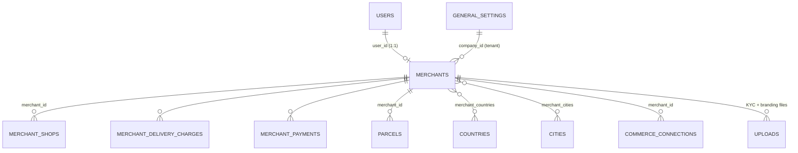
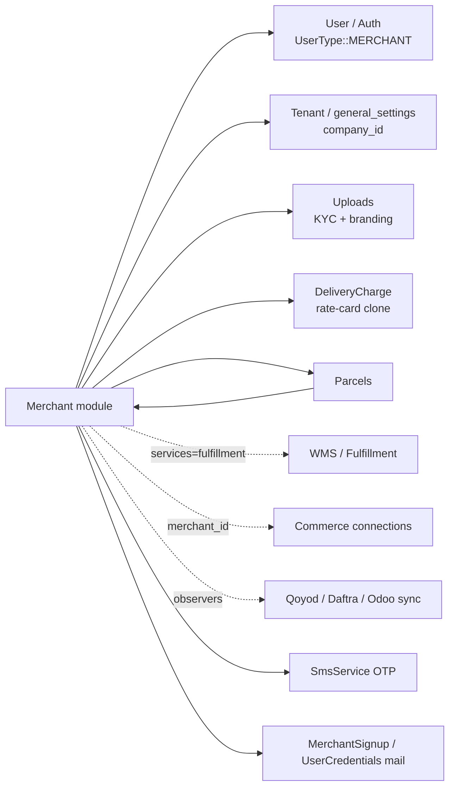

# Merchants — Portal & Management

> Module doc for the Rushly **Merchant** domain: how a merchant is onboarded, how
> admins manage merchants, what surfaces the merchant sees (web panel + mobile app),
> and the data/permissions behind it. `rushly-saas` is the single source of truth;
> `rushly-merchant-app` is a Sanctum-token client of the same backend.
>
> Grounding: every non-trivial claim cites a source file. Where an existing doc
> disagrees with code, a **⚠️ Doc vs Code** note flags it. Read the shared
> [../_CONTEXT_BRIEF.md](../_CONTEXT_BRIEF.md) first.

**Cross-links:** [../06-Database.md](../06-Database.md) · [../09-API.md](../09-API.md) · [../10-Authentication.md](../10-Authentication.md) · [../11-Modules.md](../11-Modules.md) · [../13-User-Journeys.md](../13-User-Journeys.md) · sibling modules [parcels.md](parcels.md), [oms-orders.md](oms-orders.md), [commerce-integrations.md](commerce-integrations.md), [wms-warehouse.md](wms-warehouse.md), [fulfillment.md](fulfillment.md), [zatca-einvoicing.md](zatca-einvoicing.md), [accounting-sync.md](accounting-sync.md).

---

## 1. Purpose

A **merchant** is a Rushly tenant's e-commerce customer — the shipper who hands
parcels to the courier company for last-mile delivery (and optionally warehousing
/ fulfillment). The Merchant module owns:

- **Onboarding** — three entry paths: admin-created, self sign-up (OTP), and a
  public KYC "apply" form.
- **The merchant identity** — one `merchants` row bound 1:1 to a `users` row of
  `user_type = MERCHANT`, scoped to a tenant via `company_id`.
- **Shops** — pickup locations under a merchant (`merchant_shops`), one flagged
  default.
- **Store connections** — read-only view of the merchant's linked storefronts
  (Salla / Zid / WooCommerce / Shopify), owned by the Commerce module.
- **The merchant portal** — the self-service web panel (`/merchant/*`, Inertia/React
  dashboard) and the mobile app (`rushly-merchant-app`) over `/api/v10`.
- **Commercials** — COD charges, delivery-charge table, VAT, payment period,
  balances, invoices, payment accounts.
- **Branding** — per-merchant theme (colors, logo, login layout).

It is the *demand side* of the platform. The parcel lifecycle itself lives in
[parcels.md](parcels.md); canonical orders in [oms-orders.md](oms-orders.md);
storefront ingestion in [commerce-integrations.md](commerce-integrations.md).

---

## 2. Responsibilities & boundaries

| Owns | Delegates to |
|---|---|
| Merchant record, shops, KYC docs, branding, coverage geography | Parcel lifecycle → [parcels.md](parcels.md) |
| Onboarding (admin / self-signup / apply) + OTP | Auth session/guards → [../10-Authentication.md](../10-Authentication.md) |
| Merchant commercials (COD, delivery charges, VAT, balance) | Payments/statements → `MerchantPanel/*` controllers |
| Merchant dashboard & mobile surfaces | Storefront connections → `App\Commerce\*` ([commerce-integrations.md](commerce-integrations.md)) |
| Admin management (CRUD, impersonate, invite, invoice) | Accounting mirror → [accounting-sync.md](accounting-sync.md) |

⚠️ **Two "Merchant" models exist — don't confuse them.**
- `app/Models/Backend/Merchant.php` — **the** merchant domain model (this doc).
- `app/Salla/Models/Merchant.php` — a Salla-bridge record (external Salla merchant
  identity), unrelated to the portal. See [commerce-integrations.md](commerce-integrations.md).

---

## 3. Onboarding — three paths

```mermaid
flowchart TD
    subgraph AdminCreated["A. Admin-created (web)"]
      A1[Admin fills Create form] --> A2["MerchantController@store<br/>MerchantRepository@store"]
      A2 --> A3["User(MERCHANT) + Merchant<br/>+ default MerchantShop<br/>+ MerchantDeliveryCharge rows"]
      A3 --> A4["MerchantSignup mail"]
    end
    subgraph SelfSignup["B. Self sign-up (OTP)"]
      B1[Merchant sign-up form / app register] --> B2["signUpStore()<br/>status INACTIVE, otp set"]
      B2 --> B3["SmsService@sendOtp"]
      B3 --> B4["otpVerification()<br/>verification_status=ACTIVE"]
      B4 --> B5[Login]
    end
    subgraph Apply["C. Public KYC apply (no auth)"]
      C1["GET /merchant/apply"] --> C2["applyStore()<br/>User+Merchant status=INACTIVE<br/>KYC fields + file uploads"]
      C2 --> C3[Admin reviews & activates]
    end
```

### A. Admin-created (primary)
`MerchantController@store` → `MerchantRepository@store()`
(`app/Http/Controllers/Backend/MerchantController.php`,
`app/Repositories/Merchant/MerchantRepository.php`). In one DB transaction it:
1. Creates a `User` (`user_type = UserType::MERCHANT`, hashed password, `unique_id`,
   `company_id = settings()->id`, hub, status).
2. Creates the `Merchant` row (business name, `merchant_unique_id` = same unique id,
   opening balance → also seeds `current_balance`, VAT, `cod_charges` array,
   payment period, return charges, references, wallet flag, custom theme).
3. Creates one **default** `MerchantShop` (`default_shop = Status::ACTIVE`) named
   after the business.
4. Clones every company `DeliveryCharge` into `MerchantDeliveryCharge` rows so the
   merchant has an editable rate card from day one.
5. On success, emails `MerchantSignup` to the merchant.

### B. Self sign-up + OTP
`signUpStore()` creates the same trio (`User`/`Merchant`/`MerchantShop` +
delivery charges) but with `verification_status = INACTIVE` and a 5-digit `otp`,
then dispatches an SMS via `app(SmsService::class)->sendOtp(...)`. The mobile
app hits `POST /api/v10/register` → `AuthController@register`
(`routes/api.php:237`). `otpVerification()` flips `verification_status = ACTIVE`;
`resendOTP()` regenerates. Web routes: `merchant.sign-up`, `merchant.sign-up-store`,
`merchant.otp-verification`, `merchant.resend-otp` (`routes/web.php:251-255`).

There is also `socialSignupStore()` (Google/Facebook) which mints the merchant
from an OAuth profile with a random password.

### C. Public KYC "apply" form (no auth)
`GET /merchant/apply` → `applyStore()` (`routes/web.php:258-260`). Creates an
**INACTIVE** `User`+`Merchant` with a random password and captures full KYC:
`cr_number`, `tax_number`, `owner_id_number`, `classification`, `delivery_type`,
`expected_daily_shipments`, `national_address_short_code`, `iban`, `bank_name`,
`swift_code`, `cr_expiry`, `services[]`, plus file uploads
(`cr_file`, `contract_file`, `owner_id_file`, `national_address_file`, `iban_file`,
`nid`, `trade_license`). An admin then reviews and activates. The admin can copy
the apply link from the merchant index (`urls.apply`) and, post-review, use
**Send credentials** (`sendCredentials()`) to email a passwordless "sign in to
`<brand>`" invite — the tenant login URL is resolved from Stancl's `Domain` table
so it points at the tenant subdomain.

**Onboarding notifications:** `MerchantSignup` mail (`app/Mail/MerchantSignup.php`),
`UserCredentialsMail` (invite), OTP SMS (`app/Http/Services/SmsService.php`).

---

## 4. Data model

### `merchants` (`app/Models/Backend/Merchant.php`)
Base migration `2014_10_11_000001_create_merchants_table.php`, extended by six
later migrations. Key columns:

| Column | Type | Notes |
|---|---|---|
| `company_id` | FK → `general_settings` | tenant scope (see `scopeCompanywise`) |
| `user_id` | FK → `users` | 1:1 login identity (`UserType::MERCHANT`) |
| `business_name`, `merchant_unique_id` | string | unique id mirrors `users.unique_id` |
| `current_balance`, `opening_balance`, `wallet_balance`, `vat` | decimal(16,2) | |
| `cod_charges` | longText JSON (`array` cast) | keyed `inside_city` / `sub_city` / `outside_city` |
| `nid_id`, `trade_license` | FK → `uploads` | legacy KYC docs |
| `payment_period` | string | default `2` (days) — auto-invoice cadence |
| `status`, `wallet_use_activation` | tinyint | `App\Enums\Status` |
| `return_charges` | decimal | default `100` (% of charge billed on return) |
| `reference_name`, `reference_phone` | string | |
| `services` | JSON (`array` cast) | subset of `SERVICE_KEYS = ['last_mile','fulfillment','storage']` (`2026_06_12_000003`) |
| `covers_all_cities` | bool default true | geo coverage flag (`2026_06_12_000005`) |
| KYC extras | `cr_number`, `tax_number`, `owner_id_number`, `classification`, `delivery_type`, `expected_daily_shipments`, `national_address_short_code`, `iban`, `bank_name`, `swift_code`, `cr_expiry` (date cast), + `cr_file_id`/`contract_file_id`/`owner_id_file_id`/`national_address_file_id`/`iban_file_id` FKs → `uploads` |
| Branding | `primary_color`, `text_color`, `sidebar_color`, `topbar_color`, `accent_color` (+ `*_text_color`), `sidebar_style`, `font_family`, `border_radius`, `density`, `login_layout`, `logo_id`, `light_logo_id`, `favicon_id` (`2026_06_18_*`) |
| Accounting sync | `qoyod_*`, `daftra_*`, `odoo_*` mirror columns (`2026_06_24_*`) — see [accounting-sync.md](accounting-sync.md) |

⚠️ **Doc vs Code:** migration `2026_06_12_000003` added boolean flags
`has_last_mile` / `has_fulfillment` / `has_storage`, but `2026_06_12_000004`
(`drop_unused_merchant_service_flags`) drops them again — the live mechanism is
the JSON `services` array + `Merchant::hasService()` / `activeServices()`, **not**
the boolean columns. Any code referencing `has_fulfillment` is stale.

**Model highlights** (`app/Models/Backend/Merchant.php`):
- Relations: `user()`, `parcels()`, `merchantShops()`, `payments()`, `countries()`
  / `cities()` (m2m via `merchant_countries` / `merchant_cities`), KYC/branding
  `Upload` belongsTo relations, `licensefile()`, `nidfile()`.
- `getActiveShopAttribute()` → the shop with `default_shop = ACTIVE`.
- `getComputedBalanceAttribute()` — **derived** balance:
  `Σ cash_collection(status 9) − Σ total_delivery_amount(status 9) − Σ payments(status 4)`.
  `current_balance` accessor returns this computed value.
  ⚠️ Business rule lives in the model with **magic status literals** (`9` =
  delivered, `4` = paid) — a known tech-debt smell (see [../22-Technical-Debt.md](../22-Technical-Debt.md)).
- `SERVICE_KEYS`, `hasService()`, `activeServices()`, `coverageSummary()`.
- `LogsActivity` (spatie) with log name `Merchant`.

### `merchant_shops` (`app/Models/MerchantShops.php`)
Migration `2022_04_10_050353_create_merchant_shops_table.php`.

| Column | Notes |
|---|---|
| `merchant_id` | FK → `merchants` (cascade) |
| `name`, `contact_no`, `address` | fillable |
| `merchant_lat`, `merchant_long` | pickup geo (set via API/panel, not the admin form) |
| `status` | `Status::ACTIVE`/`INACTIVE` |
| `default_shop` | exactly one ACTIVE per merchant, enforced by `defaultShop()` |

`LogsActivity` log name `MerchantShops`. Model is thin: `merchant()` belongsTo.

### Related tables
`merchant_delivery_charges`, `merchant_payments`, `merchant_statements`,
`merchant_online_payments`, `merchant_online_payment_receiveds`,
`merchant_settings`, `merchant_countries`, `merchant_cities`, `parcel_items`.
Store connections live in the Commerce module's `commerce_connections` table
(`App\Commerce\Models\CommerceConnection`) — **not** a merchant-owned table.
Full column-level ERD in [../06-Database.md](../06-Database.md).

---

## 5. Services, repositories & controllers

The module uses the **repository pattern** (interface + implementation bound in a
provider), not the newer `app/<Module>/` service layout.

### Repositories (`app/Repositories/*`)
| Interface | Impl | Role |
|---|---|---|
| `Merchant/MerchantInterface` | `MerchantRepository` | CRUD, all 3 onboarding paths, OTP, file uploads, custom theme, geo sync, delete |
| `MerchantShops/ShopsInterface` | `ShopsRepository` | shop CRUD, `defaultShop()` toggle |
| `MerchantPayment/PaymentInterface` | `PaymentRepository` | merchant payouts/COD payments |
| `MerchantOnlinePaymentSetup/PaymentSetupInterface` | `PaymentSetupRepository` | online payment gateway config |
| `MerchantProfile/MerchantProfileInterface` | `MerchantProfileRepository` | self-service profile edit |
| `MerchantDeliveryCharge/MerchantDeliveryChargeInterface` | `MerchantDeliveryChargeRepository` | per-merchant rate card |

`MerchantRepository` also holds the branding logic (`applyCustomTheme()` —
whitelists hex colors + enum values so the DB never stores invalid theme data)
and the KYC/image upload helpers (`uploadMerchantFile`, `merchant_image`,
`trade_license`, `merchaant_nid` [sic]).

### Admin-side controllers (`app/Http/Controllers/Backend/*`)
| Controller | Surface |
|---|---|
| `MerchantController` | index / create / view / edit / store / update / destroy, `apply*`, `signUp*`, OTP, `impersonate` / `stopImpersonate`, `sendCredentials`, `invoiceGenerate`. Renders Inertia pages `Admin/Merchant/{Index,Create,View}`. |
| `MerchantShopsController` | admin management of a merchant's shops → `Admin/Merchant/Shops/Index` |
| `MerchantProfileController` | merchant-panel profile view/edit/password |
| `MerchantDeliveryChargeController` | rate-card CRUD |
| `MerchantInvoiceController` | merchant invoice listing/generation |
| `MerchantPaymentAccountController` | bank/mobile payment accounts |
| `MerchantmanagePaymentController` | admin COD payout processing (create → process → processed, reject/cancel) |

### Merchant-panel controllers (`app/Http/Controllers/Backend/MerchantPanel/*`)
Self-service surfaces mounted under `/merchant/*` (`routes/web.php:1295+`):
`SettingsController`, `PaymentAccountController`, `AccountTransactionController`,
`StatementsController`, `PaymentRequestController`, `ShopsController`,
`NewsOfferController`, `SupportController`, `FraudController`, `InvoiceController`,
`MerchantOnlinePaymentSetupController`, `ReportsController`,
`MerchantReportsController`, `OnlinePaymentController`, `PickupRequestController`,
`WalletController`, `MerchantKnowledgeBaseController`, `MerchantParcelController`,
plus ZATCA `Settings`/`Invoice` controllers (see [zatca-einvoicing.md](zatca-einvoicing.md)).

### The merchant dashboard
`DashbordController@index` branches on `Auth::user()->user_type`; for
`UserType::MERCHANT` it returns `Inertia::render('Merchant/Dashboard/Index', …)`
(ported from Blade 2026-06-27). The full controller↔component prop contract
(`parcel_kpis`, `active_amounts`, `fees_amounts`, `delivery_amounts`, `reports`,
`series`, `pie`, `urls`, `t`) is documented in the repo-root
[`../../MERCHANT_DASHBOARD.md`](../../MERCHANT_DASHBOARD.md) — not duplicated here.
Charts are hand-rolled inline SVG (no chart lib). The date filter still posts to
the legacy `merchant-panel.dashboard.filter` (`DashbordController@merchantDashboardFilter`).

---

## 6. HTTP surfaces

### Web (Inertia/React, session guard)
Admin management, gated per-action by `hasPermission:*` middleware
(`routes/web.php:468-526`):

| Route name | Method | Purpose | Permission |
|---|---|---|---|
| `merchant.index` | GET | list | `merchant_read` |
| `merchant.create` / `merchant.store` | GET/POST | create | `merchant_create` |
| `merchant.view` | GET | detail | `merchant_view` |
| `merchant.edit` / `merchant.update` | GET/PUT | edit | `merchant_update` |
| `merchant.delete` | DELETE | remove | `merchant_delete` |
| `merchant.impersonate` | POST | log in as merchant | `merchant_update` |
| `merchant.send-credentials` | POST | email login invite | `merchant_update` |
| `merchant.invoice.generate` | GET | generate invoice | `merchant_view` |
| `merchant.shops.*` | — | shop CRUD + `default` | `merchant_shop_{read,create,update,delete}` |
| `merchant.deliveryCharge.*` | — | rate card | `merchant_delivery_charge_*` |
| `merchant.paymentaccount.*` | — | payment accounts | `merchant_payment_*` |
| `merchant.apply` / `merchant.apply.store` / `merchant.apply.success` | GET/POST | **public** KYC form (no auth) | — |
| `merchant.impersonate.stop` | POST | end impersonation | (session `impersonator_id`) |

Merchant self-service under `/merchant/*` (`routes/web.php:1295+`): dashboard,
shops, parcels, payment-requests, statements, invoices, support, fraud, news,
wallet, ZATCA, knowledge base.

### API (`/api/v10`, Sanctum bearer + tenant, `routes/api.php`)
Consumed by `rushly-merchant-app`. Base host resolved per-tenant
(`https://<tenant>.<suffix>/api/v10`, `rushly-merchant-app/lib/core/config/env.dart`).

| Endpoint | Controller | Consumer screen |
|---|---|---|
| `POST /register`, `/otp-verification`, `/resend-otp`, `/signin` | `AuthController` | register / otp / signin |
| `POST /password/email`, `/password/reset` | `AuthController` | forgot password |
| `GET /dashboard`, `/dashboard/filter`, `/dashboard/balance-details`, `/dashboard/available-parcels` | `DashboardController` | dashboard |
| `GET /profile`, `POST /profile/update`, `PUT /update-password` | `AuthController` | profile |
| `GET/POST/PUT/DELETE shops/*` | `Api\V10\ShopsController` | shops |
| `GET store-connections` | `Api\V10\MerchantStoreConnectionsController` | store connections |
| `GET/POST parcel/*`, `parcel/bulk-store` | `ParcelController` | parcels / bulk import |
| `GET reports/shipments`, `statements/*`, `account-transaction/*` | reports controllers | reports |
| `GET ndr/merchant`, `ndr/stats` | `NdrApiController` | NDR |
| `GET/POST fraud/*`, `fraud/check` | `FraudController` | fraud check |
| `GET news-offer/index` | `NewsOfferController` | news |
| `GET invoice-list/index`, `invoice-details/{id}` | `InvoiceController` | invoices |
| `GET/POST payment-request/*`, `payment-accounts/*` | payment controllers | payments hub |
| `POST fcm-subscribe` / `fcm-unsubscribe` | `PushNotificationController` | push registration |

> **Note:** the mobile `signin` posts `{merchant_id, password}` where `merchant_id`
> is the merchant's `unique_id` (`rushly-merchant-app/.../auth_repository.dart`),
> whereas the web login uses email/mobile + password. Both resolve to the same
> `users` row. Full auth mechanics in [../10-Authentication.md](../10-Authentication.md).

---

## 7. Flutter merchant app (`rushly-merchant-app`)

Feature-first architecture (`lib/features/<feature>/{data,domain,presentation}`),
Riverpod + Dio. It is a **pure client** — no business logic beyond presentation;
every list/mutation is an `/api/v10` call.

**Bottom-nav shell** (`features/dashboard/presentation/home_shell.dart`):
Dashboard · Parcels · Payments (Wallet) · Invoices · News · Profile, with a
"New parcel" FAB.

| Feature dir | Screens | Backend |
|---|---|---|
| `tenant` | `tenant_select_screen` | picks tenant subdomain → base URL (`TenantStorage`) |
| `auth` | `signin`, `register`, `otp`, `forgot_password` | `AuthController` |
| `dashboard` | `dashboard_screen`, `home_shell`, `profile_screen` | `DashboardController` |
| `parcels` | `parcel_list`, `parcel_details`, `parcel_form`, `bulk_import`, `parcel_tracking_map` | `ParcelController` |
| `shops` | `shops_screen`, `shop_form_screen` | `ShopsController` (`Shop.fromJson` reads `merchant_lat/long`, `default_shop`) |
| `store_connections` | `store_connections_screen` | `MerchantStoreConnectionsController` (read-only) |
| `invoices` | `invoices_screen`, `invoice_details_screen` | `InvoiceController` |
| `payments` | payments hub | payment/wallet controllers |
| `ndr` | `ndr_screen` | `NdrApiController@merchantIndex` |
| `fraud` | `fraud_screen` | `FraudController@check` |
| `news` | `news_screen` | `NewsOfferController` |
| `reports` | shipment reports | `MerchantReportsController` |
| `settings` | `settings_screen` | `/settings/cod-charges`, `/settings/delivery-charges` |
| `support` | support tickets | `SupportController` |

**Store connections** are surfaced read-only: the `StoreConnection` domain object
carries `providerCode/Name`, `connectionName`, `domain`, `status`, `isDefault`,
`lastTestedAt/SyncAt/EventAt` — provider **secrets are stripped** server-side by
`CommerceConnection::$hidden`. See [commerce-integrations.md](commerce-integrations.md)
for how connections are created and how webhooks turn store orders into parcels.

Mobile app inventory context: [../08-Flutter.md](../08-Flutter.md) and
repo-root [`../../MOBILE_APPS.md`](../../MOBILE_APPS.md).

---

## 8. Business rules (authoritative list)

1. **1:1 user binding.** Every merchant has exactly one `users` row of
   `UserType::MERCHANT`; deleting the merchant cascades the user + uploaded files
   (`MerchantRepository@delete`).
2. **Tenant isolation.** All reads scope by `company_id = settings()->id`
   (`scopeCompanywise`, `all()`, `get()`); a merchant is invisible cross-tenant.
3. **Exactly one default shop.** `defaultShop()` deactivates all sibling shops
   before activating the target; on create/signup the first shop is auto-default.
4. **Auto-provisioned rate card.** Creating a merchant clones every company
   `DeliveryCharge` into `MerchantDeliveryCharge` rows.
5. **Opening balance seeds current balance** on create; thereafter
   `current_balance` is the **computed** value (COD − delivery − payments over
   delivered/paid statuses).
6. **COD charges** are a JSON map keyed `inside_city` / `sub_city` / `outside_city`.
7. **Services** are a whitelisted JSON array (`last_mile`, `fulfillment`,
   `storage`); `fulfillment` routes orders through WMS pick/pack
   ([wms-warehouse.md](wms-warehouse.md), [fulfillment.md](fulfillment.md)).
8. **Geo coverage.** A merchant must have ≥1 country; `covers_all_cities = true`
   ignores the per-city pivot and **detaches** stale cities on save.
9. **Self-signup requires OTP** — `verification_status` stays INACTIVE until a
   valid OTP flips it ACTIVE.
10. **Public apply creates INACTIVE records** with a random password — an admin
    must review KYC and activate.
11. **Branding is validated** — colors must match `#RGB`/`#RRGGBB`, enums are
    whitelisted (`applyCustomTheme`); empty string clears the override.
12. **Impersonation is single-level & audited** — no nested impersonation, can't
    impersonate self, both start/stop are written to spatie activity log
    (`impersonation` log). Original admin id stashed in `session('impersonator_id')`.

---

## 9. Dependencies

- **User / Auth** — merchant identity + guard ([../10-Authentication.md](../10-Authentication.md)).
- **Tenant** (`stancl/tenancy`) — `company_id` scoping ([../05-System-Architecture.md](../05-System-Architecture.md)).
- **Uploads** — KYC docs + branding assets.
- **DeliveryCharge** — seeded per merchant.
- **Parcels / OMS / Fulfillment / WMS** — downstream consumers of `merchant_id`.
- **Commerce** — `CommerceConnection.merchant_id` links storefronts.
- **Accounting** — `MerchantObserver` (Qoyod/Daftra/Odoo) mirrors merchants as
  customers ([accounting-sync.md](accounting-sync.md)).
- **Notifications** — `SmsService` (Twilio/Vonage) for OTP, Mailables for invites,
  `PushNotificationController` (FCM) for the app.

---

## 10. Notifications

| Event | Channel | Source |
|---|---|---|
| Admin creates merchant | Email `MerchantSignup` | `MerchantRepository@store` |
| Self sign-up / resend | SMS OTP | `SmsService@sendOtp` |
| Admin invite (apply flow) | Email `UserCredentialsMail` | `MerchantController@sendCredentials` |
| Mobile push registration | FCM subscribe/unsubscribe | `POST /api/v10/fcm-*` |
| Merchant news/offers | In-app | `NewsOfferController` → app `news` feature |

Rushly's queue default is `sync` (see [../_CONTEXT_BRIEF.md](../_CONTEXT_BRIEF.md)),
so these send inline unless `QUEUE_CONNECTION` is overridden.

---

## 11. Permissions

Web management is gated by the string-permission system (`hasPermission:*`
middleware; catalog in `database/seeders/PermissionSeeder.php`):

| Group | Permissions |
|---|---|
| Merchant CRUD | `merchant_read`, `merchant_create`, `merchant_update`, `merchant_delete`, `merchant_view` |
| Shops | `merchant_shop_read/create/update/delete` |
| Delivery charge | `merchant_delivery_charge_read/create/update/delete` |
| Payment accounts | `merchant_payment_read/create/update/delete` |
| Payout processing | `payment_read/create/update/delete/reject/process` |

`impersonate` and `send-credentials` reuse `merchant_update` (any admin who can
edit a merchant can log in as them). The **merchant portal itself** is gated by
`user_type = MERCHANT` + tenant, not by these admin permissions; a merchant's own
`users.permissions` array is set to `[]` at signup (self-service access is
role-implicit). KYC screenshot writes in the merchant knowledge base need
`knowledge_base_update` (curated centrally). Full model in
[../17-Security.md](../17-Security.md) and [../10-Authentication.md](../10-Authentication.md).

---

## 12. Maturity & status

| Area | Status | Notes |
|---|---|---|
| Merchant CRUD (admin) | ✅ Mature, Inertia-ported | index/create/view/edit are React |
| Shops | ✅ Mature | admin index is React; create/edit still Blade views |
| Onboarding (admin) | ✅ Mature | |
| Self-signup + OTP | ✅ Working | web + mobile |
| Public KYC apply | 🟡 Newer (2026-06) | captures docs; activation is manual |
| Branding / custom theme | 🟡 Newer (2026-06) | validated; per-merchant login layout |
| Geo coverage | 🟡 Newer (2026-06) | country required, city optional |
| Store connections (mobile) | 🟡 Read-only | create/manage lives in Commerce web |
| Merchant dashboard | ✅ Ported 2026-06-27 | legacy Blade + filter still on disk |
| Accounting sync | 🟡 Behind config | Qoyod/Daftra/Odoo observers |

**Known debt / smells:**
- `getComputedBalanceAttribute()` hardcodes status literals `9`/`4` instead of
  `ParcelStatus`/enum constants.
- `MerchantRepository` mixes persistence, file I/O, mail and theme validation in
  one ~800-line class; onboarding logic duplicated across `store`/`signUpStore`/
  `applyStore`/`socialSignupStore` (delivery-charge clone copy-pasted 4×).
- Method typo `merchaant_nid()`; legacy single-file KYC (`nid_id`, `trade_license`)
  coexists with the newer multi-file KYC set.
- Two divergent shop-create paths (admin Blade vs. React vs. API).
- See [../22-Technical-Debt.md](../22-Technical-Debt.md).

---

## 13. Future improvements

1. Extract onboarding into a single `MerchantProvisioner` service (dedupe the
   4 create paths + delivery-charge seeding).
2. Replace magic balance-status literals with `ParcelStatus` / payment enums;
   consider a materialized ledger instead of recomputing on every read.
3. Turn the public KYC "apply" into a first-class **approval queue** with an
   `ApprovalStatus` state machine (enum already exists) and notifications.
4. Promote mobile store-connection management from read-only to create/test/disable
   (currently web-only in Commerce).
5. Finish the Inertia migration for shop create/edit and the dashboard date filter
   (still legacy Blade — [`../../MERCHANT_DASHBOARD.md`](../../MERCHANT_DASHBOARD.md) §Filter flow).
6. Add explicit fine-grained merchant-portal permissions rather than the implicit
   `user_type`-only gate.

---

## Sources

**rushly-saas**
- `app/Models/Backend/Merchant.php`, `app/Models/MerchantShops.php`
- `app/Http/Controllers/Backend/MerchantController.php`, `MerchantShopsController.php`
- `app/Http/Controllers/Api/V10/MerchantStoreConnectionsController.php`
- `app/Repositories/Merchant/MerchantRepository.php`, `app/Repositories/MerchantShops/ShopsRepository.php`
- `database/migrations/2014_10_11_000001_create_merchants_table.php`, `2022_04_10_050353_create_merchant_shops_table.php`, `2026_06_12_000003_*`, `2026_06_12_000004_*`, `2026_06_12_000005_add_merchant_geo_coverage.php`, `2026_06_18_000001_add_custom_theme_to_merchants_table.php`
- `database/seeders/PermissionSeeder.php`
- `routes/web.php` (merchant + merchant-panel groups), `routes/api.php` (`/api/v10`)
- `MERCHANT_DASHBOARD.md` (repo root)

**rushly-merchant-app**
- `lib/features/{auth,dashboard,shops,store_connections,settings,tenant}/*`
- `lib/core/config/env.dart`, `lib/core/api/api_endpoints.dart`, `lib/core/api/dio_client.dart`

**Shared context**
- `docs/_CONTEXT_BRIEF.md`; sibling docs 06/08/09/10/11/13/17/22 and modules
  `commerce-integrations.md`, `parcels.md`, `oms-orders.md`, `wms-warehouse.md`,
  `fulfillment.md`, `zatca-einvoicing.md`, `accounting-sync.md`.
