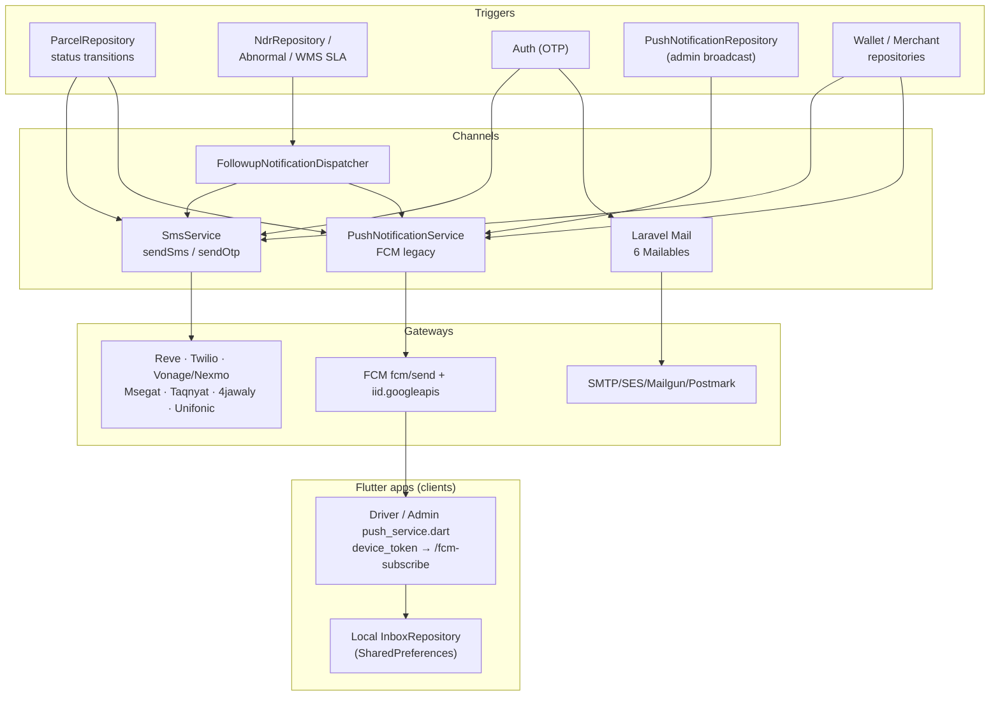

# Notifications — SMS, Push, Email

> How Rushly reaches humans: transactional SMS, Firebase push, and email. This
> module is a **fan-out delivery layer** wired into the parcel lifecycle, the NDR /
> abnormal follow-up engine, marketing broadcasts, and auth (OTP). Every non-trivial
> claim cites a source file. Verified against code on 2026-07-27.
>
> `rushly-saas` is the single source of truth; the Flutter apps are **clients** that
> register FCM device tokens and render a local inbox. See
> [_CONTEXT_BRIEF.md](../_CONTEXT_BRIEF.md).

**Sibling docs:** [14-Integrations.md](../14-Integrations.md) (gateway catalogue) · [05-System-Architecture.md](../05-System-Architecture.md) · [09-API.md](../09-API.md) · [10-Authentication.md](../10-Authentication.md) · [06-Database.md](../06-Database.md) · [17-Security.md](../17-Security.md) · [modules/parcels.md](parcels.md) · [modules/drivers-deliverymen.md](drivers-deliverymen.md)

> This doc goes **deeper** on the notification slice than [14-Integrations.md §8–9](../14-Integrations.md); the Integrations doc catalogues the gateways, this one documents the *pipelines, triggers, tables, and app consumers*.

---

## 1. Purpose & responsibilities

Rushly has **three outbound human-facing channels** plus an in-app inbox. There is
**no unified `Notification` abstraction** (no Laravel `notifications` table, no
`Notifiable` channels) — instead each channel is a hand-rolled service invoked
imperatively from the parcel/NDR/wallet flows.

| Channel | Service | Transport | Direction |
|---|---|---|---|
| **SMS** | `App\Http\Services\SmsService` | 7 gateways (cURL / SDK), fan-out | Outbound |
| **Push** | `App\Http\Services\PushNotificationService` | Firebase Cloud Messaging (legacy HTTP) | Outbound |
| **Email** | Laravel `Mail` + 6 Mailables | SMTP / SES / Mailgun / Postmark | Outbound |
| **Follow-up matrix** | `App\Services\FollowupNotificationDispatcher` | wraps SMS + push for NDR/abnormal events | Outbound |
| **In-app inbox** | Flutter-local (`InboxRepository`) + admin/merchant broadcast list (`push_notifications`) | device-local + DB | Client-side |

Responsibilities:
- Deliver **transactional** messages on parcel status transitions (pickup assigned, out for delivery, delivered, cancelled, returned, etc.).
- Deliver **OTP** codes for phone-based auth/verification.
- Deliver **marketing / news broadcasts** from admins to drivers & merchants.
- Deliver **operational alerts** to supervisors/admins for NDR and abnormal-shipment escalation.
- Deliver **email** for signups, invoices, login-OTP, contact form, and credential handout.

Everything is **per-tenant**: gateway credentials, FCM keys, and event toggles all
resolve through `companywise()` scoping (see §7).

---

## 2. SMS — `SmsService`

**File:** `app/Http/Services/SmsService.php` (a fan-out dispatcher, no interface, no queue).

### 2.1 Public methods

| Method | Signature | Used for |
|---|---|---|
| `sendSms($userPhone, $msg)` | raw message | parcel status, wallet, NDR follow-up |
| `sendOtp($userPhone, $otpCode)` | code → templated message | phone OTP / verification |

Both methods **fan out to every gateway whose per-tenant status flag is `ACTIVE`**
(`smsSettings('<gateway>_status') == Status::ACTIVE`). There is no primary/failover
concept — if two gateways are enabled, the recipient gets **two** SMS. `sendOtp`
does **not** include Vonage/Nexmo (only `sendSms` does); otherwise the gateway lists
match.

### 2.2 Gateways (7)

Enum `app/Enums/SmsSetup.php` (ids 1–7) and the private methods in `SmsService`:

| Enum | Gateway | Region | Transport / auth | Private method | Endpoint |
|---|---|---|---|---|---|
| `REVE=1` | Reve | Bangladesh | GET querystring cURL, `apikey`+`secretkey`+`callerID` | `reveSms` | `smsSettings('reve_api_url')` |
| `TWILIO=2` | Twilio | Global | `Twilio\Rest\Client` SDK, `twilio_sid`/`twilio_token`/`twilio_from` | `twilioSms` | Twilio API |
| `NEXMO=3` | Vonage / Nexmo | Global | `Vonage\Client` Basic (`nexmo_key`/`nexmo_secret_key`) | `nexmoSms` | Vonage API |
| `MSEGAT=4` | Msegat | Saudi | POST JSON, `userName`+`apiKey`+`userSender` | `msegatSms` | `msegat.com/gw/sendsms.php` |
| `TAQNYAT=5` | Taqnyat | Saudi | POST JSON, `Authorization: Bearer` token | `taqnyatSms` | `api.taqnyat.sa/v1/messages` |
| `JAWALY4=6` | 4jawaly | Saudi | POST JSON, HTTP Basic (`app_id`:`app_sec`) | `jawaly4Sms` | `api-sms.4jawaly.com/api/v1/account/area/sms/send` |
| `UNIFONIC=7` | Unifonic | Saudi/GCC | form-encoded POST per recipient, `AppSid` | `unifonicSms` | `el.cloud.unifonic.com/rest/SMS/messages` |

**Composer libs:** `twilio/sdk`, `vonage/client`. The four Saudi gateways are
hand-rolled cURL, no SDK.

### 2.3 Message templating & sender

- **Sender/caller ID** defaults to `settings()->name` (the tenant brand) for every gateway; Msegat/Taqnyat/4jawaly/Unifonic prefer a per-tenant `*_sender` override.
- **OTP body** is templated: `"<code> is your <tenant name> verification code."` (built in each gateway method when `$type === 'otp'`).
- **Plain SMS** passes the message through unchanged.

### 2.4 Robustness caveats (⚠️)

- Every gateway method wraps its call in `try/catch` and **returns the `\Exception` object on failure** rather than throwing — callers ignore the return, so failures are silent (`SmsService.php:107,126,171,…`).
- `CURLOPT_SSL_VERIFYPEER` is set to **false** on every cURL gateway (`SmsService.php:99,166,207,254,299`) — MITM exposure. See [17-Security.md](../17-Security.md).
- A dead `use http\Client;` import sits at the top (`SmsService.php:8`).
- No queueing: SMS is sent **synchronously** inside the request/repository call (`QUEUE_CONNECTION` defaults to `sync` anyway — see [_CONTEXT_BRIEF.md](../_CONTEXT_BRIEF.md)).

---

## 3. Push — `PushNotificationService` (FCM legacy)

**File:** `app/Http/Services/PushNotificationService.php`. **Outbound only.**

### 3.1 Methods

| Method | Purpose | FCM target |
|---|---|---|
| `sendPushNotification($data, $topicName, $type)` | marketing/news broadcast | `/topics/<topic>` |
| `sendStatusPushNotification($parcel, $topicName, $msg, $type)` | per-parcel status update | `/topics/<topic>` |
| `sendWebNotification($data, $notification, $type, $FcmToken)` | new-parcel merchant web alert | `registration_ids[]` |
| `fcmSubscribe($request)` | subscribe device to user topic **and** global topic | IID rel/topics |
| `fcmGlobalSubscribe($request)` | subscribe device to the global topic | IID rel/topics |
| `fcmUnsubscribe($request)` | remove a web device token | IID delete |

### 3.2 Topic model

- Per-tenant base topic = `notificationSettings()->fcm_topic`.
- A **per-user topic** appends a sanitized suffix built from the user's email/phone: `str_replace(['@','.','+'], ['_','_',''], $topicName)` (`PushNotificationService.php:14,57,98`). So a status push for a parcel targets `"<fcm_topic>_<sanitized-user-email>"`.
- `fcmSubscribe` subscribes a device to **both** its user topic and the global `fcm_topic` (via `fcmGlobalSubscribe`), so broadcasts to the base topic reach everyone.

### 3.3 Transport & auth (⚠️ deprecated)

- **Send endpoint:** `https://fcm.googleapis.com/fcm/send` (the **legacy FCM HTTP API**).
- **Topic mgmt:** `https://iid.googleapis.com/iid/v1/{deviceToken}/rel/topics/{topic}`.
- **Auth:** legacy server key — `Authorization: key=<notificationSettings()->fcm_secret_key>` (per-tenant, `PushNotificationService.php:33,74,102,…`).

> ⚠️ **Doc vs Code.** This uses Google's **deprecated FCM legacy HTTP API** (`fcm/send` + `Authorization: key=`), **not** FCM HTTP v1 / OAuth2 service-account. Google has sunset the legacy API. [14-Integrations.md §9](../14-Integrations.md) flags the same: `INTEGRATIONS.md §5` mentions `firebase/php-jwt` + "FCM HTTP v1" on the *driver-app* side, but the actual server implementation here is legacy-key. A migration to HTTP v1 is implied but **not present in the codebase**. This is the single biggest maturity risk in this module.

Other rough edges: `sendPushNotification` calls **`die('Curl failed: …')`** on a
cURL failure (`PushNotificationService.php:48`) — an unhandled hard-exit inside a
request. `CURLOPT_SSL_VERIFYPEER` is `false` throughout.

---

## 4. Follow-up matrix — `FollowupNotificationDispatcher`

**File:** `app/Services/FollowupNotificationDispatcher.php`. A thin wrapper that lets
the **NDR** and **Abnormal-shipment** modules fire the SMS+push matrix without
re-implementing recipient resolution. Callers: `app/Repositories/NdrRepository.php`,
`app/Console/Commands/WmsMinStockCheck.php`, `app/Console/Commands/WmsFulfillmentSlaCheck.php`.

| Event method | Recipients | Channels |
|---|---|---|
| `ndrCreated(Ndr)` (attempts 1–2) | supervisors | push |
| `ndrAttemptThree(Ndr)` | admins + merchant + customer + merchant mobile | push + SMS |
| `abnormalDetected(AbnormalShipment)` | supervisors | push |
| `abnormalCritical(AbnormalShipment)` | admins | push |
| `dailyDigest(companyId, counts)` | supervisors (per company) | push (daily 8 AM digest) |
| `closedAsLost(AbnormalShipment)` | admins + merchant + merchant mobile | push + SMS |

- SMS is **gated by event key**: `sms(...)` checks `SmsSendSettingHelper($eventKey)` (e.g. `'ndr_attempt_three'`, `'shipment_closed_lost'`) and skips if disabled (`FollowupNotificationDispatcher.php:120`). Note these string keys are **not** in the `SmsSendStatus` enum (§6.2) — they are free-form and rely on matching `sms_send_settings` rows that may not exist, so these SMS are effectively **opt-in and off by default**.
- Recipient resolution uses raw `user_type`/`company_owner` filters (`supervisors()` = `user_type IN [1]`, `admins()` = `company_owner = 1`).
- Every dispatch is `Log::info`-logged; failures are caught and `Log::warning`-logged (best-effort, never throws).

> ⚠️ **Doc vs Code — the push path is a silent no-op.** `FollowupNotificationDispatcher::push()` calls `$svc->sendNotification($u, $title, $body)` or `$svc->send($token, …)` guarded by `method_exists(...)` (`FollowupNotificationDispatcher.php:104-107`). But the real `PushNotificationService` exposes **neither `sendNotification` nor `send`** — only `sendPushNotification` / `sendStatusPushNotification` / `sendWebNotification`. So both `method_exists` checks fail and **no push is ever actually sent** by this dispatcher; it only writes the `followup.push` log line. The follow-up push matrix is therefore **wired but non-functional** against the current push service. This is an integration seam that was stubbed and never reconnected.

---

## 5. Email — Laravel Mail

**Config:** `config/mail.php` — default mailer `smtp` (env `MAIL_MAILER`), transports
supported: `smtp`, `ses`, `mailgun`, `postmark`, `sendmail`, `log`, `array`,
`failover` (smtp→log). Provider creds in `config/services.php` (`mailgun.*`,
`postmark.*`, `ses.*`). Global `from` = `MAIL_FROM_ADDRESS`/`MAIL_FROM_NAME`.

**Mailables** (`app/Mail/`):

| Mailable | Subject / view | Trigger |
|---|---|---|
| `LoginOtpMail` | `auth.login_otp_subject` → `emails.login-otp` | staff login OTP (feature-flagged, §6.4) |
| `InvoicePDFSend` | envelope + PDF `Attachment` | merchant invoice email |
| `MerchantSignup` | "Welcome to new merchant" → `backend.merchant.mail.signup` | new merchant provisioning |
| `CompanySignup` | "Welcome to new company" → super-admin company signup view | new tenant/company signup |
| `ContactMail` | dynamic subject, to `settings()->email` | public contact form |
| `UserCredentialsMail` | credentials handout → `emails.user-credentials` | User view page / Merchants "Send login info by email" |

`Mail::to(...)` send sites include `LoginOtpController`, `LoginController`,
`UserController`, `MerchantController`, `FrontendController`,
`Api/V10/ParcelController`, `CompanyRepository`, `MerchantRepository`,
`DatabaseAutoBackup` (backup notice). Email uses env-level SMTP config (not
per-tenant DB rows), unlike SMS/FCM.

---

## 6. Notification triggers & business rules

### 6.1 Parcel-lifecycle triggers (`app/Repositories/Parcel/ParcelRepository.php`)

The parcel status engine is the primary notification source. On each transition it
calls `SmsService::sendSms` (customer / merchant mobile / pickup-man mobile) and
`PushNotificationService::sendStatusPushNotification` (deliveryman / merchant topic).
Representative sites:

| Transition (approx.) | SMS recipients | Push topic | Source line |
|---|---|---|---|
| Parcel created | customer (gated by `PARCEL_CREATE`) | — | `ParcelRepository.php:758-765` |
| Pickup assigned | pickup-man mobile | deliveryman | `:1176-1181` |
| Pickup → merchant notify | merchant mobile | merchant | `:1190-1199` |
| Pickup reschedule | pickup-man, merchant | deliveryman + merchant | `:1269-1295` |
| Delivery assigned | customer | deliveryman | `:1453-1458` |
| Delivery reschedule | customer | deliveryman | `:1494-1498` |
| Return / other | customer, merchant | merchant | `:1567-1588`, `:1783-1788`, `:1869` |
| Delivered/cancel | customer (gated `DELIVERED_CANCEL_CUSTOMER`), merchant (gated `DELIVERED_CANCEL_MERCHANT`) | merchant | `:2460-2474`, `:2677-2692` |

> ⚠️ **Business-rule inconsistency.** Only **three** send sites are gated by the
> `SmsSendStatus` toggle (create + the two delivered/cancel events). The **many
> other** `sendSms(...)` calls (pickup, reschedule, assign, return) fire
> **unconditionally** whenever the code path runs — there is no per-event opt-out for
> them. So the `sms_send_settings` UI (§6.2) controls far fewer messages than it
> appears to.

`sendStatusPushNotification` builds its own title:
`"Your parcel #<tracking_id> status updated <trans(parcelStatus.<status>)>"`
(`PushNotificationService.php:66`) and body from the caller's `$msg`.

### 6.2 SMS-send toggles — `SmsSendStatus` enum & `sms_send_settings`

- **Enum** `app/Enums/SmsSendStatus.php`: `PARCEL_CREATE=1`, `DELIVERED_CANCEL_CUSTOMER=2`, `DELIVERED_CANCEL_MERCHANT=3`.
- **Table** `sms_send_settings` (`2022_05_23_122723_create_sms_send_settings_table.php`): `company_id`, `sms_send_status` (the enum id), `status` (Status::ACTIVE/INACTIVE), timestamps.
- **Model** `app/Models/Backend/SmsSendSetting.php` (companywise).
- **Helper** `SmsSendSettingHelper($status)` (`app/Http/Helper/Helper.php:83`): returns `true` iff a companywise `sms_send_settings` row exists for that enum id with `status = ACTIVE`.
- **Admin UI**: `/admin/sms-send-settings/index` + `/status` (`SmsSendSettingsController`, `routes/web.php:903-904`), permission `sms_send_settings_read` / `_status_change`.

### 6.3 Wallet / merchant triggers

`app/Repositories/Wallet/WalletRepository.php` and
`app/Repositories/Merchant/MerchantRepository.php` also invoke `SmsService` /
`PushNotificationService` (e.g. wallet credit, merchant provisioning). Bulk parcel
actions fire notifications via `app/Http/Controllers/Backend/ParcelBulkActionController.php`.

### 6.4 OTP triggers

- **Phone OTP**: `SmsService::sendOtp($phone, $code)` — used by v10 auth (`/otp-verification`, `/resend-otp`) and any phone verification flow.
- **Email login-OTP**: feature-flagged `login_otp` (`config/features.php`, env `FEATURE_LOGIN_OTP`, default OFF). When on, staff (Admin/SuperAdmin) get a 6-digit code via `LoginOtpMail`; merchants/deliverymen skip it. Controllers `Auth/LoginController`, `Auth/LoginOtpController`. Full auth detail in [10-Authentication.md](../10-Authentication.md).

---

## 7. Database tables

See [06-Database.md](../06-Database.md) for the global schema. Notification-specific tables:

| Table | Migration | Key columns | Purpose |
|---|---|---|---|
| `sms_settings` | `2022_05_23_122723_create_sms_settings_table.php` | `company_id`, `key`, `value` | per-tenant **key/value** gateway creds & status flags (e.g. `twilio_sid`, `reve_status`) |
| `sms_send_settings` | `2022_05_23_122723_create_sms_send_settings_table.php` | `company_id`, `sms_send_status`, `status` | per-event SMS on/off toggle |
| `notification_settings` | `2022_05_31_094551_create_notification_settings_table.php` | `company_id`, `fcm_secret_key`, `fcm_topic` | per-tenant FCM legacy key + base topic |
| `push_notifications` | `2022_02_15_122629_create_push_notifications_table.php` | `company_id`, `title`, `description`, `user_id`, `merchant_id`, `type`, `image_id` | admin **broadcast** records (history of sent broadcasts) |
| `users.device_token` / `users.web_token` | `2014_10_11_000000_create_users_table.php:39-40` | device FCM token (mobile) / web push token | device registration |

Models: `app/Models/Backend/SmsSetting.php`, `SmsSendSetting.php`,
`NotificationSettings.php`, `PushNotification.php`.

**Settings resolution helpers** (`app/Http/Helper/Helper.php`):
- `smsSettings($key)` (`:933`) — reads a `sms_settings` row for the current tenant (`company_id=1` fallback for superadmin context).
- `notificationSettings()` (`:235`) — `NotificationSettings::companywise()->first()`.
- `settings()` (`:106`) — the tenant `GeneralSettings` (brand name = SMS sender).
- `SmsSendSettingHelper($status)` (`:83`).

> No Laravel `notifications` / `notifiable` table exists — this is **not** a
> `Notifiable`-based system. In-app "inbox" is client-side (§10).

---

## 8. Services, controllers & APIs

### 8.1 Services

| Service | Path |
|---|---|
| `SmsService` | `app/Http/Services/SmsService.php` |
| `PushNotificationService` | `app/Http/Services/PushNotificationService.php` |
| `FollowupNotificationDispatcher` | `app/Services/FollowupNotificationDispatcher.php` |
| `PushNotificationRepository` (broadcast orchestration) | `app/Repositories/PushNotification/PushNotificationRepository.php` |

`PushNotificationRepository::store()` builds a `push_notifications` row, then fans
out based on `role_id`: `all` (every non-user_type-1 user via topic push +
`sendWebNotification` to `web_token`s), a single `user_id`, or a specific
`user_type`. ⚠️ It uses `dd($exception)` in its catch blocks (`PushNotificationRepository.php:64,69`) — a hard dump-and-die on failure, unsuitable for production.

### 8.2 Admin-web controllers (`routes/web.php`)

| Feature | Controller | Routes | Permission |
|---|---|---|---|
| SMS gateway creds | `SmsSettingsController` | `/admin/sms-settings/*` (`:896-902`) | `sms_settings_read/create/update/delete/status_change` |
| SMS event toggles | `SmsSendSettingsController` | `/admin/sms-send-settings/{index,status}` (`:903-904`) | `sms_send_settings_read/status_change` |
| FCM key + topic | `NotificationSettingsController` | `/admin/notification-settings/{index,update}` (`:1124-1125`) | `notification_settings_read/update` |
| Broadcast push | `PushNotificationController` (Backend) | `/admin/push-notification/*` (`:1127-1131`) | `push_notification_read/create/update/delete` |
| Web push token store | `WebNotificationController` | `/store-token` (`:1528`) | — |

### 8.3 Mobile API (`routes/api.php`, `/api/v10`, `CheckApiKey` + `auth:sanctum`)

| Endpoint | Controller | Purpose |
|---|---|---|
| `POST /api/v10/fcm-subscribe` | `Api\V10\PushNotificationController@fcmSubscribe` (`:256`) | register device token → subscribe to user + global topic |
| `POST /api/v10/fcm-unsubscribe` | `PushNotificationController@fcmUnsubscribe` (`:257`) | unregister |
| `POST /api/v10/admin/fcm-subscribe` | `Api\V10\Admin\AdminPushController@subscribe` (`:206`) | admin-app device subscribe |
| `POST /api/v10/admin/fcm-unsubscribe` | `AdminPushController@unsubscribe` (`:207`) | admin-app unsubscribe |
| `POST /api/v10/otp-verification`, `/resend-otp` | `AuthController` | phone OTP (drives `SmsService::sendOtp`) |

Both subscribe controllers delegate straight to
`PushNotificationService::fcmSubscribe/fcmUnsubscribe`. Payload is
`{ "device_token": "<fcm token>" }` (plus optional `topic`).

---

## 9. Flutter apps that consume it

All Flutter apps are **clients**; they register an FCM token with the backend and
render notifications locally. See [08-Flutter.md](../08-Flutter.md) and
[modules/drivers-deliverymen.md](drivers-deliverymen.md).

### 9.1 Driver app — full push + local inbox

- `lib/core/push/push_service.dart`: requests notification permission, gets `FirebaseMessaging.instance.getToken()`, POSTs it via `AuthRepository.fcmSubscribe(token)` → `/fcm-subscribe` with `{'device_token': token}` (`auth_repository.dart:84-86`, `api_endpoints.dart:24-25`). Re-subscribes on `onTokenRefresh`.
- Foreground messages are shown via `flutter_local_notifications` (channel `rushly_driver_default` "Rushly Driver") **and persisted** into a local inbox.
- `lib/features/notifications/` — `inbox_repository.dart` (SharedPreferences, key `inbox_v1`, FIFO cap 100), `domain/inbox_message.dart`, `presentation/inbox_screen.dart`. `inboxVersionProvider` ticks so the screen rebuilds without polling.
- `unsubscribe()` calls `/fcm-unsubscribe` on logout.

### 9.2 Admin app — push only

- `lib/core/push/push_service.dart` (rushly-admin-app) registers via `/api/v10/admin/fcm-subscribe` (`AdminPushController`).

### 9.3 Merchant app — news/offers feed

- `lib/features/news/` (`news_repository.dart`, `news_screen.dart`, `domain/news_offer.dart`) renders merchant-facing broadcasts/offers. Server-side broadcasts originate from the admin `push_notifications` broadcast tool (§8.1).

> ⚠️ The in-app **inbox is device-local** (SharedPreferences), not a server-backed
> feed — clearing app data wipes history, and the inbox only contains messages the
> app received while installed/foregrounded. There is **no** `GET /notifications`
> history endpoint in `routes/api.php`.

---

## 10. In-app notification inbox

| Layer | Where | Storage |
|---|---|---|
| Driver device inbox | `rushly-driver-app` `InboxRepository` | SharedPreferences (`inbox_v1`, cap 100, FIFO) |
| Admin broadcast history | `push_notifications` table + `/admin/push-notification` list | DB (per tenant) |
| Merchant news feed | merchant-app `news` feature | served from broadcast data |

The **only** persistent server-side record of a "notification" is the
`push_notifications` broadcast row (title/description/image/target). Transactional
parcel/OTP/NDR messages are **not** persisted as notification records — they exist
only as SMS/FCM sends and (for follow-ups) `Log` lines.

---

## 11. Dependencies

- **Composer:** `twilio/sdk`, `vonage/client` (SMS); Laravel Mail + `symfony/mailer` transports (`mailgun`, `postmark`, `ses` need their driver packages). No Firebase PHP SDK on the server — FCM is raw cURL.
- **Flutter:** `firebase_messaging`, `flutter_local_notifications`, `permission_handler`, `shared_preferences`, `flutter_riverpod`.
- **Internal helpers:** `smsSettings()`, `notificationSettings()`, `settings()`, `SmsSendSettingHelper()` (`app/Http/Helper/Helper.php`); `Status` enum; `companywise()` tenant scope.
- **Cross-module:** consumed by Parcel lifecycle ([parcels.md](parcels.md)), NDR/Abnormal follow-up ([drivers-deliverymen.md](drivers-deliverymen.md)), Wallet ([finance-billing-wallet.md](finance-billing-wallet.md)), Auth OTP ([10-Authentication.md](../10-Authentication.md)).

---

## 12. Permissions

Seeded in `database/seeders/UserSeeder.php` (granted to admin role; `_read` also to a
lesser role at `:509-514`):

`sms_settings_read/create/update/delete/status_change`,
`sms_send_settings_read/create/update/delete/status_change`,
`notification_settings_read/update`,
`push_notification_read/create/update/delete`.

Enforced via `hasPermission:<perm>` route middleware (see §8.2). Permission model &
scheme in [10-Authentication.md](../10-Authentication.md) / [17-Security.md](../17-Security.md).

---

## 13. Maturity / status

| Area | Status | Notes |
|---|---|---|
| SMS fan-out (7 gateways) | **Live** | Works; silent-failure + `SSL_VERIFYPEER=false` risks |
| FCM push (transactional + broadcast) | **Live but on deprecated API** | Legacy `fcm/send` + server key; Google-sunset |
| Email (6 Mailables) | **Live** | Standard Laravel Mail |
| `FollowupNotificationDispatcher` push path | **Broken / no-op** | `method_exists` guards never match real service (§4) |
| `FollowupNotificationDispatcher` SMS path | **Opt-in, likely off** | Gated by non-enum event keys with no seeded rows |
| SMS event toggles | **Partial** | Only 3 of many transitions honour the toggle (§6.1) |
| In-app inbox | **Client-local only** | No server history endpoint |
| Queueing | **None** | Synchronous sends (`QUEUE_CONNECTION=sync`) |

---

## 14. Future improvements

1. **Migrate FCM to HTTP v1 / OAuth2 service account** — the legacy `fcm/send` + `Authorization: key=` path is deprecated and will stop working; adopt `google/apiclient` or `kreait/firebase-php`. (§3.3)
2. **Reconnect `FollowupNotificationDispatcher::push()`** to real methods (`sendStatusPushNotification` / a new `sendNotification`) so NDR/abnormal push actually fires. (§4)
3. **Queue all sends** (SMS/push/email) off the request thread once `QUEUE_CONNECTION` moves off `sync`; add retries + a persisted delivery log.
4. **Introduce a real `notifications` table** (or Laravel `Notifiable` channels) so transactional messages have server-side history and the mobile inbox can be server-backed rather than device-local. (§10)
5. **Stop returning exceptions from SMS gateways** — throw or return typed results, capture per-send success/failure, surface in an activity log. Re-enable `CURLOPT_SSL_VERIFYPEER`. (§2.4)
6. **Replace `dd()`/`die()`** in `PushNotificationRepository` and `PushNotificationService` with proper logging. (§3.3, §8.1)
7. **Gate every transactional SMS** behind an event toggle (extend `SmsSendStatus`) so tenants can control cost, not just 3 of the transitions. (§6.1)
8. **Add a primary/failover gateway strategy** — currently every enabled SMS gateway sends, causing duplicate messages and duplicate cost. (§2.1)

---

## Sources

Files and directories actually opened for this document:

- `docs/_CONTEXT_BRIEF.md`, `docs/14-Integrations.md`
- `app/Http/Services/SmsService.php`, `app/Http/Services/PushNotificationService.php`
- `app/Services/FollowupNotificationDispatcher.php`
- `app/Repositories/Parcel/ParcelRepository.php` (SMS/push trigger sites)
- `app/Repositories/PushNotification/PushNotificationRepository.php`
- `app/Enums/SmsSetup.php`, `app/Enums/SmsSendStatus.php`
- `app/Http/Helper/Helper.php` (`smsSettings`, `notificationSettings`, `settings`, `SmsSendSettingHelper`)
- `app/Mail/` (`LoginOtpMail`, `InvoicePDFSend`, `MerchantSignup`, `CompanySignup`, `ContactMail`, `UserCredentialsMail`)
- `config/services.php` (mailgun/postmark/ses), `config/mail.php`
- `database/migrations/*_create_push_notifications_table.php`, `*_create_sms_send_settings_table.php`, `*_create_sms_settings_table.php`, `*_create_notification_settings_table.php`, `*_create_users_table.php`
- `app/Models/Backend/{SmsSetting,SmsSendSetting,NotificationSettings,PushNotification}.php`
- `routes/web.php` (sms/notification/push routes), `routes/api.php` (fcm-subscribe / admin push)
- `app/Http/Controllers/Api/V10/PushNotificationController.php`, `Api/V10/Admin/AdminPushController.php`
- `database/seeders/UserSeeder.php` (permissions)
- `rushly-driver-app/lib/core/push/push_service.dart`, `lib/features/notifications/data/inbox_repository.dart`, `lib/features/auth/data/auth_repository.dart`, `lib/core/api/api_endpoints.dart`
- `rushly-admin-app/lib/core/push/push_service.dart`, `rushly-merchant-app/lib/features/news/`
