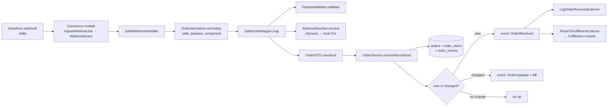

# OMS — Canonical Orders & Normalization

> **Module root:** `app/Oms/`
> **Primary repo doc:** [`OMS.md`](../../OMS.md) (verified against code below; several ⚠️ Doc vs Code deltas flagged)
> **Feature flag:** shares `config('features.commerce_layer')` with the Commerce module (`FEATURE_COMMERCE_LAYER`, default **off** — `config/features.php`)
> **Status/maturity:** Phase 4 (normalization) + Phase 5 (persistence) shipped; Phase 6 (Fulfillment) wired in. Salla is the only provider mapper. Read-only admin UI.

The OMS (Order Management System) is the **canonical order layer** of `rushly-saas`. It sits between storefront ingestion (the Commerce module) and order fulfillment (the Fulfillment module). Every order — regardless of source storefront — is reduced to exactly **one `orders` row + N `order_items` rows + ≥1 `order_events` audit row**. Downstream systems (Fulfillment router, dashboards, reports) read only this canonical shape; provider variance stops at the mapper boundary.

For the platform-wide picture see [03-Business-Domain.md](../03-Business-Domain.md), the end-to-end flows in [04-Business-Logic.md](../04-Business-Logic.md) and [12-Workflows.md](../12-Workflows.md), the module map in [11-Modules.md](../11-Modules.md), and the schema catalogue in [06-Database.md](../06-Database.md).

---

## 1. Purpose

`rushly-saas` is the single source of truth for the whole Rushly ecosystem; the Flutter apps are clients (see [_CONTEXT_BRIEF.md](../_CONTEXT_BRIEF.md)). Historically, each storefront integration (Salla, Zid, WooCommerce) wrote its own bespoke `*_orders` table and its own parcel-creation path. The OMS replaces that with **one canonical order model** so that:

- **Fulfillment, reporting, and dashboards read one shape**, not five provider-specific shapes.
- **Idempotent replay is trivial** — a webhook fired twice lands on the same row.
- **Provider quirks are isolated** to a thin per-provider mapper.
- **Orders and Parcels are decoupled**: one `Order` (merchant-side commerce unit) can produce 0..N `Parcels` (courier-side shipment units). The two have separate lifecycles and separate audit trails (`order_events` vs `parcel_events`).

> Source: `app/Oms/Models/Order.php` (docblock), `app/Oms/Enums/OrderStatus.php` (docblock).

---

## 2. Responsibilities & non-goals

**OMS owns:**

1. Normalizing a raw provider payload into a canonical `OrderDTO` (`app/Oms/Normalization/*`).
2. Materializing that DTO into `orders` / `order_items` / `order_events` idempotently (`app/Oms/Services/OrderService.php`).
3. Emitting domain events — `OrderReceived` (new) and `OrderUpdated` (changed) — so downstream modules can react.
4. Maintaining the append-only per-order audit trail.
5. Best-effort resolution of freeform provider city/area strings to local `cities.id` / `areas.id` (`app/Oms/Normalization/AddressResolver.php`).

**OMS explicitly does NOT (non-goals, `OMS.md` §8):**

- **Create Parcels.** That is the Fulfillment module's job (`RouteToFulfillmentListener` → `FulfillmentService`). OMS ends at "the canonical Order exists and an event was fired." See [FULFILLMENT.md](../../FULFILLMENT.md).
- **Write back to the storefront** (AWB/status push). That is a Commerce provider concern.
- **Send email/SMS/push.** OMS is a data layer; notifications belong to their existing pipelines.
- **Convert currency** — provider-native currency passes through untouched (deferred to a future "Phase 7").
- **Dedupe customers** — the `OrderCustomerDTO` is a per-order snapshot, not a persistent customer entity.

---

## 3. Where it sits (pipeline)



> Sources: `app/Commerce/Providers/Salla/SallaWebhookHandler.php`, `app/Oms/Normalization/OrderNormalizer.php`, `app/Oms/Normalization/Providers/SallaOrderMapper.php`, `app/Oms/Services/OrderService.php`, `app/Providers/EventServiceProvider.php`.

---

## 4. Business rules

| Rule | Where enforced | Notes |
|---|---|---|
| **Idempotency key** = `(connection_id, remote_order_id)` UNIQUE | `orders` migration (`orders_connection_remote_unique`); `OrderService::receiveNormalized` | Replay of the same webhook → same row. |
| **New order** → insert row, items, one `created` audit event, fire `OrderReceived` | `OrderService::createNew` | New orders start `status=pending`, `fulfillment_status=unfulfilled`. |
| **Existing order** → recompute, diff against mapper-authoritative columns; if changed → `updated` audit event + `OrderUpdated`; if unchanged → silent no-op | `OrderService::applyUpdate` + `diff()` | Different events on purpose: fulfillment runs **once** (on receive); replays/edits must not re-trigger it (`OMS.md` §5). |
| **Full item replace** on every update (delete + re-insert) | `OrderService::replaceItems` | Cheaper than diffing a short line list; correct when storefront removes/edits a line. |
| **All-or-nothing write** | `DB::transaction()` wrapping `receiveNormalized` | No orphan `order_items` on partial failure. |
| **Payment status auto-canonicalized** from mapper `financialStatus` | `OrderService::mapPaymentStatus` | `paid/pending/refunded/voided` → enum; anything else → `unknown`. |
| **OMS owns `status` / `fulfillment_status`**; the mapper is authoritative only for provider/customer/address/money columns | `applyUpdate` `$original` allow-list | Internal status columns are **not** overwritten by replays — they are driven by Phase 6 flows. |
| **Bad payload is non-retryable** | `NormalizationException` (caught in `SallaWebhookHandler`) | Handler stamps `webhook_events.normalization_error` instead of throwing, so the queue does not retry pointlessly. |
| **Address resolution never throws** | `AddressResolver` (swallows lookup faults, returns null IDs) | Order is still accepted with a freeform city string. |
| **Money** = `decimal(12,2)`; **currency** defaults `SAR` | `orders`/`order_items` migrations | Single-currency per order; no conversion. |

---

## 5. Database tables

Migrations: `database/migrations/2026_07_01_110001_create_orders_table.php`, `..._110002_create_order_items_table.php`, `..._110003_create_order_events_table.php`, and `..._130001_add_oms_order_id_to_parcels.php`. Cross-reference the full catalogue in [06-Database.md](../06-Database.md).

### 5.1 `orders` (canonical order, one per merchant-side commerce order)

| Column | Type | Notes |
|---|---|---|
| `id` | bigint PK | |
| `company_id` | bigint, indexed | Tenant scope (`settings()->id`). |
| `connection_id` | bigint, nullable | Loose FK → `commerce_connections` (no constraint, survives deletes). |
| `source_provider_code` | varchar(32) | `salla`, `zid`, … Redundant with connection but survives deletes. |
| `merchant_id` | bigint, nullable | Rushly `merchants.id`. |
| `webhook_event_id` | bigint, nullable | `webhook_events.id` that produced this order. |
| `remote_order_id` | varchar(191) | Provider's internal id. |
| `remote_order_number` | varchar(191), nullable | Human-readable ("#1042"). |
| `provider_status` | varchar(100), nullable | Provider-native status string. |
| `status` | varchar(32), default `pending` | `OrderStatus` enum value. |
| `payment_status` | varchar(32), default `unknown` | `PaymentStatus` enum value. |
| `fulfillment_status` | varchar(32), default `unfulfilled` | `FulfillmentStatus` enum value. |
| `payment_method` | varchar(32), nullable | Canonicalized by mapper (`cod`, `mada`, `tabby`, …). |
| `customer_remote_id` / `customer_name` / `customer_email` / `customer_phone` | varchar | Inline customer snapshot; `customer_phone` indexed for dedupe queries. |
| `shipping_name`, `shipping_phone`, `shipping_line1`, `shipping_line2`, `shipping_city_name`, `shipping_area_name`, `shipping_region`, `shipping_country`, `shipping_postcode` | varchar | Inline shipping address (denormalized, same pattern as `parcels.customer_*`). |
| `shipping_city_id` (indexed), `shipping_area_id` | bigint, nullable | `AddressResolver` matches into local `cities.id` / `areas.id`. |
| `subtotal`, `tax`, `shipping_fee`, `discount`, `total`, `cod_amount` | decimal(12,2), default 0 | `cod_amount` = 0 when not COD. |
| `currency` | varchar(8), default `SAR` | |
| `note` | text, nullable | |
| `normalized_snapshot` | longText, nullable | Full `OrderDTO::toArray()` blob — audit/debug only; consumers read the columns, not this. |
| `extra` | json, nullable | Provider-specific overflow (Salla urls/channel/tags). |
| `occurred_at` | timestamp, nullable, indexed | Provider's order-placed timestamp. |
| `received_at` | timestamp, default now, indexed | When Rushly first materialized the row. |
| `created_at` / `updated_at` | timestamps | |

**Indexes:** UNIQUE `(connection_id, remote_order_id)`; `(company_id, status)`; `(company_id, received_at)`; `(merchant_id, status)`; plus single-column indexes above.

### 5.2 `order_items`

`id`, `order_id` (FK → `orders`, **cascadeOnDelete**), `sort_order`, `sku` (indexed), `name`, `quantity`, `unit_price`, `total_price`, `currency`, `remote_product_id` (indexed), `remote_variant_id`, `extra` (json), timestamps. Index `(order_id, sort_order)`. Rewritten in full on every order update.

### 5.3 `order_events` (append-only audit trail)

`id`, `order_id` (FK cascadeOnDelete), `company_id` (indexed), `event_type` (varchar(64), indexed), `payload` (json), `user_id` (nullable — null = system event), `occurred_at` (default now), timestamps. Index `(order_id, occurred_at)`.

Event-type constants (`app/Oms/Models/OrderEvent.php`): `created`, `updated`, `status_changed`, `payment_status_changed`, `fulfillment_status_changed`, `parcel_linked`, `cancelled`, `note`. OMS itself writes only `created` and `updated`; downstream modules add the rest. Analogous to `parcel_events` on the courier side (kept separate on purpose).

### 5.4 `parcels.oms_order_id`

Migration `..._130001_add_oms_order_id_to_parcels.php` adds a nullable `oms_order_id` reverse link on `parcels` (after `wms_fulfillment_id`), indexed for the `OrderToParcelBridge` idempotency check. Nullable because legacy Salla path + manual admin parcel creation still write parcels with no Order.

---

## 6. Enums

All three are **PHP interfaces holding string constants** (not `enum` classes), serialized as varchar for self-documenting payloads/logs.

- **`OrderStatus`** (`app/Oms/Enums/OrderStatus.php`) — 7 states: `pending`, `confirmed`, `in_fulfillment`, `shipped`, `delivered`, `cancelled`, `returned`. `TERMINAL = [delivered, cancelled, returned]`. Orthogonal to the ~34-state courier `ParcelStatus`.
- **`FulfillmentStatus`** (`app/Oms/Enums/FulfillmentStatus.php`) — `unfulfilled`, `in_progress`, `partial`, `fulfilled`, `cancelled`. Umbrella above the WMS-side `App\Enums\Wms\FulfillmentStatus`.
- **`PaymentStatus`** (`app/Oms/Enums/PaymentStatus.php`) — `pending`, `paid`, `partially_paid`, `refunded`, `voided`, `unknown`.

> ⚠️ **Doc vs Code (minor):** `PaymentStatus::PARTIALLY_PAID` exists in the enum but `OrderService::mapPaymentStatus()` never emits it (`match` produces only paid/pending/refunded/voided/unknown). No mapper currently produces `partially_paid`.

---

## 7. Normalization pipeline & mappers

Two-step transform: provider-native payload → **provider-specific mapper** → canonical `OrderDTO`.

### 7.1 `OrderNormalizer` (facade)

`app/Oms/Normalization/OrderNormalizer.php` — slim, stateless facade. Resolves the mapper via `config('commerce.providers.<code>.order_mapper')` through the container (so mappers can constructor-inject shared helpers), caches the instance per code, and delegates:

```php
public function normalize(string $providerCode, array $payload, ?int $companyId = null): OrderDTO
```

- Throws `InvalidArgumentException` when no mapper is registered for the code, or the class doesn't implement `OrderMapperInterface`.
- `supportedCodes()` and `mapperFor()` support admin diagnostics.

> ⚠️ **Doc vs Code:** `OMS.md` §4/§5 shows `OrderNormalizer::normalize($raw, $connection)` and an `AddressResolver::hydrate($orderDto)` step **inside the normalizer**. The real signature is `normalize(string $providerCode, array $payload, ?int $companyId)`, and address resolution happens **inside the mapper** (`SallaOrderMapper::extractShippingAddress` calls `AddressResolver::resolve`), not as a separate normalizer stage. Code wins.

### 7.2 `OrderMapperInterface`

`app/Oms/Normalization/OrderMapperInterface.php` — one implementation per storefront. Contract: `code(): string` and `map(array $payload, ?int $companyId = null): OrderDTO`. The mapper validates shape, maps native → canonical fields, and calls `AddressResolver`. It does **not** persist, call the provider API, convert currency, or dedupe customers.

### 7.3 `SallaOrderMapper` (the only provider mapper today)

`app/Oms/Normalization/Providers/SallaOrderMapper.php`, registered as `config('commerce.providers.salla.order_mapper')`. Field paths mirror the legacy `app/Salla/Webhooks/Handlers/OrderCreatedHandler` (production source of truth). Key behaviors:

- Accepts both the full webhook envelope (`{event, merchant, data, …}`) and a bare order object — normalizes to `$data` up front.
- `PayloadValidator::validate($data, [...])` requires `id` and `customer` (array); `total.amount`/`items` etc. are nullable.
- Extracts customer (first+last name concat), shipping address, line items, currency (`total.currency` → `currency` → default `SAR`), and totals.
- **COD fallback:** if `cash_on_delivery.amount` is 0 **and** payment method is COD, `cod_amount` = order total.
- **Canonical payment method** (`canonicalPaymentMethod`): `cod`, `mada`, `apple_pay`, `tabby`, `tamara`, `bank_transfer`, `wallet`, `card`, else `prepaid`; empty → null.
- **Canonical financial status** (`canonicalFinancialStatus`): `paid`, `pending`, `refunded`, `voided`, else `unknown`.
- `billingAddress` is always null (Salla doesn't distinguish shipping vs billing).

### 7.4 `PayloadValidator`

`app/Oms/Normalization/PayloadValidator.php` — wraps Laravel's `Validator`; on failure throws `NormalizationException` carrying `errors` (nested) and `flat` (`"<field>: <msg>"` strings for the webhook viewer). NormalizationException is non-retryable by convention.

### 7.5 `AddressResolver`

`app/Oms/Normalization/AddressResolver.php` — best-effort match of provider city/area strings to local `cities.id` / `areas.id`. Case-insensitive, `en_name` first then Arabic `name`, `is_active=1`, scoped per company for cities, cached 24h (`Cache::remember`, keys `commerce.address.city:*` / `:area:*`). Faults are swallowed (returns null). `forget()` invalidates a cached pair. Known future work (in-code): fuzzy/Levenshtein match, synonym table ("Ar Riyadh" ↔ "Riyadh"), per-provider city-code column.

### 7.6 DTOs

Immutable, `readonly`, all provide `toArray()`:

- **`OrderDTO`** (`app/Oms/DTOs/OrderDTO.php`) — the canonical shape; `isCod()` helper; `toArray()` is the wire shape stored in `orders.normalized_snapshot` / `webhook_events.normalized_payload`.
- **`OrderItemDTO`**, **`OrderCustomerDTO`**, **`OrderAddressDTO`** — the latter carries both provider strings and resolved IDs, with `withResolved($cityId, $areaId)` returning a new instance.

---

## 8. `OrderService` (single persistence entry point)

`app/Oms/Services/OrderService.php`. Constructor-injects `OrderRepository`.

```php
public function receiveNormalized(
    OrderDTO $dto,
    CommerceConnection $connection,
    ?WebhookEvent $sourceEvent = null,
): Order
```

Flow (inside `DB::transaction`):

1. `repo->findByConnectionAndRemote($connection->id, $dto->remoteOrderId)`.
2. **None →** `createNew()`: fill common fields, set `status=pending` / `payment_status` (from financial status) / `fulfillment_status=unfulfilled` / `received_at=now`, save, `replaceItems`, write `OrderEvent(created)`, dispatch `OrderReceived`, return `fresh(['items'])`.
3. **Exists →** `applyUpdate()`: capture `$original` (mapper-authoritative columns only), re-fill, re-canonicalize `payment_status`, save, `replaceItems`, `diff()`; if non-empty → write `OrderEvent(updated, {changes})` + dispatch `OrderUpdated($order, $changes)`. If empty → no event (idempotent no-op).

`diff()` compares numerics as strings to avoid float/decimal noise. `fillCommonFields()` also stores `extra` and the full `normalized_snapshot`.

> ⚠️ **Doc vs Code:** `OMS.md` §5 says the initial audit event is `type=received`; the code writes `OrderEvent::TYPE_CREATED` (`created`) for new orders and `updated` for changes. The migration docblock says OrderService "uses `updateOrCreate`", but it actually does an explicit find-then-create/update, not `updateOrCreate`.

---

## 9. Events & consumers

| Event | Fired when | Payload |
|---|---|---|
| `App\Oms\Events\OrderReceived` | First materialization of an order | `readonly Order $order` |
| `App\Oms\Events\OrderUpdated` | Existing order re-normalized **with real changes** | `readonly Order $order`, `readonly array $changes` (`{col: {from, to}}`) |

Both use `Dispatchable` + `SerializesModels` (queue-safe).

**Registration** — `app/Providers/EventServiceProvider.php`:

```php
OrderReceived::class => [
    LogOrderReceivedListener::class,      // app/Oms/Listeners — structured log for ops
    RouteToFulfillmentListener::class,    // app/Fulfillment/Listeners — the real work
],
```

Listener order matters: log first (diagnostic row survives even if routing throws), then route.

- **`LogOrderReceivedListener`** (`app/Oms/Listeners/LogOrderReceivedListener.php`) — synchronous; writes `oms.order.received` structured log (order/company/connection/provider/remote id/total/currency/cod/items). Creates no Parcel.
  > ⚠️ **Doc vs Code:** this listener's own docblock calls itself a "Phase 5 stub" that gets "swapped for `RouteToFulfillment` when Phase 6 lands." In the current wiring Phase 6 **has** landed — `RouteToFulfillmentListener` is registered **alongside** it, not as a replacement. The stale comment overstates the parallel-with-legacy situation.
- **`RouteToFulfillmentListener`** (`app/Fulfillment/Listeners/RouteToFulfillmentListener.php`) — calls `FulfillmentService::fulfill($order)` synchronously (Phase 6 MVP). Never throws (failures recorded on the Fulfillment row + `FulfillmentFailed` event). See [FULFILLMENT.md](../../FULFILLMENT.md).

**`OrderUpdated` has no listeners today.** Storefront edits (e.g. a customer changing the shipping address before pickup) are not auto-propagated into an already-created Parcel — currently a manual ops task (`OMS.md` §6).

**Upstream consumer:** the only production caller of the pipeline is `app/Commerce/Providers/Salla/SallaWebhookHandler.php` — on any `order.*` webhook it calls `OrderNormalizer::normalize('salla', $event->payload, $connection->company_id)`, stamps `webhook_events.normalized_payload`, then calls `OrderService::receiveNormalized($dto, $connection, $event)`. `NormalizationException` is caught and stamped as `normalization_error`; any other exception rethrows to trigger queue retry. See [COMMERCE.md](../../COMMERCE.md) and [14-Integrations.md](../14-Integrations.md).

---

## 10. Reading orders — `OrderRepository`

`app/Oms/Repositories/OrderRepository.php` — thin, tenant-scoped:

- `find(int $id): ?Order` — with `items`, `connection.provider`.
- `findForCompany(int $id, int $companyId): ?Order` — tenant-scoped fetch.
- `findByConnectionAndRemote(int $connectionId, string $remoteOrderId): ?Order` — the idempotency lookup.
- `listForCompany(int $companyId, ?string $status, ?int $connectionId, int $limit = 100): Collection`.

The `Order` model also exposes a `scopeCompanywise()` (filters on `settings()->id`) and relations `items()` (ordered by `sort_order`), `events()` (desc `occurred_at`), `connection()`, `webhookEvent()`, `merchant()`.

> ⚠️ **Doc vs Code:** `OMS.md` §7 lists `pendingForCompany()` and `sinceForConnection()` methods — **neither exists** in the repository. The real read methods are the four above.

---

## 11. Controllers, routes & permissions

Admin-web only (Inertia/React), **read-only** in the current phase.

- **Controller:** `app/Http/Controllers/Backend/Oms/OrderController.php` — `index()` (list + filters) and `show()` (full detail with items/events/webhook link). Constructor `abort_unless(config('features.commerce_layer'), 404)` (skipped in console).
- **Inertia pages:** `Admin/Oms/Orders/Index` and `Admin/Oms/Orders/Show` (`resources/js/Pages/...`).
- **Routes** (both tenant-admin and super-admin surfaces):
  - `routes/web.php` (~L1001): `oms.orders.index` (`GET /admin/.../oms/orders`), `oms.orders.show` (`GET .../oms/orders/{id}`).
  - `routes/superadmin.php` (~L281): same two routes under the super-admin `oms.` group.
- **Permission:** both routes gated by middleware `hasPermission:integrations_read`. Mutations (there are none yet) would use `integrations_update` per the Commerce/Shipping convention. See [10-Authentication.md](../10-Authentication.md) and [17-Security.md](../17-Security.md).
- **Feature flag:** whole surface hidden unless `features.commerce_layer` is on.

See the route atlas in [09-API.md](../09-API.md). No public/mobile REST API exposes OMS orders — there is no `routes/api.php` entry for `Oms`.

---

## 12. Which apps use it

| App / surface | Uses OMS? | How |
|---|---|---|
| `rushly-saas` admin web (tenant) | ✅ | `Admin/Oms/Orders/*` read-only viewer, `integrations_read`, flag-gated. |
| `rushly-saas` super-admin web | ✅ | Same controller under `superadmin.php`. |
| Commerce module (`app/Commerce`) | ✅ upstream | `SallaWebhookHandler` feeds the pipeline. |
| Fulfillment module (`app/Fulfillment`) | ✅ downstream | Listens to `OrderReceived`; `OrderToParcelBridge` links `parcels.oms_order_id`. |
| **Flutter apps** (merchant, driver, admin, warehouse, …) | ❌ | **Not found in the current codebase.** No Flutter app consumes OMS orders directly. The merchant app's `store_connections` screen manages Commerce **connections**, not OMS orders; parcels (the courier unit) are what the mobile apps read, via the Parcel APIs — not `orders`. |

> The OMS canonical `orders` table is deliberately courier-agnostic; Flutter clients operate on `parcels`. If a merchant-facing "orders" screen is ever added it would consume this module via a new API layer (does not exist today).

---

## 13. Notifications

**None emitted by OMS.** Per the non-goals (`OMS.md` §8), OMS is a pure data layer — no email/SMS/push. `LogOrderReceivedListener` writes structured logs only. Any customer/merchant notification is the responsibility of downstream pipelines (Fulfillment, courier events) once a Parcel exists. See [14-Integrations.md](../14-Integrations.md) for the SMS/push providers.

---

## 14. Dependencies

- **Commerce module** (`app/Commerce/*`) — `CommerceConnection`, `WebhookEvent`, `RawOrderDTO`, provider registry in `config/commerce.php`. Upstream feeder.
- **Fulfillment module** (`app/Fulfillment/*`) — downstream consumer of `OrderReceived`. See [FULFILLMENT.md](../../FULFILLMENT.md).
- **Local geography tables** `cities` / `areas` — read by `AddressResolver`.
- **`merchants` table** — `Order::merchant()` relation.
- **Config:** `config/features.php` (`commerce_layer` flag), `config/commerce.php` (`providers.*.order_mapper`).
- **Framework:** Laravel `^10.10` (⚠️ `README.md` claims "Laravel 12"; `composer.json` pins `^10.10` — code wins, per [_CONTEXT_BRIEF.md](../_CONTEXT_BRIEF.md) and [26-Architecture-Decisions.md](../26-Architecture-Decisions.md)). Multi-tenancy via `stancl/tenancy`; `company_id` scoping via `settings()->id`.
- **Queue:** default `sync` (env `QUEUE_CONNECTION`) — events/listeners run inline unless the deployment configures a real queue.

---

## 15. Maturity & status

| Aspect | State |
|---|---|
| Normalization pipeline | **Shipped** (Salla only). Interface + facade generalized for more providers. |
| Persistence + idempotency + audit | **Shipped**, transactional. |
| Events `OrderReceived` / `OrderUpdated` | **Shipped**; `OrderReceived` fully wired to logging + Fulfillment. |
| `OrderUpdated` listeners | **None** — storefront edits not propagated to parcels. |
| Provider coverage | **Salla only.** Zid/WooCommerce/Shopify referenced in comments/DTO examples but **no mappers exist** — `OrderNormalizer` throws `InvalidArgumentException` for them. |
| Address resolution | **Baseline** exact-match; fuzzy/synonym matching not implemented. |
| Admin UI | **Read-only** viewer; no mutations. |
| Customer entity / dedupe | **Not implemented** (snapshot only). |
| Currency conversion | **Not implemented** (provider-native pass-through). |
| Feature flag | **Off by default** (`commerce_layer`), so OMS is dormant in a default install. |
| Legacy coexistence | Legacy `app/Salla/Webhooks/Handlers/OrderCreatedHandler` and per-provider `*_orders` tables still exist; OMS runs alongside, not yet a full replacement. See [22-Technical-Debt.md](../22-Technical-Debt.md). |

---

## 16. Future improvements

1. **More provider mappers** — `ZidOrderMapper`, `WooCommerceOrderMapper`, `ShopifyOrderMapper` implementing `OrderMapperInterface`; register in `config/commerce.php`.
2. **`OrderUpdated` listener** — propagate storefront edits (address/items) into an already-created Parcel instead of manual ops.
3. **Fuzzy address resolution** — Levenshtein, synonym table, per-provider city-code column (noted in `AddressResolver` docblock).
4. **Persistent Customer entity + dedupe** — the "Phase 5 `CustomerNormalizer`" against a real `customers` table (phone/email dedupe), replacing the per-order snapshot DTO.
5. **`order_payments` table** — per-payment records; wire `partially_paid` end-to-end (enum value exists but is never produced today).
6. **Currency conversion** — the deferred "Phase 7" work.
7. **Retire the legacy Salla order path** once the OMS→Fulfillment pipeline fully covers parcel creation, removing the parallel `OrderCreatedHandler`.
8. **Fix stale docstrings** — `LogOrderReceivedListener` "swapped in Phase 6" comment, the `orders` migration "`updateOrCreate`" claim, and the `OMS.md` schema/method drift documented in the ⚠️ notes above.
9. **Admin mutations** — status changes / manual reprocess / re-dispatch (currently read-only), gated by `integrations_update`.

---

## Sources

**Read directly:**

- `OMS.md` (repo-root primary doc)
- `app/Oms/Models/Order.php`, `OrderItem.php`, `OrderEvent.php`
- `app/Oms/Services/OrderService.php`
- `app/Oms/Normalization/OrderNormalizer.php`, `OrderMapperInterface.php`, `PayloadValidator.php`, `AddressResolver.php`, `Providers/SallaOrderMapper.php`
- `app/Oms/DTOs/OrderDTO.php`, `OrderItemDTO.php`, `OrderAddressDTO.php`, `OrderCustomerDTO.php`
- `app/Oms/Events/OrderReceived.php`, `OrderUpdated.php`
- `app/Oms/Listeners/LogOrderReceivedListener.php`
- `app/Oms/Repositories/OrderRepository.php`
- `app/Oms/Enums/OrderStatus.php`, `FulfillmentStatus.php`, `PaymentStatus.php`
- `app/Oms/Exceptions/NormalizationException.php`
- `database/migrations/2026_07_01_110001_create_orders_table.php`, `..._110002_create_order_items_table.php`, `..._110003_create_order_events_table.php`, `..._130001_add_oms_order_id_to_parcels.php`
- `app/Http/Controllers/Backend/Oms/OrderController.php`
- `app/Commerce/Providers/Salla/SallaWebhookHandler.php`
- `app/Fulfillment/Listeners/RouteToFulfillmentListener.php`
- `app/Providers/EventServiceProvider.php`
- `config/commerce.php` (provider registry), `config/features.php` (flag)
- `routes/web.php`, `routes/superadmin.php` (OMS routes)

**Cross-linked docs:** [03-Business-Domain.md](../03-Business-Domain.md), [04-Business-Logic.md](../04-Business-Logic.md), [06-Database.md](../06-Database.md), [09-API.md](../09-API.md), [10-Authentication.md](../10-Authentication.md), [11-Modules.md](../11-Modules.md), [12-Workflows.md](../12-Workflows.md), [14-Integrations.md](../14-Integrations.md), [17-Security.md](../17-Security.md), [22-Technical-Debt.md](../22-Technical-Debt.md), [26-Architecture-Decisions.md](../26-Architecture-Decisions.md), and repo-root [COMMERCE.md](../../COMMERCE.md), [FULFILLMENT.md](../../FULFILLMENT.md).
