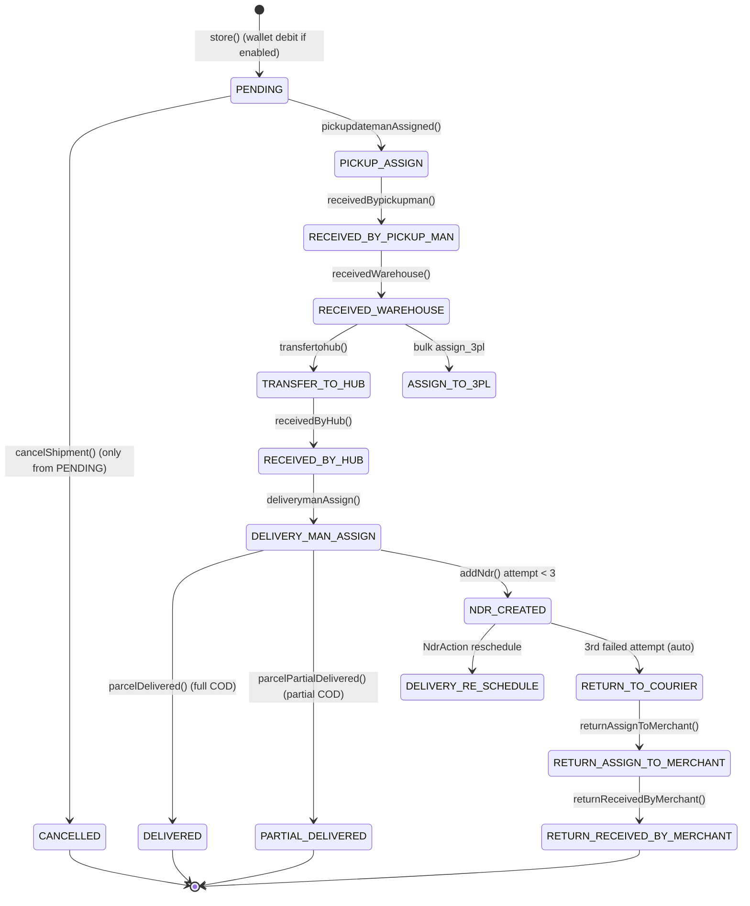
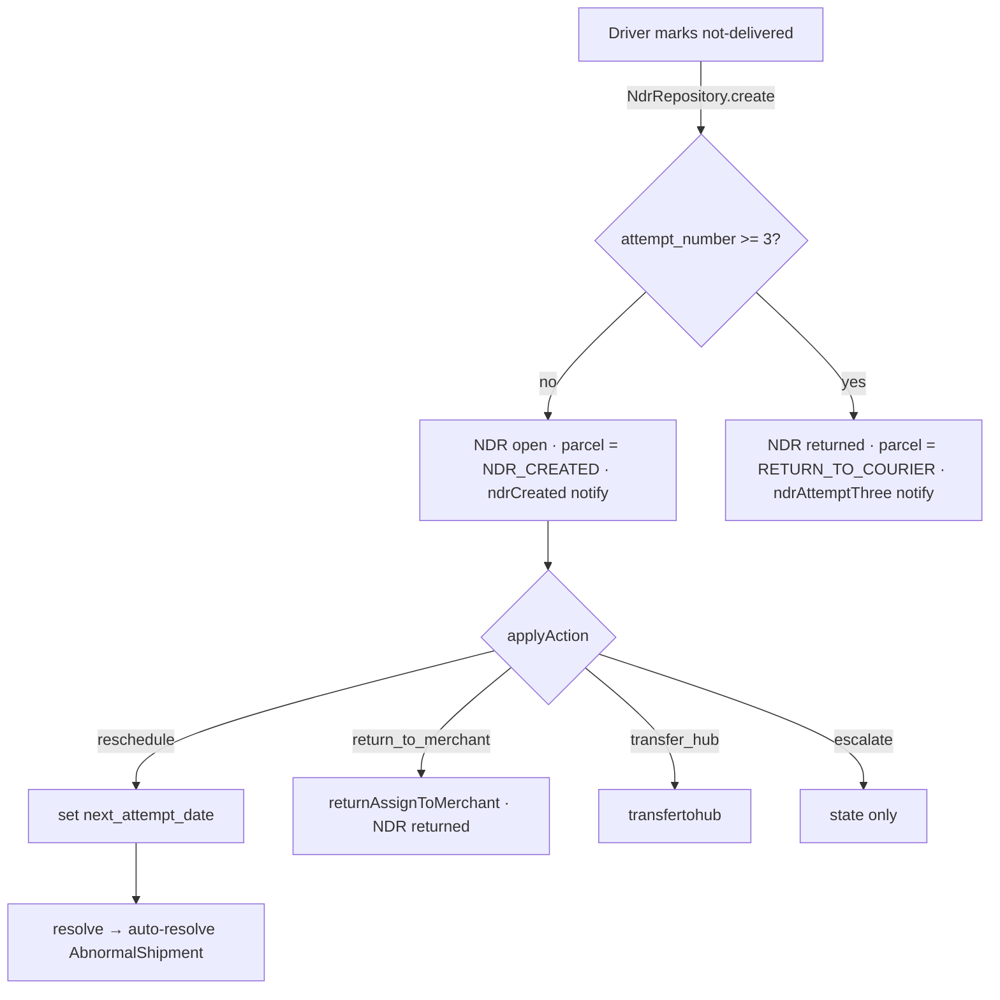

# Parcels — Core Courier Shipment Domain

> **Module status:** Legacy-but-live. This is the original, production, *parcel-centric*
> shipment engine of Rushly — the code path that actually moves boxes today. It predates
> the newer modular `app/Oms/`, `app/Fulfillment/`, `app/Shipping/` and `app/Wms/`
> namespaces, which layer *on top of* it (they ultimately create `Parcel` rows). Do not
> confuse this with the OMS canonical-order flow: see
> [oms-orders.md](oms-orders.md) for the newer ingestion pipeline, and
> [../11-Modules.md](../11-Modules.md) for how the modules relate.
>
> **Grounding:** every non-trivial claim below cites a real source file. Where the
> existing repo docs disagree with the code, a **⚠️ Doc vs Code** note flags it.
> Read [../_CONTEXT_BRIEF.md](../_CONTEXT_BRIEF.md) first for the ecosystem map.

---

## 1. Purpose & scope

The Parcels module owns the lifecycle of a single physical shipment ("parcel") from
merchant creation → pickup → warehouse/hub sorting → last-mile delivery →
COD settlement → return/RTO. It is the hub that every other Rushly surface reads and
writes:

- **Admin web** (Inertia/React + legacy Blade) drives it via `Backend\ParcelController`.
- **Mobile apps** (driver, merchant, admin, scanner, sorting) drive it via the
  `Api/V10` controllers.
- **Storefront bridges** (Salla, Zid, WooCommerce) create parcels via the external API.
- **3PL vendors** (Panda, Aramex, Jet, Zajel, Logestechs) are assigned parcels through
  the bulk-action and `parcels_3pl` bridge.

Two auxiliary sub-domains ship *inside* this module and are documented here because they
are tightly coupled to the parcel timeline:

- **NDR** — Non-Delivery Report: a structured failed-delivery attempt record.
- **Abnormal Shipments** — a background sweep that flags parcels with no timeline
  activity for N days.

Cross-links: business rules in [../04-Business-Logic.md](../04-Business-Logic.md),
workflows in [../12-Workflows.md](../12-Workflows.md), the API surface in
[../09-API.md](../09-API.md), schema in [../06-Database.md](../06-Database.md).

---

## 2. Responsibilities

| Responsibility | Where it lives |
|---|---|
| Parcel record + tenant isolation + activity log | `app/Models/Backend/Parcel.php` |
| Append-only status timeline | `app/Models/Backend/ParcelEvent.php` |
| 41-state status lifecycle (transitions + money side-effects) | `app/Repositories/Parcel/ParcelRepository.php` |
| Status labels / badge colors (single source via reflection) | `app/Support/ParcelStatusHelper.php`, `app/Enums/ParcelStatus.php` |
| Web CRUD + status transitions + printing | `app/Http/Controllers/Backend/ParcelController.php` |
| Mobile CRUD + driver actions | `app/Http/Controllers/Api/V10/ParcelController.php`, `DeliveryManParcelController.php` |
| Bulk actions (assign 3PL, change status, cancel, print AWBs, export, SMS, note) | `app/Http/Controllers/Backend/ParcelBulkActionController.php` |
| NDR lifecycle | `app/Models/Backend/Ndr.php`, `app/Repositories/NdrRepository.php`, `Backend\NdrController`, `Api/V10/NdrApiController` |
| Abnormal detection & triage | `app/Models/Backend/AbnormalShipment.php`, `app/Repositories/AbnormalShipmentRepository.php`, `Backend\AbnormalShipmentController`, `app/Console/Commands/DetectAbnormalShipments.php` |
| AWB / label PDF generation | `ParcelController::printMultipleParcelLabels()` (mpdf + `milon/barcode`) |
| External carrier status mapping | `app/Models/Backend/ParcelStatusMapping.php` |
| Notifications (push + SMS) for NDR/abnormal | `app/Services/FollowupNotificationDispatcher.php` |

---

## 3. Domain model

### 3.1 `Parcel` — `app/Models/Backend/Parcel.php`

Table `parcels`. Key traits and behaviours:

- **`use HasFactory, LogsActivity`** — Spatie activity log with log name `parcel`,
  logging only a curated financial/PII field set (`getActivitylogOptions()`,
  `app/Models/Backend/Parcel.php:173`).
- **Tenant global scope** (`booted()`, line 81): *every* Eloquent query is auto-constrained
  to `company_id = tenant()->company_id`. This closes the leak where
  `Parcel::find($id)` with a URL-supplied id could reach another tenant's row. Guards
  skip the scope when there is no tenant context (CLI/jobs/cron), when the tenant is
  half-resolved, or when the authed user is `SUPER_ADMIN`. Escape hatch:
  `Parcel::withoutGlobalScope('tenant')`. The legacy `scopeCompanywise()`
  (`->where('company_id', settings()->id)`, line 409) is retained for back-compat and is
  now redundant.
- **`updating` hook** (line 96): once `status === CANCELLED`, *all* further updates are
  aborted (`return false`). Also auto-increments `number_of_attempts` when status flips
  to `DELIVERY_MAN_ASSIGN`.
- **`updated` hook** (line 119): whenever any path flips status to `CANCELLED`, a
  `ParcelEvent` is logged best-effort with the transient `$cancellationReason`.
- **Cancellation rules**: `isCancellable()` returns true **only** while `status === PENDING`
  (line 149). `cancelShipment($reason)` (line 154) is the single guarded entry point.

**Relationships** (same file): `merchant`, `merchantShop`/`shop`, `deliveryCategory`,
`packaging`, `hub`/`transferhub`, `city`, `area`, `items` (→ `ParcelItem`),
`parcelEvent`/`lastParcelEvent`, `lastDeliveryMan`, `lastPickupMan`,
`parcels_3pl`/`lastParcel3pl`, `rejected_parcels`, `deliverymanStatement`, `images`.

**Rendered accessors**: `parcel_status` / `status_parcel` HTML badges (delegating to
`ParcelStatusHelper::badgeClass()`), `barcode_print` (`DNS1D` Code128 of `tracking_id`),
`qrcode_print` / `qrcode_id_print` (`DNS2D` QR), `parcel_invoice` / `admin_parcel_invoice`.

### 3.2 `ParcelItem` — `app/Models/Backend/ParcelItem.php`

Table `parcel_items` (added `2026_06_12_000003`). Lightweight SKU line snapshot attached
at parcel-create time (`sku`, `name`, `quantity`, `unit_price`, `line_total`, `note`),
optionally linked to a `WmsProduct`. Name/SKU are snapshotted so renaming a product later
does not rewrite shipment history.

### 3.3 `ParcelEvent` — `app/Models/Backend/ParcelEvent.php`

Table `parcel_events` — the **append-only timeline**. Each transition writes one row
(`parcel_status`, `note`, actor `created_by`, and optional `delivery_man_id`,
`pickup_man_id`, `hub_id`, GPS `delivery_lat/long`, `signature_image`, `delivered_images`).
`company_id` was denormalised onto it (migration `2026_06_27_000002`) so list/detection
queries need not join `parcels`; a `creating` hook backfills it from the parent parcel.

> Notable cross-module hook: `ParcelEvent::created()` (line ~104) **auto-resolves** any
> open `AbnormalShipment` for the same parcel — i.e. *any* new timeline activity clears
> the "stalled" flag.

### 3.4 Supporting models

- `ParcelStatusMapping` (`parcel_statuses_mapping`) — maps an external carrier's status
  code/text (EN/AR) to an internal `parcel_status_id`. `mapExternalToInternal()`
  normalises and matches by code → EN text → AR text. Used to translate 3PL webhook
  statuses into Rushly states.
- `Parcels_3pl` — bridge row per 3PL assignment (target company, remote reference).
- `ParcelLogs`, `ParcelImage`, `ParcelRating`, `RejectedParcel`, `InvoiceParcel` — see
  `app/Models/Backend/`.

---

## 4. Status lifecycle

`app/Enums/ParcelStatus.php` defines **41 integer constants** (a PHP `interface` of
`const`s, not a native enum). `parcels.status` (unsigned tinyint, default `PENDING = 1`)
holds exactly one. Human labels come from `lang/en/parcelStatus.php` (34 entries — several
states are badge-only flags with no label, e.g. `NDR_CREATED`, `ABNORMAL`). Badge colours
come from `ParcelStatusHelper::badgeMap`.

**⚠️ Doc vs Code:** the original `2022_04_04_142330_create_parcels_table.php` column
comment lists an old 9-value status set (`pending=1 … returned_merchant=9`). That comment
is **stale**; the live enum has 41 states. Code (`app/Enums/ParcelStatus.php`) wins.

Selected states (full list in the enum):

| # | Constant | Notes |
|---|---|---|
| 1 | `PENDING` | "Created". Only cancellable state. |
| 2–4 | `PICKUP_ASSIGN`, `PICKUP_RE_SCHEDULE`, `RECEIVED_BY_PICKUP_MAN` | Pickup leg |
| 5–6, 19 | `RECEIVED_WAREHOUSE`, `TRANSFER_TO_HUB`, `RECEIVED_BY_HUB` | Sorting / hub network |
| 7–8 | `DELIVERY_MAN_ASSIGN` ("OFD"), `DELIVERY_RE_SCHEDULE` | Last-mile |
| 9 | `DELIVERED` | Terminal — full COD settlement |
| 32 | `PARTIAL_DELIVERED` | Partial COD settlement |
| 11–13, 24–31 | `RETURN_WAREHOUSE` (RTO), returns to merchant (RTC) | Reverse flow |
| 34 | `ASSIGN_TO_3PL` | Handed to external carrier |
| 35 | `NDR_CREATED` | Flag — NDR badge |
| 36 | `ABNORMAL` | Flag — stalled shipment |
| 37–40 | `WMS_FULFILLMENT_PENDING/PICKING/PACKING/READY_TO_SHIP` | WMS integration states |
| 41 | `CANCELLED` | Terminal — locks the row (no further updates) |
| *-Cancel* | 14–18, 20–23, 25, 28–29, 31, 33 | Every forward move has a cancel/rewind twin |

Each cancel-suffixed state is the "undo" of its forward twin (e.g.
`RECEIVED_WAREHOUSE_CANCEL` rewinds `RECEIVED_WAREHOUSE`). See
[../04-Business-Logic.md](../04-Business-Logic.md) §1 for the full table and the money
side-effect of each edge.

### Transition engine — `ParcelRepository`

`app/Repositories/Parcel/ParcelRepository.php` (~3,570 lines) is the transition engine.
The contract is `app/Repositories/Parcel/ParcelInterface.php`. Every lifecycle edge is a
dedicated method that (a) writes a `ParcelEvent`, (b) sets `parcels.status`, and
(c) for money-bearing transitions, settles COD / wallet / deliveryman statements.
Representative methods: `store`, `duplicateStore`, `update`, `statusUpdate`,
`cancelShipment`, `pickupdatemanAssigned`, `receivedBypickupman`, `receivedWarehouse`,
`transfertohub`, `receivedByHub`, `deliverymanAssign`, `deliveryReschedule`,
`parcelDelivered`, `parcelPartialDelivered`, `returntoQourier`, `returnAssignToMerchant`,
`returnReceivedByMerchant`, plus a `*Cancel` twin for most, and bulk variants
(`deliveryManAssignMultipleParcel`, `transferToHubMultipleParcel`, `AssignReturnToMerchantBulk`).

**Tracking-id generation** (`app/Traits/TrackingTrait.php`): `generateTrackingId($id)`
returns `UPPER(prefix) . random_int(11111111,99999999) . $id`. The prefix is the tenant
setting `par_track_prefix` (default `RL-`). External bridges use `trackingId()` (no id
suffix) because the parcel row does not yet exist. In `store()` the parcel is inserted,
then the tracking id is generated from the new id and written back
(`ParcelRepository.php:641`).

---

## 5. NDR — Non-Delivery Report

Introduced `2026_05_23_020000_create_ndrs_table.php`. A structured record of a failed
delivery attempt, distinct from the raw `parcel_events` timeline.

- **Model** `app/Models/Backend/Ndr.php` (`ndrs` table, soft-deletes, activity-logged).
  Fields: `parcel_id`, `deliveryman_id`, `attempt_number`, `failure_reason`,
  `driver_notes`, `driver_photo`, `customer_notified`, `action_taken`,
  `next_attempt_date`, `status`, `resolved_by/at`, `abnormal_shipment_id` (link).
- **Enums**: `NdrStatus` (`open`/`in_progress`/`resolved`/`returned`),
  `NdrAction` (`reschedule`/`return_to_merchant`/`transfer_hub`/`escalate`),
  `NdrFailureReason` (`customer_absent`, `wrong_address`, `refused_delivery`,
  `customer_postponed`, `access_denied`, `payment_issue`, `damaged_shipment`,
  `incomplete_address`, `other`).

**Business rules** (`app/Repositories/NdrRepository.php`):

- `create()` (line 50): sets `company_id`, computes attempt number, links to an open
  `AbnormalShipment` if one exists.
  - **Three-strike rule**: if `attempt_number >= 3`, the NDR is marked `RETURNED`, the
    parcel is force-moved to `RETURN_TO_COURIER`, and `ndrAttemptThree()` fires. Otherwise
    the parcel is flagged `NDR_CREATED` and `ndrCreated()` fires.
- `applyAction()` (line 84): maps `NdrAction` to a real parcel transition —
  `reschedule` sets `next_attempt_date`; `return_to_merchant` calls
  `parcelRepo->returnAssignToMerchant()` and marks `RETURNED`;
  `transfer_hub` calls `parcelRepo->transfertohub()`; `escalate` just marks state.
- `resolve()` (line 115): marks `RESOLVED` and cross-resolves the parcel's open
  `AbnormalShipment` (`abnormalRepo->autoResolveByParcel()`).
- `stats()` / `returnRate()` power the NDR dashboard.

**Controllers**: `Backend\NdrController` (web: `index`, `create(Parcel)`, `store`,
`show`, `updateAction`, `resolve`, `export` → `app/Exports/NdrExport.php`),
`Api/V10/NdrApiController` (mobile: `index`, `merchantIndex`, `stats`, `byParcel`,
`show`, `store`, `notifyCustomer`). Parcels also expose `ParcelController::addNdr()`
(`POST /parcel/{parcel}/add-ndr`).

---

## 6. Abnormal shipments

Introduced `2026_05_23_010000_create_abnormal_shipments_table.php`. A background sweep
that surfaces parcels stuck with **no timeline activity for N days**.

- **Model** `app/Models/Backend/AbnormalShipment.php` (`abnormal_shipments`, soft-deletes,
  activity-logged): `parcel_id`, `detected_at`, `last_event_at`, `stale_days`,
  `severity`, `assigned_to`, `status`, `resolution_note`, `resolved_by`,
  `escalated_at`, `resolved_at`, plus `hasMany(Ndr)`.
- **Severity** (`app/Enums/AbnormalSeverity.php`): `warning` (3–4d stalled),
  `danger` (5–6d), `critical` (7+d). Computed in `severityFor()`.

**Detection** — `app/Repositories/AbnormalShipmentRepository.php::detect($thresholdDays)`
(line 42):

1. Skips terminal statuses (`DELIVERED`, `PARTIAL_DELIVERED`, `RETURNED_MERCHANT`,
   `RETURN_RECEIVED_BY_MERCHANT`, `DELIVERED_CANCEL`).
2. Left-joins the max `parcel_events.created_at` per parcel; a parcel is a candidate if
   its last event is older than the cutoff (or has no events).
3. Upserts an `abnormal_shipments` row per candidate with the computed `stale_days` /
   `severity`; existing open rows are refreshed rather than duplicated.

**Threshold** is per-tenant: `getThresholdDays()` reads `Config` key
`abnormal_threshold_days` (default 3, min 1).

**Command** `app/Console/Commands/DetectAbnormalShipments.php`
(`php artisan shipments:detect-abnormal [--tenant=] [--threshold=]`) iterates every
tenant, initialises tenancy, and calls `detect()`.

> **⚠️ Doc vs Code — scheduling:** the command exists and is tenant-aware, but I did not
> find it registered on a schedule in `app/Console/Kernel.php` / `routes/console.php`.
> **Not found in the current codebase** — confirm whether it runs via cron/scheduler or is
> invoked manually.

**Triage** — `Backend\AbnormalShipmentController`: `index` (list + filters),
`show`, `assign` (→ `investigating`), `takeAction`, `resolve`, and
`settings`/`updateSettings` (threshold config). Auto-resolution happens two ways:
resolving an NDR (§5) and *any* new `ParcelEvent` (§3.3).

---

## 7. AWB / label printing

- **Single label**: `ParcelController::parcelPrintLabel($id)` →
  `printMultipleParcelLabels(collect([$parcel]))`.
- **Bulk labels**: `parcelMultiplePrintLabel(Request)` validates selection, resolves the
  parcels via `repo->parcelMultiplePrintLabel()`, then `printMultipleParcelLabels()`.
- **Full detail print**: `parcelPrint($id)`.
- **Renderer**: `printMultipleParcelLabels()` uses **mpdf** (temp dir
  `storage/app/mpdf`) to render a PDF from a Blade view. Barcodes/QRs are the model's
  `barcode_print` (Code128 via `milon/barcode` `DNS1D`) and `qrcode_print` (`DNS2D`).
- Bulk **print AWBs** is also an action type in the bulk-action controller (§8), and
  `ParcelBulkAssignPrint` / runsheet printing (`TMSController::print_runsheet`) cover
  driver run-sheets.

---

## 8. Bulk actions

`app/Http/Controllers/Backend/ParcelBulkActionController.php` (~1,300 lines) backs the
`/admin/bulk_action` screen. Two-step: `check` (validate/preview a selection) then
`apply`.

`apply()` (line 224) accepts `action_type ∈ {change_status, assign_3pl, cancel,
export_excel, print_awbs, add_note, send_sms}`. Selections arrive as `shipment_ids`
(a textarea of `RL-…` tracking ids and/or numeric ids), split by `splitIds()` and matched
on `tracking_id`/`id`.

- **`change_status`** → `change_status()` (line 634) with a `statusMap()` (line 600).
- **`assign_3pl`** → per-carrier bulk assign (`zajel`, `aramex`, `jet`, `logestechs`, and
  `panda` via DeliveryPanda API). Guard: all selected parcels must be `RECEIVED_WAREHOUSE`.
  Logestechs routes through the newer `app/Shipping/` module via a `connection_id`.
- **`cancel` / `add_note` / `send_sms` / `print_awbs` / `export_excel`** — the remaining
  action types.

> **⚠️ Doc vs Code (fixed bugs, preserved as comments):** the code notes that the frontend
> historically posted `shipment_ids` while the backend read a non-existent `checked_ids`
> (every bulk action silently no-op'd), and that an `assign_deliveryman` action type was
> advertised but had no handler — both removed. See the inline comments at
> `ParcelBulkActionController.php:228` and `:248`.

See [../12-Workflows.md](../12-Workflows.md) for the bulk-ops workflow and
[../04-Business-Logic.md](../04-Business-Logic.md) for the money implications.

---

## 9. Tracking

- **Timeline read**: `ParcelController::trackingOffcanvas($id)` /
  `trackingJson($id)` / `logs($id)` render the `parcel_events` history; the model's
  `parcelEvent()` / `lastParcelEvent()` relations feed them.
- **By tracking id**: `ParcelRepository::parcelByTracking($tracking_id)` and the public
  API `GET /api/v10/parcel/tracking/{tracking_id}` (`ParcelController::parcelTrackingLogs`).
- **Public tracking**: the standalone `rushly-salla` bridge exposes `/track/{tn}` (see
  brief); public tracking API keys live in `App\Models\PublicTrackingApiKey`.
- **Map**: `MapParcelController` + `Api/V10/Admin/AdminMapController::parcels` feed live
  parcel positions to the admin map screens.
- **External-status ingestion**: 3PL webhooks translate carrier statuses via
  `ParcelStatusMapping::mapExternalToInternal()` before applying an internal transition.

---

## 10. Database tables

Full schema in [../06-Database.md](../06-Database.md). Parcel-owned tables:

| Table | Migration | Purpose |
|---|---|---|
| `parcels` | `2022_04_04_142330_create_parcels_table.php` | Core shipment row |
| `parcel_logs` | `2022_04_24_045606_create_parcel_logs_table.php` | Legacy log |
| `parcel_events` | `2022_04_27_123343_create_parcel_events_table.php` (+ `company_id` `2026_06_27_000002`) | Append-only timeline |
| `parcel_items` | `2026_06_12_000003_add_merchant_services_and_parcel_items.php` | SKU line snapshots |
| `parcel_statuses_mapping` | (see model) | External→internal status map |
| `ndrs` | `2026_05_23_020000_create_ndrs_table.php` | Non-delivery reports |
| `abnormal_shipments` | `2026_05_23_010000_create_abnormal_shipments_table.php` | Stalled-parcel flags |
| `invoice_parcels` | `2024_09_04_063833_create_invoice_parcels_table.php` | Parcel↔invoice bridge |

**Columns added to `parcels` over time** (migrations): `wms_fulfillment_id`
(`2026_05_23_100012`), `oms_order_id` (`2026_07_01_130001`) — these tie a parcel back to
the newer WMS fulfillment and OMS canonical order. `parcels_3pl` gained
`target_company_id` (`2026_05_29`) and `company_id` (`2026_07_01_140001`).

Core `parcels` columns (from the create migration): `company_id` (FK
`general_settings`), `merchant_id`, `merchant_shop_id`, pickup/customer address+phone+geo,
`invoice_no`, `category_id`, `weight`, `delivery_type_id`, `hub_id`/`transfer_hub_id`,
money columns (`cash_collection`, `selling_price`, `delivery_charge`, `cod_charge`,
`cod_amount`, `vat`, `vat_amount`, `total_delivery_amount`, `current_payable`,
`return_charges`), `tracking_id`, `status` (default `PENDING`), `partial_delivered`,
`return_to_courier`, `pickup_date`, `delivery_date`, `invoice_id`, timestamps.

---

## 11. APIs

Web routes are under `routes/web.php` (admin panel + merchant-panel prefix); mobile under
`routes/api.php` (`/api/v10`). Full route dump: repo-root `ROUTES.md` and
[../09-API.md](../09-API.md).

**Web (admin), `hasPermission:*` guarded** — a selection:
`parcel/index|details/{id}|create|store|edit/{id}|update/{id}`,
`parcel/status-update/{id}/{status_id}`, `parcel/cancel-shipment/{id}`,
`parcel/print/{id}`, `parcel/print/{id}/label`, `parcel/multiple/print/label`,
`parcel/tracking-json/{id}`, `parcel/logs/{id}`, plus ~40 transition endpoints
(pickup, warehouse, hub, delivery, return, delivered, partial) and their cancel twins,
`parcels/bulk/check` + `parcels/bulk/apply`, `bulk_action`,
`parcel/{parcel}/add-ndr`. NDR: `ndr/*` group (`hasPermission:ndr_manage`). Abnormal:
`abnormal/*` group (`hasPermission:abnormal_manage`).

**Mobile `/api/v10` (Sanctum)**:
`parcel/index|create|store|bulk-store|details/{id}|edit/{id}|update/{id}|logs/{id}|filter`,
`parcel/{id}/status/{statusId}`, `parcel/delete/{id}`, `parcel/all/status`,
`status-wise/parcel/list/{status}`; driver:
`deliveryman/parcel/index|details/{id}|by-tracking/{tracking}`,
`deliveryman/parcel/delivered/{id}`, `.../partial-delivered/{id}`,
`deliveryman/parcel-not-delivered`, `deliveryman/parcel-location-update`;
NDR: `ndr`, `ndr/merchant`, `ndr/stats`, `ndr/parcel/{parcelId}`, `ndr/{id}`,
`POST ndr`, `ndr/{id}/notify`; admin:
`admin/parcels`, `admin/parcels/{id}/assign-driver`, `admin/parcels/{id}/status`,
`admin/parcels/{id}/3pl`, `admin/parcels/{id}/3pl-assign`.
Public: `GET parcel/tracking/{tracking_id}`.

**External storefront bridges** (`api/v10/external/*`): `salla/parcel`, `zid/parcel`,
`woocommerce/parcel` → `SallaParcelController`, `ZidParcelController`,
`WooCommerceParcelController` — each `store()`s a parcel from a partner order and returns
the AWB/tracking id.

---

## 12. Flutter screens that consume it

All Flutter apps are **clients** of the endpoints above (rushly-saas is the SSOT). See
[../08-Flutter.md](../08-Flutter.md) and [../apps/](../apps/). Parcel-consuming screens:

| App | Screens (paths under `lib/features/`) |
|---|---|
| **rushly-driver-app** | `parcels/parcel_list_screen`, `parcel_details_screen`, `deliver_screen`, `not_delivered_screen`, `partial_delivery_screen`, `runsheet_screen`, `parcel_tracking_map`; `ndr/ndr_screen`, `ndr_create_screen` (uses `ApiEndpoints.ndrIndex/ndrStats/ndrByParcel`) |
| **rushly-merchant-app** | `parcels/parcel_list_screen`, `parcel_form_screen`, `parcel_details_screen`, `bulk_import_screen`, `parcel_tracking_map`; `ndr/ndr_screen` (read-only) |
| **rushly-admin-app** | `parcels/parcels_screen`, `parcel_details_screen`, `parcel_tracking_map`, `three_pl_sheet` (assign 3PL), `map/map_parcel` |
| **rushly-scanner-app / rushly-sorting-app** | scan-driven status transitions (`RECEIVED_WAREHOUSE`, `TRANSFER_TO_HUB`, `RECEIVED_BY_HUB`) via the status-update endpoints |

Each app ships its own `core/utils/parcel_status.dart` mirror of the status ids — a
duplication risk (see §15).

---

## 13. Notifications

`app/Services/FollowupNotificationDispatcher.php` centralises NDR/abnormal notifications
(push + SMS):

- `ndrCreated(Ndr)`, `ndrAttemptThree(Ndr)` — fired by `NdrRepository::create()`.
- `abnormalDetected(AbnormalShipment)`, `abnormalCritical(AbnormalShipment)`,
  `closedAsLost(AbnormalShipment)`, `dailyDigest($companyId, $counts)`.
- Recipients resolve to supervisors/admins/merchant (`supervisors()`, `admins()`,
  `merchant()`); push via `PushNotificationService`, SMS gated by
  `SmsSendSettingHelper($eventKey)`.

Parcel-create also sends the customer an SMS with the tracking id (bilingual message in
`ParcelRepository::store()` around line 760). Broadcast driver defaults to `null` and the
queue to `sync` (see brief), so notifications dispatch inline unless configured otherwise.

---

## 14. Permissions

Seeded in `database/seeders/PermissionSeeder.php`:

| Slug | Line | Guards |
|---|---|---|
| `parcel_read` | 224 | index/details/tracking/logs/print/export |
| `parcel_create` | 225 | create/store/import |
| `parcel_update` | 226 | edit/update |
| `parcel_delete` | 227 | destroy |
| `parcel_status_update` | 228 | all transition + cancel routes |
| `ndr_manage` | 417 | entire `ndr/*` group |
| `abnormal_manage` | 425 | entire `abnormal/*` group |

Enforced by the `hasPermission:*` route middleware and mirrored in controller-side
`hasPermission()` checks (e.g. `ParcelController.php:262`). Reporting permissions
(`parcel_total_summery`, `parcel_status_reports`, `parcel_wise_profit`) guard the
report routes. See [../10-Authentication.md](../10-Authentication.md) and
[../17-Security.md](../17-Security.md).

---

## 15. Maturity / status

- **Maturity:** production-critical, legacy monolith. `ParcelRepository` (~3,570 lines)
  and `ParcelController` (87 methods, ~3,300 lines) are the largest, hottest files in the
  domain. Battle-tested but hard to change safely.
- **NDR & Abnormal:** newer (May–Jun 2026 migrations), cleanly separated into repositories
  with interfaces — the intended pattern for the rest of the module.
- **Tenant isolation:** hardened recently — the `tenant` global scope on `Parcel` /
  `ParcelEvent` supersedes the older `scopeCompanywise()`.
- **Integration seams:** `oms_order_id`, `wms_fulfillment_id`, `parcels_3pl` link the
  legacy core to the newer `app/Oms/`, `app/Fulfillment/`, `app/Wms/`, `app/Shipping/`
  modules — the migration path is "new modules create Parcel rows", not "replace Parcel".

## 16. Known gaps & future improvements

- **⚠️ Abnormal cron unscheduled** — `shipments:detect-abnormal` is not confirmed on any
  schedule (§6). Register it (and a daily NDR/abnormal digest) explicitly.
- **God objects** — `ParcelRepository` mixes 41 transitions + COD/wallet/statement money
  logic + SMS in one file. Extract per-leg services (pickup, hub, last-mile, returns) and
  a dedicated settlement service; the NDR/Abnormal repos are the template.
- **Status set is a bare `interface`** of ints, not a PHP 8.1 native `enum`, and each
  Flutter app re-declares the ids (`core/utils/parcel_status.dart`) — drift risk. Publish
  the status catalogue via an endpoint or shared codegen.
- **Stale schema comment** — the `parcels.status` column comment still lists the old
  9-value set (§4). Correct it.
- **No formal transition guard table** — legal transitions are enforced implicitly across
  many methods; only `PENDING→CANCELLED` is guarded model-side. A central state-machine
  guard would prevent illegal jumps from the raw `statusUpdate()` / API force-status paths.
- **`parcelDelivered222` / `parcelSearchs222`** — dead/duplicated variants remain in
  `ParcelRepository`; prune.

See [../22-Technical-Debt.md](../22-Technical-Debt.md) and repo-root `GAPS.md`.

---

## Sources

Files and directories read for this doc:

- `app/Models/Backend/Parcel.php`, `ParcelItem.php`, `ParcelEvent.php`,
  `ParcelStatusMapping.php`, `Ndr.php`, `AbnormalShipment.php`
- `app/Enums/ParcelStatus.php`, `ParcelType.php`, `NdrStatus.php`, `NdrAction.php`,
  `NdrFailureReason.php`, `AbnormalSeverity.php`
- `app/Support/ParcelStatusHelper.php`, `app/Traits/TrackingTrait.php`
- `app/Repositories/Parcel/ParcelRepository.php`, `ParcelInterface.php`
- `app/Repositories/NdrRepository.php`, `AbnormalShipmentRepository.php`
- `app/Http/Controllers/Backend/ParcelController.php`, `ParcelBulkActionController.php`,
  `NdrController.php`, `AbnormalShipmentController.php`
- `app/Http/Controllers/Api/V10/ParcelController.php`, `DeliveryManParcelController.php`,
  `NdrApiController.php`, and `Api/V10/Admin/*`, `External/*` parcel controllers
- `app/Console/Commands/DetectAbnormalShipments.php`
- `app/Services/FollowupNotificationDispatcher.php`
- `database/migrations/2022_04_04_142330_create_parcels_table.php`,
  `2026_06_12_000003_add_merchant_services_and_parcel_items.php`,
  `2026_05_23_010000_create_abnormal_shipments_table.php`,
  `2026_05_23_020000_create_ndrs_table.php`, and other `*parcels*` migrations
- `database/seeders/PermissionSeeder.php`
- `routes/web.php`, `routes/api.php`
- `docs/04-Business-Logic.md`, `docs/_CONTEXT_BRIEF.md`, `lang/en/parcelStatus.php`
- Flutter clients: `rushly-driver-app/lib/features/{parcels,ndr}/`,
  `rushly-merchant-app/lib/features/{parcels,ndr}/`,
  `rushly-admin-app/lib/features/parcels/`
