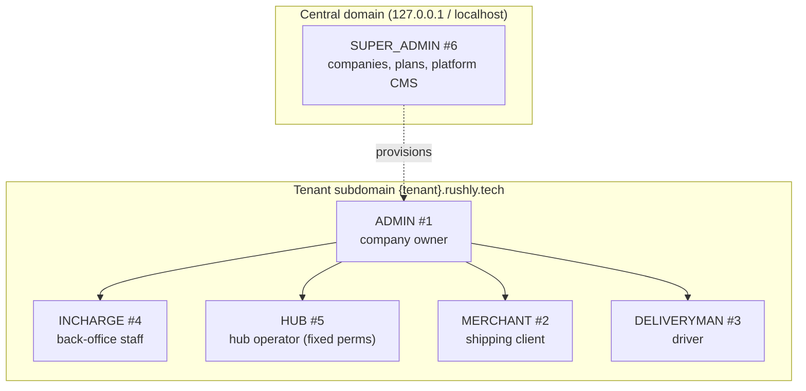
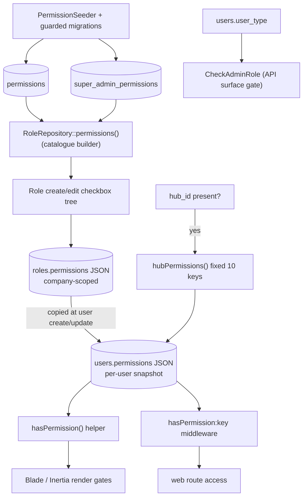

# Permissions, Users & Roles

> **Rushly business-module deep-dive.** This document goes *deeper* on the
> **Role-Based Access Control (RBAC)** slice than the platform-wide auth doc.
> If you want the end-to-end authentication story (login flows, Sanctum, OTP,
> session vs token), read [../10-Authentication.md](../10-Authentication.md)
> **first** — this module assumes it and expands only on the *authorization*
> half: how permissions are catalogued, how roles bundle them, how a user ends
> up with an effective permission set, and how the six user types partition the
> platform.
>
> **Ground truth:** `/var/www/rushly-saas` is the Single Source of Truth (see
> [../_CONTEXT_BRIEF.md](../_CONTEXT_BRIEF.md)). All Flutter apps are **clients** —
> they carry a `user_type` and a bearer token but do **not** hold or evaluate the
> fine-grained permission array; every gate that matters is enforced server-side.
>
> Cross-refs: [../06-Database.md](../06-Database.md) (tables),
> [../07-Laravel.md](../07-Laravel.md) (middleware pipeline),
> [../17-Security.md](../17-Security.md) (security posture),
> [../../super-admin.md](../../super-admin.md) (super-admin route inventory),
> and the sibling modules [merchants.md](merchants.md),
> [drivers-deliverymen.md](drivers-deliverymen.md), [hubs-network.md](hubs-network.md).

---

## 1. Purpose

Rushly is a **multi-tenant courier / logistics SaaS**. A single `users` table
serves every human actor across the platform: the platform operator, each
courier company's staff, their merchant clients, and their last-mile drivers.
The Permissions/Users/Roles module answers two questions:

1. **What kind of actor is this?** — the coarse **`user_type`** hierarchy
   (`app/Enums/UserType.php`) partitions users into six mutually-exclusive
   classes and decides *which surface* (central admin, tenant admin web,
   merchant portal, driver app, admin API…) they may even reach.
2. **What may this actor do inside that surface?** — a **flat array of
   permission strings** stored per user (`users.permissions`, JSON), assembled
   from a **role** (`roles` table) which is in turn built from a seeded
   **permission catalogue** (`permissions` + `super_admin_permissions`).

> **Design in one sentence:** Rushly RBAC is *not* Laravel Policies/Gates. It is
> a **seeded catalogue → role bundle → per-user snapshot** pipeline enforced by
> two string-membership checks (`hasPermission()` helper + `hasPermission:<key>`
> middleware) plus a `user_type` surface gate. Confirmed:
> `app/Providers/AuthServiceProvider.php` has an empty `$policies` map and there
> is no `app/Policies/` directory — see [../10-Authentication.md §1](../10-Authentication.md).

---

## 2. Responsibilities

| Responsibility | Where it lives |
|---|---|
| Define the actor taxonomy (6 user types) | `app/Enums/UserType.php` |
| Catalogue every grantable back-office permission | `database/seeders/PermissionSeeder.php` → `permissions` table (`App\Models\Permission`) |
| Catalogue every grantable platform (super-admin) permission | `PermissionSeeder::supperAdminPermissions()` → `super_admin_permissions` table (`App\Models\SuperAdminPermission`) |
| Bundle permissions into named, company-scoped roles | `app/Models/Backend/Role.php`, `app/Http/Controllers/Backend/RoleController.php`, `app/Repositories/Role/RoleRepository.php` |
| Snapshot a role's permissions onto a user at create/update | `app/Repositories/User/UserRepository.php` |
| Enforce per-permission access on web routes | `app/Http/Middleware/PermissionCheckMiddleware.php` (`hasPermission:<key>`) |
| Enforce per-permission access in views/props | `hasPermission()` helper — `app/Http/Helper/Helper.php:96` |
| Enforce coarse surface access on the admin API | `app/Http/Middleware/CheckAdminRoleMiddleware.php` |
| Keep the catalogue current on existing installs | idempotent `*_seed_*_permissions` migrations |

---

## 3. Business rules (the load-bearing invariants)

1. **`user_type` is set once, structurally, not by a role.** It comes from the
   creation path (merchant self-signup → `MERCHANT`, driver creation →
   `DELIVERYMAN`, super-admin context → `SUPER_ADMIN`, otherwise default
   `ADMIN`). It is *not* derived from the permission array.
   (`app/Repositories/User/UserRepository.php:90` sets `SUPER_ADMIN` when
   `isSuperadmin()`; the `users` migration defaults `user_type = ADMIN`.)

2. **Permissions are a per-user snapshot, not a live join.** At user
   create/update, the assigned role's `permissions` JSON is **copied** onto
   `users.permissions` (`UserRepository::store` line 108-110, `::update`
   line 157-159). **Editing a role afterwards does NOT retroactively change
   already-provisioned users** until each is re-saved. Treat
   `users.permissions` as the per-user source of truth.

3. **HUB users ignore their role and get a fixed default set.** If a user is
   created/updated with a `hub_id`, `UserRepository` overrides the role copy with
   the hard-coded `hubPermissions()` list (10 keys — dashboard/parcel read +
   hub-cash + hub-payment-request), regardless of the selected role
   (`UserRepository.php:169-182`).

4. **Roles are company-scoped (tenant-isolated).** `roles.company_id` is a
   non-nullable FK to `general_settings` (the per-tenant "company" row), and all
   role reads filter `where('company_id', settings()->id)`
   (`RoleRepository::all/getRole`, `Role::scopeCompanywise`). One tenant can
   never see or assign another tenant's roles.

5. **Two disjoint catalogues.** Tenant/back-office roles draw from
   `permissions`; the super-admin role draws from `super_admin_permissions`. The
   `RoleRepository::permissions()` builder picks the catalogue by
   `isSuperadmin()` (`RoleRepository.php:83-94`).

6. **The tenant "owner" (admin) role is deliberately blocked from two hub-only
   attributes.** When building permissions for an `admin` / `super-admin` slug
   role, `hub_payments_request` and `cash_received_from_delivery_man` are
   excluded (`RoleRepository::permissions` line 87-89 and
   `adminPermissionsModules` line 100-102) — those belong to hub operators, not
   the company owner.

7. **Null-safe deny.** A user whose `permissions` is `NULL` (or non-array) is
   treated as **unauthorised**, never a 500. Both the helper (`Helper.php:101`,
   `is_array($perms) && in_array(...)`) and the middleware
   (`PermissionCheckMiddleware.php:24-28`) guard this — a documented fix for a
   past `in_array(..., null)` TypeError.

8. **Surface gate is coarse and independent of the permission array.** The admin
   API admits only `{ADMIN, SUPER_ADMIN, INCHARGE, HUB}`
   (`CheckAdminRoleMiddleware::ADMIT`); MERCHANT and DELIVERYMAN are rejected with
   `403` even holding a valid token and even if their permission array somehow
   contained admin keys.

9. **User id `1` is protected.** `UserRepository::delete` refuses to delete
   `id == 1`, and `::update` skips hub/designation/department/status mutation for
   `id == 1` (`UserRepository.php:136-141,187`) — the seeded primary owner cannot
   be demoted or removed through the normal path.

---

## 4. User types — the coarse hierarchy

`app/Enums/UserType.php` is a **PHP interface of integer constants** (not a
native `enum`), stored in `users.user_type` (`unsignedTinyInteger`, default =
`ADMIN`):

```php
interface UserType {
    const ADMIN       = 1;
    const MERCHANT    = 2;
    const DELIVERYMAN = 3;
    const INCHARGE    = 4;
    const HUB         = 5;
    const SUPER_ADMIN = 6;
}
```

| # | Constant | Actor | Primary surface | Permission source |
|---|---|---|---|---|
| 1 | `ADMIN` | Courier-company owner / tenant admin | Admin web `/admin/*`, Admin app | Assigned role (owner/admin role usually = full tenant catalogue minus hub-only keys) |
| 2 | `MERCHANT` | Tenant's shipping client | Merchant portal `/merchant/*`, Merchant app | Merchant role (merchant-scoped keys only) |
| 3 | `DELIVERYMAN` | Last-mile / fleet driver | Driver app, Fleet app | No web permission array in practice — driver actions are API-endpoint-scoped, not `hasPermission`-gated |
| 4 | `INCHARGE` | Hub in-charge / back-office staff | Admin web + Admin API | Assigned role |
| 5 | `HUB` | Hub operator account | Admin web + Admin API | **Fixed** `hubPermissions()` set (bypasses role) |
| 6 | `SUPER_ADMIN` | Rushly platform operator | Central domain `/super-admin/*` | Super-admin role from `super_admin_permissions` |



> ⚠️ **Doc vs Code — `INCHARGE` is missing from the migration's comment map, and
> `HUB`/`SUPER_ADMIN` are absent too.** The `users` migration's `user_type` column
> comment only enumerates ADMIN/MERCHANT/DELIVERYMAN/INCHARGE
> (`2014_10_11_000000_create_users_table.php:31`). The **code enum is the truth**:
> `HUB=5` and `SUPER_ADMIN=6` exist and are used throughout
> (`CheckAdminRoleMiddleware`, `UserRepository`, `LoginController`). The comment
> is stale.

> Note the mixed casing in the enum source (`CONST HUB`, `CONST SUPER_ADMIN`) —
> PHP keywords are case-insensitive so this is harmless, but it flags these two as
> later additions to the original four.

---

## 5. The permission catalogue

### 5.1 Two tables, same shape

Both catalogue tables are intentionally minimal (`permissions` migration
`2022_04_23_032024`, `super_admin_permissions` migration `2023_12_24_115931`):

| Column | Type | Meaning |
|---|---|---|
| `id` | bigint PK | — |
| `attribute` | string, nullable | The **module/group** name (e.g. `hubs`, `wms`, `parcel`) |
| `keywords` | text, nullable | JSON map of `verb → permission-string`, cast to `array` |
| `created_at/updated_at` | timestamps | — |

The models are one-liners — the only behaviour is the `keywords` array cast:

```php
// app/Models/Permission.php  &  app/Models/SuperAdminPermission.php
protected $casts = ['keywords' => 'array'];
```

So one **row** = one attribute group; its `keywords` value expands to several
granular permission strings. Example row seeded for hubs:

```
attribute = 'hubs'
keywords  = { read: hub_read, create: hub_create, update: hub_update,
              delete: hub_delete, incharge_read: hub_incharge_read, …,
              incharge_assigned: hub_incharge_assigned, view: hub_view }
```

### 5.2 Naming convention

Within a group, keywords follow **`{entity}_{read|create|update|delete}`** plus
feature verbs where CRUD doesn't fit:

- CRUD: `account_read`, `account_create`, `account_update`, `account_delete`.
- Feature verbs: `payment_reject`, `payment_process`, `support_reply`,
  `support_status_update`, `parcel_status_update`, `sms_settings_status_change`,
  `hub_incharge_assigned`, `permission_update`, `wallet_request_approve`.
- **Composite "manage" gates** for newer modules applied at the whole-prefix
  level in `routes/web.php`: `ndr_manage`, `abnormal_manage`, `wms_manage`,
  `zatca_manage`, `label_template_manage`, `tour_manage`, `knowledge_base_update`,
  `performance_dashboard_read`.

### 5.3 Tenant / back-office catalogue (`permissions` table)

`PermissionSeeder::run()` seeds ~72 attribute groups. Grouped by domain:

| Domain | Attribute groups (rows) |
|---|---|
| Dashboard & reports | `dashboard` (25 keyword widgets), `logs`, `reports`, `bank_transaction`, `performance_dashboard` |
| Network & staff | `hubs`, `users`, `roles`, `designations`, `departments`, `supplier_companies`, `operational_areas` |
| Finance | `accounts`, `income`, `expense`, `fund_transfer`, `account_heads`, `salary`, `salary_generate`, `payments`, `hub_payments`, `hub_payments_request`, `cash_received_from_delivery_man`, `payout`, `payout_setup_settings`, `online_payment`, `invoice`, `wallet_request` |
| Merchants | `merchant` (incl. shop / delivery-charge / payment sub-keys) |
| Parcels & delivery | `parcel`, `delivery_man`, `delivery_category`, `delivery_charge`, `delivery_type`, `packaging`, `category`, `liquid_fragile`, `pickup_request`, `fraud` |
| NDR / exceptions / WMS / TMS | `ndr`, `abnormal`, `wms`, `tms` |
| Settings & integrations | `general_settings`, `integrations`, `mobile_apps`, `sms_settings`, `sms_send_settings`, `notification_settings`, `push_notification`, `social_login_settings`, `zatca`, `knowledge_base`, `tour`, `label_template`, `company` |
| Assets & content | `asset_category`, `assets`, `news_offer`, `todo`, `subscribe`, `subscription` |
| Front-web CMS | `social_link`, `services`, `why_courier`, `faq`, `partner`, `blogs`, `pages`, `sections` |

Notable specifics from the seeder:

- **`dashboard`** is unusual — its keywords are not CRUD but **25 individual
  widget/metric toggles** (`total_parcel`, `income_expense_charts`,
  `merchant_revenue_charts`, `bank_transaction`, …), letting a role show/hide
  each dashboard tile.
- **`users`** and **`roles`** groups include `permission_update` and full CRUD —
  these are the meta-permissions that let an admin manage other users' access.
- **`company`** (tenant scope) grants `company_read` / `company_create` only — a
  reseller/white-label capability letting a *tenant admin* spin up child tenants.
  The seeder comment explicitly notes this **coexists with** the super-admin
  `company` attribute (which has the full CRUD+subscribe set) — same string
  prefix, different catalogue, different scope.
- **`database_backup`** is **commented out** in the tenant catalogue
  (`PermissionSeeder.php:185-187`) — it exists only in the super-admin catalogue.

### 5.4 Platform / super-admin catalogue (`super_admin_permissions` table)

`PermissionSeeder::supperAdminPermissions()` seeds the platform-operator groups:

| Domain | Attribute groups |
|---|---|
| Platform ops | `dashboard`, `database_backup`, `roles`, `designations`, `departments`, `supplier_companies`, `operational_areas`, `users` |
| **Tenant lifecycle** | **`company`** (read/create/update/delete/**subscribe**), **`plans`** (CRUD) |
| Global settings | `general_settings`, `integrations`, `mobile_apps`, `knowledge_base`, `sms_settings`, `currency`, `payout_setup_settings` |
| Support & billing | `support`, `subscribe` |
| Front-web CMS | `social_link`, `why_courier`, `faq`, `partner`, `blogs`, `pages`, `sections` |

The defining super-admin-only capabilities are **`company_*`** (create/manage
tenant companies, `company_subscribe`), **`plans_*`** (subscription plans), and
**`currency_*`** — none of which exist in the tenant catalogue.

### 5.5 Catalogue evolution — the seeder is **not idempotent**

⚠️ **Doc vs Code caveat.** `PermissionSeeder::run()` does raw `new Permission();
…->save()` in a loop — **re-running it inserts duplicate rows.** New permission
groups added after the initial seed are therefore introduced by **idempotent
migrations** that check-then-insert, not by re-seeding:

| Migration | Adds |
|---|---|
| `2026_05_24_000004_seed_integrations_permissions.php` | `integrations` |
| `2026_06_27_000001_seed_knowledge_base_permissions.php` | `knowledge_base` |
| `2026_07_01_100006_seed_tour_manage_permission.php` | `tour_manage` |
| `2026_07_05_100003_seed_tms_permissions.php` + `..._100006_backfill_tms_permissions.php` | `tms` |
| `2026_07_05_100007_seed_tenant_company_permission.php` | tenant `company` |
| `2026_07_22_230000_seed_mobile_apps_permission.php` | `mobile_apps` |

Each guards with `if (DB::table('permissions')->where('attribute', X)->exists())
return;` and explicitly documents that it does **not** backfill role/user grants —
adding a catalogue key never silently grants it to anyone
(`2026_07_05_100003_seed_tms_permissions.php` docblock). ⚠️ The seeder itself
still lists `tms`, `company`, `mobile_apps`, etc., so on a **fresh** install the
seeder covers them and the guarded migrations no-op; on an **existing** install
the migrations fill the gap. Both paths converge to one row per attribute.

---

## 6. Roles

### 6.1 Table & model

`roles` migration (`2014_10_10_040240_create_roles_table.php`):

| Column | Type | Notes |
|---|---|---|
| `id` | bigint PK | — |
| `company_id` | FK → `general_settings`, cascade | **Tenant scope** (non-nullable) |
| `name` | string, nullable | Display name |
| `slug` | string, nullable | `str_replace(' ','-', strtolower(name))`; special slugs `admin` / `super-admin` change the catalogue builder |
| `permissions` | text, nullable, **cast `array`** | The bundled permission-string list |
| `status` | tinyInteger, default `Status::ACTIVE` | Active/inactive toggle |
| timestamps | — | — |

`app/Models/Backend/Role.php` casts `permissions => array`, logs changes via
spatie activity-log (`logOnly(['name','permissions'])`), and exposes
`scopeCompanywise()` (`where('company_id', settings()->id)`).

### 6.2 Building a role (the catalogue → role UI)

`RoleController@create/edit` calls `RoleRepository::permissions($slug)` to fetch
the checkbox tree the admin ticks (`RoleRepository.php:81-95`):

```php
public function permissions($role) {
    if (isSuperadmin())                                   // super-admin console
        return SuperAdminPermission::all();
    elseif ($role == 'admin' || $role == 'super-admin')   // tenant owner role
        return Permission::whereNotIn('attribute',
                 ['hub_payments_request','cash_received_from_delivery_man'])->get();
    else                                                  // any custom tenant role
        return Permission::orderBy('id','asc')->get();
}
```

On submit, `RoleRepository::store/update` writes the ticked permission strings
straight into `roles.permissions` and pins `company_id = settings()->id`
(`RoleRepository.php:33-64`). The role builder is **additive** — a role is just
the flat union of the granular strings the admin selected across all groups.

### 6.3 Roles are managed under the `roles` permission group

Route access to role CRUD is itself gated by `role_read` / `role_create` /
`role_update` / `role_delete` (seeded in both catalogues) — a chicken-and-egg
that the seeded owner/super-admin role bootstraps.

---

## 7. From role to user — the snapshot pipeline



**The copy points** (`app/Repositories/User/UserRepository.php`):

- `store()` line 105-111: `if ($request->hub_id) { permissions = hubPermissions(); }
  else if ($role->permissions !== null) { permissions = $role->permissions; }`
- `update()` line 154-160: same logic.
- `permissionUpdate($id, $request)` line 236-251: a **direct** per-user override —
  the "edit this specific user's permissions" screen writes
  `users.permissions = $request->permissions` (or `[]` if none), **bypassing any
  role**. Gated by `permission_update`.

**Consequence:** three independent ways a user's effective permissions are set —
(1) role snapshot at create/update, (2) fixed hub default when `hub_id` set,
(3) manual per-user override. There is **no runtime join** back to `roles`; the
role is a *template*, not a live authority.

---

## 8. Enforcement points

| Layer | Mechanism | Source | On failure |
|---|---|---|---|
| Web route | `hasPermission:<key>` middleware | `PermissionCheckMiddleware.php` | `redirect('/')` |
| View / Inertia prop | `hasPermission('<key>')` helper | `Helper.php:96` | element/prop hidden (returns `false`) |
| Admin API surface | `CheckAdminRole` (`user_type ∈ ADMIT`) | `CheckAdminRoleMiddleware.php` | `403 Forbidden` |
| API app-key | `CheckApiKey` header | `CheckApiKeyMiddleware.php` | `400 Invalid Api Key` |
| Central vs tenant login | `LoginController::login` | `Auth/LoginController.php` | failed-login / redirect to tenant |
| Super-admin routes | `auth` + `hasPermission:<super key>` | `routes/superadmin.php` | `redirect('/')` |

Key nuance already established in [../10-Authentication.md §9](../10-Authentication.md):
**Admin vs merchant separation is by permission, not a user_type middleware** on
the web. Both `/admin/*` and `/merchant/*` sit under the same `auth` +
`subscriptionCheck` groups; a merchant's copied permission set simply lacks admin
keys, so admin routes `redirect('/')`. The API is the opposite — there the coarse
`CheckAdminRole` **type** gate is the primary wall.

---

## 9. Permission matrix

### 9.1 By user type — effective surface access

Derived from `CheckAdminRoleMiddleware`, the central/tenant login rules
(`LoginController`), `subscriptionCheck`, `RequireOnboarding`, and typical seeded
role sets. Fine-grained access *within* a type still depends on the exact
`users.permissions` array.

| Capability | SUPER_ADMIN (6) | ADMIN (1) | INCHARGE (4) | HUB (5) | MERCHANT (2) | DELIVERYMAN (3) |
|---|:--:|:--:|:--:|:--:|:--:|:--:|
| Web login on **central** domain | ✅ | ❌ redirected | ❌ | ❌ | ❌ | ❌ |
| Web login on **tenant** subdomain | ❌ | ✅ | ✅ | ✅ | ✅ | portal parts |
| `/super-admin/*` (companies, plans, currency) | ✅ (via super perms) | ❌ | ❌ | ❌ | ❌ | ❌ |
| Admin web `/admin/*` (per `hasPermission`) | ✅ | ✅ | partial | partial (fixed hub set) | ❌ | ❌ |
| Merchant portal `/merchant/*` | — | — | — | — | ✅ | ❌ |
| Admin API `/api/v10/admin/*` (`CheckAdminRole`) | ✅ | ✅ | ✅ | ✅ | ❌ 403 | ❌ 403 |
| Merchant API endpoints | ❌ | ❌ | ❌ | ❌ | ✅ | ❌ |
| Driver API endpoints | ❌ | ❌ | ❌ | ❌ | ❌ | ✅ |
| Subject to `subscriptionCheck` | ❌ exempt | ✅ | ✅ | ✅ | ✅ | ✅ |
| Forced through `/onboarding` | ❌ | ✅ until done | ❌ | ❌ | ❌ | ❌ |
| Permission source | super-admin role | assigned role | assigned role | **fixed** `hubPermissions()` | merchant role | endpoint-scoped |

Legend: ✅ permitted · ❌ denied · "partial" = depends on granular keys.

### 9.2 By capability — who typically holds each catalogue group

Effective grants depend on the role, but the catalogue *scope* is fixed:

| Permission group | Tenant catalogue | Super-admin catalogue | Typical holder |
|---|:--:|:--:|---|
| `company_*` (create tenant companies) | read/create only | full CRUD + subscribe | SUPER_ADMIN (full); ADMIN (child-company create, if granted) |
| `plans_*`, `currency_*` | — | ✅ | SUPER_ADMIN |
| `role_*`, `user_*`, `permission_update` | ✅ | ✅ | ADMIN, SUPER_ADMIN |
| `hub_*`, `hub_incharge_*` | ✅ | — | ADMIN, INCHARGE |
| `hub_payment_request_*`, `cash_received_from_delivery_man_*` | ✅ (**excluded from admin/owner role**) | — | HUB (fixed set), INCHARGE |
| `merchant_*`, `merchant_shop_*`, `merchant_payment_*` | ✅ | — | ADMIN, INCHARGE |
| `parcel_*`, `delivery_man_*`, `pickup_request_*` | ✅ | — | ADMIN, INCHARGE |
| `wms_*`, `ndr_*`, `abnormal_*`, `tms_*`, `zatca_*` | ✅ | — | ADMIN + specialised staff roles |
| `performance_dashboard_*` | ✅ | — | ADMIN (executive) |
| Front-web CMS (`blogs`, `faq`, `pages`, …) | ✅ | ✅ | ADMIN (tenant site) / SUPER_ADMIN (marketing site) |

---

## 10. Database tables

| Table | Model | Key columns | Migration |
|---|---|---|---|
| `permissions` | `App\Models\Permission` | `attribute`, `keywords` (JSON) | `2022_04_23_032024_create_permissions_table.php` |
| `super_admin_permissions` | `App\Models\SuperAdminPermission` | `attribute`, `keywords` (JSON) | `2023_12_24_115931_create_super_admin_permissions_table.php` |
| `roles` | `App\Models\Backend\Role` | `company_id` FK, `name`, `slug`, `permissions` (JSON), `status` | `2014_10_10_040240_create_roles_table.php` |
| `users` | `App\Models\User` | `user_type`, `role_id` FK, `permissions` (longText/JSON), `company_id`, `unique_id` | `2014_10_11_000000_create_users_table.php` |

Relationships: `users.role_id → roles.id` (nullable, cascade on delete);
`roles.company_id → general_settings.id`; `users.company_id → general_settings.id`.
Note that `users.role_id` is stored but **not used for live authorization** — the
snapshot in `users.permissions` is what's evaluated. See
[../06-Database.md](../06-Database.md) for the full schema.

---

## 11. Services, controllers & models

**Models:** `App\Models\Permission`, `App\Models\SuperAdminPermission`,
`App\Models\Backend\Role`, `App\Models\User` (see
[../10-Authentication.md §3.2](../10-Authentication.md) for the User model's auth traits).

**Repositories (the business logic):**
- `App\Repositories\Role\RoleRepository` (impl. `RoleInterface`) — role CRUD,
  company scoping, catalogue builder, owner-role exclusions.
- `App\Repositories\User\UserRepository` (impl. `UserInterface`) — user CRUD, the
  role→user permission snapshot, `hubPermissions()` fixed set,
  `permissionUpdate()` per-user override.

**Controllers:**
- `App\Http\Controllers\Backend\RoleController` — web CRUD for roles
  (`backend.role.*` Blade views).
- User management controller(s) under `app/Http/Controllers/Backend/` consuming
  `UserRepository` (route group `/admin/users`, gated by `user_*` keys and
  `permission_update`).
- `App\Http\Controllers\Api\V10\Admin\AdminAuthController` — admin API login,
  applies the `ADMIN_TYPES` surface gate at login (line ~50) mirroring
  `CheckAdminRole`.

**Middleware:** `PermissionCheckMiddleware`, `CheckAdminRoleMiddleware`,
`CheckApiKeyMiddleware` (registered in `app/Http/Kernel.php`; see
[../07-Laravel.md](../07-Laravel.md)).

**Helpers** (`app/Http/Helper/Helper.php`): `hasPermission()`, `isSuperadmin()`,
`settings()` (resolves the tenant `general_settings` row that scopes roles).

---

## 12. APIs

There is **no dedicated REST resource for permissions/roles** on the mobile API —
RBAC administration is a web-only concern. The API's relationship to this module
is purely at the **gate** layer:

| Endpoint / group | RBAC touch-point |
|---|---|
| `POST /api/v10/admin/login` | Rejects non-back-office `user_type` at login (`AdminAuthController`, `ADMIN_TYPES`) |
| `/api/v10/admin/*` group | `CheckAdminRole` middleware — `user_type ∈ {ADMIN, SUPER_ADMIN, INCHARGE, HUB}` |
| `POST /api/v10/signin` (merchant) | Must be `MERCHANT` after password check |
| `POST /api/v10/deliveryman/login` | Must be `DELIVERYMAN` after password check |

Login responses expose `user_type` to the client, but **not** the fine-grained
permission array — clients do not receive or evaluate `users.permissions`. See
[../09-API.md](../09-API.md) and [../10-Authentication.md §6](../10-Authentication.md).

---

## 13. Flutter screens that consume this module

The Flutter apps are **coarse consumers** — they parse and branch on `user_type`
only; they do **not** hold the permission array or perform `hasPermission`-style
checks (grep for permission-string evaluation in the client `lib/` returns only
OS-level location/notification permission code, not RBAC).

| App | Consumption point | Detail |
|---|---|---|
| rushly-admin-app | `lib/features/auth/domain/admin_user.dart` | Parses `user_type` as `int` (`userType: asInt(json['user_type'])`); the API's `CheckAdminRole` already guaranteed a back-office type before a token was issued |
| rushly-merchant-app | `lib/features/auth/domain/merchant_user.dart` | Parses `user_type` as `String` |
| rushly-driver-app | `lib/features/auth/domain/auth_user.dart` | Parses `user_type` as `String` |

Because enforcement is server-side, a Flutter client can display any UI it wants —
the API rejects unauthorised calls regardless. Feature/menu visibility in the
admin app is driven by `user_type` and endpoint responses, not by a synced
permission list. See [../08-Flutter.md](../08-Flutter.md).

> **Design implication for client teams:** if fine-grained (per-`hasPermission`)
> UI gating is ever wanted on mobile, the login response would first need to
> return `users.permissions` — it currently does **not**.

---

## 14. Dependencies

- **`stancl/tenancy`** — `settings()` resolves the active tenant's
  `general_settings` row, which scopes every role query (`company_id`). Central
  vs tenant domain determines super-admin vs tenant catalogue.
- **`laravel/sanctum`** — bearer token that carries the authenticated user (and
  thus `user_type`) into `CheckAdminRole`.
- **`spatie/laravel-activitylog`** — `Role` (and `User`) changes are logged
  (`Role::getActivitylogOptions` logs `name` + `permissions`).
- **`general_settings` table** ("company") — the tenant anchor every role and
  user FKs to.
- **Enums** — `App\Enums\UserType`, `App\Enums\Status` (role active/inactive).

---

## 15. Notifications

This module emits **no notifications of its own**. Permission/role/user changes
are recorded to the **activity log** (spatie), not pushed. Account-lifecycle
notifications (welcome email, password reset, merchant OTP) belong to the auth
flow — see [../10-Authentication.md §10](../10-Authentication.md) and
[notifications.md](notifications.md). Push infrastructure
(`app/Http/Services/PushNotificationService.php`) is unrelated to RBAC.

---

## 16. Permissions *governing* this module

Managing RBAC is itself permission-gated (self-referential bootstrap via the
seeded owner/super-admin role):

| Action | Required permission | Catalogue |
|---|---|---|
| List/view roles | `role_read` | both |
| Create role | `role_create` | both |
| Edit role | `role_update` | both |
| Delete role | `role_delete` | both |
| List/view users | `user_read` | both |
| Create user | `user_create` | both |
| Edit user | `user_update` | both |
| Delete user | `user_delete` | both |
| Override a user's permission array directly | `permission_update` | both |

---

## 17. Maturity & status

| Aspect | Status |
|---|---|
| User-type taxonomy | **Stable** — six types, used consistently across web + API |
| Catalogue seeding | **Stable but non-idempotent** — new keys added via guarded migrations, not re-seed |
| Role builder & company scoping | **Stable** — tenant isolation enforced at query level |
| Enforcement (helper + middleware) | **Stable & null-safe** — recently hardened against `in_array(null)` TypeError |
| Snapshot model | **Working, with a known sharp edge** — role edits don't propagate to existing users |
| Newer module gates | **Mixed maturity** — some modules seed a catalogue key but are *not yet route-gated* (e.g. TMS: `tms_*` exists but the `hasPermission:tms_read` middleware is a deferred Phase-3 step per `2026_07_05_100003` docblock) |
| Client-side RBAC | **Coarse only** — Flutter apps branch on `user_type`, no permission sync |

---

## 18. Future improvements

1. **Make role edits propagate.** Replace the copy-at-create snapshot with a
   live join (evaluate `role->permissions` at request time) or add a "resync
   users on role save" job. Today an admin who tightens a role is surprised that
   existing users keep the old grants (§3 rule 2).
2. **Make the seeder idempotent** (`firstOrCreate` on `attribute`) so it can be
   safely re-run, retiring the growing pile of one-off guarded seed migrations.
3. **Model the catalogue as one table with a `scope` column** (`tenant` /
   `super_admin`) instead of two near-identical tables + two models, removing the
   `company` string collision ambiguity (§5.3).
4. **Route-gate the newer modules that only have catalogue keys** (TMS, and audit
   whether every `*_manage` key is actually attached to a route). An ungated key
   is a false sense of security.
5. **Type-safe `user_type`.** Promote `App\Enums\UserType` from an interface of
   constants to a native PHP 8.1 backed enum, and fix the stale
   `users.user_type` column comment (missing HUB/SUPER_ADMIN, §4).
6. **Optional per-permission mobile gating** — return `users.permissions` in the
   admin-app login response so INCHARGE/HUB staff see only their permitted
   features (§13).
7. **Foreign-key integrity for grants.** `users.permissions` / `roles.permissions`
   are free-text JSON string lists with no referential link to the catalogue —
   a renamed/removed catalogue key silently orphans grants.

---

## Sources

Files actually opened for this document:

- `app/Enums/UserType.php`
- `app/Models/Permission.php`
- `app/Models/SuperAdminPermission.php`
- `app/Models/Backend/Role.php`
- `database/seeders/PermissionSeeder.php`
- `database/migrations/2022_04_23_032024_create_permissions_table.php`
- `database/migrations/2023_12_24_115931_create_super_admin_permissions_table.php`
- `database/migrations/2014_10_10_040240_create_roles_table.php`
- `database/migrations/2014_10_11_000000_create_users_table.php` (user_type/role_id/permissions columns)
- `database/migrations/2026_07_05_100003_seed_tms_permissions.php` (+ sibling guarded seed/backfill migrations)
- `app/Repositories/Role/RoleRepository.php`
- `app/Repositories/User/UserRepository.php`
- `app/Http/Controllers/Backend/RoleController.php`
- `app/Http/Middleware/PermissionCheckMiddleware.php`
- `app/Http/Middleware/CheckAdminRoleMiddleware.php`
- `app/Http/Helper/Helper.php` (`hasPermission`, `isSuperadmin`, `settings`)
- `rushly-admin-app/lib/features/auth/domain/admin_user.dart`
- `rushly-merchant-app/lib/features/auth/domain/merchant_user.dart`
- `rushly-driver-app/lib/features/auth/domain/auth_user.dart`
- Cross-referenced: `docs/10-Authentication.md`, `docs/_CONTEXT_BRIEF.md`

_Negative result verified:_ Flutter clients do **not** hold or evaluate the
`users.permissions` array — a `lib/`-wide search finds only OS location/push
permission code, not RBAC checks.
