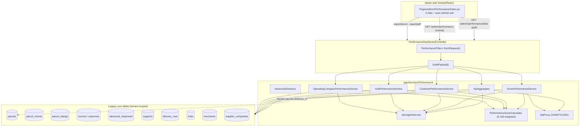
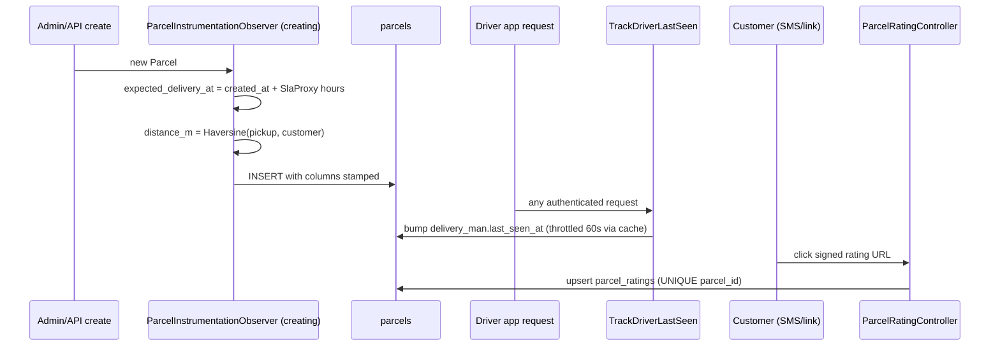

# Reports, Analytics & Performance/KPI

> Module deep-dive for the Rushly Performance Dashboard, the KPI/analytics
> service suite under `app/Services/Performance/`, the reporting controllers &
> Excel/PDF exports, and the Flutter report screens that consume them.
> `rushly-saas` (`/var/www/rushly-saas`) is the single source of truth; every
> Flutter app is a client. Read the shared context in
> [`../_CONTEXT_BRIEF.md`](../_CONTEXT_BRIEF.md) first. Compiled from source on
> 2026-07-27.

**Cross-links:** performance/runtime engineering review in
[`../20-Performance.md`](../20-Performance.md) · persona walkthroughs in
[`../13-User-Journeys.md`](../13-User-Journeys.md) · schema in
[`../06-Database.md`](../06-Database.md) · module map in
[`../11-Modules.md`](../11-Modules.md) · API surface in
[`../09-API.md`](../09-API.md) · workflows in [`../12-Workflows.md`](../12-Workflows.md) ·
permissions in [`../permissions-users-roles.md`](permissions-users-roles.md) ·
drivers in [`../drivers-deliverymen.md`](drivers-deliverymen.md) · hubs in
[`../hubs-network.md`](hubs-network.md) · merchants in
[`../merchants.md`](merchants.md) · finance in
[`../finance-billing-wallet.md`](finance-billing-wallet.md) · support in
[`../support-crm.md`](support-crm.md).

> ⚠️ **Terminology note.** This module has two distinct layers that both call
> themselves "reports":
> 1. **The Performance Dashboard** (2026, `app/Services/Performance/**`) — a
>    modern, tenant-scoped executive analytics engine with 6 tabs, a weighted
>    KPI score, "AI" insights, and multi-sheet exports. **This is the primary
>    subject of this doc.**
> 2. **Legacy reports** (2022–2023, `app/Http/Controllers/Backend/ReportsController.php`,
>    `TotalSummeryReportController`, merchant-panel report controllers) — Blade
>    print views + `FromCollection`/`FromView` exports. Covered in §9.

---

## 1. Purpose & scope

The Performance Dashboard answers the question *"how is this tenant's logistics
operation performing?"* across five entity dimensions plus a rule-based insights
layer:

| Tab | Question answered | Service |
|---|---|---|
| **Executive** | Company-wide orders / revenue / activity / service-quality KPI grid | `KpiAggregator` |
| **Drivers** | Per-driver leaderboard, acceptance/on-time, distance, ratings | `DriverPerformanceService` |
| **Customers** | Merchant (customer) segmentation, LTV, retention, churn | `CustomerPerformanceService` |
| **Branches** | Per-hub revenue/profit/throughput ranking + monthly trend | `HubPerformanceService` |
| **Companies** | Per-3PL (supplier company) fleet performance ranking | `OperatingCompanyPerformanceService` |
| **Insights** | Rule-based highlights, risks, churn watch, bottlenecks, revenue forecast | `AiInsightsService` |

Everything is **tenant-scoped** (`company_id = settings()->id`) and filtered by a
shared date-range/entity filter DTO. A single controller assembles all six
payloads once per request and reuses them for the Inertia page, the JSON
refresh endpoint, and the Excel/PDF exports so the numbers are always
identical.

Source of truth: `app/Http/Controllers/Backend/PerformanceDashboardController.php`,
`app/Services/Performance/**`.

---

## 2. Architecture at a glance



### Design principles observed in code
- **Single query budget:** `AiInsightsService` consumes the *already-computed*
  payloads from the other services instead of re-querying, "so the numbers in
  insight cards exactly match the numbers shown elsewhere"
  (`app/Services/Performance/AiInsightsService.php:15-18`).
- **Proxy-first, upgrade-later:** metrics the schema can't yet express are
  returned with an `is_real` flag + a human-readable `proxies` note; when the
  Phase 4 instrumentation columns are populated the same code path silently
  switches to the real metric (`KpiAggregator::service()`).
- **Tenant safety on raw queries:** services that hit `parcel_events` via raw
  `DB::table()` bypass the Parcel global scope, so they re-apply tenancy with a
  `whereIn('parcel_id', <parcels where company_id = settings()->id>)` semi-join
  (`DriverPerformanceService::tenantParcelIds()`,
  `OperatingCompanyPerformanceService::kpiBlock()`).

See [`../20-Performance.md`](../20-Performance.md) §0 for how this "new module
code" contrasts with the unindexed legacy core it queries.

---

## 3. Business rules

### 3.1 The weighted Performance Score (0–100)
`app/Services/Performance/PerformanceScoreCalculator.php` is the shared scoring
kernel used by driver / customer / hub / company rankings.

| Component | Weight | Meaning |
|---|---|---|
| `productivity` | 20% | volume normalised against the cohort top |
| `completion`   | 20% | delivered / total (or handled) |
| `rating`       | 15% | customer rating / 5 (or satisfaction proxy) |
| `on_time`      | 15% | delivered within SLA (real or proxy) |
| `revenue`      | 15% | revenue normalised against the cohort top |
| `sla`          | 10% | 1 − abnormal_open / total |
| `growth`       | 5%  | current vs previous period orders |

Rules (`PerformanceScoreCalculator::compute`):
- Each component is a fraction in `[0..1]`, clamped.
- **Null components are skipped and the remaining weights re-normalised** — a row
  with no rating data isn't penalised harder than a fully-populated one.
- `score = round(weightedSum / weightTotal * 100)`; `0` if no components.

**Bands** (`::band`): `≥90 excellent`, `≥80 very_good`, `≥70 good`,
`≥60 needs_improvement`, else `critical`.

### 3.2 SLA proxy targets
`app/Services/Performance/SlaProxy.php` maps `delivery_type_id → target hours`,
measured `created_at → delivery_date`:

| delivery_type_id | Type | SLA hours |
|---|---|---|
| 1 (`SAMEDAY`) | Same-day | 24 |
| 2 (`NEXTDAY`) | Next-day | 48 |
| 3 (`SUBCITY`) | Sub-city | 72 |
| 4 (`OUTSIDECITY`) | Out-of-city | 120 |
| — | fallback (`DEFAULT_HOURS`) | 72 |

These are **deliberate, documented assumptions** surfaced as "(proxy)" in the UI
until real `expected_delivery_at` targets exist. Enum: `app/Enums/DeliveryType.php`.

### 3.3 Real-vs-proxy metric ladder
Several KPIs are "proxy-until-instrumented". Each returns a boolean flag so the
UI can badge it:

| KPI | Real metric (when data present) | Proxy fallback |
|---|---|---|
| On-time rate (`on_time_is_real`) | `delivery_date ≤ expected_delivery_at` | SLA-proxy hours by delivery_type |
| Satisfaction (`satisfaction_is_real`) | `AVG(parcel_ratings.rating) / 5` | `1 − support_tickets / orders` |
| Online drivers (`online_is_real`) | `delivery_man.last_seen_at ≥ now()−5min` | distinct drivers with a parcel_event in last 24h |
| Complaints (`complaints_is_real`) | `supports.driver_id` linkage | all tickets opened in window |
| Distance | `parcels.distance_m` (haversine) | null |

Implemented in `KpiAggregator::service()` / `::onTimeRateProxy()` and
`DriverPerformanceService::kpiBlock()`. The dual real+proxy on-time computation
is done in **one SQL `CASE`** in `DriverPerformanceService::onTimeRateForDrivers()`.

### 3.4 Cancellation bucket
Twelve statuses count as "cancelled" (`KpiAggregator::CANCELLED_STATUSES`,
mirrored in `CustomerPerformanceService::CANCEL_STATUSES`): all the `*_CANCEL`
`ParcelStatus` values. `pending = max(0, total − completed − cancelled)`.

### 3.5 Financials
- **Executive revenue/expense:** `SUM(income.amount)` / `SUM(expenses.amount)`
  by `date` in window (`KpiAggregator::financial()`). Currency from
  `settings()->currency`.
- **Hub / company revenue:** `SUM(parcels.cash_collection)` for DELIVERED;
  **expense** = `SUM(parcels.delivery_charge)`; `profit = revenue − expense`
  (`HubPerformanceService`, `OperatingCompanyPerformanceService`).
- **Customer LTV:** all-time delivered `cash_collection ÷ total customers`.
- **AOV:** window delivered revenue ÷ window orders.

> ⚠️ The two revenue definitions differ by design: the Executive tab uses the
> `income`/`expenses` ledger (see [`../finance-billing-wallet.md`](finance-billing-wallet.md)),
> while the Hub/Company/Customer tabs use parcel `cash_collection`. Numbers
> across tabs are therefore **not directly reconcilable** — this is a known
> modelling seam, not a bug.

### 3.6 Customer segmentation & churn
`CustomerPerformanceService`:
- **Active** = distinct merchants with a parcel in window.
- **New** = merchants created in window. **Returning** = ≥2 orders in window.
- **Lost** = had an order before window-start, none inside it.
- **Retention** = active_now / active_prev (previous same-length window).
- **Spend tiers** (`segments()`): VIP >$10k, High $2k–10k, Mid $500–2k, Low <$500
  (thresholds hard-coded in USD-labelled buckets).

### 3.7 Insights heuristics
`AiInsightsService` is **deterministic, rule-based — not LLM-driven**
(`AiInsightsService.php:11-13`). Thresholds:
- **Risks:** SLA <85% (high if <70%), on-time <80% (high <60%), growth <−10%
  (high <−30%).
- **Churn watch:** merchants with an order older than 30 days but none since
  (`CHURN_WATCH_INACTIVE_DAYS = 30`), top 10.
- **Bottlenecks:** cohort avg delivery >72h; slowest hub if `avg_hours > max(48, median×1.5)`.
- **Revenue forecast:** ordinary least-squares linear regression on weekly
  delivered `cash_collection`, projecting `FORECAST_WEEKS = 4` weeks; confidence
  = R² (flagged "low" if <0.3; needs ≥2 weeks of history).
- **Suggestions:** cancellation >5%, driver acceptance <80%, >5 idle drivers,
  net-negative branches.

---

## 4. Database tables

The dashboard **reads** existing tenant tables and relies on a small set of
**Phase 4 instrumentation columns/tables** added in 2026. See
[`../06-Database.md`](../06-Database.md) for the full schema.

### 4.1 New instrumentation (2026)
`database/migrations/2026_06_27_120000_add_performance_instrumentation_columns.php`:

| Table.column | Type | Purpose |
|---|---|---|
| `parcels.expected_delivery_at` | `timestamp NULL` | target SLA timestamp stamped at create (SlaProxy) |
| `parcels.distance_m` | `unsignedInteger NULL` (indexed) | straight-line metres pickup→customer (haversine) |
| `delivery_man.last_seen_at` | `timestamp NULL` (indexed) | driver online heartbeat |

> **No in-migration backfill** — the `parcels` table is hot, so historical rows
> are filled by the `performance:backfill` artisan command in chunks (§7).

`database/migrations/2026_06_27_130000_add_parcel_ratings_and_support_driver_id.php`:

- **`parcel_ratings`** (new table): `id, company_id (idx), parcel_id
  (UNIQUE), deliveryman_id (idx), merchant_id (idx), customer_phone, rating
  (tinyint 1–5), comment, source (public|admin|merchant|api), timestamps`.
  Composite indexes `(company_id, created_at)` and `(deliveryman_id, created_at)`.
  Model: `app/Models/Backend/ParcelRating.php` (has `scopeCompanywise`).
- **`supports.driver_id`** (`unsignedBigInteger NULL`, indexed) — links a
  support ticket to a driver, upgrading the complaints proxy.

### 4.2 Read-only sources
`parcels`, `parcel_events` (per-status timeline; **no `company_id`** — scoped via
parcel subquery), `income`, `expenses`, `abnormal_shipments`
(`detected_at`, `status`, resolved via `NOT IN ('resolved','closed_lost')`),
`supports`, `delivery_man`, `hubs`, `hub_incharges`, `merchants`,
`supplier_companies`, `assets` (vehicles), `users`.

---

## 5. Services (the core of the module)

All live in `app/Services/Performance/`.

| File | Role | Output shape |
|---|---|---|
| `PerformanceFilters.php` | Immutable filter DTO. Parses `from/to/driver_id/hub_id/merchant_id/supplier_company_id/delivery_type_id`. Defaults to last 30 days, clamps range ≤366d, swaps reversed dates, provides `previousPeriod()` for growth math. | value object |
| `KpiAggregator.php` | Executive grid: `meta / orders / financial / activity / service`. | `array` |
| `DriverPerformanceService.php` | `kpi / ranking (leaderboard) / time_series (daily) / rating_distribution`. | `array` |
| `CustomerPerformanceService.php` | `kpi / top / segments / growth / churn`. | `array` |
| `HubPerformanceService.php` | `kpi / ranking / trend (monthly)`. | `array` |
| `OperatingCompanyPerformanceService.php` | `kpi / ranking / compare (weekly)`. 3PL supplier companies. | `array` |
| `AiInsightsService.php` | `highlights / risks / churn_watch / bottlenecks / forecast / suggestions`. Rule-based. | `array` |
| `PerformanceScoreCalculator.php` | Static weighted 0–100 score + band. | `{score, band, components}` |
| `SlaProxy.php` | delivery_type → SLA hours constants. | static |
| `HaversineDistance.php` | Great-circle metres (or null). | static |

### 5.1 Key implementation details worth knowing
- **`activity()` "active drivers"** counts distinct `delivery_man_id` in
  `parcel_events` within window, scoped to tenant parcels
  (`KpiAggregator.php:118-123`).
- **Driver leaderboard** normalises `delivered/topDelivered` and
  `revenue/topRevenue`, joins `delivery_man`→`users` for names, computes a
  per-row `PerformanceScoreCalculator` score, sorts descending
  (`DriverPerformanceService::ranking`).
- **Rating distribution is a proxy** — completion-rate buckets mapped to ★
  levels (≥0.95→5★ … <0.50→1★) *until* enough real `parcel_ratings` exist
  (`DriverPerformanceService::ratingDistributionProxy`).
- **Hub employees** = users with `hub_id` + `hub_incharges` (tenancy via join to
  `users`, since `hub_incharges` has no `company_id`).
- **Operating-company `SUM(DISTINCT …)`** is used in the supplier ranking to
  avoid double-counting parcels that fan out to multiple events — a deliberate
  (if approximate) de-dup; noted as a modelling limitation for `cash_collection`
  sums (`OperatingCompanyPerformanceService::ranking`).

---

## 6. Controller, routes & exports

### 6.1 Controller
`app/Http/Controllers/Backend/PerformanceDashboardController.php` — constructor
injects all six services. Actions:

| Action | Route name | Returns |
|---|---|---|
| `index()` | `performance.index` | `Inertia::render('Admin/Performance/Index', …)` with full payload + filter options + i18n |
| `data()` | `performance.data` | `JsonResponse` — lightweight poll refresh, same `buildPayload()` |
| `exportExcel()` | `performance.export.excel` | `PerformanceExcelExport` `.xlsx` download |
| `exportPdf()` | `performance.export.pdf` | mPDF stream of `backend.performance.print` Blade |

`buildPayload()` calls the five entity services then feeds all payloads +
`execKpi` into `AiInsightsService::payload()` — **one assembly, reused
everywhere** (identical numbers in web / JSON / Excel / PDF).

`filterOptions()` supplies dropdown data: drivers (with user name), hubs,
merchants (capped 500), supplier companies, and the four delivery types.

### 6.2 Routes
`routes/web.php:814-819`, inside the tenant admin group:

```
Route::prefix('performance')->name('performance.')
  ->middleware('hasPermission:performance_dashboard_read')->group(function () {
    GET  /               index
    GET  /data           data
    GET  /export/excel   exportExcel  (middleware hasPermission:performance_dashboard_export)
    GET  /export/pdf     exportPdf    (middleware hasPermission:performance_dashboard_export)
});
```

Public rating capture (feeds `parcel_ratings`), signed-URL, no auth
(`routes/web.php:217-222`):
```
GET  /r/parcel/{id}/rate   parcel.rating.show
POST /r/parcel/{id}/rate   parcel.rating.store
```

### 6.3 Exports
`app/Exports/Performance/`:
- `PerformanceExcelExport` (`WithMultipleSheets`) — always Executive + Drivers;
  conditionally adds Customers / Hubs / Companies sheets when non-empty.
- `ExecutiveSheet`, `DriversSheet`, `CustomersSheet`, `HubsSheet`,
  `CompaniesSheet` — each `FromArray + WithHeadings + WithTitle`, formatting the
  service payload (percentages via `number_format(v*100,2).'%'`).

> ⚠️ **Doc vs Code / performance caveat:** these sheets are `FromArray` over an
> already-materialised payload (fine, since the payload is bounded/aggregated),
> but the underlying services run many `whereBetween` scans on **unindexed
> legacy columns** (`parcels.status`, `parcels.created_at`). For large tenants
> and wide date ranges the dashboard is scan-heavy. See
> [`../20-Performance.md`](../20-Performance.md) §"Exports" and the index gaps
> table.

---

## 7. Instrumentation: observer, middleware, backfill command



- **`app/Observers/ParcelInstrumentationObserver.php`** — on `creating`, stamps
  `expected_delivery_at` (SlaProxy) and `distance_m` (Haversine). Idempotent:
  never overwrites set values. Registered in
  `app/Providers/EventServiceProvider.php:74`.
- **`app/Http/Middleware/TrackDriverLastSeen.php`** — bumps
  `delivery_man.last_seen_at` on any authenticated **driver** (`UserType::DELIVERYMAN`)
  request, throttled to once/60s per driver via `Cache`, wrapped in try/catch so
  instrumentation never breaks the request. Registered in `app/Http/Kernel.php:44,55`
  (web + api groups).
- **`app/Console/Commands/PerformanceBackfill.php`** (`performance:backfill`) —
  chunked (`chunkById`), NULL-only, re-runnable backfill of
  `expected_delivery_at` + `distance_m` for historical parcels. Options:
  `--chunk`, `--tenant`, `--dry-run`. Uses raw `update()` to skip observers.
  **Not scheduled** — run manually after deploy (no entry in
  `app/Console/Kernel.php` / `routes/console.php`).
- **Rating capture:** `app/Http/Controllers/Backend/ParcelRatingController.php`
  — public signed URL (60-day expiry), only for `DELIVERED` parcels, upsert by
  `UNIQUE(parcel_id)`. Model `app/Models/Backend/ParcelRating.php`.

---

## 8. Flutter clients that consume reports

The Performance Dashboard itself is **admin-web only** (Inertia/React). Two
Flutter apps ship their own lighter report screens that hit dedicated **API**
endpoints (not the dashboard's `/admin/performance/*` web routes). See
[`../08-Flutter.md`](../08-Flutter.md) and [`../13-User-Journeys.md`](../13-User-Journeys.md).

### 8.1 Supervisor app — Driver report
- Screens: `rushly-supervisor-app/lib/features/reports/presentation/reports_tab.dart`,
  repo `…/reports/data/reports_repository.dart`, model `…/domain/driver_report.dart`.
- Calls `GET /api/v10/admin/reports/drivers?from=&to=&hub_id=`
  → `app/Http/Controllers/Api/V10/Admin/AdminReportsController@drivers`
  (`routes/api.php:224`). Per-driver `parcels / delivered / cod / delivery_rate`,
  hub-clamped for HUB/INCHARGE roles, limit 200.

### 8.2 Merchant app — Shipment report
- Screens: `rushly-merchant-app/lib/features/reports/presentation/reports_screen.dart`,
  repo `…/reports/data/reports_repository.dart`, model `…/domain/shipment_report.dart`.
- Calls `GET /api/v10/…/reports/shipments?from=&to=`
  → `app/Http/Controllers/Api/V10/MerchantReportsController@shipments`
  (`routes/api.php:344`).

> These API report endpoints are **separate, simpler aggregations** — they do
> **not** reuse the `app/Services/Performance/**` suite. The rich six-tab
> analytics engine has no Flutter client today (future improvement, §13).

---

## 9. Legacy reporting (pre-2026)

Still live and permission-gated separately from the Performance Dashboard.

| Controller | Route prefix | Notable methods | Export |
|---|---|---|---|
| `Backend/ReportsController.php` | `admin/reports/*` (`web.php:1077-1096`) | `parcelReports`, `parcelFinanceReports`, `parcelWiseProfitReports`, `salaryReports`, `MerchantHubDeliverymanReports` (MHD) | `MerchantReports`, `HubReports`, `DeliverymanReports`, mPDF print views |
| `Backend/TotalSummeryReportController.php` | `admin/reports/parcel-total-summery` | parcel total-summary grid | — |
| `Backend/MerchantPanel/ReportsController.php` + `MerchantReportsController.php` | `merchant-panel/reports/*` (`web.php:1380-1419`) | merchant self-serve parcel/finance/total-summary | Blade print |

Legacy exports (`app/Exports/`): `MerchantReports` (`FromView`), `HubReports` &
`DeliverymanReports` (`FromCollection` — **stubs, `collection()` returns nothing**),
`ReportExports`, `NdrExport`, `ShipmentExport`, `InvoiceExport`,
`DriverRunsheetExport`, `ParcelSampleExport`, etc. Each legacy per-report
permission (`parcel_status_reports`, `parcel_total_summery`, `parcel_wise_profit`,
`salary_reports`, `merchant_hub_deliveryman`) gates its route.

> ⚠️ `HubReports`/`DeliverymanReports` are empty scaffolds — the actual MHD
> export path runs through `ReportsController::MerchantReportExport` / `mhdPDF`.

---

## 10. APIs

| Method & path | Controller | Consumer | Auth |
|---|---|---|---|
| `GET /admin/performance` | `PerformanceDashboardController@index` | Admin web (Inertia) | session + `performance_dashboard_read` |
| `GET /admin/performance/data` | `…@data` | Admin web poll | session + `performance_dashboard_read` |
| `GET /admin/performance/export/excel` | `…@exportExcel` | Admin web | + `performance_dashboard_export` |
| `GET /admin/performance/export/pdf` | `…@exportPdf` | Admin web | + `performance_dashboard_export` |
| `GET /api/v10/admin/reports/drivers` | `AdminReportsController@drivers` | Supervisor app | Sanctum |
| `GET /api/v10/…/reports/shipments` | `MerchantReportsController@shipments` | Merchant app | Sanctum |
| `GET/POST /r/parcel/{id}/rate` | `ParcelRatingController` | Customer (public) | signed URL |

Full route dump: `ROUTES.md`; API conventions: [`../09-API.md`](../09-API.md).

---

## 11. Permissions

Seeded in `database/seeders/PermissionSeeder.php:483-491` under attribute
`performance_dashboard`:

| Permission | Guards |
|---|---|
| `performance_dashboard_read` | view dashboard (index + data) |
| `performance_dashboard_export` | Excel + PDF export |
| `performance_dashboard_drivers_view` | Drivers tab (seeded; UI-level gate) |
| `performance_dashboard_customers_view` | Customers tab |
| `performance_dashboard_hubs_view` | Branches tab |
| `performance_dashboard_companies_view` | Companies tab |

Enforced by the `hasPermission:` route middleware. Only `_read` and `_export`
are wired to routes today; the four per-tab permissions are seeded for
front-end/role-editor use (`routes/web.php:815-819`). Legacy report permissions
are separate (§9). Full model: [`../permissions-users-roles.md`](permissions-users-roles.md).

---

## 12. Dependencies & notifications

**Depends on:**
- `maatwebsite/excel` (exports), `mccarlosen/laravel-mpdf` (PDF), Inertia+React
  (`resources/js/Pages/Admin/Performance/Index.jsx` + `Components/*`), Ziggy
  (route names), `lucide-react` (icons), Carbon.
- Cross-module data: parcels/events ([`../parcels.md`](parcels.md)), drivers
  ([`../drivers-deliverymen.md`](drivers-deliverymen.md)), hubs
  ([`../hubs-network.md`](hubs-network.md)), merchants
  ([`../merchants.md`](merchants.md)), finance ledger
  ([`../finance-billing-wallet.md`](finance-billing-wallet.md)), abnormal
  shipments + support ([`../support-crm.md`](support-crm.md)), delivery-type enum.

**Notifications:** **none.** This module has no notification/event dispatch —
the dashboard is pull-only (page load + client-side poll of `/data`). The only
proactive touch is the customer rating link, which is *generated* by
`Parcel::ratingUrl()` and delivered by an external caller (admin app or "future
SMS hook", per `ParcelRatingController` docblock). No scheduled digest/alert
exists. See [`../notifications.md`](notifications.md).

---

## 13. Maturity, status & known limitations

**Status:** the Performance Dashboard is **new (2026, Phase 1–4b)** and actively
maturing. Route comment: *"Phase 1: executive + driver perf"* (`web.php:814`) —
but the shipped code already covers all six tabs.

Maturity signals:
- ✅ Clean service separation, DI, tenant-safe raw queries, i18n (`trans('performance')`).
- ✅ Instrumentation columns + observer + middleware + chunked backfill shipped.
- ✅ Real-metric ladder (ratings, last_seen, expected_delivery_at, distance).
- ⚠️ **Many KPIs remain proxies** until instrumentation is backfilled/populated
  (satisfaction, on-time, complaints, online, rating distribution).
- ⚠️ **Scan-heavy on legacy indexes** — every tab issues multiple
  `whereBetween(created_at/delivery_date)` + `where(status)` aggregations on
  tables whose only relevant indexes are FKs (see
  [`../20-Performance.md`](../20-Performance.md)). No result caching layer
  (`CACHE_DRIVER=file` default; no Redis requirement).
- ⚠️ **Cross-tab revenue mismatch** by design (§3.5).
- ⚠️ `performance:backfill` is **not scheduled** — a manual post-deploy step.
- ⚠️ `AiInsightsService::fastestGrowingHub` admits it lacks per-hub trend data
  and falls back to top-profit hub (`AiInsightsService.php:85-102`).

### Future improvements (grounded in code TODOs/comments)
1. **Real SLA targets at creation** — replace `SlaProxy` with per-parcel/per-SLA
   contract targets (`SlaProxy` docblock: "Phase 4 will replace with real targets").
2. **Backfill automation** — schedule `performance:backfill` or make the Phase 4
   columns non-nullable once populated.
3. **Result caching** — cache aggregations per `(tenant, filter-hash)` given the
   scan cost; adopt Redis (already configured, opt-in).
4. **Covering indexes** on `parcels(company_id, status, created_at)` /
   `(company_id, status, delivery_date)` to make the dashboard cheap.
5. **Mobile analytics client** — expose the six-tab engine (or a subset) to the
   supervisor/admin Flutter apps; today only two thin `/reports/*` APIs exist.
6. **True LLM insights** — the "AI" layer is rule-based today; a genuine model
   layer is the obvious next step (name already reserved).
7. **Per-tab permission enforcement** — wire the four seeded
   `performance_dashboard_*_view` permissions to actual tab gating.
8. **SMS rating dispatch** — automate the rating link the `ParcelRatingController`
   docblock anticipates, to grow real satisfaction data faster.

---

## Sources

Services & core:
- `app/Services/Performance/KpiAggregator.php`
- `app/Services/Performance/DriverPerformanceService.php`
- `app/Services/Performance/CustomerPerformanceService.php`
- `app/Services/Performance/HubPerformanceService.php`
- `app/Services/Performance/OperatingCompanyPerformanceService.php`
- `app/Services/Performance/AiInsightsService.php`
- `app/Services/Performance/PerformanceScoreCalculator.php`
- `app/Services/Performance/PerformanceFilters.php`
- `app/Services/Performance/SlaProxy.php`
- `app/Services/Performance/HaversineDistance.php`

Controller / instrumentation / exports:
- `app/Http/Controllers/Backend/PerformanceDashboardController.php`
- `app/Observers/ParcelInstrumentationObserver.php` · `app/Providers/EventServiceProvider.php`
- `app/Http/Middleware/TrackDriverLastSeen.php` · `app/Http/Kernel.php`
- `app/Console/Commands/PerformanceBackfill.php`
- `app/Http/Controllers/Backend/ParcelRatingController.php` · `app/Models/Backend/ParcelRating.php`
- `app/Exports/Performance/{PerformanceExcelExport,ExecutiveSheet,DriversSheet,CustomersSheet,HubsSheet,CompaniesSheet}.php`

Legacy reporting & APIs:
- `app/Http/Controllers/Backend/ReportsController.php`
- `app/Http/Controllers/Api/V10/Admin/AdminReportsController.php`
- `app/Http/Controllers/Api/V10/MerchantReportsController.php`
- `app/Exports/{MerchantReports,HubReports,DeliverymanReports}.php`

Migrations / seeders / routes:
- `database/migrations/2026_06_27_120000_add_performance_instrumentation_columns.php`
- `database/migrations/2026_06_27_130000_add_parcel_ratings_and_support_driver_id.php`
- `database/seeders/PermissionSeeder.php`
- `routes/web.php` (814-819, 217-222, 1077-1096, 1380-1419) · `routes/api.php` (224, 344)

Frontend clients:
- `resources/js/Pages/Admin/Performance/Index.jsx` + `Components/{Charts,FilterBar,KpiTile,ScoreBadge}.jsx`
- `rushly-supervisor-app/lib/features/reports/**`
- `rushly-merchant-app/lib/features/reports/**`

Reference docs: `../_CONTEXT_BRIEF.md`, `../20-Performance.md`, `../13-User-Journeys.md`,
`../06-Database.md`, `../09-API.md`, `../11-Modules.md`.
