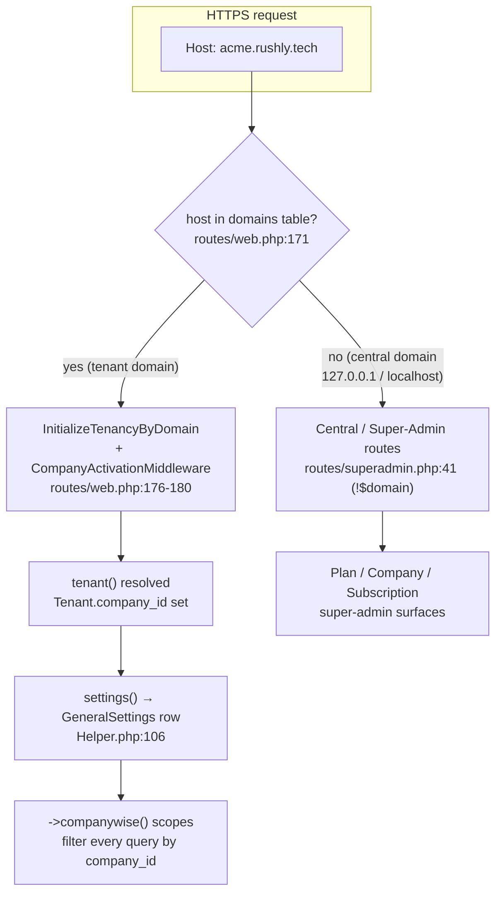
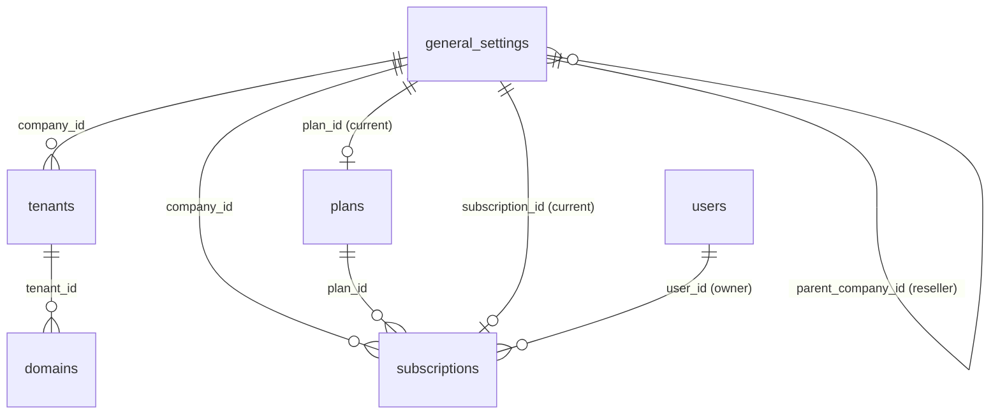
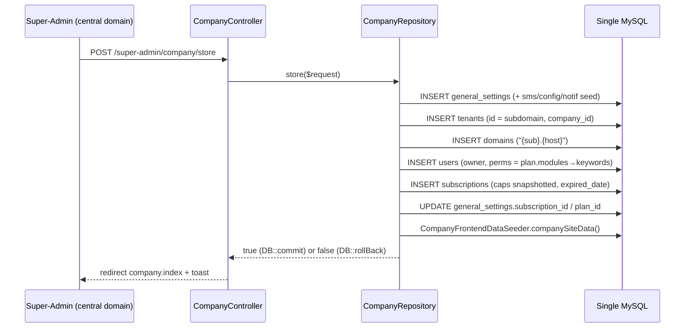
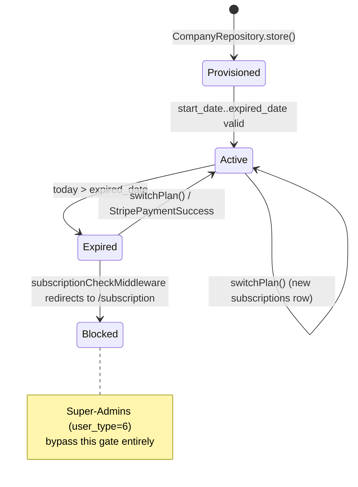

# SaaS — Tenancy, Subscriptions & Super-Admin

> **Module scope**: the multi-tenant SaaS layer of `rushly-saas` — how a courier
> company becomes a **Tenant**, how requests are routed to the right tenant by
> subdomain, how the platform owner (**Super-Admin**) provisions and bills
> tenants through **Plans** and **Subscriptions**, and how the **Vendor** plan
> plus the **Sub-accounts** (reseller / white-label) flow let a tenant spin up
> child tenants.
>
> **Single source of truth**: `rushly-saas`. All Flutter apps (driver, merchant,
> admin, fleet, scanner, sorting, supervisor, warehouse) are *clients* that
> select a tenant by storing its subdomain-derived API base URL — see
> [§10 Flutter clients](#10-flutter-clients-that-consume-this-layer).
>
> **Grounding**: every non-trivial claim cites a real source file. Where the
> repo-root docs disagree with code, a **⚠️ Doc vs Code** note flags it.
> Read this alongside the numbered references it goes deeper than:
> [../05-System-Architecture.md](../05-System-Architecture.md) ·
> [../06-Database.md](../06-Database.md) ·
> [../10-Authentication.md](../10-Authentication.md).

---

## 1. Purpose & mental model

Rushly is a **single-database, subdomain-per-tenant** SaaS. One Laravel install
serves every courier company. A "tenant" is one courier company; it gets:

- its own **subdomain** (`{sub}.rushly.tech`) mapped through the `domains` table;
- its own **`general_settings` row** (the real tenant record — brand, currency,
  prefixes, owner, plan, subscription);
- its own **owner User** (`user_type = ADMIN`, `company_owner = YES`);
- its own **subscription** against a **Plan**.

The pivotal design fact: **tenant data is NOT physically isolated in separate
databases.** The `stancl/tenancy` package is installed, but the
`DatabaseTenancyBootstrapper` is **commented out** in
`config/tenancy.php:31`. Isolation is enforced *at query time* by a
`->companywise()` scope that filters `where('company_id', settings()->id)`
(e.g. `app/Models/Subscribe.php:13`, `app/Models/User.php:156`). Every
tenant-owned row carries a `company_id` FK to `general_settings.id`.



The three identifiers are chained:

```
domains.domain ("acme.rushly.tech")
   → domains.tenant_id
   → tenants.id (UUID or the chosen subdomain string)
   → tenants.company_id   ─────────────►  general_settings.id
                                          (the tenant's real config row)
```

`settings()` (`app/Http/Helper/Helper.php:106`) resolves the active
`GeneralSettings` row from `tenant()->company_id`, or — on the central domain —
from the authenticated user's `company_id`, defaulting to `id = 1` (the platform
owner) for a Super-Admin.

---

## 2. Responsibilities

| Responsibility | Where it lives |
|---|---|
| Map a hostname → tenant | `routes/web.php:169-180` (`$domain` gate + `InitializeTenancyByDomain`) |
| Resolve the active tenant config | `settings()` helper, `app/Http/Helper/Helper.php:106` |
| Guard un-activated tenants | `app/Http/Middleware/CompanyActivationMiddleware.php` (renders `domain_not_activate` view when `tenant()` exists but `settings()` is null) |
| Provision a new tenant (owner + domain + subscription) | `app/Repositories/Superadmin/Company/CompanyRepository.php::store()` |
| Super-Admin CRUD of tenants | `app/Http/Controllers/Backend/Superadmin/CompanyController.php` |
| Super-Admin CRUD of plans | `app/Http/Controllers/Backend/Superadmin/PlanController.php` |
| Subscription lifecycle (create / switch / expiry) | `CompanyRepository` + `subscriptionCheck()` helper + `subscriptionCheckMiddleware` |
| Reseller / white-label sub-accounts | `app/Http/Controllers/Backend/ChildCompanyController.php` (Vendor plan only) |
| Seat / parcel / driver caps | copied plan caps onto `subscriptions`, enforced in `UserController::store` etc. |

---

## 3. Business rules

1. **A tenant = one `general_settings` row.** Everything hangs off its `id`,
   which is the `company_id` used platform-wide.
   (`database/migrations/2019_09_15_000010_create_tenants_table.php:20` —
   `tenants.company_id` is a FK to `general_settings`.)
2. **Company `id = 1` is the platform owner / central tenant.** `settings()`
   falls back to it for Super-Admins (`Helper.php` fallback `where('id',1)`),
   and Stripe/config lookups are hard-coded to `company_id = 1`
   (`PlanController.php:253`, `:383`).
3. **Super-Admin is `user_type = 6`.** (`app/Enums/UserType.php:11`
   `SUPER_ADMIN = 6`; tenant owner is `ADMIN = 1`.) Super-Admins bypass the
   subscription gate and see cross-tenant data.
4. **Subscription caps are snapshotted, not referenced.** At create/switch time
   the plan's `parcel_count`, `deliveryman_count`, `days_count`, `user_count`,
   and `price` are **copied** onto the `subscriptions` row
   (`CompanyRepository.php:240-247`). Editing a Plan later does **not**
   retroactively change existing subscriptions.
5. **`user_count = NULL` means unlimited seats** (backwards-compat for plans
   created before 2026-07). The seat cap is only enforced when non-null
   (`app/Http/Controllers/Backend/UserController.php:170-174`; VENDOR.md §6).
6. **Expiry is date-based.** `subscriptionCheck()` compares today against
   `subscriptions.expired_date` (`Helper.php:1126`). A non-Super-Admin whose
   subscription has expired is redirected to `subscription.index`
   (`subscriptionCheckMiddleware.php:22`).
7. **Sub-accounts may only use the Vendor plan** — enforced client-side *and*
   server-side (`ChildCompanyController.php:97` filters `name = 'Vendor'`;
   `:135` re-checks the posted `plan_id` against an active Vendor plan before
   delegating). A tampered POST cannot pick a paid tier.
8. **Child tenant ≠ sub-record.** Each sub-account is a *full* tenant (own
   subdomain, owner, subscription). The only linkage is
   `general_settings.parent_company_id` (VENDOR.md §1).
9. **Provisioning is transactional.** `CompanyRepository::store()` wraps the
   whole graph (GeneralSettings → Tenant → Domain → owner User → Subscription →
   frontend seed) in a DB transaction and rolls back on any throw
   (`CompanyRepository.php:204-270`).
10. **Cache & filesystem ARE tenant-scoped even though the DB is not.** The
    `CacheTenancyBootstrapper`, `FilesystemTenancyBootstrapper`, and
    `QueueTenancyBootstrapper` are enabled (`config/tenancy.php:32-34`), so
    cache tags and storage paths are suffixed by `tenant_id`.

---

## 4. Database tables

Full column-level schema lives in [../06-Database.md](../06-Database.md); this
section documents the *tenancy/subscription slice* and the relationships that
matter here.

### 4.1 `tenants` — Stancl tenant registry
`database/migrations/2019_09_15_000010_create_tenants_table.php`

| Column | Type | Notes |
|---|---|---|
| `id` | string PK | Tenant identifier. `id_generator = UUIDGenerator` (`config/tenancy.php:10`), **but** the provisioning code sets `id` to the chosen subdomain string, not a UUID (`CompanyRepository.php:211` — `Tenant::create(['id' => $request->domain, ...])`). ⚠️ see §11. |
| `company_id` | FK → `general_settings.id` | Custom column exposed via `Tenant::getCustomColumns()` (`app/Models/Tenant.php:15`). The bridge to the real tenant config. |
| `data` | json nullable | Stancl virtual-column bag (unused here). |

Model: `app/Models/Tenant.php` extends `Stancl\Tenancy\Database\Models\Tenant`,
implements `TenantWithDatabase`, uses `HasDatabase, HasDomains`.

### 4.2 `domains` — hostname → tenant map
`database/migrations/2019_09_15_000020_create_domains_table.php`

| Column | Type | Notes |
|---|---|---|
| `id` | int PK | |
| `domain` | string unique | Full host, e.g. `acme.rushly.tech` (`CompanyRepository.php:212`). This is what `routes/web.php:171` matches `request()->getHost()` against. |
| `tenant_id` | FK → `tenants.id` | |
| `domain_name` | string | The bare subdomain label (`acme`). |

### 4.3 `plans` — subscription tiers (Super-Admin catalog)
`database/migrations/2023_12_24_102349_create_plans_table.php`
(+ `2026_07_05_100001_add_user_count_to_plans.php`)

| Column | Type | Notes |
|---|---|---|
| `id` | int PK | |
| `name` | string | e.g. `Vendor`. |
| `parcel_count` | bigint default 0 | Max parcels the tier allows. |
| `deliveryman_count` | bigint default 0 | Max drivers. |
| `user_count` | ubigint **nullable** | Max staff seats. `NULL` = unlimited (added 2026-07-05). |
| `days_count` | bigint default 0 | Subscription length in days → derives `expired_date`. |
| `price` | decimal(22,2) | |
| `description` | longText | |
| `position` | bigint | Display order. |
| `modules` | longText JSON (cast `array`) | Which permission *attributes* the plan unlocks, e.g. `["dashboard","delivery_man","tms","reports"]`. Drives the owner's granted permissions (see §6). |
| `status` | tinyint | `Status::ACTIVE` / `INACTIVE`. |

Model: `app/Models/Backend/Superadmin/Plan.php` — casts `modules` to array,
exposes `my_status` (badge HTML) and `intval_name` (humanised `days_count`,
e.g. `30 → "1 Month"`).

### 4.4 `subscriptions` — a tenant's active/historical subscription
`database/migrations/2023_12_28_090620_create_subscriptions_table.php`
(+ `2026_07_05_100004_add_user_count_to_subscriptions.php`)

| Column | Type | Notes |
|---|---|---|
| `id` | int PK | |
| `company_id` | FK → `general_settings.id` nullable | The tenant this subscription belongs to. |
| `user_id` | bigint nullable | The owner user at subscribe time. |
| `plan_id` | FK → `plans.id` | |
| `price`, `parcel_count`, `deliveryman_count`, `days_count`, `user_count` | — | **Snapshotted from the plan** at create/switch (`CompanyRepository.php:240-247`). These are the runtime caps. |
| `start_date`, `expired_date` | timestamp | `expired_date = start_date + days_count` (`CompanyRepository.php:246`). |

Model: `app/Models/Backend/Subscription.php` — `belongsTo` `GeneralSettings`
(`company`), `Plan` (`plan`), `User` (`user`).

### 4.5 `general_settings` — the real tenant config row
Base migration `2014_05_31_094551_create_general_settings_table.php`;
tenancy-relevant additions:

| Column | Migration | Purpose |
|---|---|---|
| `parent_company_id` | `2026_07_05_100002_add_parent_company_id_to_general_settings.php` | Nullable, indexed. The company that created this tenant. **`NULL` = created by Super-Admin** (default). Set for reseller sub-accounts. |
| `subscription_id` | (base) | Points at the current `subscriptions.id` (`CompanyRepository.php:251`). |
| `plan_id` | (base) | Current plan (`CompanyRepository.php:252`). |

Model `app/Models/Backend/GeneralSettings.php`:
`plan()` → `belongsTo(Plan, 'plan_id')`, `subscription()` →
`belongsTo(Subscription, 'subscription_id')`.

### 4.6 Permission catalogs
- `permissions` — the **tenant-side** grantable catalog. Row `attribute='company'`
  with keywords `company_read`, `company_create` gates the sub-accounts UI
  (`2026_07_05_100007_seed_tenant_company_permission.php`). Row `attribute='tms'`
  gates the TMS module per plan (VENDOR.md §2).
- `super_admin_permissions` — the **platform-owner** catalog
  (`2023_12_24_115931_create_super_admin_permissions_table.php`, model
  `app/Models/SuperAdminPermission.php`, `keywords` cast to array). Its own
  `company` row is **independent** of the tenant-side one — both strings coexist
  (VENDOR.md §2).
- `subscribes` — ⚠️ **unrelated to billing.** `app/Models/Subscribe.php` +
  `2022_08_17_145916_create_subscribes_table.php` is the marketing-site
  *newsletter* email capture (`{email, company_id}`), companywise-scoped. Named
  confusingly close to `subscriptions`; do not conflate.



---

## 5. Services, repositories & helpers

### 5.1 `CompanyRepository` — the provisioning engine
`app/Repositories/Superadmin/Company/CompanyRepository.php`
(bound via `CompanyInterface`)

The single place a tenant is born, whether from the Super-Admin panel, the
public self-service sign-up, or the reseller sub-accounts flow. Key methods:

| Method | What it does |
|---|---|
| `company_create($request, $id=null, $parentCompanyId=null)` | Insert/update the `general_settings` row; on create also seeds SMS settings, config, notification settings. Writes `parent_company_id` only on create when provided (`:79-81`). |
| `store($request, $parentCompanyId=null)` | Full transactional provisioning: `company_create` → `Tenant::create` (id = subdomain) → `->domains()->create` (`{sub}.get_host()`) → owner `User` (perms derived from plan modules) → `Subscription` (caps snapshotted, `expired_date` computed) → back-fill `general_settings.subscription_id/plan_id` → `CompanyFrontendDataSeeder::companySiteData()`. Rolls back on throw. (`:200-271`) |
| `update($id, $request)` | Edits the owner user, renames the tenant `id`/domain, re-derives permissions, and **extends** the current subscription's `expired_date` from its original `start_date`. (`:272-339`) |
| `switchPlan($request)` | Creates a **new** `subscriptions` row for a plan change (used by both the Super-Admin "Switch subscription" action and the Stripe success callback), re-derives the owner's permissions from the new plan's modules, updates `general_settings`. (`:353-387`) |
| `permissions($plan)` | Flattens `Permission::whereIn('attribute', $plan->modules)->pluck('keywords')` into the flat permission-key array stored on `users.permissions`. (`:186-198`) |
| `signUpStore($request)` | Public self-service company sign-up: same graph as `store` but starts on `Plan::first()`, an **already-expired** trial subscription, an OTP-gated owner, and a `CompanySignup` verification email. (`:418-503`) |
| `otpVerification` / `resendOTP` | Email-OTP verification for the self-service sign-up. |

### 5.2 `subscriptionCheck()` helper
`app/Http/Helper/Helper.php:1126` — returns remaining days (subscribed) or
`false` (expired). Two arities: passed a `$user` it returns
`Carbon::now()->diffInDays($expired_date)`; called bare it evaluates
`Auth::user()` and returns a boolean. Used by `subscriptionCheckMiddleware`,
`CompanyController::index`, and `PlanController::subscription`.

### 5.3 Host / scheme helpers
- `get_host()` (`Helper.php:897`) — the app host (`localhost` in dev,
  `request()->getHost()` in prod). Used to build `{sub}.{host}` domains.
- `scheme_name($domain)` (`Helper.php:885`) — prefixes `https://`/`http://`.
- `settings()` (`Helper.php:106`) — resolves the active tenant `GeneralSettings`.

### 5.4 Tenancy wiring (providers & middleware)
- `config/tenancy.php` — `tenant_model = App\Models\Tenant`, central domains
  `127.0.0.1`/`localhost`, **DB bootstrapper disabled** (`:31`), cache/FS/queue
  bootstrappers enabled.
- `app/Providers/TenancyServiceProvider.php` — registers Stancl events and makes
  the identification middleware highest-priority. `routes/tenant.php` is
  effectively **empty** (its Stancl block is commented out) — tenant routes
  actually live in the `if ($domain)` block of `routes/web.php`.
- `app/Providers/RouteServiceProvider.php` — loads `web.php`, `admin.php`,
  `superadmin.php` all under the `web` middleware group; `HOME = '/summary'`
  (post-login landing).
- `app/Http/Middleware/subscriptionCheckMiddleware.php` (alias
  `subscriptionCheck`, `app/Http/Kernel.php:86`).
- `app/Http/Middleware/CompanyActivationMiddleware.php` — blocks a resolved
  tenant whose `general_settings` is missing/inactive.

---

## 6. Provisioning flow (end-to-end)



**Permission derivation**: the owner user's `permissions` JSON array is computed
from the plan's `modules` — each module `attribute` expands to its permission
`keywords` (`CompanyRepository::permissions()`). So the plan you pick literally
decides what the tenant owner can see/do.

---

## 7. Controllers & routes

### 7.1 Super-Admin surfaces (`routes/superadmin.php`, `!$domain` central block)

Registered under the `super-admin` prefix (also mirrored in the tenant-gated
block of `web.php` so CLI `route:list` can see them — see `super-admin.md`).
Snapshot audit: `super-admin.md`.

| Method | URL | Name | Controller | Permission | UI |
|---|---|---|---|---|---|
| GET | `/super-admin/plan/` | `plan.index` | `PlanController@index` | `plans_read` | **Inertia** `Admin/Superadmin/Plan/Index` |
| GET | `/super-admin/plan/create` | `plan.create` | `@create` | `plans_create` | Inertia `Plan/Form` |
| POST | `/super-admin/plan/store` | `plan.store` | `@store` | `plans_create` | — |
| GET | `/super-admin/plan/edit/{id}` | `plan.edit` | `@edit` | `plans_update` | Inertia `Plan/Form` |
| PUT | `/super-admin/plan/update` | `plan.update` | `@update` | `plans_update` | — |
| DELETE | `/super-admin/plan/delete/{id}` | `plan.delete` | `@delete` | `plans_delete` | — |
| GET | `/super-admin/plan/modules/{plan_id}` | `plan.modules.view` | `@modulesView` | `plans_read` | Inertia `Plan/Modules` (largely superseded by an inline popover) |
| GET | `/super-admin/subscription/history` | `subscription.history` | `@subscriptionHistory` | (auth) | Inertia `Admin/Subscription/History` |
| GET | `/super-admin/company/` | `company.index` | `CompanyController@index` | `company_read` | **Inertia** `Company/Index` |
| GET | `/super-admin/company/create` | `company.create` | `@create` | `company_create` | Inertia `Company/Form` |
| POST | `/super-admin/company/store` | `company.store` | `@store` | `company_create` | — |
| GET | `/super-admin/company/edit/{id}` | `company.edit` | `@edit` | `company_update` | Inertia `Company/Form` |
| PUT | `/super-admin/company/update` | `company.update` | `@update` | `company_update` | — |
| DELETE | `/super-admin/company/delete/{id}` | `company.delete` | `@delete` | `company_delete` | — (blocked in `DEMO` mode) |
| GET | `/super-admin/company/subscription/switch/{id}` | `company.subscription.switch` | `@switchSubscription` | `company_subscribe` | Inertia `Company/SwitchSubscription` |
| POST | `/super-admin/company/subscription/switch/store` | `company.subscription.switch.store` | `@switchSubscriptionStore` | `company_subscribe` | — |

**⚠️ Doc vs Code (super-admin.md)**: the audit lists `plan/create`, `plan/edit`,
`company/create`, `company/edit`, and `company/subscription/switch` as **Legacy
Blade**. In the current controllers they all return **Inertia** pages
(`PlanController.php:110/127`, `CompanyController.php:144/162/296`). The Blade→React
port described in `super-admin.md` §"Port plan" has since been completed for these
pages; `super-admin.md` predates it. The `company.store`/`update` still use
`Company\StoreRequest`/`UpdateRequest` form requests. Also note the audit omits
`company_subscribe` as the gate on the switch routes — the live routes carry it
(`routes/superadmin.php:122-123`).

Other Super-Admin (central) surfaces in the same file: `/summary`
(`SummaryController` — cross-tenant KPIs, the Super-Admin home page),
`/super-admin/business-logic/fulfillment-defaults` (fulfillment-router global
defaults + per-tenant overrides), plus the full central copies of integrations,
shipping/commerce/OMS/fulfillment/ops viewers.

### 7.2 Self-service company sign-up (central, guest)
`routes/superadmin.php:72-76` (and `web.php`): `company/sign-up`,
`company/sign-up/store`, `company/otp-verification-form`, `company/resend-otp`,
`company/otp-verification` → `CompanyController` → `CompanyRepository::signUpStore`.
Creates a tenant on a trial (already-expired) subscription pending email-OTP.

### 7.3 Tenant-side subscription pages
- GET `/subscription` → `PlanController@subscription` (`subscription.index`) —
  the plan picker shown to a tenant admin whose subscription lapsed
  (`PlanController.php:249`). Inertia `Admin/Subscription/Index`.
- GET `/admin/subscription/history` → `PlanController@subscriptionHistory`
  (`admin.subscription.history`) — filtered to the current tenant for non-super
  admins, all tenants for Super-Admins (`PlanController.php:304-334`).
- Stripe checkout: `subscription.payment` → `subscriptionPayment` (Stripe
  Checkout Session), `subscription.success` → `StripePaymentSuccess`
  (`switchPlan`), `subscription.cancel` (`PlanController.php:381-422`).
  ⚠️ Stripe keys are read from `Setting` rows keyed on `company_id = 1` only.

### 7.4 Reseller Sub-accounts (tenant context)
`app/Http/Controllers/Backend/ChildCompanyController.php`, registered in the
`web.php` tenant-domain block (VENDOR.md §4):

| Method | URI | Name | Middleware |
|---|---|---|---|
| GET | `admin/child-companies` | `child-companies.index` | `hasPermission:company_create` |
| GET | `admin/child-companies/create` | `child-companies.create` | `hasPermission:company_create` |
| POST | `admin/child-companies` | `child-companies.store` | `hasPermission:company_create` |

`index` LEFT-JOINs `general_settings → tenants → domains` filtered by
`parent_company_id = settings()->id` to surface each child's portal URL
(`ChildCompanyController.php:48-54`). `store` delegates to the *same*
`CompanyRepository::store()` with `$parentCompanyId = settings()->id`
(`:132-144`). Restricted to the Vendor plan both client- and server-side.

---

## 8. Plans, Subscriptions & the Vendor tier

### 8.1 The Vendor plan
Seeded idempotently by
`database/migrations/2026_07_05_100005_seed_vendor_plan.php`:

```
name              = "Vendor"
parcel_count      = 5000
deliveryman_count = 100
user_count        = 5
days_count        = 30
price             = 0
modules           = ["dashboard","delivery_man","tms","reports"]
status            = ACTIVE
```

Keyed on `name`, so re-running the migration never duplicates it (VENDOR.md §7
has a test that asserts exactly one row after running `up()` twice).

### 8.2 Seat-cap enforcement
`subscriptions.user_count` (snapshotted from the plan) is the runtime seat cap,
enforced in the tenant `UserController::store`
(`app/Http/Controllers/Backend/UserController.php:170-174`):

```php
$seatCap = optional(settings()->subscription)->user_count;
if ($seatCap !== null) {
    $current = User::companywise()->count();
    if ($current >= (int) $seatCap) { /* toast + block */ }
}
```

`NULL` = unlimited (legacy plans). For Vendor the cap is 5 — the 6th user create
fails. Parcel/driver caps follow the same snapshot-then-compare pattern.

### 8.3 Subscription lifecycle



---

## 9. Reseller / white-label (Sub-accounts)

A tenant admin holding `company_create` gets a **Sub-accounts** sidebar entry and
can create full child tenants under their own account. Each child is a complete
tenant (own subdomain, owner, subscription); the only tie-back is
`general_settings.parent_company_id`. Full reference: repo-root
[`VENDOR.md`](../../VENDOR.md).

Because the app is single-DB, **no Stancl central/tenant context switch is
needed** — creating a tenant from inside a tenant is just inserting rows keyed on
a new `company_id` (VENDOR.md §6; `ChildCompanyController` class doc).

**Known limitations** (VENDOR.md §8): no parent-pays-for-children billing (there
is a `TODO(billing)` seam in `CompanyRepository::store`), no white-label brand
inheritance (children get platform defaults from `CompanyFrontendDataSeeder`), no
cross-tenant aggregate reporting, Vendor plan only.

---

## 10. Flutter clients that consume this layer

All eight Flutter apps are **subdomain-aware clients**. They don't do
server-side tenancy; they *pick* a tenant on first boot and store the derived API
base URL. Verified in the driver app (twins exist in each app per the file
headers):

- `rushly-driver-app/lib/features/tenant/presentation/tenant_select_screen.dart`
  — first-boot screen. User types a workspace name (`acme`) → app builds
  `https://acme.<TENANT_HOST_SUFFIX>/api/v10`; or pastes a full base URL
  (Advanced). It pings `/general-settings` before persisting so a bad
  subdomain fails at selection, not at login.
- `rushly-driver-app/lib/core/storage/tenant_storage.dart` — persists
  `tenant_api_base` + `tenant_label` in secure storage. "Change workspace"
  clears the token and returns to the select screen.
- `rushly-driver-app/lib/core/api/dio_client.dart` — Dio's `baseUrl` is
  resolved once at construction from `TenantStorage`.

So the mobile clients mirror the web's subdomain identification, but resolve it
**client-side** into a base URL rather than by HTTP `Host` matching. The
`general_settings`/brand endpoint they hit is the same tenant config row this
module manages. Per-app tenant feature folders: admin, driver, merchant, fleet,
supervisor apps all list a `tenant` feature in the workspace inventory
([_CONTEXT_BRIEF.md](../_CONTEXT_BRIEF.md)). See
[../08-Flutter.md](../08-Flutter.md) and [../09-API.md](../09-API.md).

---

## 11. Dependencies

- **`stancl/tenancy ^3`** — Tenant/Domain models, `InitializeTenancyByDomain`,
  `PreventAccessFromCentralDomains`, UUID id generator (`config/tenancy.php`).
  DB-per-tenant bootstrapper deliberately **off**.
- **`inertiajs/inertia-laravel ^2` + React** — all modern Super-Admin pages
  (`Admin/Superadmin/*`).
- **`laravel/sanctum ^3`** — mobile API auth (the tenant a token belongs to is
  implied by the subdomain host the app calls). Web guard is `session`.
- **Stripe** (`stripe/stripe-php` via Cartalyst) — the only wired subscription
  payment path (`PlanController::subscriptionPayment`); keys under
  `company_id = 1`.
- **`brian2694/toastr`** — flash messaging on all these controllers.
- Seed dependency: `Database\Seeders\CompanyFrontendDataSeeder::companySiteData()`
  — populates a new tenant's frontend content on provisioning.

Cross-cutting: [../05-System-Architecture.md](../05-System-Architecture.md)
(request lifecycle, module namespaces), [../06-Database.md](../06-Database.md)
(full schema), [../10-Authentication.md](../10-Authentication.md) (guards, user
types, permission model).

---

## 12. Notifications

- **Self-service sign-up** sends a `CompanySignup` mailable with an OTP to the
  new owner (`CompanyRepository::signUpStore` `:488`, `resendOTP` `:519`).
- **New tenant seeding** provisions per-tenant SMS provider settings (REVE,
  Twilio, Nexmo — all `INACTIVE`) and a `NotificationSettings` row (empty FCM
  key/topic) so the tenant can wire push/SMS later
  (`CompanyRepository::smsSetting/notificationSettings` `:145-185`).
- No dedicated subscription-expiry notification job was found. Expiry is enforced
  *reactively* by `subscriptionCheckMiddleware` at request time, not by a
  proactive reminder. **Not found in the current codebase**: a scheduled
  "subscription expiring soon" notifier.

---

## 13. Permissions

| Permission key | Catalog | Gates |
|---|---|---|
| `plans_read/create/update/delete` | tenant `permissions` | Super-Admin plan CRUD (`routes/superadmin.php:103-109`) |
| `company_read/update/delete/subscribe` | tenant `permissions` | Super-Admin company CRUD + subscription switch (`:116-123`) |
| `company_create` | tenant `permissions` (`attribute='company'`) | **Dual use**: Super-Admin company create *and* the tenant-side Sub-accounts UI. Not auto-granted to any role — flipped per-role via `/admin/roles/edit/{id}` (VENDOR.md §3). |
| `tms` | tenant `permissions` (`attribute='tms'`) | Per-plan TMS module gate; backfilled onto anyone who had `delivery_man_read` (VENDOR.md §2). |
| super-admin `company` row | `super_admin_permissions` | Platform-owner company UI — **independent** of the tenant `company` string. |

Super-Admin (`user_type = 6`) bypasses the subscription gate and, in
`subscriptionHistory`, sees **all** tenants; other admins are scoped to
`company_id = settings()->id` (`PlanController.php:305-311`).

---

## 14. Maturity & status

| Area | Status |
|---|---|
| Subdomain identification (single-DB) | **Stable / production.** Battle-tested `$domain` gate in `web.php`. |
| Plan CRUD (Super-Admin) | **Stable, fully ported to Inertia** (contradicts the older `super-admin.md` "Legacy Blade" audit — see §7.1). |
| Company CRUD + provisioning | **Stable, Inertia.** Transactional `CompanyRepository::store`. |
| Subscription switch (manual, Super-Admin) | **Stable.** |
| Stripe self-serve payment | **Partial / fragile.** Hard-codes `company_id = 1` for keys; single-currency `USD` in the Checkout Session (`PlanController.php:395`); success handler trusts query params. |
| Self-service sign-up | **Present but trial starts already-expired** (`signUpStore` `:468-469`) — effectively forces contact-admin/pay before use. |
| Vendor plan + Sub-accounts | **Shipped (2026-07-05), tested** (`tests/Feature/Companies/`, VENDOR.md §7). |
| Parent-pays-for-children billing | **Not implemented** (`TODO(billing)`). |
| DB-per-tenant isolation | **Intentionally not used** (`config/tenancy.php:31`). |

---

## 15. Future improvements

1. **Parent-billed sub-accounts** — wire the `TODO(billing)` seam in
   `CompanyRepository::store` so a reseller pays for its children.
2. **Proactive expiry notifications** — a scheduled command to email/SMS tenants
   before `expired_date`, replacing the purely reactive middleware redirect.
3. **De-hardcode payments** — read Stripe config per-tenant instead of
   `company_id = 1`, honour the tenant currency instead of forcing `USD`.
4. **Multi-tier sub-accounts** — relax the Vendor-only filter in
   `ChildCompanyController::create/store` when other reseller tiers are needed.
5. **White-label inheritance** — let children inherit parent brand/logo/colours.
6. **Cross-tenant aggregate reporting** for resellers (parent rollups).
7. **Reconcile `tenants.id`** — the config declares a UUID generator
   (`config/tenancy.php:10`) but provisioning sets `id` to the subdomain string
   (`CompanyRepository.php:211`). Decide on one scheme and document it; renaming a
   subdomain currently rewrites the tenant PK (`CompanyRepository.php:286`).
8. **Split `company_read` / `company_create`** on the Sub-accounts routes if
   read-only access without create rights is ever required (VENDOR.md §4).

---

## Sources

Files and directories actually read for this document:

- `docs/_CONTEXT_BRIEF.md`
- `super-admin.md` (repo root)
- `VENDOR.md` (repo root)
- `config/tenancy.php`
- `app/Models/Tenant.php`
- `app/Models/Subscribe.php`
- `app/Models/Backend/Subscription.php`
- `app/Models/Backend/Superadmin/Plan.php`
- `app/Models/SuperAdminPermission.php`
- `app/Models/Backend/GeneralSettings.php` (relations: `plan`, `subscription`)
- `app/Models/User.php` (relations: `company`, `subscription`, `tenantDetails`, `companywise` scope)
- `routes/superadmin.php`
- `routes/tenant.php`
- `routes/web.php` (tenant-domain gate, lines ~145–220)
- `app/Http/Controllers/Backend/Superadmin/PlanController.php`
- `app/Http/Controllers/Backend/Superadmin/CompanyController.php`
- `app/Http/Controllers/Backend/ChildCompanyController.php`
- `app/Repositories/Superadmin/Company/CompanyRepository.php`
- `app/Http/Middleware/subscriptionCheckMiddleware.php`
- `app/Http/Middleware/CompanyActivationMiddleware.php`
- `app/Http/Helper/Helper.php` (`settings`, `get_host`, `scheme_name`, `subscriptionCheck`)
- `app/Providers/RouteServiceProvider.php`, `app/Providers/TenancyServiceProvider.php`
- `app/Http/Kernel.php` (middleware groups + aliases)
- `app/Enums/UserType.php`
- `app/Http/Controllers/Backend/UserController.php` (seat-cap block)
- Migrations: `2019_09_15_000010_create_tenants_table.php`, `2019_09_15_000020_create_domains_table.php`, `2023_12_24_102349_create_plans_table.php`, `2023_12_28_090620_create_subscriptions_table.php`, `2026_07_05_100001_add_user_count_to_plans.php`, `2026_07_05_100002_add_parent_company_id_to_general_settings.php`, `2026_07_05_100004_add_user_count_to_subscriptions.php`, `2026_07_05_100005_seed_vendor_plan.php`, `2026_07_05_100007_seed_tenant_company_permission.php`
- Flutter (driver app): `lib/features/tenant/presentation/tenant_select_screen.dart`, `lib/core/storage/tenant_storage.dart`, `lib/core/api/dio_client.dart`
