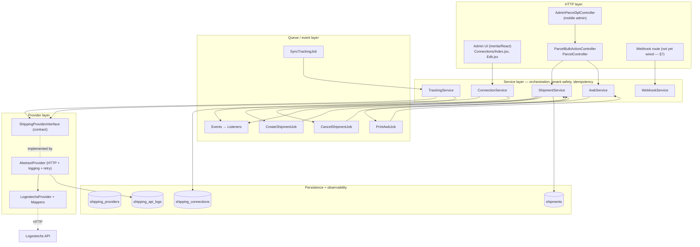
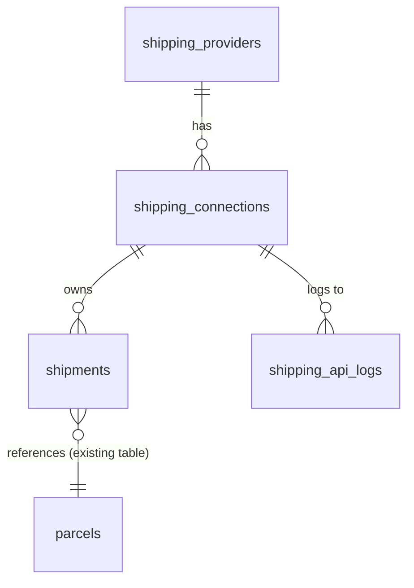
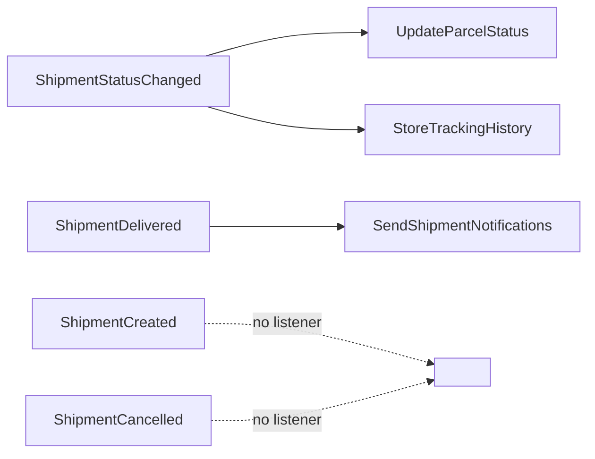

# Shipping — Generic Courier Abstraction

> **Module:** `app/Shipping/` · **First provider:** Logestechs · **Status:** Live for Logestechs; abstraction ready for more providers.
> **Primary engineering doc:** `docs/shipping-architecture.md` (repo-relative to `rushly-saas`). **Operator-facing 3PL doc:** `3PL.md`.
> This document goes deeper than the reference docs on the *provider-abstraction slice*. For the wider platform see
> [../05-System-Architecture.md](../05-System-Architecture.md), [../06-Database.md](../06-Database.md),
> [../09-API.md](../09-API.md), [../11-Modules.md](../11-Modules.md), [../12-Workflows.md](../12-Workflows.md),
> [../14-Integrations.md](../14-Integrations.md).

---

## 1. Purpose

`app/Shipping/` is a **generic, multi-tenant courier abstraction**. Business logic (controllers, observers, jobs) hands a parcel to a *service*; the service resolves the tenant's chosen provider through a *factory* and calls a single *contract*. Swapping Logestechs for OTO / SMSA / Aramex-v2 is a config-plus-class change — no business-logic edits.

Design goals, verified against the code:

- **One contract, many providers.** Everything talks to `ShippingProviderInterface`; nothing outside a provider folder references a concrete provider class. Source: `app/Shipping/Contracts/ShippingProviderInterface.php`, `app/Shipping/Factory/ShippingProviderFactory.php`.
- **Tenant safety by construction.** Every table carries `company_id`; the service asserts parcel/connection tenant match before dispatching. Source: `app/Shipping/Services/ShipmentService.php:47`.
- **Idempotency.** A `(connection_id, remote_shipment_id)` unique index plus pre-flight checks stop duplicate AWBs. Source: `database/migrations/2026_06_30_130303_create_shipments_table.php`, `app/Shipping/Services/ShipmentService.php:60`.
- **Observability + retention.** Every outbound HTTP call is logged (masked) to `shipping_api_logs`; a daily prune enforces a 30-day window. Source: `app/Shipping/Logging/ApiLogger.php`, `app/Console/Commands/ShippingPruneLogs.php`.
- **Clean break from the legacy pattern.** The old per-provider services (`app/Services/LogestechsService.php`, `AramexService`, `JetService`, `ZajelService`, `DeliveryPandaService`) and the `parcels_3pl` table remain in place for un-migrated providers, but Logestechs now flows through this module. See §12.

> ⚠️ **Doc vs Code — README "Laravel 12".** The repo README claims Laravel 12; `composer.json` pins `laravel/framework ^10.10`. Code wins: this module is Laravel 10. (Per `_CONTEXT_BRIEF.md`.)

---

## 2. Layered architecture

**Rule (enforced by convention, not compiler):** business code calls **services only**; services call the **contract only** via the factory. Grep confirms no controller imports `LogestechsProvider` directly.

---

## 3. Responsibilities (component-by-component)

| Component | File | Responsibility |
|---|---|---|
| `ShippingProviderInterface` | `app/Shipping/Contracts/ShippingProviderInterface.php` | The one contract every provider implements: `code`, `resolveCompanyByDomain`, `testConnection`, `authenticate`, `createShipment`, `cancelShipment`, `getStatus`, `getTracking`, `printAwb`, `searchVillages`. |
| `SupportsWebhooks` | `app/Shipping/Contracts/SupportsWebhooks.php` | Optional marker interface: `verifyWebhook`, `handleWebhook`. Providers opt in. |
| `AbstractProvider` | `app/Shipping/Providers/AbstractProvider.php` | Shared HTTP chokepoint `http()` — timing, `shipping_api_logs` write, header masking, HTTP-level retry, transport→typed-exception normalization, `config()` accessor. |
| `LogestechsProvider` | `app/Shipping/Providers/Logestechs/LogestechsProvider.php` | Concrete Logestechs impl. Wire-shape details delegated to 3 mappers. |
| `ShippingProviderFactory` | `app/Shipping/Factory/ShippingProviderFactory.php` | Resolve `code → class` from `config('shipping.providers')`. `make()`, `forConnection()`, `codes()`. Memoizes instances. |
| `ConnectionService` | `app/Shipping/Services/ConnectionService.php` | Connection lifecycle: resolve-domain, test, store (test-before-persist), update, set-default, deactivate. |
| `ShipmentService` | `app/Shipping/Services/ShipmentService.php` | The only entry point for create/cancel. Tenant + idempotency checks synchronously; provider call in the job. |
| `TrackingService` | `app/Shipping/Services/TrackingService.php` | Poll one connection's non-terminal shipments, map + persist status, fire status events. |
| `AwbService` | `app/Shipping/Services/AwbService.php` | Fetch AWB PDF bytes for a batch of shipments (must share one connection). |
| `WebhookService` | `app/Shipping/Services/WebhookService.php` | Route an inbound webhook to the matching `SupportsWebhooks` provider, persist status, fire events. |
| `ApiLogger` | `app/Shipping/Logging/ApiLogger.php` | Write one `shipping_api_logs` row per call. Never throws — masks sensitive headers, truncates bodies to 65k. |
| Repositories | `app/Shipping/Repositories/*` | `ShippingConnectionRepository` (find/list/default/setDefault/activeForSync), `ShipmentRepository` (find/findByParcelAndConnection/pendingForConnection/lastForParcel). |

---

## 4. Business rules (grounded in code)

1. **Test-before-persist.** `ConnectionService::store()` resolves the remote company id (if only a domain was pasted), runs `testConnection`, and throws `ConnectionTestFailedException` if it fails — *nothing is written unless the test passes*. `ConnectionService.php:52-109`.
2. **First connection per provider becomes default.** `is_default = ! exists(company_id, provider_id)`. `ConnectionService.php:87`.
3. **Cross-tenant refusal.** `dispatchCreate()` throws `InvalidArgumentException` if `parcel.company_id !== connection.company_id`. `ShipmentService.php:49`.
4. **Connection must be "ready".** `isReady()` = status `active` + `remote_company_id` + `email` + `password_encrypted` all present. `ShippingConnection.php:73`, checked at `ShipmentService.php:54`.
5. **Idempotent create.** If a `Shipment` for `(parcel, connection)` already has a `remote_shipment_id`, return it — no re-dispatch, no second AWB. `ShipmentService.php:60`; job re-checks at `CreateShipmentJob.php` (`if ($shipment->remote_shipment_id) return`).
6. **Provider-rejected ≠ retryable.** `ProviderRejectedShipmentException` (4xx / validation) calls `$this->fail()` immediately — no retry. `ProviderUnavailableException` (transport / 5xx) bubbles so the queue retries with backoff. `CreateShipmentJob.php:44`, `AbstractProvider.php:99-111`.
7. **Two-tier retry.** HTTP-level: `AbstractProvider::http()` wraps in Laravel `->retry(tries, sleepMs)` filtered to `ConnectionException` only (never 4xx). Queue-level: jobs retry `config('shipping.retry.tries')` = 3 with backoff `[10,30,90]`s. HTTP retry sits *below* the job retry. `AbstractProvider.php:63-70`.
8. **Terminal-status short-circuit.** Tracking only polls `nonTerminal` shipments — excludes states `cancelled`/`failed` and local statuses DELIVERED / PARTIAL_DELIVERED / CANCELLED / RETURN_RECEIVED_BY_MERCHANT. `Shipment.php:54`, `ShipmentRepository::pendingForConnection`.
9. **Per-connection sync isolation.** `shipping:sync-tracking` dispatches *one `SyncTrackingJob` per active connection* so a slow provider can't block other tenants. `ShippingSyncTracking.php`, `SyncTrackingJob.php` (`tries()=1`, `timeout()=300`).
10. **Status → parcel bridge.** A local status change fires `ShipmentStatusChanged`; `UpdateParcelStatus` writes it back to the canonical `Parcel` — routing DELIVERED through `ParcelRepository::parcelDelivered()` so balances/notifications fire (but only when transitioning from DELIVERY_MAN_ASSIGN). `TrackingService.php:53`, `UpdateParcelStatus.php`.
11. **Credential handling.** Passwords stored via Laravel `encrypted` cast; `$hidden`; only decrypted inside the provider HTTP layer immediately before the outbound call. `ShippingConnection.php:37,40,85`.
12. **Password never round-trips to the browser.** The edit form receives a `••••••` mask; on test/update the backend hydrates the real password from the tenant-scoped row when it sees a blank/`__keep__`/`••`-prefixed value. `ShippingConnectionsController::test()`, `ConnectionService::update():116`.

---

## 5. Database tables (`shipping_*`)

See [../06-Database.md](../06-Database.md) for the platform-wide schema. Migrations: `database/migrations/2026_06_30_130301..130305_*.php`.

### `shipping_providers` — the provider catalog
`id`, `code` (unique, 32) · `name` · `logo_url` · `status` enum(`active`,`disabled`) · `supports` json (capability chips, e.g. `['cancel','awb_pdf','tracking','villages']`) · timestamps. Seeded idempotently by `..130305_seed_shipping_providers.php` — **Logestechs only** today.

### `shipping_connections` — a tenant's account with a provider
`id` · `company_id` (indexed, tenant scope) · `provider_id` (FK, cascade) · `connection_name` · `remote_company_id` (their side) · `domain` · `email` · `password_encrypted` (text, Laravel Crypt) · `settings` json · `status` enum(`active`,`paused`,`invalid`) · `is_default` · `last_tested_at` · `last_sync_at` · timestamps.
Constraints: unique `(company_id, provider_id, connection_name)`; indexes `(company_id, is_default)`, `(provider_id, status)`.

### `shipments` — canonical home for module-created shipments
`id` · `company_id` · `parcel_id` · `connection_id` (FK, cascade) · `remote_shipment_id` · `awb_number` · `awb_pdf_url` · `current_status_raw` · `current_status_local` (smallint → `ParcelStatus`) · `last_status_at` · `last_synced_at` · `last_sync_error` · `state` enum(`pending`,`created`,`failed`,`cancelled`) · `request_payload` json · `response_payload` json · timestamps.
Constraints: **unique `(connection_id, remote_shipment_id)`** (idempotency); indexes `(company_id, current_status_local)`, `(company_id, state, last_synced_at)`.

> **Why not reuse `parcels_3pl`?** The legacy table has no `company_id` and no unique index (multi-tenant leakage risk). `shipments` starts clean and properly scoped. `parcels_3pl` stays for Aramex/Jet/Zajel/Panda. (`..130303` migration docblock; `shipping-architecture.md` §3.)

### `shipping_api_logs` — outbound call log (high-volume, pruned)
`id` · `company_id` (nullable — pre-auth `resolveCompanyByDomain` calls) · `connection_id` (nullable) · `provider_code` · `endpoint` · `method` · `request_headers` json · `request_body` longtext · `response_status` · `response_body` longtext · `duration_ms` · `error` · `created_at` (`useCurrent`, indexed; no `updated_at`).
Indexes: `(company_id, created_at)`, `(connection_id, created_at)`. Pruned to 30 days by `shipping:prune-logs`.

Related sibling tables **not** owned by this module: `parcels_3pl` (legacy 3PL), `salla_shipments` (Salla bridge — `..create_salla_shipments_table.php`), `abnormal_shipments`. See [../14-Integrations.md](../14-Integrations.md).

---

## 6. Services in depth

### ConnectionService (`app/Shipping/Services/ConnectionService.php`)
- `resolveCompanyByDomain($code,$domain)` → provider-side company id (no persistence).
- `test(ConnectionDTO)` → `TestResultDTO` (never throws on logical failure; caller decides).
- `store($companyId,$code,$input)` → resolve-domain → test → **transactional insert** with encrypted creds and default flag.
- `update($conn,$input)` → selective field updates; only overwrites password when a real non-mask value is supplied.
- `setDefault` (delegates to repo transaction) / `deactivate` (status → `paused`).

### ShipmentService (`app/Shipping/Services/ShipmentService.php`)
- `dispatchCreate(parcel, connection)` → tenant + ready + idempotency checks, pre-create `pending` row, dispatch `CreateShipmentJob` on the `shipping` queue. Returns the row so the UI can render "queued".
- `createNow(parcel, connection)` → synchronous path for single-parcel admin assign (immediate feedback).
- `executeCreate(shipment)` → **called by the job**: build `ShipmentDTO::fromParcel`, call `provider->createShipment`, persist remote ids + `state=created`, fire `ShipmentCreated`; on throw persist `state=failed` + `last_sync_error` and rethrow.
- `dispatchCancel` / `executeCancel` → queue or run a provider cancel, set `state=cancelled`, fire `ShipmentCancelled`.

### TrackingService (`app/Shipping/Services/TrackingService.php`)
`syncConnection(connection, limit=200)` loops `pendingForConnection`, calls `getStatus`, persists `current_status_*` + `last_synced_at`, and on change fires `ShipmentStatusChanged` (and `ShipmentDelivered` when DELIVERED). Per-shipment errors are caught, counted, logged (`shipping.tracking.sync_failed`) — one bad row doesn't abort the batch. Returns `{changed, delivered, errors, total}`.

### AwbService (`app/Shipping/Services/AwbService.php`)
`printForShipments(array $shipments)` → asserts a single shared connection, filters `remote_shipment_id`s, delegates to `provider->printAwb`, returns raw PDF bytes. `PrintAwbJob` persists them to the `public` disk under `awbs/Y/m/batch_*.pdf` and writes `awb_pdf_url` back.

### WebhookService (`app/Shipping/Services/WebhookService.php`)
`handle($providerCode, Request)` → factory `make` → guard `instanceof SupportsWebhooks` → `verifyWebhook` → `handleWebhook` → locate shipment by `(provider_code, remote_shipment_id)` → persist + fire events. **No provider implements `SupportsWebhooks` today and no route is registered** — this is scaffolding for push-capable providers (§7, §13).

---

## 7. Provider layer & the Logestechs implementation

### AbstractProvider `http()` — the single chokepoint
Concrete providers never touch `shipping_api_logs` or `Http::` directly. `http($method,$endpoint,$connection,$build,$rawBody)`:
1. Builds URL from `config('shipping.providers.<code>.config.base_url')` + endpoint.
2. Wraps in `Http::timeout()->acceptJson()->retry($tries,$sleepMs, filter=ConnectionException, throw:false)`.
3. Times the call, writes a `shipping_api_logs` row via `ApiLogger` (headers masked, body from `$rawBody` so plaintext passwords are pre-redacted by the caller).
4. Transport error → `ProviderUnavailableException`; `serverError()` (5xx) → `ProviderUnavailableException`; otherwise returns the `Response` for the provider to inspect (4xx handled by the provider, typically as `ProviderRejectedShipmentException`).

### LogestechsProvider (`app/Shipping/Providers/Logestechs/LogestechsProvider.php`)
Auth model: a `company-id` header on every call; email+password embedded in the JSON body of create/cancel/login (Logestechs validates the customer per call). Endpoint map (from the class docblock, confirmed against a captured Postman collection):

| Contract method | Logestechs endpoint |
|---|---|
| `resolveCompanyByDomain` | `GET /guests/companies/info-by-domain?domain=` |
| `testConnection` | `GET /addresses/villages` (reachability) + `POST /auth/customer/login` (creds) |
| `authenticate` | `POST /auth/customer/login` (validate only — no token persisted) |
| `createShipment` | `POST /ship/request/by-email` |
| `cancelShipment` | `PUT /guests/{cid}/packages/{id}/cancel` |
| `getStatus` | `GET /guests/packages/status?barcode=` |
| `getTracking` | `GET /guests/{cid}/packages/tracking?barcode=` |
| `printAwb` | `POST /guests/{cid}/packages/pdf` |
| `searchVillages` | `GET /addresses/villages?search=` |

### The three Logestechs mappers (isolate provider quirks)
- **`ShipmentRequestMapper`** (`Mappers/ShipmentRequestMapper.php`) — canonical `ShipmentDTO`+`ConnectionDTO` → the `/ship/request/by-email` body. Encodes every Logestechs quirk: email/password inside the body; `cod` as **integer**; `packageItemsToDeliverList`; `serviceType` from `settings('service_type','STANDARD')`; **`shipmentType` hardcoded `'COD'`** (Logestechs returns HTTP 400 `model.shipmentType null` for other values — non-COD still validates with `pkg.cod = 0`); `destinationAddress` wrapping resolved `{village, cityId, regionId}`; `integrationSource` from settings/config; `pkgUnitType='METRIC'`.
- **`ShipmentResponseMapper`** (`Mappers/ShipmentResponseMapper.php`) — create response `{id, barcode, barcodeImage, …}` → `ShipmentDTO::withRemote(remoteId=id, awb=barcode, awbPdf=barcodeImage)`.
- **`StatusMapper`** (`Mappers/StatusMapper.php`) — tolerant **substring** matching of Logestechs SCREAMING_SNAKE status strings → `ParcelStatus` int. Unknown → `null` (logged + skipped so the mapping table can be calibrated from real traffic). Mirrors the heuristic from the deleted `LogestechsSyncTracking` command.

`StatusMapper` mapping (source of truth for the local status bridge):

| Logestechs contains… | `ParcelStatus` |
|---|---|
| `PARTIAL` | `PARTIAL_DELIVERED` |
| `DELIVERED` / `COMPLETED` | `DELIVERED` |
| `CANCEL` | `CANCELLED` |
| `RETURN` + (`MERCHANT`/`SENDER`/`SHIPPER`) | `RETURN_RECEIVED_BY_MERCHANT` |
| `RETURN` (other) | `RETURN_TO_COURIER` |
| `OUT_FOR_DELIVERY` / `WITH_DRIVER` / `ASSIGNED_TO_DELIVERY` | `DELIVERY_MAN_ASSIGN` |
| `PICKED_UP` / `COLLECTED` / `OUT_FOR_PICKUP` | `RECEIVED_BY_PICKUP_MAN` |
| `AT_HUB` / `AT_WAREHOUSE` / `AT_BRANCH` | `RECEIVED_BY_HUB` |
| `IN_TRANSIT` / `EN_ROUTE` / `TRANSFER` | `TRANSFER_TO_HUB` |
| `FAILED` / `RESCHEDULE` / `POSTPONED` | `DELIVERY_RE_SCHEDULE` |
| `PENDING` / `DRAFT` / `CREATED` / `NEW` | `PENDING` |
| anything else | `null` (unknown) |

### Village resolution
`createShipment` resolves a village from the recipient area/city via `searchVillages` (first match) unless `extra['village']` is pre-supplied. **Known gap:** no caching — one lookup per unmapped destination (§13). `AddressDTO.extra` carries `{villageId, cityId, regionId, prefix}`.

---

## 8. Jobs, events & listeners

### Jobs (`app/Shipping/Jobs/`, queue `shipping`, connection `config('shipping.queue.connection')` → default `sync`)
| Job | Tries | Backoff | Timeout | Role |
|---|---|---|---|---|
| `CreateShipmentJob` | 3 | `[10,30,90]` | 60s | Calls `ShipmentService::executeCreate`; `ProviderRejected` → `fail()` (no retry); idempotent early-return on `remote_shipment_id`. |
| `CancelShipmentJob` | 3 | `[10,30,90]` | 60s | Calls `executeCancel`; early-return if already `cancelled`. |
| `SyncTrackingJob` | 1 | — | 300s | One per active connection; calls `TrackingService::syncConnection`; logs `shipping.tracking.synced`. |
| `PrintAwbJob` | 3 | `[10,30,90]` | 120s | `AwbService::printForShipments` → store PDF to `public` disk → write `awb_pdf_url`. |

> ⚠️ **Env note.** Default `QUEUE_CONNECTION=sync` (per `_CONTEXT_BRIEF.md`), so "queued" jobs run **inline** unless a real queue worker is configured. `SHIPPING_QUEUE_CONNECTION`/`SHIPPING_QUEUE_NAME` override.

### Events → Listeners
Wired in `app/Providers/EventServiceProvider.php` (verified):

- **`UpdateParcelStatus`** — writes the mapped status back to the canonical `Parcel`; DELIVERED (from DELIVERY_MAN_ASSIGN) routes through `ParcelInterface::parcelDelivered()` (balances/notifications), else sets `parcel->status` directly. Errors → `shipping.update_parcel_status_failed`.
- **`StoreTrackingHistory`** — appends a `parcel_events` timeline row (skips CANCELLED to avoid duping the model's own `updated` hook).
- **`SendShipmentNotifications`** — **log-only hook today** (`shipping.delivered_notification_hook`); real SMS/email still flows through `parcelDelivered`'s `send_sms_*` flags. Reserved for shipping-specific notifications.
- `ShipmentCreated` / `ShipmentCancelled` — **no listeners registered** (extension points).

---

## 9. Controllers, routes & API surface

### Admin web (Inertia) — `ShippingConnectionsController`
`app/Http/Controllers/Backend/Shipping/ShippingConnectionsController.php`, mounted under the tenant `admin/` group in **both** `routes/web.php` and `routes/superadmin.php` (same middleware stack: auth + IsInstalled + subscription + permission). See [../09-API.md](../09-API.md) and [../10-Authentication.md](../10-Authentication.md).

| Method + path (under `/admin/shipping/`) | Name | Permission |
|---|---|---|
| `GET connections` | `shipping.connections.index` | `integrations_read` |
| `GET connections/create` | `…create` | `integrations_update` |
| `POST connections/test` | `…test` | `integrations_update` |
| `POST connections/resolve-domain/{provider}` | `…resolve_domain` | `integrations_update` |
| `GET connections/{id}/edit` | `…edit` | `integrations_update` |
| `PUT connections/{id}` | `…update` | `integrations_update` |
| `DELETE connections/{id}` | `…destroy` | `integrations_update` |
| `POST connections/{id}/default` | `…set_default` | `integrations_update` |
| `POST connections/{provider}` (wildcard store — **registered last**) | `…store` | `integrations_update` |

> **Route ordering matters.** The literal `connections/test` and `connections/resolve-domain/{provider}` are registered **before** the wildcard `connections/{provider}` store route, otherwise the wildcard swallows them (regression noted in `shipping-architecture.md` §12).

Legacy redirect: `GET admin/integrations/logestechs` → `shipping.connections.index` (both web + superadmin). The old `LogestechsSettingsController` page is now a redirect.

### Parcel-assign consumers (the actual "create a shipment" triggers)
- **`ParcelBulkActionController::assignLogestechsBulk`** (`app/Http/Controllers/Backend/ParcelBulkActionController.php`) — `/admin/bulk_action` with `company=logestechs`. Picks the connection from `connection_id` or `defaultForCompany(...,'logestechs')`, loops parcels calling `ShipmentService::dispatchCreate` (queued), returns a "N queued" summary. The bulk-action form shows a **connection picker** (tenant's saved Logestechs connections, default pre-selected) instead of asking for email/password per submit.
- **`ParcelController::ThirdPartyLogistics`** — single-parcel assign; for `logestechs` calls `ShipmentService::createNow` (synchronous), catches `ProviderRejectedShipmentException` for inline feedback. Other providers (panda/zajel/aramex/jet) still use the legacy per-provider services in the same method.

### Mobile API (admin app) — `AdminParcel3plController`
`app/Http/Controllers/Api/V10/Admin/AdminParcel3plController.php` (Sanctum, `routes/api.php`):
- `GET /admin/parcels/{id}/3pl` → `status`: available providers + past assignments. For `logestechs`, "configured" is computed from a tenant-scoped `ShippingConnection` (`companywise()` + provider row).
- `POST /admin/parcels/{id}/3pl-assign` → `assign`: validates `company` ∈ `panda,zajel,aramex,jet,logestechs` + optional `connection_id`, then **delegates to `ParcelController::ThirdPartyLogistics`** for provider parity — so Logestechs assignment from mobile flows into `ShipmentService::createNow`.

### Console
| Command | Schedule (`app/Console/Kernel.php`) | Purpose |
|---|---|---|
| `shipping:sync-tracking {--provider=}` | `everyFiveMinutes()->withoutOverlapping()` | Dispatch one `SyncTrackingJob` per active connection. |
| `shipping:prune-logs {--dry-run}` | `dailyAt('03:15')->withoutOverlapping()` | Delete `shipping_api_logs` older than `retention_days` (batched 5000). |

### Webhooks
**No route registered** in `routes/api.php` (grep returns nothing) and no provider implements `SupportsWebhooks`. Onboarding a push provider adds a route → `WebhookService::handle('<code>', $request)` (§7 of `shipping-architecture.md`).

---

## 10. Models & DTOs

**Eloquent models** (`app/Shipping/Models/`): `ShippingProvider` (`supports()` capability check), `ShippingConnection` (`encrypted` password cast, `scopeCompanywise`/`scopeActive`, `isReady()`), `Shipment` (`scopeCompanywise`/`scopeNonTerminal`, array casts, `parcel`/`connection` relations), `ShippingApiLog` (`$timestamps=false`, `created_at` only).

Tenant scoping uses `settings()->id` (not `auth()`), so scopes work in queue/scheduler context where there is no authenticated user. See [../17-Security.md](../17-Security.md).

**DTOs** (`app/Shipping/DTOs/`, all `final`, immutable `withX()` copy-on-write):
- `ConnectionDTO` — `fromModel()`; carries plaintext password (from `encrypted` cast) only in memory; `setting()` accessor.
- `ShipmentDTO` — `fromParcel(Parcel)` maps canonical fields (recipient from `customer_*` + city/area relations; sender from merchant/pickup; `codAmount` from `cash_collection`; `currency` from `settings()->currency_code ?? 'SAR'`); `withRemote()`, `withExtra()`, `isCod()`.
- `TrackingDTO` — `rawStatus` + mapped `localStatus` + `occurredAt` + full `raw`.
- `TestResultDTO` — `ok()`/`fail()` + diagnostics.
- `AddressDTO` — canonical address; provider ids in `extra`.

**Exceptions** (`app/Shipping/Exceptions/`): `ShippingException` (base, carries `$payload`) → `ProviderRejectedShipmentException` (no retry), `ProviderUnavailableException` (retryable), `ConnectionTestFailedException`.

---

## 11. Flutter clients that consume this module

`rushly-saas` is the SSOT; Flutter apps are clients (`_CONTEXT_BRIEF.md`). See [../08-Flutter.md](../08-Flutter.md).

- **rushly-admin-app** — the direct consumer of the assign surface.
  - `lib/features/parcels/domain/three_pl.dart` — `ThreePlProvider {name, configured}`, `ThreePlAssignment {provider, awbNumber, awbPdf, currentStatus, statusAt}`, `ThreePlStatus {providers, past}`.
  - `lib/features/parcels/presentation/three_pl_sheet.dart` — bottom sheet listing providers; tap → `_assign(provider)`; shows past assignments (AWB + status + PDF link).
  - `lib/features/parcels/data/parcel_repository.dart` → `ApiEndpoints.parcel3plStatus(id)` = `/admin/parcels/{id}/3pl`, `parcel3plAssign(id)` = `/admin/parcels/{id}/3pl-assign` — i.e. `AdminParcel3plController` (§9). For Logestechs this reaches `ShipmentService::createNow`.
- **rushly-merchant-app** — consumes the *outputs* (AWB / tracking id / status), not the assign flow: `features/parcels/{domain/parcel.dart, presentation/parcel_details_screen.dart}`, `features/reports/domain/shipment_report.dart`. It reads parcel status that `UpdateParcelStatus` keeps in sync.
- Other apps (driver, scanner, sorting, warehouse) act on the resulting `Parcel` lifecycle, not the shipping abstraction directly.

> The mobile 3PL model is still shaped around the legacy `parcels_3pl` fields (`provider`, `awb_number`, `current_status`); for Logestechs the backend now sources these from the new module while keeping the mobile contract stable.

---

## 12. Migration from the legacy 3PL pattern

| Legacy artifact | State |
|---|---|
| `app/Services/LogestechsService.php` | On disk; **not loaded** by the new flow (still injected into some controllers for other paths). |
| `app/Logestechs/Models/Settings.php` + `logestechs_settings` table | On disk + DB; **superseded** by `shipping_connections`. No auto-backfill — operators re-add in the new UI. |
| `app/Http/Controllers/Backend/LogestechsSettingsController.php` | On disk; route is now a **redirect** to `shipping.connections.index`. |
| `app/Console/Commands/LogestechsSyncTracking.php` | **Deleted**; replaced by `shipping:sync-tracking`. |
| `parcels_3pl` table | **Untouched** — still serves Aramex / Jet / Zajel / Panda (not yet migrated). |

Aramex/Jet/Zajel/Panda remain on the legacy per-provider services (`ParcelController`/`ParcelBulkActionController` branches). Migrating them = writing provider classes in this module + repointing those branches. See [../22-Technical-Debt.md](../22-Technical-Debt.md).

---

## 13. Provider onboarding recipe (add a new courier)

No business-logic code is touched — six steps (from `shipping-architecture.md` §8, verified against `config/shipping.php`, factory, and migrations):

1. **Provider class** — `app/Shipping/Providers/Foo/FooProvider.php` extends `AbstractProvider`, `code()` returns e.g. `'oto'`, implement the contract; use `$this->http(...)` for outbound calls (logging + retry free).
2. **Mappers (optional)** — `app/Shipping/Providers/Foo/Mappers/*` to keep the provider lean (request/response/status).
3. **Register in `config/shipping.php`** under `providers` → `['class' => …::class, 'config' => ['base_url' => env(...), 'timeout' => 30]]`.
4. **Seed `shipping_providers`** via a migration: `updateOrInsert(['code'=>'oto'], ['name'=>'OTO','status'=>'active','supports'=>json_encode([...])])`.
5. **Webhook (optional)** — implement `SupportsWebhooks` and add `Route::post('/shipping/webhooks/oto', fn($r)=>app(WebhookService::class)->handle('oto',$r))` in `routes/api.php`.
6. **Done** — the admin "Add integration" picker auto-lists it (`ShippingProviderFactory::codes()` + active `shipping_providers`); bulk/single assign pick it up via `ShippingConnection->provider->code`; `shipping:sync-tracking` polls it automatically.

---

## 14. Notifications, permissions, observability

- **Permissions:** reuses the existing integration permissions — `integrations_read` (list) and `integrations_update` (all mutations). No shipping-specific permission was added. See [../10-Authentication.md](../10-Authentication.md) and [../17-Security.md](../17-Security.md).
- **Notifications:** no dedicated shipping notifications yet. Customer/merchant SMS on delivery flows through the existing `ParcelRepository::parcelDelivered()` `send_sms_*` flags (which `UpdateParcelStatus` sets to `off` on auto-sync to avoid double-sends). `SendShipmentNotifications` is a reserved, log-only hook.
- **Observability (3 places to look):** (1) `shipping_api_logs` — every outbound call (masked headers via `config('shipping.logging.sensitive_headers')` = `authorization`, `company-id`, `x-api-key`); (2) `shipments.last_sync_error` + `shipments.state`; (3) Laravel log channels `shipping.tracking.synced`, `shipping.tracking.sync_failed`, `shipping.update_parcel_status_failed`, `shipping.store_tracking_history_failed`, `shipping.api_log_write_failed`. Retention 30 days via `shipping:prune-logs`. See [../20-Performance.md](../20-Performance.md).

---

## 15. Tests

`tests/Unit/Shipping/`: `ConnectionDTOTest`, `ShipmentRequestMapperTest`, `ShippingProviderFactoryTest`, `StatusMapperTest`. Coverage is on the pure/mapping units (factory resolution, request mapping, status mapping, DTO immutability). **Gap:** no feature tests for the full create/sync/cancel flow or controller endpoints. See [../21-Code-Review.md](../21-Code-Review.md).

---

## 16. Maturity / status

| Area | Status |
|---|---|
| Abstraction (contract, factory, AbstractProvider, DTOs, exceptions) | ✅ Complete, production-shaped |
| Logestechs provider (create, cancel, status, tracking, AWB, villages) | ✅ Live |
| Connection CRUD UI + test-before-persist | ✅ Live (web + superadmin) |
| Bulk + single + mobile assign | ✅ Live (Logestechs) |
| Tracking sync (5-min, per-connection) + status bridge | ✅ Live |
| AWB batch print | ✅ Implemented (`PrintAwbJob`) |
| Log pruning | ✅ Live (03:15 daily) |
| Webhooks | ⚠️ Scaffolding only — no provider, no route |
| Other providers (OTO/SMSA/Aramex-v2) | ❌ Not built (recipe ready) |
| Aramex/Jet/Zajel/Panda migration | ❌ Still on legacy services |
| Feature-test coverage | ⚠️ Unit-only |
| Notifications | ⚠️ Log-only hook |

---

## 17. Future improvements (from code + `shipping-architecture.md` §12)

1. **Backfill** `logestechs_settings` → `shipping_connections` (none today; manual re-setup).
2. **Migrate Aramex / Jet / Zajel / Panda** into the module as provider classes; retire `parcels_3pl`.
3. **Logestechs webhooks** — implement `SupportsWebhooks` if/when they add push events (poll-only today).
4. **Automatic cancel propagation** — wire `CancelShipmentJob` into the parcel-cancel flow (e.g. a `Parcel` observer) for bidirectional cancellation.
5. **Village-lookup caching** — cache resolved `{cityId, regionId}` per `(remote_company_id, area_name)` to drop the extra round-trip on every create.
6. **Feature tests** for create/sync/cancel + controllers.
7. **Cold-archive** `shipping_api_logs` to object storage before prune (noted in `..130304` migration docblock).
8. **Real shipping notifications** via `SendShipmentNotifications` (e.g. "your tracking number is ready").

---

## Sources

**Docs read**
- `docs/_CONTEXT_BRIEF.md`
- `docs/shipping-architecture.md`
- `docs/09-API.md`, `docs/12-Workflows.md`, `docs/14-Integrations.md` (headings, for cross-links)

**Config / console / providers**
- `config/shipping.php`
- `app/Shipping/ShippingServiceProvider.php`
- `app/Console/Commands/ShippingSyncTracking.php`, `app/Console/Commands/ShippingPruneLogs.php`
- `app/Console/Kernel.php` (schedule), `app/Providers/EventServiceProvider.php` (listener wiring)

**Module (`app/Shipping/`)**
- `Contracts/ShippingProviderInterface.php`, `Contracts/SupportsWebhooks.php`
- `Factory/ShippingProviderFactory.php`, `Providers/AbstractProvider.php`
- `Providers/Logestechs/LogestechsProvider.php` + `Mappers/{ShipmentRequestMapper,ShipmentResponseMapper,StatusMapper}.php` + `Exceptions/LogestechsApiException.php`
- `Services/{ConnectionService,ShipmentService,TrackingService,AwbService,WebhookService}.php`
- `Jobs/{CreateShipmentJob,CancelShipmentJob,SyncTrackingJob,PrintAwbJob}.php`
- `Listeners/{UpdateParcelStatus,StoreTrackingHistory,SendShipmentNotifications}.php`
- `Events/{ShipmentCreated,ShipmentStatusChanged,ShipmentDelivered,ShipmentCancelled}.php`
- `Models/{Shipment,ShippingConnection,ShippingProvider,ShippingApiLog}.php`
- `DTOs/{ConnectionDTO,ShipmentDTO,TrackingDTO,TestResultDTO,AddressDTO}.php`
- `Exceptions/{ShippingException,ProviderRejectedShipmentException,ProviderUnavailableException,ConnectionTestFailedException}.php`
- `Logging/ApiLogger.php`, `Repositories/{ShipmentRepository,ShippingConnectionRepository}.php`

**Migrations**
- `database/migrations/2026_06_30_130301..130305_*` (providers, connections, shipments, api_logs, seed)

**Controllers / routes**
- `app/Http/Controllers/Backend/Shipping/ShippingConnectionsController.php`
- `app/Http/Controllers/Backend/ParcelBulkActionController.php`, `app/Http/Controllers/Backend/ParcelController.php`
- `app/Http/Controllers/Api/V10/Admin/AdminParcel3plController.php`
- `routes/web.php`, `routes/superadmin.php`, `routes/api.php`

**Frontend / Flutter**
- `resources/js/Pages/Admin/Shipping/Connections/{Index,Edit}.jsx`
- `rushly-admin-app/lib/features/parcels/{domain/three_pl.dart, presentation/three_pl_sheet.dart, data/parcel_repository.dart}`, `rushly-admin-app/lib/core/api/api_endpoints.dart`
- `rushly-merchant-app/lib/features/parcels/*` (consumers of AWB/status)

**Tests**
- `tests/Unit/Shipping/{ConnectionDTOTest,ShipmentRequestMapperTest,ShippingProviderFactoryTest,StatusMapperTest}.php`
