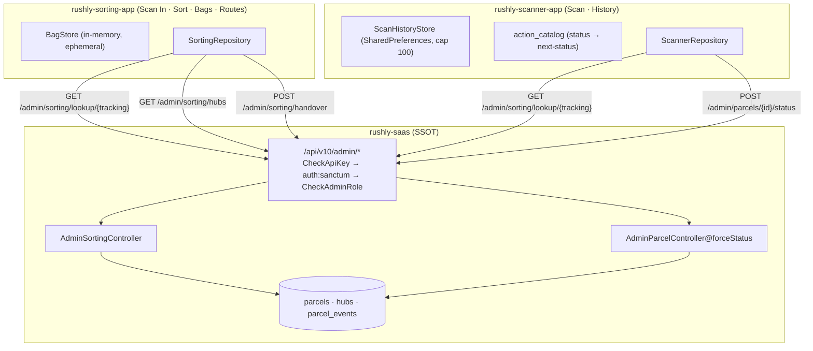
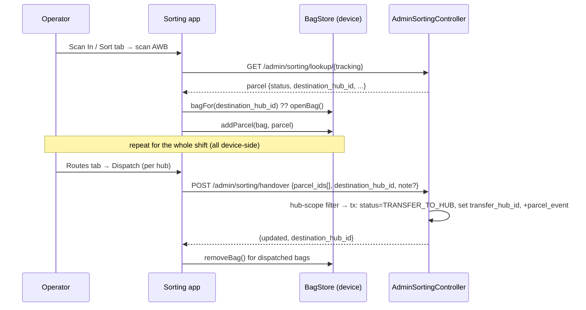
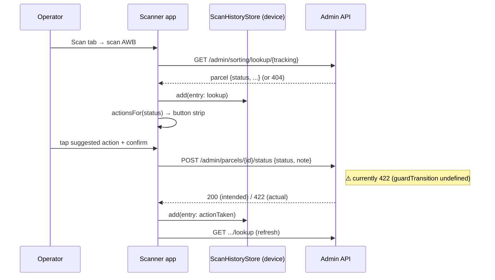

# Sorting & Scanning

> **Scope:** Sorting-center operations (scan-in, sort into bags, dispatch routes to
> hubs) and the universal parcel scanner (scan → look up → advance status). Covers the
> two Flutter clients — `rushly-sorting-app` and `rushly-scanner-app` — and the thin
> backend surface they call in `rushly-saas` (the single source of truth).
>
> **Grounding:** Every non-trivial claim cites a real source file. Where a doc and the
> code disagree, a **⚠️ Doc vs Code** note calls it out. Read the shared
> [`_CONTEXT_BRIEF.md`](../_CONTEXT_BRIEF.md) first.

**Cross-links:** [09-API.md](../09-API.md) §11.7 (Sorting center) · [12-Workflows.md](../12-Workflows.md) §9 (Sorting flow) · [06-Database.md](../06-Database.md) (parcels, hubs, parcel_events) · [10-Authentication.md](../10-Authentication.md) (admin login / Sanctum) · [11-Modules.md](../11-Modules.md) · sibling modules [parcels.md](parcels.md), [hubs-network.md](hubs-network.md), [wms-warehouse.md](wms-warehouse.md).

---

## 1. Purpose

Two small, single-purpose mobile apps sit on top of the existing parcel + hub model.
Neither introduces new domain tables — both are **thin operator surfaces** over the
`parcels`, `hubs`, and `parcel_events` tables.

| App | Path | Role | Tabs |
|---|---|---|---|
| **Sorting center** | `/var/www/rushly-sorting-app` | Scan parcels arriving at a sorting hub, group them into bags by destination hub, dispatch bags as a bulk hub-to-hub transfer | Scan In · Sort · Bags · Routes |
| **Universal scanner** | `/var/www/rushly-scanner-app` | Scan any AWB anywhere in the network, see its current state, and (optionally) advance it to the next logical status | Scan · History |

Both apps reuse the **admin API** (`/api/v10/admin/*`) and the same barcode-scanning
widget (`mobile_scanner`). The sorting app owns *bags and routes* entirely on-device;
the only server writes it performs are parcel look-ups and the bulk **handover**. The
scanner app performs look-ups plus per-parcel **status forcing**.

Source of the design intent: header docblock in
`app/Http/Controllers/Api/V10/Admin/AdminSortingController.php` — *"The app tracks
bags/routes device-side (ephemeral per-shift buckets); this controller only owns the two
operations that need server writes."*

---

## 2. Responsibilities

### Backend (`rushly-saas`) — owns
- **Parcel resolution by tracking id** (`GET /admin/sorting/lookup/{tracking}`).
- **Destination-hub list** (`GET /admin/sorting/hubs`).
- **Bulk hub handover** — flip N parcels to `TRANSFER_TO_HUB`, set their
  `transfer_hub_id`, and append a `parcel_events` row each
  (`POST /admin/sorting/handover`).
- **Single-parcel status force** — set a parcel's `status` and append a `parcel_events`
  row (`POST /admin/parcels/{id}/status`).
- **Hub-scoping / authorization** — HUB and INCHARGE users may only act on parcels
  currently in their own hub.

### Sorting app — owns
- On-device **bag lifecycle** (open, add/remove parcel, close, remove) — see
  `rushly-sorting-app/lib/features/sorting/data/bag_store.dart`.
- **Route grouping** — bags grouped by destination hub, dispatched as one handover.
- Barcode capture and the operator UX. No persistence: bags live only for the shift
  (in-memory `StateNotifier`, cleared on app restart / dispatch).

### Scanner app — owns
- **Suggested-action mapping** — given a parcel's current status, which status
  transitions to offer (`rushly-scanner-app/lib/features/scanner/domain/action_catalog.dart`).
- **Device-local scan history**, capped at 100 entries, persisted in
  `SharedPreferences` (`.../data/scan_history_store.dart`).
- Barcode capture, torch/flip camera controls, confirmation dialogs.

---

## 3. Architecture at a glance

Both apps share an identical `core/` scaffold (`DioClient`, `TokenStorage`,
`TenantStorage`, `ApiEndpoints`), differing only in their `features/` module. The two
`dio_client.dart` files are byte-for-byte identical.

---

## 4. Business rules

### 4.1 Sorting handover (`AdminSortingController@handover`)
Source: `app/Http/Controllers/Api/V10/Admin/AdminSortingController.php`.

1. Validation: `parcel_ids` (`required|array|min:1`, each `integer`),
   `destination_hub_id` (`required|integer|exists:hubs,id`), `note` (`nullable|string|max:500`).
2. **Hub-scoping:** if the caller's `user_type` is `HUB` (5) or `INCHARGE` (4) **and**
   they have a `hub_id`, the parcel set is filtered to `where('hub_id', user.hub_id)` —
   an operator can only hand over parcels physically in their own hub. ADMIN (1) /
   SUPER_ADMIN (6) are unrestricted.
3. If no parcels survive the filter → **422** `"No parcels eligible"`.
4. Inside a DB transaction, for each eligible parcel:
   - `transfer_hub_id = destination_hub_id`
   - `status = ParcelStatus::TRANSFER_TO_HUB` (6)
   - insert `parcel_events` row `{ parcel_id, parcel_status: 6, note }` (note defaults to
     `"Sorted for hub transfer"`).
5. Returns `{ updated, destination_hub_id }`.

> There is **no re-scan / bag-close guard on the server** — the server trusts the
> parcel-id list the app sends. The app-side bag/route grouping is advisory only.

### 4.2 Lookup (`AdminSortingController@lookup`)
- Resolves `Parcel::where('tracking_id', $tracking)->first()` (eager-loads
  `hub`, `transferHub`, `merchant.user`). **404** if not found.
- Returns a flat projection: `id, tracking_id, customer_name, customer_city,
  customer_area, status, current_hub_id, current_hub_name, destination_hub_id,
  destination_hub, merchant_name, cash_collection`.
- **Not tenant/hub-scoped** — any authenticated admin-role user can resolve any AWB in
  the tenant. Used by **both** apps (the scanner reuses the sorting lookup endpoint —
  see `rushly-scanner-app/.../api_endpoints.dart`, `lookupTracking`).

### 4.3 Status force (`AdminParcelController@forceStatus`)
Source: `app/Http/Controllers/Api/V10/Admin/AdminParcelController.php` (used by the
scanner app's "apply action").

1. Validation: `status` (`required|integer`), `note` (`nullable|string|max:500`).
2. `ensureHubMatch()` — HUB/INCHARGE users get **403 "Hub mismatch"** if the parcel's
   `hub_id` ≠ their `hub_id`.
3. **Intended** transition guard: `ParcelStatusHelper::guardTransition($current, $next)`
   inside `if (class_exists(...))` + `try/catch` → 422 on invalid transition.
4. `parcel->status = next; save();` then insert `parcel_events`
   `{ parcel_id, parcel_status: next, note }` (note defaults to `"Status forced by admin"`).
5. Returns `{ parcel_id, status }`.

> ### ⚠️ Doc vs Code — the scanner "apply action" is currently broken
> `AdminParcelController@forceStatus` calls **`ParcelStatusHelper::guardTransition()`**
> (line 153), but **that method does not exist** on `App\Support\ParcelStatusHelper`
> (`grep -rn 'guardTransition' app` finds only the call site; the class defines
> `nameOf`, `label`, `badgeClass`, `color`, `options`, `isCanceled`, `isReturnFlow`,
> `getStatusList`, … but **no `guardTransition`**). Because the call is wrapped in
> `if (class_exists(ParcelStatusHelper::class))` (true) and `catch (\Throwable $e)`,
> the resulting `\Error: Call to undefined method` is caught and the endpoint returns
> **HTTP 422 `admin.parcel.status_invalid`** for *every* call. Net effect: the scanner
> app's status-advance buttons always fail; only look-up works today. This is a real bug,
> not just a doc gap — either implement `guardTransition` or drop the guard block.
> (Source: `app/Http/Controllers/Api/V10/Admin/AdminParcelController.php:151-157`,
> `app/Support/ParcelStatusHelper.php`.)

### 4.4 Sorting-app device rules
- **One open bag per destination hub** — `BagStore.bagFor(hubId)` returns the first
  non-closed bag for a destination; `_sort()` auto-opens one if none exists
  (`rushly-sorting-app/.../data/bag_store.dart`, `.../presentation/sort_tab.dart`).
- A parcel with **no `destination_hub_id`** cannot be sorted — the Sort tab shows
  `noHubSet` and refuses to bag it.
- **De-dup:** adding a parcel already in a bag replaces it (keyed on `parcel.id`).
- **Dispatch** collects the *union* of parcel ids across all bags for a hub, posts one
  handover, then removes those bags from local state
  (`.../presentation/routes_tab.dart`, `_confirmDispatch`).

### 4.5 Scanner-app action mapping
`action_catalog.dart` maps current status → suggested next status(es):

| Current status (id) | Offered action → new status |
|---|---|
| `TRANSFER_TO_HUB` (6) | Received by hub → `RECEIVED_BY_HUB` (19) |
| `PENDING` (1) / `PICKUP_ASSIGN` (2) / `PICKUP_RE_SCHEDULE` (3) | Picked up → `RECEIVED_BY_PICKUP_MAN` (4) |
| `RECEIVED_BY_PICKUP_MAN` (4) | At warehouse → `RECEIVED_WAREHOUSE` (5) |
| `RECEIVED_WAREHOUSE` (5) / `RECEIVED_BY_HUB` (19) | Transfer to hub → `TRANSFER_TO_HUB` (6) |
| `DELIVERY_MAN_ASSIGN` (7) | Delivered → `DELIVERED` (9) |
| `RETURN_TO_COURIER` (24) / `RETURN_ASSIGN_TO_MERCHANT` (26) | Return received → `RETURN_WAREHOUSE` (11) |
| anything else | *(no suggested actions)* |

These ids match the backend `App\Enums\ParcelStatus` interface exactly (verified against
`app/Enums/ParcelStatus.php`). The client hard-codes them in
`ParcelStatus` constants inside `action_catalog.dart` — a duplication risk if the server
enum changes (see §12).

---

## 5. End-to-end flows

### 5.1 Sorting: scan → bag → dispatch

### 5.2 Scanner: scan → look up → advance

---

## 6. Database tables

No tables are exclusive to these apps. They read/write three existing ones (full schema
in [06-Database.md](../06-Database.md)):

| Table | Migration | Columns touched | By |
|---|---|---|---|
| `parcels` | `database/migrations/2022_04_04_142330_create_parcels_table.php` | `status`, `transfer_hub_id`, `hub_id` (read), `tracking_id` (read) | handover, forceStatus, lookup |
| `hubs` | (hubs migration) | `id, name, address` (read) | `/sorting/hubs` |
| `parcel_events` | `App\Models\Backend\ParcelEvent` | insert `{ parcel_id, parcel_status, note }` (plus auto `company_id` via model `creating` hook) | handover, forceStatus |

`transfer_hub_id` on `parcels` is confirmed present in the create-parcels migration.
`ParcelEvent` auto-populates `company_id` in a `creating` hook (added by migration
`2026_06_27_000002`), so the controllers' bare `ParcelEvent::create([...])` calls remain
valid (`app/Models/Backend/ParcelEvent.php`).

**Bags and routes have NO table.** They are ephemeral device-side objects
(`Bag` model in `rushly-sorting-app/.../domain/models.dart`, held in a Riverpod
`StateNotifier`). Scan history likewise lives only in the scanner device's
`SharedPreferences` (`scan_history_v1`).

---

## 7. Backend controllers, services, models

| Kind | File | Role |
|---|---|---|
| Controller | `app/Http/Controllers/Api/V10/Admin/AdminSortingController.php` | `lookup`, `hubs`, `handover` |
| Controller | `app/Http/Controllers/Api/V10/Admin/AdminParcelController.php` | `forceStatus` (scanner status writes) + `show`, `logs`, `index`, `assignDriver` |
| Controller | `app/Http/Controllers/Api/V10/Admin/AdminAuthController.php` | `login`, `profile`, `logout` (shared admin auth for both apps) |
| Middleware | `app/Http/Middleware/CheckApiKeyMiddleware.php` | validates static `apiKey` header vs `config('rxcourier.api_key')` |
| Middleware | `app/Http/Middleware/CheckAdminRoleMiddleware.php` | admits only `user_type ∈ {ADMIN, SUPER_ADMIN, INCHARGE, HUB}`; else 403 |
| Model | `app/Models/Backend/Parcel.php` | parcel + `hub`, `transferHub`, `merchant` relations |
| Model | `app/Models/Backend/Hub.php` | destination hubs |
| Model | `app/Models/Backend/ParcelEvent.php` | audit/history row per status change |
| Enum | `app/Enums/ParcelStatus.php` | status ids (1–41) |
| Enum | `app/Enums/UserType.php` | `ADMIN=1, MERCHANT=2, DELIVERYMAN=3, INCHARGE=4, HUB=5, SUPER_ADMIN=6` |
| Helper | `app/Support/ParcelStatusHelper.php` | status labels/colors — **note: no `guardTransition` (see §4.3)** |
| Trait | `App\Traits\ApiReturnFormatTrait` | uniform `{ success, message, data }` envelope |

There is **no dedicated `SortingService` / `ScanService`** — the logic lives directly in
the two controllers. This is intentional (small surface) but worth noting for future
extraction (§12).

---

## 8. API endpoints

All under prefix `v10/admin`, middleware chain `CheckApiKey` → `auth:sanctum` →
`CheckAdminRole` (`routes/api.php:150-173`). Full catalogue: [09-API.md](../09-API.md)
§11.7 and §10.

| Method | Path | Body / params | Response | Used by |
|---|---|---|---|---|
| POST | `/v10/admin/login` | `email`, `password` | `{ token, user }`; 401 if not an admin-type user | both (auth) |
| GET | `/v10/admin/sorting/lookup/{tracking}` | — | `{ parcel }`; **404** if not found | both |
| GET | `/v10/admin/sorting/hubs` | — | `{ count, hubs[] }` | sorting (new-bag / dispatch picker) |
| POST | `/v10/admin/sorting/handover` | `parcel_ids[]`, `destination_hub_id`, `note?` | `{ updated, destination_hub_id }`; **422** if none eligible | sorting |
| POST | `/v10/admin/parcels/{id}/status` | `status` (int), `note?` | `{ parcel_id, status }`; 403 hub mismatch; **422** (see §4.3 bug) | scanner |
| GET | `/v10/admin/profile` · POST `/v10/admin/logout` | — | user / logout | both |

**Client endpoint constants:**
- Sorting: `rushly-sorting-app/lib/core/api/api_endpoints.dart` — `sortingLookup`,
  `sortingHubs`, `sortingHandover`.
- Scanner: `rushly-scanner-app/lib/core/api/api_endpoints.dart` — `lookupTracking`
  (reuses `/admin/sorting/lookup`), `hubs`, `setStatus` (`/admin/parcels/{id}/status`).

**Response unwrapping:** `DioClient._unwrap` returns `data['data']` when present, so
repositories see the inner payload directly (`.../core/api/dio_client.dart`).

---

## 9. Flutter screens & state

### Sorting app (`rushly-sorting-app`)
Tabs wired in `lib/features/dashboard/presentation/home_shell.dart`
(`IndexedStack` + `NavigationBar`), routing in `lib/shared/router/app_router.dart`.

| Screen / widget | File | Notes |
|---|---|---|
| Scan In tab | `features/sorting/presentation/scan_in_tab.dart` | scan/type AWB → lookup → `ParcelCard`. Look-up only, no bagging. |
| Sort tab | `features/sorting/presentation/sort_tab.dart` | scan → lookup → auto-add to the bag for its destination hub; undo via snackbar. |
| Bags tab | `features/sorting/presentation/bags_tab.dart` | list bags; new-bag bottom sheet (hub dropdown from `sortingHubsProvider`); close/remove. |
| Routes tab | `features/sorting/presentation/routes_tab.dart` | bags grouped by destination hub; **Dispatch** → confirm → `handover`. |
| Bag detail | `features/sorting/presentation/bag_detail_screen.dart` | route `/bag/:id`; parcel list, remove parcels, close bag. |
| Scanner page | `features/sorting/presentation/scanner_page.dart` | `mobile_scanner`; returns raw barcode value via `Navigator.pop`. |
| Parcel card | `features/sorting/presentation/parcel_card.dart` | shows destination (orange "no hub set" if null), COD, current hub, status. |
| State | `features/sorting/data/bag_store.dart` | `BagStore extends StateNotifier<List<Bag>>` (in-memory). |
| Repo | `features/sorting/data/sorting_repository.dart` | `lookup`, `hubs`, `handover`; `sortingHubsProvider`. |
| Models | `features/sorting/domain/models.dart` | `ScannedParcel`, `SortingHub`, `Bag`. |

### Scanner app (`rushly-scanner-app`)
| Screen / widget | File | Notes |
|---|---|---|
| Scan tab | `features/scanner/presentation/scan_tab.dart` | scan/type → lookup → parcel card + suggested-action strip → confirm → `setStatus` → refresh. Every scan logged to history. |
| History tab | `features/scanner/presentation/history_tab.dart` | reverse-chronological list; icons for not-found / lookup-only / action-taken; clear-all. |
| Scanner page | `features/scanner/presentation/scanner_page.dart` | `mobile_scanner` **with torch + flip-camera** controls (richer than sorting's). |
| State (history) | `features/scanner/data/scan_history_store.dart` | `SharedPreferences`, key `scan_history_v1`, cap 100, 30-s de-dup window. |
| Repo | `features/scanner/data/scanner_repository.dart` | `lookup`, `setStatus`. |
| Action catalog | `features/scanner/domain/action_catalog.dart` | status→label map + `actionsFor(status)`. |
| Models | `features/scanner/domain/scanned_parcel.dart` | `ScannedParcel`, `ScanHistoryEntry`. |

Auth/tenant screens (`features/auth/*`, `features/tenant/*`) are shared scaffold across
all Rushly Flutter apps — see [08-Flutter.md](../08-Flutter.md) / [MOBILE_APPS.md](../../MOBILE_APPS.md).

---

## 10. Authentication, tenancy & dependencies

- **Auth:** both apps log in via `POST /admin/login` (`AdminAuthController`). Any
  back-office `user_type` (ADMIN/SUPER_ADMIN/INCHARGE/HUB) may sign in; merchants and
  deliverymen are rejected at both login and `CheckAdminRole`. Token = Laravel Sanctum
  personal-access token, stored client-side by `TokenStorage`, sent as
  `Authorization: Bearer …` (`.../core/api/dio_client.dart`). A 401 clears the token and
  bounces to `/login`. See [10-Authentication.md](../10-Authentication.md).
- **Static API key:** every request also carries header `apiKey` (default
  `123456rx-ecourier123456`, `Env.apiKey`) validated by `CheckApiKeyMiddleware`.
- **Multi-tenancy:** the app resolves its base URL per tenant from `TenantStorage` at
  `DioClient` construction. A user typing a workspace name `acme` yields
  `https://acme.<TENANT_HOST_SUFFIX>/api/v10` (`Env.tenantHostSuffix`, default
  `rushly-logistic.com`). "Change workspace" clears token + tenant and returns to the
  tenant-select screen. Tenancy model per `stancl/tenancy` (see [05-System-Architecture.md](../05-System-Architecture.md)).
- **Default API base:** `https://api.rushly-logistic.com/api/v10` (`Env.apiBaseUrl`).

**Flutter package dependencies (both apps):** `dio` + `pretty_dio_logger` (HTTP),
`flutter_riverpod` (state), `go_router` (routing), `mobile_scanner` (barcode),
`flutter_dotenv` (config), `shared_preferences` (scanner history; sorting uses it for
tenant/token only), `intl` (scanner history dates).

---

## 11. Notifications, permissions, maturity

- **Notifications:** **None.** Neither app subscribes to FCM, and neither the handover
  nor forceStatus path dispatches a notification/event. (Contrast the merchant/driver
  apps which call `fcm-subscribe` — `routes/api.php:206-207,256-257`.) A hub transfer or
  status change made from these apps does **not** currently notify the merchant, the
  destination hub, or the customer. → future improvement (§12).
- **Permissions:** coarse, `user_type`-based only:
  - Sign-in gate: `AdminAuthController::ADMIN_TYPES`.
  - Endpoint gate: `CheckAdminRoleMiddleware` (same four types).
  - Row-level: HUB/INCHARGE are **hub-scoped** on `handover` (filter) and `forceStatus`
    (403 on mismatch); ADMIN/SUPER_ADMIN unrestricted. **`lookup` and `hubs` have no
    hub-scoping** — any admin-type user reads any parcel/hub in the tenant.
  - No fine-grained `Permission`/policy check (the platform's `App\Models\Permission`
    system is not consulted here). See [17-Security.md](../17-Security.md).
- **Maturity / status:** **Early / functional-but-thin.**
  - ✅ Working: admin login, tenant switching, barcode scan, lookup, hub list, bulk
    handover, on-device bags/routes, scanner history.
  - 🐞 Broken: **scanner status-advance** (`forceStatus` 422, §4.3).
  - ⚠️ Ephemeral by design: bags/routes and scan history are device-local and lost on
    restart — no server record that "operator X bagged parcel Y at time T" beyond the
    `parcel_events` row written at dispatch.
  - The controller docblock frames the backend as deliberately minimal, consistent with
    a Phase-10 scaffold (see [12-Workflows.md](../12-Workflows.md) §9).

---

## 12. Future improvements

1. **Fix `forceStatus`** — implement `ParcelStatusHelper::guardTransition()` (a real
   transition-validity matrix) or remove the guard block. Until then the scanner app can
   only look up, not advance (§4.3).
2. **Server-side bags/routes** — persist bags as first-class records so handovers are
   auditable, resumable across devices/shifts, and reportable. Currently a mid-shift app
   crash loses all un-dispatched grouping.
3. **Notifications** — emit an event on handover / status change so the destination hub,
   merchant, and (for delivery/return states) the customer are informed; wire FCM
   subscription like the driver/merchant apps.
4. **De-duplicate the status enum** — the scanner hard-codes status ids in
   `action_catalog.dart`; expose them from the backend (e.g. via `/general-settings` or a
   dedicated endpoint) to avoid client/server drift.
5. **Scope `lookup`/`hubs`** — add hub-scoping so a hub operator only sees relevant hubs
   and cannot resolve arbitrary AWBs, aligning with the write-path rules.
6. **Extract a `SortingService`** — move handover logic out of the controller for reuse
   (e.g. by the warehouse dispatch flow) and unit-testing.
7. **Confirm-on-mismatch UX** — surface the 403 "Hub mismatch" and 422 "no eligible"
   cases with clear operator messaging (today the sorting app shows raw `e.toString()`).

---

## Sources

**Backend (`rushly-saas`)**
- `app/Http/Controllers/Api/V10/Admin/AdminSortingController.php`
- `app/Http/Controllers/Api/V10/Admin/AdminParcelController.php`
- `app/Http/Controllers/Api/V10/Admin/AdminAuthController.php`
- `app/Http/Middleware/CheckAdminRoleMiddleware.php`
- `app/Http/Middleware/CheckApiKeyMiddleware.php`
- `app/Enums/ParcelStatus.php`, `app/Enums/UserType.php`
- `app/Support/ParcelStatusHelper.php` (verified: no `guardTransition`)
- `app/Models/Backend/ParcelEvent.php`
- `routes/api.php` (lines 150-173, 313-323 for context)
- `database/migrations/2022_04_04_142330_create_parcels_table.php` (`transfer_hub_id`)
- Existing docs: `docs/09-API.md` §11.7, `docs/12-Workflows.md` §9

**Sorting app (`rushly-sorting-app`)**
- `lib/features/sorting/domain/models.dart`
- `lib/features/sorting/data/sorting_repository.dart`, `.../data/bag_store.dart`
- `lib/features/sorting/presentation/{scan_in_tab,sort_tab,bags_tab,routes_tab,bag_detail_screen,scanner_page,parcel_card}.dart`
- `lib/features/dashboard/presentation/home_shell.dart`
- `lib/shared/router/app_router.dart`, `lib/core/api/{api_endpoints,dio_client}.dart`, `lib/core/config/env.dart`, `lib/features/auth/data/auth_repository.dart`

**Scanner app (`rushly-scanner-app`)**
- `lib/features/scanner/domain/{scanned_parcel,action_catalog}.dart`
- `lib/features/scanner/data/{scanner_repository,scan_history_store}.dart`
- `lib/features/scanner/presentation/{scan_tab,history_tab,scanner_page}.dart`
- `lib/features/dashboard/presentation/home_shell.dart`
- `lib/shared/router/app_router.dart`, `lib/core/api/{api_endpoints,dio_client}.dart`, `lib/core/config/env.dart`
