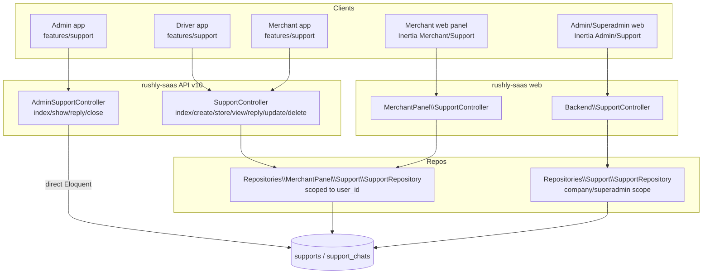
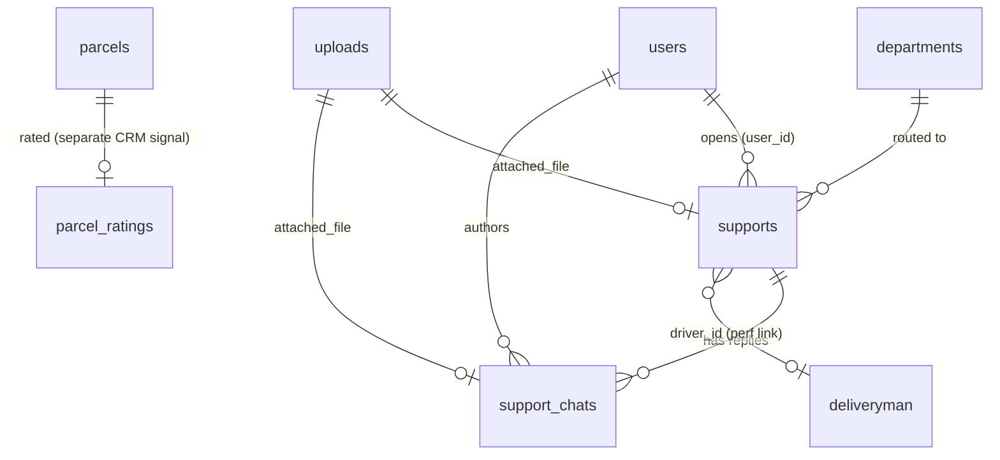
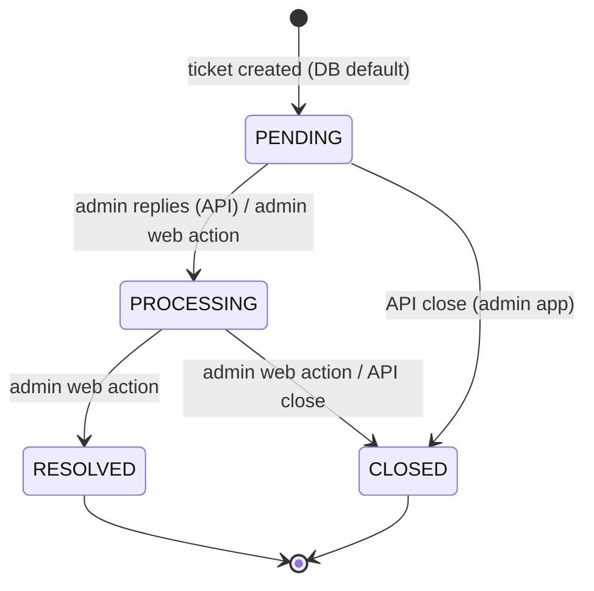

# Support & CRM

> Scope: the in-platform **support ticketing** system (tickets, threaded replies, status
> lifecycle) and the state of **CRM / customer-contact** capabilities across Rushly.
> Source of truth is `rushly-saas`; the Flutter apps (driver, merchant, admin) are clients.
>
> Cross-references: [../06-Database.md](../06-Database.md) ·
> [../08-Flutter.md](../08-Flutter.md) · [../09-API.md](../09-API.md) ·
> [../10-Authentication.md](../10-Authentication.md) · [../11-Modules.md](../11-Modules.md) ·
> [../13-User-Journeys.md](../13-User-Journeys.md) · [../17-Security.md](../17-Security.md)

---

## 1. Purpose

Support is a **classic help-desk ticket module**: a user (merchant, driver, or admin/staff)
opens a ticket against a **department**, picks a **service** and **priority**, and then the
two sides exchange **threaded replies** (`support_chats`) until an operator moves the ticket
through a four-state status lifecycle. It is the only first-party customer-communication
surface in the platform.

It is a **thin, self-contained CRUD module**, not a full CRM. There is **no dedicated CRM
module** (no leads, no accounts/opportunities pipeline, no contact timeline). "Customer"
relationship data lives implicitly on parcels and in analytics — see §11.

Source of the enum that anchors the whole module — `app/Enums/SupportStatus.php`:

```php
interface SupportStatus{
    const PENDING    = 1;
    const PROCESSING = 2;
    const RESOLVED   = 3;
    const CLOSED     = 4;
}
```

---

## 2. Responsibilities

| Responsibility | Where |
|---|---|
| Create/list/edit/delete tickets | `app/Http/Controllers/Backend/SupportController.php` (admin web), `.../MerchantPanel/SupportController.php` (merchant web), `app/Http/Controllers/Api/V10/SupportController.php` (mobile) |
| Threaded replies | `SupportChat` model + `reply()` in the repositories |
| Status lifecycle transitions | admin web `statusUpdate()`, admin API `reply()`/`close()` |
| Admin triage (list/show/reply/close) via API | `app/Http/Controllers/Api/V10/Admin/AdminSupportController.php` |
| Departments (routing target) | `app/Models/Backend/Department.php` |
| File attachments | `Upload` model, `file()` in repositories (`public/uploads/support/`) |
| Activity audit log | spatie/laravel-activitylog on `Support` and `Department` |
| In-app notification bell feed | `app/Http/Helper/Helper.php` (~line 782) |
| Feeds "complaints" KPI to analytics | `app/Services/Performance/*` |

---

## 3. Architecture at a glance



⚠️ **Note the split repository wiring**: the **mobile `SupportController`** (`Api/V10`)
injects `App\Repositories\MerchantPanel\Support\SupportInterface` — i.e. **both the driver
app and the merchant app** go through the **MerchantPanel** repository, which scopes lists to
`user_id = Auth::user()->id` (`app/Http/Controllers/Api/V10/SupportController.php`
constructor + `app/Repositories/MerchantPanel/Support/SupportRepository.php::all()`).
`AdminSupportController` bypasses the repository layer entirely and queries `Support` directly.

---

## 4. Data model / database tables

See [../06-Database.md](../06-Database.md) for the global schema. This module owns two tables
plus a CRM-adjacent third.

### 4.1 `supports` — `database/migrations/2022_05_23_111055_create_supports_table.php`

| Column | Type | Notes |
|---|---|---|
| `id` | bigint PK | |
| `user_id` | FK → `users`, nullable, `onDelete cascade` | ticket author |
| `driver_id` | unsignedBigInteger, nullable | **added 2026-06-27** (`..._add_parcel_ratings_and_support_driver_id.php`) — links a complaint to a specific driver for the performance dashboard |
| `department_id` | FK → `departments`, nullable, cascade | routing target |
| `service` | string, nullable | free label; UI options come from `trans('SalaryService')` |
| `priority` | string, nullable | `low` / `medium` / `high` (UI-defined, not enum-constrained) |
| `subject` | string, nullable | |
| `description` | longtext, nullable | |
| `date` | date, nullable | user-entered ticket date |
| `attached_file` | unsignedBigInteger, nullable | FK-in-spirit → `uploads.id` |
| `status` | unsignedTinyInteger, **default `PENDING`(1)** | column comment enumerates the four states |
| `timestamps` | | |

### 4.2 `support_chats` — `database/migrations/2022_06_02_125218_create_support_chats_table.php`

| Column | Type | Notes |
|---|---|---|
| `id` | bigint PK | |
| `support_id` | FK → `supports`, cascade | parent ticket |
| `user_id` | FK → `users`, cascade | reply author |
| `attached_file` | unsignedBigInteger, nullable | |
| `message` | longtext, nullable | reply body |
| `timestamps` | | |

### 4.3 `parcel_ratings` (CRM-adjacent) — same 2026-06-27 migration

Customer-satisfaction capture per delivered parcel (`rating` 1–5, `comment`, `source`,
`UNIQUE(parcel_id)`). This is the closest thing to a CRM/CSAT signal. It is **not linked to
support tickets** — it is a separate public signed-URL flow
(`app/Http/Controllers/Backend/ParcelRatingController.php`, route `/r/parcel/{id}/rate`).



---

## 5. Models

`app/Models/Backend/Support.php`
- Traits: `HasFactory`, `LogsActivity` (log name `Support`, logs user name, department title,
  service, priority, subject, description, date).
- `$fillable`: `user_id, driver_id, department_id, service, priority, subject, description, date`.
  ⚠️ **`status` is NOT fillable** and is **not set on create** — new tickets rely on the DB
  default `PENDING`. `attached_file` is also not fillable (set explicitly by the repository).
- Relations: `department()`, `user()`, `file()`/`attached_file()` (→ `Upload`), `supportChats()`.
- `getAttachedAttribute()` returns the attachment public URL or a default user image.
- `getMyStatusAttribute()` renders a coloured Bootstrap badge from `$this->status` using
  `SupportStatus` constants + `levels.*` translations.

`app/Models/Backend/SupportChat.php`
- Relations: `user()`, `support()`, `file()` (→ `Upload`).

`app/Models/Backend/Department.php`
- `$fillable = ['title']`; `scopeActive()` (status = ACTIVE); has a `show_in_merchant` column
  used to filter departments merchants may pick.

---

## 6. Services / repositories

There is **no dedicated `app/Support/` module namespace**. Logic lives in two repository
implementations behind interfaces (a light service layer):

- **`app/Repositories/Support/SupportRepository.php`** (admin/superadmin web).
  - `all()` scoping: if `isSuperadmin()` → tickets authored by `UserType::ADMIN` or
    `SUPER_ADMIN`; else `companywise()` (tenant/company scope). Paginated 10/page.
  - `store()`/`update()` persist all form fields incl. `driver_id`; handle attachment upload.
  - `reply()` inserts a `SupportChat` (`message`).
  - `statusUpdate($id,$request)` sets `status = $request->status` (no transition guard here).
  - `file()` moves upload to `public/uploads/support/` and records an `Upload` row.
- **`app/Repositories/MerchantPanel/Support/SupportRepository.php`** (merchant web **and** all
  mobile apps).
  - `all()` scoping: **`where('user_id', Auth::user()->id)`** — only the caller's own tickets.
  - `departments()` filtered to `show_in_merchant = 1`.
  - Same `store/update/reply/file` shape; **does not** set `driver_id` and has **no**
    `statusUpdate()` (merchants/mobile cannot change status).

⚠️ **Doc vs Code — `status` never leaves PENDING for merchant/mobile tickets.** Neither the
MerchantPanel repository nor the mobile `SupportController` ever writes `status`, and admin
web only lists tickets whose author is ADMIN/SUPER_ADMIN (or company-scoped). A merchant/driver
ticket only advances if an admin picks it up through the **admin API** (`AdminSupportController`,
which queries all tickets directly).

---

## 7. Controllers

| Controller | Surface | Actions |
|---|---|---|
| `Api/V10/SupportController` | Mobile (driver + merchant apps) | `index, create, store, edit, update, destroy, view, supportReply` |
| `Api/V10/Admin/AdminSupportController` | Admin app | `index, show, reply, close` |
| `Backend/SupportController` | Admin/Superadmin web (Inertia `Admin/Support/*`) | full CRUD + `view, supportReply, statusUpdate` |
| `Backend/MerchantPanel/SupportController` | Merchant web (Inertia `Merchant/Support/*`) | CRUD + `view, supportReply` (no status) |

Notes:
- `Backend/SupportController::index` builds a rich Inertia payload including `next_actions`
  (allowed status transitions) and `permissions` flags.
- `AdminSupportController` is defensively coded against schema drift — it reads
  `message ?? description` on chats and `description ?? message` on tickets, and guards writes
  with `Schema::hasColumn(...)`. ⚠️ The `description` column on `support_chats` and the
  `message` column on `supports` **do not exist** in the migrations, so those fallbacks are
  effectively dead code (harmless, but a smell).

---

## 8. Business rules

### 8.1 Status lifecycle



- **Admin web** (`Backend/SupportController::nextStatusOptions`): PENDING → PROCESSING only;
  PROCESSING → {RESOLVED, CLOSED}; RESOLVED/CLOSED are terminal (no further buttons). But the
  underlying `statusUpdate` route accepts any `?status=` value — the transition constraint is
  **UI-only**, not enforced server-side.
- **Admin API** (`AdminSupportController`): `reply()` auto-bumps PENDING → PROCESSING; `close()`
  sets CLOSED from any state.

### 8.2 Validation — `app/Http/Requests/Support/StoreRequest.php`

`department_id`, `service`, `priority`, `subject` are **required**. `description`, `date`, and
`attached_file` are optional. Replies require `message` (validated inline in each controller).

### 8.3 Visibility / tenancy

- Merchant web & mobile: caller sees only **their own** tickets (`user_id`).
- Admin web: superadmin sees ADMIN/SUPER_ADMIN-authored tickets; otherwise company-scoped
  (`companywise()`). See multi-tenancy in [../10-Authentication.md](../10-Authentication.md).
- Admin API: **all tickets**, with `?status=` and `?q=` (subject / author name+email) filters,
  paginated (`per_page` clamped 10–100, default 25).

---

## 9. APIs

All mobile routes live in `routes/api.php`. See [../09-API.md](../09-API.md) for conventions.

### 9.1 Driver + merchant mobile (`SupportController`)
Under `prefix v10` → `CheckApiKey` → `auth:sanctum` (routes/api.php ~328):

| Method | Path | Action |
|---|---|---|
| GET | `/api/v10/support/index` | list own tickets (`SupportResource`) |
| GET | `/api/v10/support/create` | department lookup for the form |
| POST | `/api/v10/support/store` | create ticket |
| GET | `/api/v10/support/edit/{id}` | ticket + departments |
| PUT | `/api/v10/support/update/{id}` | update |
| DELETE | `/api/v10/support/delete/{id}` | delete |
| GET | `/api/v10/support/view/{id}` | ticket + chat thread |
| POST | `/api/v10/support/reply` | add reply (`support_id`, `message`) |

### 9.2 Admin mobile (`AdminSupportController`)
Under `prefix v10/admin` → `CheckApiKey` → `auth:sanctum` + `CheckAdminRole` (routes/api.php ~197):

| Method | Path | Action |
|---|---|---|
| GET | `/api/v10/admin/support` | list all (filters `status`, `q`, `per_page`) |
| GET | `/api/v10/admin/support/{id}` | ticket + replies |
| POST | `/api/v10/admin/support/{id}/reply` | reply (auto PENDING→PROCESSING) |
| POST | `/api/v10/admin/support/{id}/close` | set CLOSED |

Response envelope via `ApiReturnFormatTrait`. `SupportResource`
(`app/Http/Resources/v10/SupportResource.php`) exposes `id, subject, userName, userEmail,
userMobile, department, service, priority, description, date`. ⚠️ It dereferences `$this->user`
and `$this->department` **without null-safety** — a ticket with a deleted user/department will
throw on serialization.

### 9.3 Web routes
- Admin/superadmin: `routes/web.php` ~884 and `routes/superadmin.php` ~133, each guarded by
  `hasPermission:*` middleware (§10).
- Merchant panel: `routes/web.php` ~1397 — **no permission middleware** (session auth only).

---

## 10. Permissions

Defined in `database/seeders/PermissionSeeder.php` (~275) and assigned in
`database/seeders/RoleSeeder.php`:

`support_read`, `support_create`, `support_update`, `support_delete`, `support_reply`,
`support_status_update`.

- **Admin/superadmin web routes** enforce them via `hasPermission:*` middleware.
- **Admin mobile API** is gated by `CheckAdminRole` (not per-action permissions).
- **Merchant web + all mobile** routes carry **no support-permission middleware** — access is
  authentication-scoped (own tickets only). See [../17-Security.md](../17-Security.md).

---

## 11. CRM / customer-contact — honest status

**There is no CRM module.** No `app/Crm/`, no leads/accounts/opportunities, no contact
timeline, no marketing/segmentation. Customer-relationship data is scattered and derived:

- **End-customer identity** lives on the parcel (customer name/phone/address fields on
  `Parcel`), not in a contacts table. The `Support` module's "user" is always a platform
  user (merchant/driver/staff), **never the shipment's end customer**.
- **CSAT signal**: `parcel_ratings` (§4.3) + `ParcelRatingController` — a public signed-URL
  rating form for delivered parcels. Standalone; not tied to tickets.
- **Analytics roll-ups** treat tickets as a "complaints" proxy:
  `app/Services/Performance/DriverPerformanceService.php` (driver-linked tickets via
  `driver_id`, else all tickets as fallback), plus `CustomerPerformanceService`,
  `HubPerformanceService`, `OperatingCompanyPerformanceService`, `KpiAggregator` all count
  `Support` rows in a window. See the Performance module notes in
  [../11-Modules.md](../11-Modules.md).
- `CustomerDomain` / `PublicTrackingApiKey` are **not** CRM — they are white-label tracking
  domain config.

**Conclusion:** support ticketing is real but basic; CRM is effectively **Not found in the
current codebase** beyond the parcel-rating CSAT capture.

---

## 12. Flutter clients

See [../08-Flutter.md](../08-Flutter.md). Each app has a `lib/features/support/` slice
(clean-ish layers: `data/` repository, `domain/` model, `presentation/` screens) using
Riverpod providers and a Dio client.

| App | Screens | Endpoints (`core/api/api_endpoints.dart`) | Capability |
|---|---|---|---|
| **Driver** | `support_screen` (list), `support_ticket_screen` (view+reply), `new_ticket_screen` | `/support/index`, `/create`, `/store`, `/view/{id}`, `/reply`, `/delete/{id}` | full self-service ticketing |
| **Merchant** | same three screens | same set + `/support/create` lookup | full self-service ticketing |
| **Admin** | `support_screen` (list), `support_ticket_screen` (triage) | `/admin/support`, `/admin/support/{id}`, `/reply`, `/close` | triage only — **no create** |

Client parsers are defensively lenient (`data['supports'] ?? data['tickets'] ?? data`),
accommodating the two different response envelopes (mobile `SupportResource` vs admin
`transform`). This mirrors the backend's schema-drift defensiveness — a maturity signal.

---

## 13. Notifications

Support has **no push/email/SMS notifications**. The only signal is the **admin web
notification-bell feed**, built inline in `app/Http/Helper/Helper.php` (~line 782): it scans
`supports` and `support_chats` from the **last 7 days** and emits `type: 'support'` entries
for tickets/replies authored by someone other than the current user. It is a polled UI list,
not an event/queue notification. (`FollowupNotificationDispatcher` is NDR-related, not support.)
Contrast with parcel/NDR flows which do use `PushNotificationService` — see
[../14-Integrations.md](../14-Integrations.md).

---

## 14. Dependencies

- **Models**: `User` (+ `UserType`), `Department`, `Upload`, `Parcel`/`ParcelRating` (CRM-adjacent).
- **Enum**: `App\Enums\SupportStatus`.
- **Packages**: `spatie/laravel-activitylog` (audit), Inertia+React (web), Sanctum (mobile auth),
  stancl/tenancy (`companywise()` scope) — see [../05-System-Architecture.md](../05-System-Architecture.md).
- **Storage**: local disk `public/uploads/support/` (no S3 abstraction here).
- **Consumers**: `app/Services/Performance/*` read `Support` for KPIs.

---

## 15. Maturity / status

**Functional but immature (v0-ish).** Works end-to-end for open→reply→close, but:

- Schema-drift defensive code in both `AdminSupportController` and the Flutter parsers signals
  an unstable/renamed schema history.
- `status` is not `$fillable` and is never written by merchant/mobile/merchant-web paths;
  transitions depend on an admin using the admin API/web.
- Status transition rules are UI-only (server accepts arbitrary `?status=`).
- `SupportResource` lacks null-safety on `user`/`department`.
- No SLA/first-response timers, no agent assignment/ownership, no ticket categories beyond
  free-text `service`, no internal notes, no email ingestion, no notifications.
- No automated tests found for the module.

---

## 16. Future improvements

1. Make `status` fillable + enforce a server-side state machine (reject illegal transitions).
2. Add **agent assignment / ownership** and internal (staff-only) notes.
3. Real **notifications** (push via `PushNotificationService`, email) on new ticket & reply,
   replacing the 7-day polled bell.
4. **SLA + first-response** timers feeding the Performance dashboard.
5. Reconcile the schema (drop the dead `message`/`description` fallbacks) and add null-safety
   to `SupportResource`.
6. Link **CSAT (`parcel_ratings`)** to tickets and to the end-customer to seed a real CRM
   contact record; today customer identity only exists on parcels.
7. Give the merchant web panel proper permission middleware (currently session-only).
8. Consider promoting the two divergent repositories into a single `app/Support/` module
   namespace consistent with `app/Oms`, `app/Fulfillment`, etc. (see
   [../11-Modules.md](../11-Modules.md)).

---

## Sources

Files read for this doc:

- `app/Enums/SupportStatus.php`
- `app/Models/Backend/Support.php`, `app/Models/Backend/SupportChat.php`, `app/Models/Backend/Department.php`
- `database/migrations/2022_05_23_111055_create_supports_table.php`
- `database/migrations/2022_06_02_125218_create_support_chats_table.php`
- `database/migrations/2026_06_27_130000_add_parcel_ratings_and_support_driver_id.php`
- `app/Http/Controllers/Api/V10/SupportController.php`
- `app/Http/Controllers/Api/V10/Admin/AdminSupportController.php`
- `app/Http/Controllers/Backend/SupportController.php`
- `app/Http/Controllers/Backend/MerchantPanel/SupportController.php`
- `app/Http/Controllers/Backend/ParcelRatingController.php`
- `app/Repositories/Support/{SupportInterface,SupportRepository}.php`
- `app/Repositories/MerchantPanel/Support/{SupportInterface,SupportRepository}.php`
- `app/Http/Requests/Support/StoreRequest.php`
- `app/Http/Resources/v10/SupportResource.php`
- `app/Http/Helper/Helper.php` (notification feed ~L782)
- `app/Services/Performance/DriverPerformanceService.php` (+ Customer/Hub/OperatingCompany/KpiAggregator)
- `routes/api.php`, `routes/web.php`, `routes/superadmin.php`
- `database/seeders/PermissionSeeder.php`, `database/seeders/RoleSeeder.php`
- `resources/js/Pages/Admin/Support/*`, `resources/js/Pages/Merchant/Support/*`
- Flutter: `rushly-{driver,merchant,admin}-app/lib/features/support/*` and each `lib/core/api/api_endpoints.dart`
- `docs/_CONTEXT_BRIEF.md`
