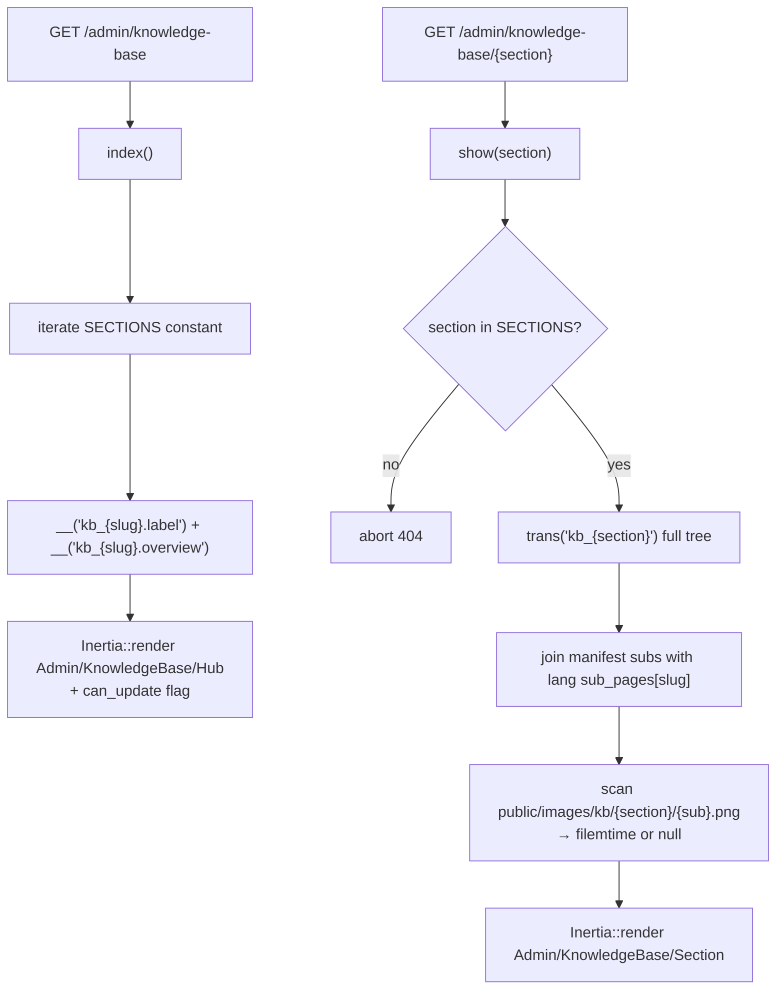
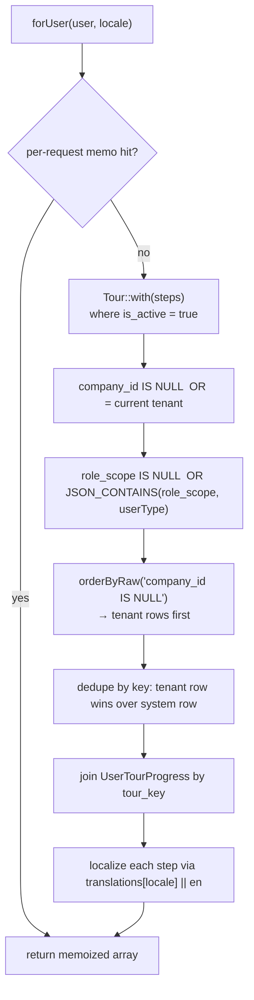
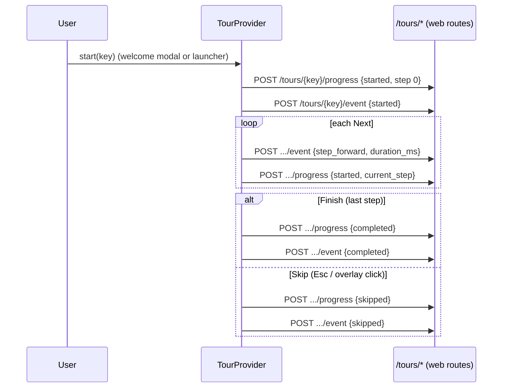

# Onboarding Tours & Knowledge Base

> **Module scope.** Two sibling, self-service "help" subsystems inside the
> rushly-saas web panels (Inertia + React):
>
> 1. **Knowledge Base (KB)** — a *static* in-app operator handbook. A hub of
>    cards, one per system section; each section documents its sub-pages
>    (purpose, key fields, status flow, cross-links, notes) with an
>    uploadable screenshot per sub-page. Content lives in PHP lang files, so
>    editing it needs no JS rebuild.
> 2. **Onboarding Tours** — an *interactive* spotlight walkthrough engine. A
>    scripted, keyboard-navigable overlay that guides a user through a module
>    on first login or on demand, with per-user progress and append-only
>    analytics.
>
> They are complementary: reach for the KB when you want a durable reference
> doc, reach for tours when you want to guide someone through a UI flow.
> `KNOWLEDGE_BASE.md` and `TOURS.md` (repo root) are the primary engineering
> docs; this file goes deeper and flags where those docs diverge from code.

Cross-references (relative links):
[../06-Database.md](../06-Database.md) ·
[../09-API.md](../09-API.md) ·
[../10-Authentication.md](../10-Authentication.md) ·
[../11-Modules.md](../11-Modules.md) ·
[../16-UI-UX.md](../16-UI-UX.md) ·
[../08-Flutter.md](../08-Flutter.md) ·
[./permissions-users-roles.md](./permissions-users-roles.md) ·
[./wms-warehouse.md](./wms-warehouse.md) ·
[./notifications.md](./notifications.md)

---

## 1. Purpose & responsibilities

| Subsystem | Purpose | Responsibilities |
|---|---|---|
| **Admin KB** | In-panel operator handbook for tenant admins. | Render a section hub and per-section handbook pages; load content from lang files; manage per-sub-page screenshots (upload/replace/delete). |
| **WMS KB** | Dedicated warehouse handbook (pre-dates the generic hub, not migrated into it). | Same screenshot mechanics for 10 fixed WMS slugs; deep-linked from the admin hub's WMS card. |
| **Merchant KB** | Merchant-panel handbook (a third KB, *not* documented in `KNOWLEDGE_BASE.md`). | Same content+screenshot model, scoped to merchant-facing pages. |
| **Tour engine (backend)** | Store/serve/resolve tour definitions; record progress + analytics. | `TourRepository::forUser()` resolution; 3 JSON endpoints; admin CRUD + analytics; JSON seeders. |
| **Tour engine (frontend)** | Drive the spotlight walkthrough in the browser. | `TourProvider` context, SVG-mask overlay, auto-placed popover, welcome modal, launcher dropdown, keyboard nav, `element_missing` handling. |

Both are **web-only** features of the Laravel/Inertia panels. No Flutter app
consumes either (see [§10](#10-flutter-clients)).

---

## 2. Knowledge Base engine

### 2.1 Where things live

| Piece | Path |
|---|---|
| Admin hub + section controller | `app/Http/Controllers/Backend/AdminKnowledgeBaseController.php` |
| WMS KB controller | `app/Http/Controllers/Backend/Wms/WmsKnowledgeBaseController.php` |
| Merchant KB controller | `app/Http/Controllers/Backend/MerchantPanel/MerchantKnowledgeBaseController.php` |
| Routes | `routes/web.php` (search `admin.kb.`, `merchant-panel.kb.`, `wms...knowledge-base`) |
| Admin hub / section pages | `resources/js/Pages/Admin/KnowledgeBase/{Hub,Section}.jsx` |
| WMS KB page | `resources/js/Pages/Admin/Wms/KnowledgeBase/Index.jsx` |
| Merchant KB pages | `resources/js/Pages/Merchant/KnowledgeBase/{Hub,Section}.jsx` |
| Chrome strings | `lang/{en,ar}/kb_chrome.php`, `lang/{en,ar}/mkb_chrome.php` |
| Section content | `lang/{en,ar}/kb_{section}.php` (admin), `lang/{en,ar}/mkb_{section}.php` (merchant) |
| WMS KB strings | inline in `resources/js/lib/i18n.js` (`wms_kb_*` keys) |
| Uploaded screenshots | `public/images/kb/{section}/{sub}.png` (admin), `public/images/wms-kb/{slug}.png` (WMS), `public/images/mkb/{section}/{sub}.png` (merchant) |

### 2.2 The section manifest is the source of truth

The **structure** of the admin KB — which sections exist, their icons, and
their ordered sub-page slugs — is a PHP constant, `SECTIONS`, in
`AdminKnowledgeBaseController.php`. The **content** for each is a matching
lang file `kb_{slug}.php`. Twelve sections ship today:

| Section slug | Icon | Sub-pages (from `SECTIONS`) |
|---|---|---|
| `main` | LayoutDashboard | `dashboard` |
| `shipments` | Package | `parcels`, `bulk-action`, `ndr`, `abnormal` |
| `wms` | Warehouse | *(none — deep-links out via `external_route => wms.knowledge-base`)* |
| `operations` | Truck | `couriers`, `tms`, `hubs`, `merchants`, `pickup-request` |
| `finance` | DollarSign | `payment-received`, `payout`, `accounts`, `wallet-request` |
| `hr` | UserCog | `users-roles`, `payroll`, `assets` |
| `productivity` | ListChecks | `todo`, `support`, `news`, `push-notifications`, `fraud` |
| `billing` | Receipt | `subscribe`, `subscription`, `child-companies`, `reports` |
| `zatca` | FileText | `invoices`, `settings` |
| `cms` | Layout | `front-web` |
| `system` | History | `logs` |
| `settings` | Settings | 14 sub-pages (`general`, `integrations`, `delivery-*`, `sms`, `payment-gateway`, …) |

Source: `AdminKnowledgeBaseController::SECTIONS`. Every entry has a
corresponding `lang/{en,ar}/kb_{slug}.php` file (verified: `kb_main`,
`kb_shipments`, `kb_wms`, `kb_operations`, `kb_finance`, `kb_hr`,
`kb_productivity`, `kb_billing`, `kb_zatca`, `kb_cms`, `kb_system`,
`kb_settings` all present in `lang/en/` and `lang/ar/`).

> **Slug ↔ filename rule.** Hyphens in a section/sub-page slug are fine, but
> the lang **file** name converts hyphens to underscores
> (`payment-gateway` → `kb_payment_gateway.php`), while the array **key**
> inside `sub_pages` keeps the hyphen. The controller performs
> `str_replace('-', '_', $slug)` when building the `__()` key
> (`AdminKnowledgeBaseController::index/show`).

### 2.3 How content is loaded



1. `index()` maps the `SECTIONS` constant to cards, resolving
   `__('kb_{slug}.label')` / `.overview`, a per-card URL
   (`route('admin.kb.show', $slug)`, or the `external_route` for WMS), the
   sub-page count, and an `is_external` flag.
2. `show($section)` `abort_unless` the section is known, reads the whole
   `trans('kb_{section}')` array, and for each manifest sub slug merges the
   lang file's `sub_pages[{slug}]` payload. Missing sub-pages render as a
   "Content pending" placeholder (the merge yields just `['slug' => …]`).
3. Screenshots are discovered on the filesystem:
   `public/images/kb/{section}/{sub}.png`; the controller ships the file's
   `filemtime` (or `null`) so the React `` can cache-bust after a
   re-upload.

The **WMS KB** works the same way but over a hard-coded `SLUGS` list
(`dashboard, products, locations, stock, grn, adjustments, cycle-counts,
damage, fulfillment, outbound`) and a flat `public/images/wms-kb/{slug}.png`
directory. It also ships every WMS page's route URL so the handbook can
deep-link into the live pages (`WmsKnowledgeBaseController::index`). See
[./wms-warehouse.md](./wms-warehouse.md).

### 2.4 Sub-page content schema

Each `sub_pages[{slug}]` entry (in the lang file) is a plain array. Only
`label` is effectively required; every other block hides when omitted
(`Section.jsx` renders conditionally). Fields observed in the doc + lang
files: `icon` (Lucide name string), `label`, `purpose`, `pages[]`
(`{path, desc}`), `fields[]` (rendered as code chips), `status_flow[]`
(`{label, tone}`), `cross_links` (prose), `notes` (prose).

`tone` controls a status-pill colour: `default` (grey), `info` (sky),
`warn` (amber), `ok` (emerald), `bad` (rose), `violet` (system action) —
see `KNOWLEDGE_BASE.md` reference table.

### 2.5 Screenshot upload / delete

`uploadScreenshot()` validates `screenshot` as `image|mimes:png,jpg,jpeg,webp|max:5120`
(5 MB), then **re-encodes via GD** to PNG (`imagecreatefrom{png,jpeg,webp}`
→ `imagealphablending(false)` + `imagesavealpha(true)` → `imagepng(...,6)`),
writes to `public/images/kb/{section}/{sub}.png`, and `chmod 0644`. Unknown
formats or a failed decode return a validation error. `deleteScreenshot()`
`@unlink`s the file. Both call `assertValid()`, which `abort_unless` both
the section **and** the sub slug are in the manifest — so arbitrary paths
can't be written. Identical mechanics exist in the WMS and merchant
controllers.

> `public/images/kb/` is **not** in `.gitignore` — uploaded screenshots must
> be `git add`ed manually if you want them in version control
> (`KNOWLEDGE_BASE.md` §Screenshots). GD is required on the server.

### 2.6 ⚠️ Doc vs Code — the Merchant KB is undocumented

`KNOWLEDGE_BASE.md` describes **only** the admin hub and the WMS special
case. In code there is a **third KB** for the merchant panel:

- Controller `app/Http/Controllers/Backend/MerchantPanel/MerchantKnowledgeBaseController.php`
  (own `SECTIONS` const, `SHOT_DIR = 'images/mkb'`).
- Routes `routes/web.php` under `merchant-panel.kb.*` (`/merchant-panel/knowledge-base`, plus `screenshot/{sub}` upload/delete gated by `hasPermission:knowledge_base_update`).
- Pages `resources/js/Pages/Merchant/KnowledgeBase/{Hub,Section}.jsx`.
- Content lang files `lang/{en,ar}/mkb_*.php` (`mkb_chrome`, `mkb_dashboard`,
  `mkb_shipments`, `mkb_accounting`, `mkb_reports`, `mkb_settings`,
  `mkb_support`, `mkb_wallet`).

Treat the merchant KB as a first-class peer of the admin KB; the recipes in
`KNOWLEDGE_BASE.md` apply to it with the `mkb_` prefix and `images/mkb` path.

### 2.7 KB endpoints

| Verb | Path | Route name | Permission |
|---|---|---|---|
| GET | `/admin/knowledge-base` | `admin.kb.index` | admin auth |
| GET | `/admin/knowledge-base/{section}` | `admin.kb.show` | admin auth |
| POST | `/admin/knowledge-base/{section}/screenshot/{sub}` | `admin.kb.screenshot.upload` | `knowledge_base_update` |
| DELETE | `/admin/knowledge-base/{section}/screenshot/{sub}` | `admin.kb.screenshot.delete` | `knowledge_base_update` |
| GET | `/admin/wms/knowledge-base` | `wms.knowledge-base` | admin auth |
| POST/DELETE | `/admin/wms/knowledge-base/screenshot/{slug}` | `wms.knowledge-base.screenshot.*` | `knowledge_base_update` |
| GET | `/merchant-panel/knowledge-base[/{section}]` | `merchant-panel.kb.index/show` | merchant auth |
| POST/DELETE | `/merchant-panel/knowledge-base/{section}/screenshot/{sub}` | `merchant-panel.kb.screenshot.*` | `knowledge_base_update` |

Source: `routes/web.php` lines ~348-352 (admin), ~831-833 (WMS), ~1302-1306
(merchant). All sit inside the tenant + auth middleware groups (see
[../10-Authentication.md](../10-Authentication.md)).

---

## 3. Onboarding tour engine — architecture

### 3.1 Data model

Four tables (`database/migrations/2026_07_01_100001..100004`), plus a new
`users.first_login_at` column (`..100005`). See
[../06-Database.md](../06-Database.md).

| Table | Model | Purpose / key columns |
|---|---|---|
| `tours` | `app/Models/Backend/Tour.php` | Tour definitions. `company_id` nullable — **NULL = system template**, non-null = tenant override. `key` (100), `module`, `title`, `description`, `role_scope` (JSON `UserType` int array; NULL = all roles), `meta` (JSON), `version`, `is_active`, `auto_start`, `trigger_route`. Indexed `(company_id,key,is_active)` and `(module,is_active)`. |
| `tour_steps` | `app/Models/Backend/TourStep.php` | Ordered steps. `target` (JSON `{type,value}`), `placement` (`top\|bottom\|start\|end\|auto`, default `auto`), `spotlight_padding` (default 8), `translations` (JSON per-locale `{en:{title,body},ar:…}`), `action` (JSON, reserved for `navigate`/`wait_for`). Indexed `(tour_id,sort_order)`. |
| `user_tour_progress` | `app/Models/Backend/UserTourProgress.php` | Per-user state, **unique `(user_id,tour_key,tour_version)`**. `status` (`started\|completed\|skipped\|dismissed`), `current_step`, `started_at`, `completed_at`. Bumping a tour's `version` therefore re-shows it to users who finished v1. |
| `tour_events` | `app/Models/Backend/TourEvent.php` | Append-only analytics. `event` (7 values below), `step_index`, `duration_ms`, `meta` (JSON). `$timestamps = false`; `created_at` set explicitly. Indexed `(company_id,tour_key,event,created_at)` and `(tour_key,event)`. |

Event vocabulary (model consts + migration comment):
`started, step_forward, step_back, skipped, completed, dismissed, element_missing`.

`Tour` uses `spatie/laravel-activitylog` (`LogsActivity`, log name `Tour`,
tracks `key/module/title/is_active/version/auto_start`). Both `Tour` and
`UserTourProgress`/`TourEvent` expose `scopeCompanywise()`; `Tour` also has
`scopeActive()` and `scopeForRole()`.

### 3.2 Resolution — `TourRepository::forUser()`

`app/Repositories/Tour/TourRepository.php` (bound to
`TourRepositoryInterface` in `app/Providers/AppServiceProvider.php`) returns
the tours applicable to the current user:



Resolution rules (all in one query, then de-duped in PHP):

1. **Active only** — `is_active = true`.
2. **Tenant-scoped** — `company_id IN (NULL, settings()->id)`.
3. **Role scoping** — `role_scope IS NULL` (all roles) OR
   `JSON_CONTAINS(role_scope, userType)` where `userType = (int)$user->user_type`.
4. **Tenant overrides win** — rows are ordered tenant-first
   (`company_id IS NULL` sorts NULLs last), then the first row seen per
   `key` wins, so a tenant tour with the same `key` shadows the system one.

Each returned tour is enriched with the user's `progress` (status +
`current_step` + `tour_version`) and its steps localized via
`TourStep::localizedContent()` (falls back to `en`, then empty).

> **⚠️ Doc vs Code — caching.** `TOURS.md` states results are "Cached
> per-user for 5 minutes (`Cache::remember`, keyed by
> `tenant.user.locale.permissions_hash`) — evicted on progress save." The
> **actual** implementation uses only a **per-request in-memory `$memo`
> array**, not a 5-minute persistent cache. The code comment explains why:
> stancl/tenancy's `CacheManager` wraps `Cache::*` with tagged stores, which
> fails against the `file` cache driver this platform defaults to (see
> [../19-Environment.md is out of scope; cache default `file` per _CONTEXT_BRIEF]).
> The memo key **is** still `tenant.user.locale.permHash`
> (`TourRepository::memoKey`), and it is reset inside `saveProgress()`.

### 3.3 First-login autostart

- `users.first_login_at` is stamped `now()` on the first successful sign-in
  by `LoginController::authenticated()`
  (`app/Http/Controllers/Auth/LoginController.php` — guarded by
  `Schema::hasColumn` and a `=== null` check).
- `TourController::forMe()` returns `first_login => $user->first_login_at === null`.
- `TourProvider` reads that flag and, if true, auto-opens the `WelcomeModal`
  for the first `auto_start` tour that isn't yet completed.

> **⚠️ Ordering caveat (potential defect).** `authenticated()` sets
> `first_login_at` *during the login response*, i.e. **before** the SPA
> mounts and calls `/tours/for-me`. By the time `forMe()` runs on the landed
> page, `first_login_at` is already non-null, so `first_login` returns
> `false` and the welcome modal would **not** auto-open for a genuine
> first-login user. `TOURS.md` describes the intended behaviour ("uses
> `first_login=true` on the initial `for-me` fetch"), but the current
> stamping order appears to defeat it. Users can still launch any tour
> manually from the topbar `TourLauncher`. Flagged for verification — not
> runtime-confirmed here.

### 3.4 Frontend engine

`resources/js/Tour/` (7 files + 1 resolver):

| File | Role |
|---|---|
| `TourProvider.jsx` | Top-level React context. Loads `for-me` on mount, auto-opens welcome modal, tracks the active tour/step, keeps the spotlight `rect` fresh on scroll/resize, binds keyboard, exposes `{tours, start, stop, next, prev, skip, finish}`. Emits progress + events through `api.js`. |
| `TourOverlay.jsx` | SVG-mask spotlight cut-out around the target `rect`; click-to-skip. |
| `TourStepPopover.jsx` | Auto-placed tooltip card: title/body, progress dots, prev/next/skip/finish, `role="dialog" aria-modal`, RTL-aware `start/end` placement. |
| `WelcomeModal.jsx` | First-login modal offering the auto-start tour. |
| `TourLauncher.jsx` | Topbar dropdown listing all applicable tours + their progress state. |
| `api.js` | Thin `fetch` wrappers (session cookie + CSRF meta tag; **no bearer token**). |
| `keyboard.js` | `→/Enter = Next`, `← = Prev`, `Esc = Skip`. |
| `resolvers/findTarget.js` | Resolves a step's `target` to a DOM node. |

**Target resolution** (`findTarget.js`), three descriptor shapes:

| `target.type` | Resolves via | Use |
|---|---|---|
| `data-tour` | `document.querySelector('[data-tour="…"]')` (CSS-escaped) | Preferred; stable anchor. |
| `selector` | `document.querySelector(value)` | Ad-hoc CSS; fragile to refactors. |
| `route-name` | returns `null` (non-spotlightable) | Used only with `action.navigate`. |

**Missing-element handling.** When `findTarget()` returns `null` (e.g. the
target sidebar item isn't on the current page), `TourProvider.refreshRect()`
sets `rect = null` (popover centers on the viewport) and fires an
`element_missing` analytics event once for that step. The user can still
advance or skip — no dead-end (matches `TOURS.md` §Missing element handling).

**Lifecycle → analytics/progress:**



**Mount point (⚠️ Doc vs Code — partial).** `TourProvider` is wired **only**
in `resources/js/merchant.jsx` (the sole JS entrypoint;
`grep TourProvider resources/js/*.jsx` matches merchant.jsx only). The
`TourLauncher` and `data-tour` anchors are present in **both**
`AdminLayout.jsx` and `MerchantLayout.jsx`, and 12 admin tours are seeded —
so admin-panel tours are authored and reachable via the launcher, but the
"global mount" is through the single shared entrypoint, not a separate
`app.jsx`. `TOURS.md` says "mounted globally in `merchant.jsx`", which is
accurate for the mount but reads as merchant-only; the admin layout does
carry the launcher.

### 3.5 `data-tour` anchor catalog

The full anchor inventory (44 admin sidebar + 12 merchant sidebar + dashboard
widgets + topbar) lives in `database/seeders/tours/README.md`. Layouts render
the anchors automatically per nav item (`sidebar-{tKey}` in
`AdminLayout.jsx`/`MerchantLayout.jsx`); dashboard widgets carry
`dashboard-kpis/amounts/charts/reports`; the bell carries
`topbar-notifications`.

---

## 4. Seeders — system tours

`database/seeders/TourSeeder.php` globs `database/seeders/tours/*.json` and
`Tour::updateOrCreate(['company_id'=>null,'key'=>…], …)` each file, then
**deletes and re-inserts** its steps (idempotent upsert). Run standalone:

```bash
php artisan db:seed --class="Database\\Seeders\\TourSeeder"
```

**18 system tours ship** (verified: 18 `"key"` entries across the JSON files):

- **12 admin** — `admin_dashboard` (auto-start, `admin.dashboard.welcome`,
  `role_scope [1,6]`), plus `admin_parcels`, `admin_wms`, `admin_operations`,
  `admin_finance`, `admin_hr`, `admin_productivity`, `admin_billing`,
  `admin_zatca`, `admin_cms`, `admin_system`, `admin_settings`.
- **6 merchant** — `merchant_dashboard` (auto-start,
  `merchant.dashboard.welcome`, `role_scope [2]`), plus `merchant_operations`,
  `merchant_finance`, `merchant_reports`, `merchant_settings`,
  `merchant_parcels`.

Exactly two tours carry `auto_start: true` (one per panel), each keyed to
`trigger_route = dashboard.index` (confirmed by
`grep '"auto_start": true' database/seeders/tours/*.json`). The JSON schema,
anchor catalog, and copy-paste templates are in
`database/seeders/tours/README.md`.

---

## 5. API surface (tours)

All under **session auth** (same cookie as Inertia; CSRF via meta tag), in
the tenant-init middleware group at the tenant subdomain root. Routes are
declared in `routes/web.php` (~lines 300-302) even though the controller
lives in the `Api\V10` namespace. See [../09-API.md](../09-API.md).

| Method | Path | Route name | Body / returns |
|---|---|---|---|
| GET | `/tours/for-me` | `tours.for-me` | `{tours[], first_login, user_type, locale}` |
| POST | `/tours/{key}/progress` | `tours.progress` | `{status∈started/completed/skipped/dismissed, current_step≥0, version≥1}` → `{ok:true}` |
| POST | `/tours/{key}/event` | `tours.event` | `{event∈7-enum, step_index?, duration_ms?, meta?}` → `{ok:true}` |

`TourController` (`app/Http/Controllers/Api/V10/TourController.php`) uses
`ApiReturnFormatTrait`, delegates to `TourRepository`, and validates each
payload (`in:` rules mirror the model consts). Unauthenticated `forMe`
returns `{tours: []}`; `saveProgress`/`logEvent` `abort(401)`.

**Admin manager CRUD** (`/admin/tours/*`, all gated by
`hasPermission:tour_manage`), controller
`app/Http/Controllers/Backend/TourManagerController.php`, Inertia pages
`resources/js/Pages/Admin/Tours/{Index,Create,Edit,Preview,Analytics,TourForm}.jsx`:

| Method | Path | Action |
|---|---|---|
| GET | `/admin/tours` | list (system + tenant, step counts) |
| GET | `/admin/tours/analytics` | analytics dashboard |
| GET | `/admin/tours/create` · POST `/store` | create tenant tour |
| GET | `/admin/tours/{id}/edit` · PUT `/{id}` | edit |
| DELETE | `/admin/tours/{id}` | delete (+ steps) |
| POST | `/admin/tours/{id}/toggle` | enable/disable (JSON `{ok,is_active}`) |
| GET | `/admin/tours/{id}/preview` | preview run |

`store`/`update` wrap step sync in a DB transaction and validate through
`app/Http/Requests/Tour/{StoreRequest,UpdateRequest}.php`. Tenant tours are
saved with `company_id = settings()->id` (so they override the system row of
the same `key`). The controller hard-codes the role lookup
(`1 Admin, 2 Merchant, 3 Deliveryman, 4 Incharge, 5 Hub, 6 Super admin`) and
placement/target-type options.

### 5.1 Analytics computation

`TourManagerController::analytics()` runs three cheap grouped queries over
`tour_events` (leveraging the indexes) and merges them per tour:

- **Starts / Completes / Skips / Dismisses** — `COUNT(*)` grouped by `event`.
- **Completion rate** — `completes / starts × 100` (rounded 1 dp).
- **Drop-off step** — most common `step_index` among `skipped|dismissed`.
- **Avg time/step** — `AVG(duration_ms)` of `step_forward` events.

`TOURS.md` suggests a nightly rollup if `tour_events` exceeds ~10M rows.

---

## 6. Models & services summary

| Type | Artifact | File |
|---|---|---|
| Model | `Tour`, `TourStep`, `UserTourProgress`, `TourEvent` | `app/Models/Backend/Tour*.php`, `UserTourProgress.php` |
| Repository | `TourRepository` + `TourRepositoryInterface` | `app/Repositories/Tour/` |
| Controller (API) | `TourController` | `app/Http/Controllers/Api/V10/TourController.php` |
| Controller (admin CRUD) | `TourManagerController` | `app/Http/Controllers/Backend/TourManagerController.php` |
| Controller (KB) | `AdminKnowledgeBaseController`, `WmsKnowledgeBaseController`, `MerchantKnowledgeBaseController` | see [§2.1](#21-where-things-live) |
| Form requests | `StoreRequest`, `UpdateRequest` | `app/Http/Requests/Tour/` |
| Seeder | `TourSeeder` + JSON | `database/seeders/TourSeeder.php`, `database/seeders/tours/*.json` |

There is **no dedicated KB service class** — KB logic is thin controller +
lang files + filesystem; there is **no KB database table** (content is code).

---

## 7. Business rules (invariants)

1. **KB structure is code, content is lang.** Adding a section/sub-page = edit
   the `SECTIONS` const + add `kb_{slug}.php` in every locale; no DB, no route
   change (`KNOWLEDGE_BASE.md` Recipes 1-3).
2. **KB writes are path-safe.** Screenshot upload/delete `abort_unless` both
   section and sub are in the manifest → no arbitrary file writes.
3. **KB uploads are normalized to PNG** via GD regardless of source format.
4. **Tour uniqueness** is enforced at the app layer per `(company_id, key)`
   (seeder `updateOrCreate`), not by a DB unique index (migration comment).
5. **Tenant tour overrides system tour** of the same `key`
   (`TourRepository::forUser` dedupe order).
6. **Progress is versioned** — `(user_id, tour_key, tour_version)` unique;
   bumping `version` re-shows the tour.
7. **Only one `auto_start` tour per role** should exist (README convention;
   `TourProvider` picks the first matching one).
8. **`tour_events` is append-only** (`$timestamps = false`, explicit
   `created_at`).
9. **Missing target never dead-ends** a tour — popover centers, event logged.

---

## 8. Permissions

See [./permissions-users-roles.md](./permissions-users-roles.md) and
[../17-Security.md](../17-Security.md). Permissions are stored as a JSON array
on the user/role (`user->permissions`), and route middleware
`hasPermission:{key}` enforces writes.

| Permission | Attribute group | Gates |
|---|---|---|
| `knowledge_base_update` | `knowledge_base` | Screenshot upload/replace/delete on **all three** KBs (admin, WMS, merchant). *Reading any KB is open to any logged-in admin/merchant.* |
| `tour_manage` | `tour` | The entire `/admin/tours/*` manager (list, CRUD, toggle, preview, analytics). The runtime `/tours/*` endpoints are **not** gated — every authenticated user can be shown tours. |

**Definitions** — both registered in
`database/seeders/PermissionSeeder.php` (`knowledge_base => {update}`,
`tour => {manage}`, and again in the super-admin permission block).

**Backfill migrations** (idempotent) for existing installs:
- `database/migrations/2026_06_27_000001_seed_knowledge_base_permissions.php`
  — inserts the `knowledge_base` rows into `permissions` +
  `super_admin_permissions`, and grants `knowledge_base_update` to any
  role/user that already has `general_settings_update`, plus the
  `super-admin` role unconditionally.
- `database/migrations/2026_07_01_100006_seed_tour_manage_permission.php` —
  grants `tour_manage` to any user with `general_settings_update` or
  `user_type === 6` (super admin).

**UI enforcement** — controllers pass a `can_update` prop to the KB pages so
the Upload/Replace/Delete buttons are hidden (not just disabled) when the
user lacks the permission (`AdminKnowledgeBaseController::canUpdate()`,
`WmsKnowledgeBaseController` inline closure).

---

## 9. Notifications

**None.** Neither the KB nor the tour engine emits push, SMS, email, or
in-app notifications. The only user-facing "prompt" is the client-side
`WelcomeModal` on first login (a React modal, not a
[notification](./notifications.md)). The `topbar-notifications` `data-tour`
anchor merely lets a tour *point at* the existing notification bell — it does
not create notifications.

---

## 10. Flutter clients

**Not found in the current codebase.** Both subsystems are exclusive to the
rushly-saas web panels (Inertia/React). No Flutter app
(admin, driver, merchant, fleet, scanner, sorting, supervisor, warehouse)
consumes `/tours/*`, `/admin/knowledge-base`, or their APIs — the tour
engine lives in `resources/js/Tour/` and the KB in `resources/js/Pages/**`.
Per the [context brief](../_CONTEXT_BRIEF.md) the Flutter apps are clients of
rushly-saas, but these help systems were built as web-only operator/merchant
tooling. See [../08-Flutter.md](../08-Flutter.md). If in-app onboarding is
ever wanted on mobile, the `/tours/for-me|progress|event` JSON contract is
reusable — but it currently relies on **session cookies**, not the Sanctum
bearer tokens the mobile apps use ([../10-Authentication.md](../10-Authentication.md)),
so it would need a token-auth mount first.

---

## 11. Dependencies

- **Laravel 10** (`^10.10` per `composer.json`; README's "Laravel 12" is a
  known doc/code conflict — see [../_CONTEXT_BRIEF.md](../_CONTEXT_BRIEF.md)).
- **Inertia.js + React** — all UI (`inertiajs/inertia-laravel ^2`).
- **stancl/tenancy** — tenant scoping via `settings()->id`; its tagged
  `CacheManager` is the reason the tour repo avoids `Cache::remember`
  ([§3.2](#32-resolution--tourrepositoryforuser)).
- **spatie/laravel-activitylog** — `Tour` model audit trail.
- **PHP GD extension** — KB screenshot re-encoding (`imagecreatefrom*`).
- **lucide-react** — icon rendering in the KB hub/section pages.
- **`brian2694/toastr`** — success flashes in `TourManagerController`.
- **Ziggy** — `route()` names on the JS side / `route-name` targets.

---

## 12. Maturity & status

| Aspect | Status |
|---|---|
| KB engine (admin) | **Shipped & stable.** 12 sections, populated lang files, screenshot upload live. |
| KB (WMS) | **Shipped**, older bespoke page, intentionally not migrated into the hub (deep-linked). |
| KB (merchant) | **Shipped but undocumented** in `KNOWLEDGE_BASE.md` ([§2.6](#26--doc-vs-code--the-merchant-kb-is-undocumented)). |
| Tour backend | **Shipped.** 4 tables, repository, 3 APIs, admin CRUD, analytics. |
| Tour frontend | **Shipped.** Full engine wired via `merchant.jsx`; launcher + anchors in both layouts. |
| System tours | **18 seeded** (12 admin + 6 merchant), 2 auto-start. |
| Automated tests | **Not shipped.** `TOURS.md` §Testing strategy lists *suggested* feature/Playwright tests only — none present in the repo. |
| First-login autostart | **At risk** — stamping order likely prevents the welcome modal from auto-opening ([§3.3](#33-first-login-autostart)). |
| Doc accuracy | Two `TOURS.md` claims stale: the "5-minute cache" and merchant-KB omission. |

---

## 13. Known gaps & future improvements

1. **Fix / verify first-login autostart** — either stamp `first_login_at`
   *after* the tour's first `for-me` fetch, or have `forMe()` derive
   "first login" from the absence of any `user_tour_progress`/prior session
   rather than a column mutated at login time ([§3.3](#33-first-login-autostart)).
2. **Reconcile `TOURS.md` with code** — drop or correct the "5-minute
   `Cache::remember`" description (it is per-request memoization), and
   document the merchant KB.
3. **`action.navigate` / `wait_for` is only partially wired** —
   `TourProvider.next()` honours `action.navigate`, but `wait_for`/`condition`
   are reserved and unimplemented (README: "Not shipped in every flow yet").
4. **Analytics rollup** — add the nightly per-day aggregation `TOURS.md`
   suggests once `tour_events` grows (>~10M rows).
5. **Mobile onboarding** — expose the tour contract over Sanctum-auth if the
   Flutter apps ever need in-app tours ([§10](#10-flutter-clients)).
6. **KB screenshot version control** — decide policy for
   `public/images/{kb,wms-kb,mkb}/` (currently not gitignored, manual `add`).
7. **Locale coverage** — only `en` + `ar` ship for both KB content and tour
   step translations; adding a locale means copying every `kb_*`/`mkb_*` lang
   file and translating step bundles.
8. **Automated coverage** — none of the suggested feature/Playwright tests
   exist; the repository is untested for both subsystems.

---

## Sources

Files and directories opened for this document:

- `KNOWLEDGE_BASE.md`, `TOURS.md` (repo root — primary engineering docs)
- `database/seeders/tours/README.md` (+ inventory of `*.json` seed files)
- `app/Http/Controllers/Backend/AdminKnowledgeBaseController.php`
- `app/Http/Controllers/Backend/Wms/WmsKnowledgeBaseController.php`
- `app/Http/Controllers/Backend/MerchantPanel/MerchantKnowledgeBaseController.php`
- `app/Http/Controllers/Api/V10/TourController.php`
- `app/Http/Controllers/Backend/TourManagerController.php`
- `app/Http/Controllers/Auth/LoginController.php` (`authenticated()` hook)
- `app/Repositories/Tour/TourRepository.php` (+ interface)
- `app/Models/Backend/{Tour,TourStep,UserTourProgress,TourEvent}.php`
- `database/migrations/2026_07_01_100001..100006_*.php`
- `database/migrations/2026_06_27_000001_seed_knowledge_base_permissions.php`
- `database/seeders/TourSeeder.php`, `database/seeders/tours/*.json`
- `database/seeders/PermissionSeeder.php` (permission definitions)
- `resources/js/Tour/{TourProvider,TourOverlay,TourStepPopover,WelcomeModal,TourLauncher}.jsx`, `api.js`, `keyboard.js`, `resolvers/findTarget.js`
- `resources/js/merchant.jsx` (TourProvider mount)
- `routes/web.php` (tour + KB route groups)
- `lang/{en,ar}/` (`kb_*.php`, `mkb_*.php`, `tours.php` file inventory)
- `docs/_CONTEXT_BRIEF.md` (shared grounding)
