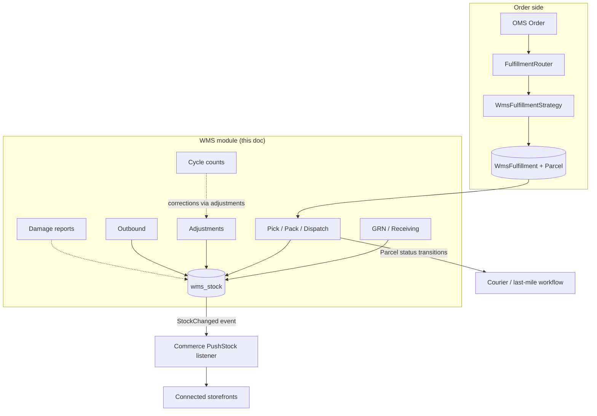
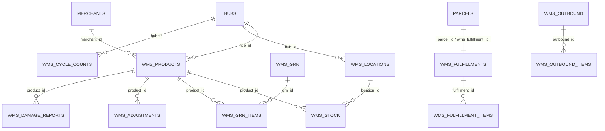
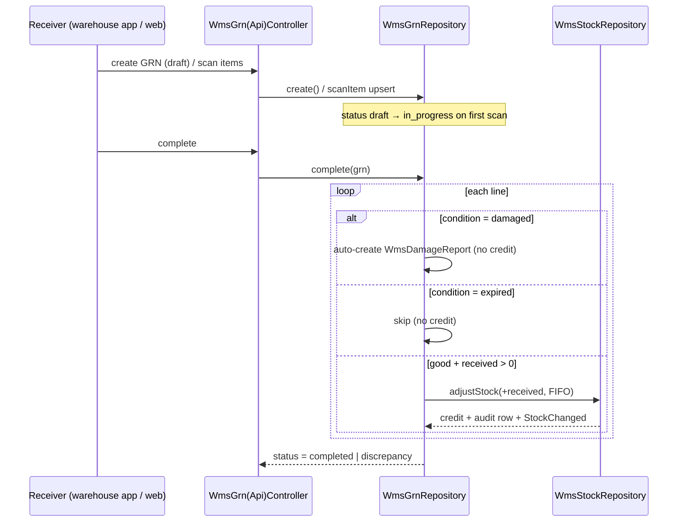
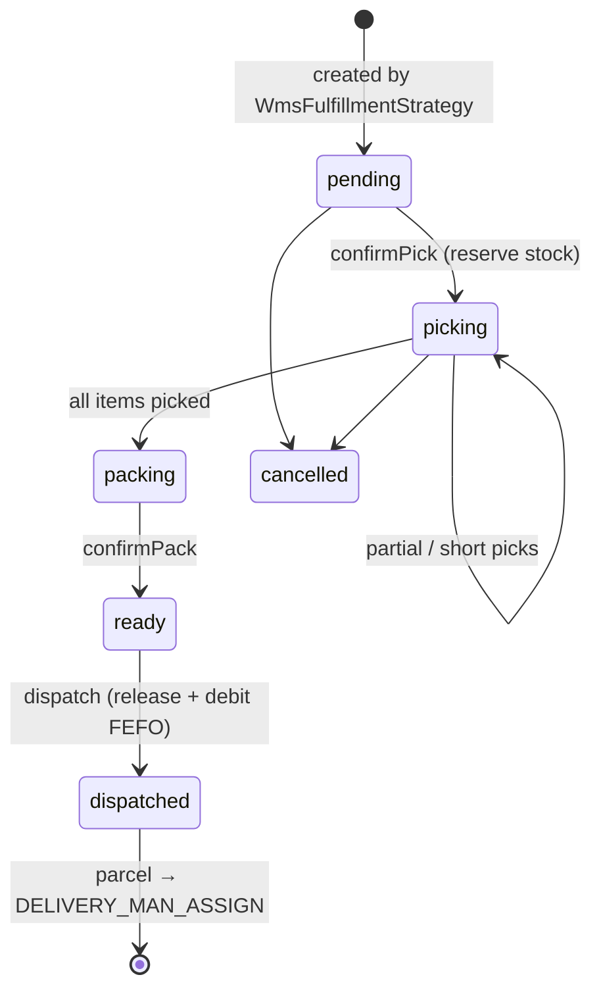

# WMS — Warehouse Management

> **Module roots:** `app/Wms/` (observer + event) · `app/Models/Backend/Wms/*` (models) · `app/Enums/Wms/*` (enums) · `app/Repositories/Wms/*` (business logic) · `app/Http/Controllers/Backend/Wms/*` (admin web) · `app/Http/Controllers/Api/V10/Wms/*` + `AdminWmsController` (mobile API) · `app/Exceptions/Wms/InsufficientStockException.php`
> **Migrations:** `database/migrations/2026_05_23_100000…100012_*` (12 tables + one `parcels` alter)
> **Flutter client:** `rushly-warehouse-app` (`lib/features/wms`, `lib/features/fulfillment`)
> **Status:** Built and wired end-to-end (admin web + mobile API + Flutter). Internally described as **Phase 2** (Products/Locations/Stock) building up to **Phase 7** (inventory sync fan-out). See [§14 Maturity & Status](#14-maturity--status).
>
> `rushly-saas` is the **single source of truth**; the warehouse Flutter app is a thin client. This doc goes deeper on the WMS slice than the numbered reference docs — cross-link, don't duplicate: [`../06-Database.md`](../06-Database.md) · [`../12-Workflows.md`](../12-Workflows.md) · [`../13-User-Journeys.md`](../13-User-Journeys.md) · [`../08-Flutter.md`](../08-Flutter.md) · [`../09-API.md`](../09-API.md) · [`../11-Modules.md`](../11-Modules.md) · [`../14-Integrations.md`](../14-Integrations.md). Sibling module docs: [`fulfillment.md`](fulfillment.md), [`oms-orders.md`](oms-orders.md), [`commerce-integrations.md`](commerce-integrations.md), [`parcels.md`](parcels.md). Read [`_CONTEXT_BRIEF.md`](../_CONTEXT_BRIEF.md) first.
>
> Every non-trivial claim cites a real source file. Where an existing doc conflicts with code, a **⚠️ Doc vs Code** note flags it — **code wins**.

---

## 1. Purpose

The WMS module turns a Rushly hub into a real **warehouse**: it tracks physical inventory (products, storage locations, per-location/per-batch stock) and runs the four warehouse workflows — **inbound receiving (GRN)**, **outbound fulfillment (pick / pack / dispatch)**, **stock hygiene (adjustments, cycle counts, damage)**, and **ad-hoc outbound** (transfers, returns, manual issues).

It is the bridge between two worlds:

- **Upstream (orders):** the OMS + Fulfillment layer materialises a storefront order into a `Parcel` and a `WmsFulfillment` row (see `app/Fulfillment/Strategies/WmsFulfillmentStrategy.php`). WMS then does the physical pick/pack and hands the parcel back to the courier/last-mile workflow by transitioning the `Parcel` status.
- **Downstream (inventory):** every stock mutation fires a `StockChanged` event that the Commerce layer fans out to connected storefronts (`app/Wms/Events/StockChanged.php` → `app/Commerce/Listeners/PushStockToConnectedChannelsListener.php`), so a sale on the warehouse floor decrements the merchant's Salla/Zid catalogue.

Everything is **multi-tenant** (`company_id` on every table) and, orthogonally, **hub-scoped** (each product/location belongs to a `hub`) — so a single tenant can run several physical warehouses.

### Where it sits



---

## 2. Responsibilities

| # | Responsibility | Owned by |
|---|---|---|
| 1 | Master data: products (SKU/barcode/unit/reorder point) and storage locations (zone→aisle→rack→shelf→bin) | `WmsProductRepository`, `WmsLocationRepository` |
| 2 | Authoritative on-hand + reserved stock, per location and per batch/lot/expiry | `WmsStockRepository`, `wms_stock` table |
| 3 | The single FIFO/FEFO/LIFO credit-and-debit engine every workflow routes through | `WmsStockRepository::adjustStock()` |
| 4 | Inbound receiving with expected-vs-received discrepancy detection and condition handling | `WmsGrnRepository` |
| 5 | Outbound fulfillment lifecycle (reserve → pick → pack → dispatch) tied to a `Parcel` | `WmsFulfillmentRepository` |
| 6 | Ad-hoc outbound: manual issue, inter-hub transfer, return-to-merchant | `WmsOutboundRepository` |
| 7 | Auditable manual adjustments with a **dual-approval gate** at ≥20% change | `WmsAdjustmentRepository` |
| 8 | Cycle counts (zone / aisle / full-hub) | `WmsCycleCountRepository` |
| 9 | Damage reporting (with photos) + auto-logging of damaged receipts | `WmsDamageController`, `WmsGrnRepository::complete()` |
| 10 | Fire `StockChanged` so downstream inventory sync stays current | `WmsStockObserver` |

**Explicitly NOT in scope:** courier assignment / last-mile (handled by the parcel workflow once `dispatch()` runs), storefront credentials + outbound HTTP (Commerce module), order normalisation (OMS). WMS never talks to a storefront directly — it only emits the event.

---

## 3. Domain model & enums

### 3.1 Models (`app/Models/Backend/Wms/`)

| Model | Table | Key traits | Notes |
|---|---|---|---|
| `WmsProduct` | `wms_products` | `SoftDeletes`, `LogsActivity`, `Companywise` | SKU-unique catalogue item. Belongs to `Merchant` + `Hub`. Computed accessors: `total_qty`, `reserved_qty`, `available_qty`; `isLowStock()` compares `total_qty <= reorder_point`. |
| `WmsLocation` | `wms_locations` | `LogsActivity`, `Companywise` | Physical bin. `buildCode()` auto-generates a `-`-joined uppercase `code` from zone/aisle/rack/shelf/bin. |
| `WmsStock` | `wms_stock` | `Companywise` (no activity log) | On-hand row keyed by (product, location, batch). `available = quantity − reserved_qty` (floored at 0). |
| `WmsGrn` | `wms_grn` | `SoftDeletes`, `LogsActivity`, `Companywise` | Goods-receipt header. `hasDiscrepancy()` compares expected vs received across items. |
| `WmsGrnItem` | `wms_grn_items` | — | Receipt line: expected/received qty, batch, expiry, `condition`. |
| `WmsFulfillment` | `wms_fulfillments` | `SoftDeletes`, `LogsActivity`, `Companywise` | Pick/pack job for one `Parcel`. `isSlaBreached()` = deadline past and not dispatched/cancelled. |
| `WmsFulfillmentItem` | `wms_fulfillment_items` | — | Line with `quantity_required`, `quantity_picked`, item `status` (`pending`/`short`/`picked`). |
| `WmsOutbound` | `wms_outbound` | `SoftDeletes`, `LogsActivity`, `Companywise` | Ad-hoc outbound header (`type` + optional `fulfillment_id` soft pointer). |
| `WmsOutboundItem` | `wms_outbound_items` | — | Outbound line (qty + optional batch). |
| `WmsAdjustment` | `wms_adjustments` | `LogsActivity`, `Companywise` | Audit row for every stock change. `percent_change` accessor drives the dual-approval gate. |
| `WmsCycleCount` | `wms_cycle_counts` | `LogsActivity`, `Companywise` | Count session (scope zone/aisle/full). |
| `WmsDamageReport` | `wms_damage_reports` | `LogsActivity`, `Companywise` | Damage record with JSON `photos[]`. |

The `Companywise` trait (`app/Models/Backend/Wms/Concerns/Companywise.php`) adds `scopeCompanywise()` = `where(table.company_id, settings()->id)`, mirroring the existing `Parcel`/`Merchant` scoping so `WmsProduct::companywise()->…` reads identically across the codebase.

### 3.2 Enums (`app/Enums/Wms/` — PHP `interface` constants, not backed enums)

| Enum | Constants | Used for |
|---|---|---|
| `GrnStatus` | `draft`, `in_progress`, `completed`, `discrepancy` | GRN header lifecycle |
| `ItemCondition` | `good`, `damaged`, `expired` | GRN line condition (drives credit/skip on complete) |
| `FulfillmentStatus` | `pending`, `picking`, `packing`, `ready`, `dispatched`, `cancelled` | Fulfillment lifecycle |
| `PickingStrategy` | `FIFO`, `FEFO`, `LIFO` | Stock debit ordering |
| `OutboundType` | `fulfillment`, `manual`, `transfer`, `return_to_merchant` | Ad-hoc outbound classification |
| `AdjustmentReason` | `damage`, `count_correction`, `expiry`, `theft`, `system_error`, `other` | Adjustment audit reason |
| `LocationType` | `standard`, `bulk`, `cold`, `hazmat` | Storage location type |
| `ProductUnit` | `piece`, `box`, `kg`, `liter`, `pallet` | Product UoM |

> **Note:** `FulfillmentItem.status` (`pending`/`short`/`picked`), `WmsAdjustment.approval_status` (`approved`/`pending_approval`/`rejected`), damage `cause`/`action_taken`, and outbound `status` (`pending`/`processing`/`completed`/`cancelled`) are **string literals in code**, not enum classes — validated inline in controllers/repositories rather than centralised.

See [`../06-Database.md`](../06-Database.md) for the full schema catalogue; the WMS ERD below goes deeper on this slice.

### 3.3 ERD



---

## 4. Database tables

All 12 tables were created in one dated batch (`2026_05_23_100000`–`100012`).

| Table | Migration | Salient columns / constraints |
|---|---|---|
| `wms_products` | `100000` | `sku` UNIQUE, `merchant_id`/`hub_id` FKs, `dimensions` JSON, `weight` decimal(8,3), `reorder_point`, `track_expiry`, `is_active`, softDeletes; index `(company_id, merchant_id)` |
| `wms_locations` | `100001` | `code` UNIQUE, `zone`/`aisle` nullable, `rack`/`shelf` required, `type` default `standard`, `capacity` nullable; index `(company_id, hub_id)` |
| `wms_stock` | `100002` | `quantity`, `reserved_qty` (both `unsignedInteger` default 0), `batch_number`/`lot_number`/`expiry_date`; **UNIQUE `(product_id, location_id, batch_number)`** (`wms_stock_product_loc_batch_uq`) |
| `wms_grn` | `100003` | `grn_number` UNIQUE, `status` default `draft`, `received_by` FK, `received_at`, softDeletes; index `(company_id, status)` |
| `wms_grn_items` | `100004` | `expected_qty`, `received_qty`, `batch_number`, `expiry_date`, `condition` default `good` |
| `wms_fulfillments` | `100005` | `fulfillment_number` UNIQUE, `parcel_id` FK, `picker_id`/`packer_id` nullable FKs, `picked_at`/`packed_at`/`dispatched_at`/`sla_deadline`, softDeletes; index `(company_id, status)` |
| `wms_fulfillment_items` | `100006` | `quantity_required`, `quantity_picked` default 0, `status` default `pending` |
| `wms_outbound` | `100007` | `outbound_number` UNIQUE, `type`, `fulfillment_id` **`unsignedBigInteger` nullable (no FK — soft pointer)**, `processed_by` FK, softDeletes; indexes `(company_id, status)`, `fulfillment_id` |
| `wms_outbound_items` | `100008` | `quantity`, `batch_number` nullable |
| `wms_adjustments` | `100009` | `quantity_before/after/change` (signed `integer`), `reason`, `reference`, `photo`, `approval_status` default `approved`, `approved_by` nullable FK, `approved_at`; index `(company_id, product_id)` |
| `wms_cycle_counts` | `100010` | `count_number` UNIQUE, `scope`, `zone` nullable, `status` **default `open`** (⚠️ see below), `started_at`/`completed_at` |
| `wms_damage_reports` | `100011` | `quantity_damaged`, `cause`, `photos` JSON, `action_taken` nullable; index `(company_id, product_id)` |
| `parcels` (alter) | `100012` | adds nullable `wms_fulfillment_id` + index — the reverse pointer from a parcel to its fulfillment |

> **⚠️ Doc vs Code (minor):** the `wms_cycle_counts.status` column defaults to `open` in the migration (`100010`), but `WmsCycleCountController::index()` / `create()` only ever surface `open → in_progress → completed`. There is no enum class for cycle-count status; `open` is the implicit initial state.

---

## 5. Services / business logic (repositories)

WMS deliberately uses the **repository pattern** rather than an `app/Wms/Services/` folder — all business logic lives in `app/Repositories/Wms/*`, bound interface→implementation in `app/Providers/AppServiceProvider.php` (lines ~123–130). Controllers stay thin and depend on the interfaces.

### 5.1 `WmsStockRepository` — the stock engine (the most important class)

`adjustStock(productId, locationId, delta, strategy = FEFO, context)` is the **single mutation path** every workflow funnels through. In one DB transaction it:

- **delta > 0 → `credit()`**: finds the `(product, location, batch)` row `lockForUpdate()`, creates it if absent, else increments `quantity` (and refreshes expiry metadata if provided).
- **delta < 0 → `debit()`**: pulls all rows at that product+location `lockForUpdate()`, orders them by strategy, checks aggregate availability, throws `InsufficientStockException` if short, then draws down row-by-row.
- writes a **`WmsAdjustment` audit row** (`approval_status = approved`) capturing before/after/change/reason/reference.

**Picking-strategy ordering** (`debit()`):

| Strategy | SQL ordering |
|---|---|
| `FIFO` | `orderBy('id')` (oldest row first) |
| `LIFO` | `orderByDesc('id')` |
| `FEFO` (default) | `orderByRaw('expiry_date IS NULL, expiry_date ASC, id ASC')` — soonest-to-expire first, nulls last |

Reservation is separate from on-hand:
- `reserve(product, location, qty)` — `lockForUpdate()`, throws `InsufficientStockException` if `(quantity − reserved_qty) < qty`, else bumps `reserved_qty`.
- `release(product, location, qty)` — decrements `reserved_qty` (floored at 0).
- `onHand(product)` = `SUM(quantity)`; `available(product)` = `SUM(quantity) − SUM(reserved_qty)` across all locations.

> **Design note (from code comments):** because auto-approved adjustments also route through `adjustStock()`, which itself writes an audit row, a manual auto-approved adjustment produces a small duplicate audit trail. The authors chose this on purpose to keep **one** FIFO/FEFO codepath (`WmsAdjustmentRepository::submit()` comment).

### 5.2 `WmsGrnRepository`

- `create(data, items)` — header + `WmsGrnItem` lines in a transaction, `status = draft`, auto `grn_number` = `GRN-{year}-{00001}`.
- `complete(grn)` — the crediting step, per line:
  - `condition = damaged` & received>0 → **auto-creates a `WmsDamageReport`** (`cause = transit_damage`, note references the GRN), does **not** credit stock.
  - `condition = expired` & received>0 → skipped (not credited).
  - otherwise received>0 → `stock->adjustStock(+received, FIFO, …)` with batch/expiry/reference `GRN <number>`.
  - sets header to `discrepancy` if any line's expected ≠ received, else `completed`; stamps `received_at`.

### 5.3 `WmsFulfillmentRepository`

The outbound-order lifecycle. Key methods:

- `create(data, items)` — inserts fulfillment (`pending`) + items, sets `sla_deadline = now + slaHours()` (config `wms_sla_hours`, default **24h**), transitions the linked `Parcel` to `WMS_FULFILLMENT_PENDING`, writes a `ParcelEvent`, and stamps `parcels.wms_fulfillment_id`.
- `confirmPick(f, userId, picks[itemId=>qty])` — on first entry **reserves** stock for every item (short picks swallowed), flips `pending→picking`, sets `picker_id`, transitions parcel to `WMS_PICKING`; applies each pick (`picked`/`short`); when all items `picked` → `packing` + `picked_at` + parcel `WMS_PACKING`.
- `confirmPack(f, userId)` — `packer_id` + `packed_at`, `packing→ready`, parcel `WMS_READY_TO_SHIP`.
- `dispatch(f)` — for each picked item: `release()` the reservation, then `adjustStock(−picked, FEFO, …)` to actually debit; sets `dispatched`, `dispatched_at`; transitions parcel to `DELIVERY_MAN_ASSIGN` — **the hand-off out of WMS into the courier workflow**.
- `breachedSla()` — non-terminal fulfillments with `sla_deadline < now`.

Parcel status constants used (`app/Enums/ParcelStatus.php`): `WMS_FULFILLMENT_PENDING = 37`, `WMS_PICKING = 38`, `WMS_PACKING = 39`, `WMS_READY_TO_SHIP = 40`, then `DELIVERY_MAN_ASSIGN`.

### 5.4 `WmsAdjustmentRepository` — dual-approval gate

`DUAL_APPROVAL_THRESHOLD = 0.20`. `submit(data)` computes `pct = |change| / before`; if `pct ≥ 20%` the row is saved `pending_approval` and **stock is NOT changed**; otherwise `approved` and applied immediately via `applyChange()` (→ `adjustStock(FEFO)`).
- `approve(a, approverId)` — refuses if the approver is the original adjuster (`throw RuntimeException` "the adjuster cannot also approve"), then applies the change.
- `reject(a, approverId, note)` — sets `rejected`, appends the note.

### 5.5 `WmsOutboundRepository`

`create()` (status `pending`, auto `OUT-{year}-{n}`) then `complete()` debits each line via `adjustStock(−qty, FEFO, …)` (may throw `InsufficientStockException`), sets `completed` + `completed_at`.

### 5.6 `WmsCycleCountRepository` / `WmsLocationRepository` / `WmsProductRepository`

- Cycle count: `create` / `start` (`in_progress` + `started_at`) / `complete` (`completed` + `completed_at`). Counting is currently a **procedural session** — the entered counts do not auto-post variances; corrections are made through the adjustments workflow.
- Location: CRUD + `buildCode()` auto-generation + `tree(hubId)` → `[zone][aisle][] = location` for the map view.
- Product: CRUD + `findBySku()` / `findByBarcode()` (used by the scanner API) + `lowStock()` (loads products and filters via `isLowStock()`).

---

## 6. Controllers

### 6.1 Admin web (Inertia/React) — `app/Http/Controllers/Backend/Wms/`

All under route prefix `wms.` and gated by `hasPermission:wms_manage` (see [§10](#10-permissions)). They render `Inertia::render('Admin/Wms/…')` pages and share the `RendersInertiaIndex` concern (`paginateMeta`, `indexLabels`, `lookupRows`).

| Controller | Responsibility | Notable actions |
|---|---|---|
| `WmsDashboardController` | KPI cards, 7-day movement chart, fulfillment-status breakdown, low-stock/expiring/SLA-breach panels | `index` |
| `WmsProductController` | Product CRUD, printable **barcode** (milon/barcode C128), stock summary on show | `index/create/store/show/edit/update/destroy/barcode` |
| `WmsLocationController` | Location CRUD + **map view** (zone→aisle tree) | `index/map/create/store/edit/update/destroy` |
| `WmsStockController` | Read-only stock browser + **CSV export** (streamed, chunked) | `index/export` |
| `WmsGrnController` | Receiving: create draft with line items, `complete` to credit stock | `index/create/store/show/complete/destroy` |
| `WmsFulfillmentController` | Pick/pack/dispatch UI (blade `show`/`picking` views); one item at a time in location-code order | `index/show/picking/confirmPick/confirmPack/dispatchOrder` |
| `WmsOutboundController` | Ad-hoc outbound create + `complete` (deduct stock) | `index/create/store/show/complete` |
| `WmsAdjustmentController` | Submit adjustment, approve/reject, `lookup-qty` JSON helper | `index/create/store/show/approve/reject/lookupQty` |
| `WmsCycleCountController` | Create/start/complete counts; show renders a count sheet of in-scope stock | `index/create/store/show/update` |
| `WmsDamageController` | Log damage with multiple photos | `index/create/store/show` |
| `WmsKnowledgeBaseController` | In-app KB with uploadable screenshots (normalised to PNG via GD), gated by `knowledge_base_update` | `index/uploadScreenshot/deleteScreenshot` |

> **Mixed rendering:** index/create pages are React/Inertia, but several **show/detail pages still render Blade** (`view('backend.wms.grn.show')`, `.fulfillment.show`, `.fulfillment.picking`, `.locations.show/edit`, `.outbound.show`, `.adjustments.show`, `.damage.show`, `.cycle_counts.show`). This is a live Blade→React migration (see repo `docs/inertia/`).

### 6.2 Mobile API (Sanctum) — `app/Http/Controllers/Api/V10/`

Two surfaces, both under `Route::middleware('auth:sanctum')` in `routes/api.php`:

**`Wms/*` — shared scanner/picker endpoints** (`prefix('wms')`):

| Method + path | Controller | Purpose |
|---|---|---|
| `GET /wms/products/lookup?barcode=|sku=` | `WmsProductApiController@lookup` | Identify a product on scan; returns on-hand/available |
| `GET /wms/stock/{productId}` | `WmsStockApiController@show` | Real-time per-location stock rows |
| `POST /wms/grn/{grn}/scan` | `WmsGrnApiController@scanItem` | Receiver scans a line (upsert by product+location+batch); moves GRN `draft→in_progress` |
| `POST /wms/grn/{grn}/complete` | `WmsGrnApiController@complete` | Finalise GRN (credit + discrepancy flags) |
| `GET /wms/fulfillment/my-tasks` | `WmsFulfillmentApiController@myTasks` | Picker queue (pending/picking, mine or unassigned), SLA-ordered, with `next_item` |
| `POST /wms/fulfillment/{id}/pick` | `…@confirmPick` | Record `{item_id, picked_qty}` |
| `POST /wms/fulfillment/{id}/pack` | `…@confirmPack` | packing→ready (409 if not packing) |
| `GET /wms/fulfillment/ready-to-dispatch` | `…@readyToDispatch` | Hand-off queue |
| `POST /wms/fulfillment/{id}/dispatch` | `…@confirmDispatch` | ready→dispatched (409 if not ready) |
| `POST /wms/adjustments` | `WmsAdjustmentApiController@store` | Submit adjustment (returns `requires_approval`) |

> `confirmDispatch` is named to avoid colliding with the framework's inherited `Controller::dispatch($job)` — a fatal-on-load if signatures differ (documented in the controller).

**`Admin/AdminWmsController` — warehouse-manager overview** (`prefix('v10/admin')` → `CheckApiKey` + `auth:sanctum` + `CheckAdminRole`):

| Path | Purpose |
|---|---|
| `GET /admin/wms/grns` | Open GRNs (draft/in_progress) with expected/received totals, hub-scoped |
| `GET /admin/wms/locations` | Location list |
| `GET`/`POST /admin/wms/cycle-counts` | List / open a cycle count |
| `GET`/`POST /admin/wms/damage-reports` | List / log damage |

All API responses use the shared `ApiReturnFormatTrait` (`responseWithSuccess`/`responseWithError`). See [`../09-API.md`](../09-API.md).

---

## 7. Key workflows

### 7.1 Inbound — GRN receiving



### 7.2 Outbound — fulfillment pick/pack/dispatch



Each transition also moves the linked `Parcel` (`ParcelStatus` 37→40 then `DELIVERY_MAN_ASSIGN`) and writes a `ParcelEvent` — so the merchant/customer tracking timeline reflects warehouse progress. See [`../12-Workflows.md`](../12-Workflows.md) and [`fulfillment.md`](fulfillment.md).

### 7.3 Stock hygiene — adjustment with dual approval

```mermaid
flowchart TD
    A[Submit adjustment: quantity_after] --> B{|change| / before ≥ 20%?}
    B -- No --> C[approved → adjustStock applied immediately]
    B -- Yes --> D[pending_approval → stock unchanged]
    D --> E{Second user approves?}
    E -- approve (≠ adjuster) --> C
    E -- reject --> F[rejected, stock unchanged]
    E -- adjuster tries to approve --> G[RuntimeException blocked]
```

---

## 8. Downstream integration — StockChanged inventory sync

`WmsStock::observe(WmsStockObserver::class)` is registered in `app/Providers/EventServiceProvider.php` (boot, line ~77). The observer fires on `created`/`updated` (only when `quantity` changed)/`deleted`, recomputes the product's **total across all locations**, skips inactive products, and dispatches `App\Wms\Events\StockChanged` carrying `companyId, productId, sku, merchantId, previousQuantity, newQuantity, reason`.

`EventServiceProvider::$listen` maps `StockChanged → PushStockToConnectedChannelsListener` (Commerce, Phase 7), which fans out `PushStockJob`s to every active `CommerceConnection` whose provider implements `SupportsInventorySync` (`app/Commerce/Contracts/SupportsInventorySync.php`; Salla is the wired provider).

> **Behavioural detail (documented in `StockChanged`):** the storefront is pushed **total on-hand**, not `total − reserved` — an intentional "aggressive availability" tradeoff the authors flagged for a future Phase 7.5 revisit. `previousQuantity` is `null` on inserts. `reason` is a diagnostics hint only, never used for logic.

See [`commerce-integrations.md`](commerce-integrations.md) and [`../14-Integrations.md`](../14-Integrations.md).

---

## 9. Flutter warehouse app (`rushly-warehouse-app`)

A thin Riverpod + Dio client. It **owns no business logic** — every action is an API call to the endpoints in [§6.2](#62-mobile-api-sanctum). Four bottom-nav tabs (`lib/features/dashboard/presentation/home_shell.dart`):

| Tab | Screen | Backs onto |
|---|---|---|
| **Receive** | `ReceiveTab` → `grn_list_screen` / `grn_scan_screen` | `GET /admin/wms/grns`, `POST /wms/grn/{id}/scan`, `/complete` |
| **Pick & Pack** | `PickPackTab` → `fulfillment_task_screen` | `GET /wms/fulfillment/my-tasks`, `POST …/pick`, `…/pack` |
| **Inventory** | `InventoryTab` → `stock_lookup_screen`, `adjustment_sheet`, `cycle_count_screen`, `damage_reports_screen` | `products/lookup`, `stock/{id}`, `POST /wms/adjustments`, cycle-counts, damage-reports |
| **Dispatch** | `DispatchTab` | `GET /wms/fulfillment/ready-to-dispatch`, `POST …/dispatch` |

Endpoint constants: `lib/core/api/api_endpoints.dart`. Data layer: `lib/features/wms/data/wms_repository.dart` and `lib/features/fulfillment/data/fulfillment_repository.dart` (providers: `wmsGrnsProvider`, `myFulfillmentTasksProvider`, `readyToDispatchProvider`, etc.). Domain DTOs in `…/domain/wms_models.dart` and `fulfillment_task.dart`.

The same scanner endpoints are also consumed by `rushly-admin-app` (which has a `wms` feature) and the universal `rushly-scanner-app`. See [`../08-Flutter.md`](../08-Flutter.md) and the app-specific notes in [`../apps`](../apps).

---

## 10. Dependencies

**Inbound (who drives WMS):**
- **Fulfillment / OMS** — `WmsFulfillmentStrategy` (`app/Fulfillment/Strategies/`) materialises an OMS `Order` into a `Parcel` + `WmsFulfillment` (status `pending`, `hub_id` may be null → warehouse assigns on pick). `SallaWmsFulfillmentService` is the Salla-specific path.

**WMS depends on (internal):**
- `Hub`, `Merchant`, `User`, `Parcel`, `ParcelEvent`, `Config` (for `wms_sla_hours`), `App\Enums\ParcelStatus`, `ParcelInterface` (parcel status transitions), `MerchantInterface`, `HubInterface`.
- `settings()` helper for tenant `company_id`; `hasPermission()` helper for gating.

**Outbound (who WMS drives):**
- **Commerce** — via `StockChanged` (loose coupling; no compile-time dependency the other way).
- **Courier / last-mile** — indirectly, by transitioning `Parcel` to `DELIVERY_MAN_ASSIGN` on dispatch.

**Third-party libs:** `milon/barcode` (product barcode PNG), `maatwebsite/excel`-adjacent CSV via raw `fputcsv` (stock export uses streamed CSV, not the Excel lib), `spatie/laravel-activitylog` (audit).

---

## 11. Notifications

**No WMS-specific notification classes exist** — searches of `app/Notifications/` and the WMS repositories/controllers return nothing (`grep` for `PushNotification`/`Notification::` in `app/Repositories/Wms` and `app/Http/Controllers/Backend/Wms` = no hits). User feedback is delivered two ways:

1. **In-web toasts** (`Brian2694\Toastr`) — success/warning/error after every web action (e.g. "Large change (≥20%) — a second supervisor must approve", "GRN completed. Stock credited.", "Dispatched. Parcel handed off to courier workflow.").
2. **Parcel-side events** — dispatch transitions the parcel, which flows into the **existing parcel notification pipeline** (SMS/push on status change) owned by the parcel/courier modules, not WMS.

Customer/merchant push therefore happens **downstream** of WMS via the parcel workflow, not from WMS directly. *Not found in the current codebase:* any dedicated low-stock / SLA-breach / pending-approval push alert (these surface only on the web dashboard panels).

---

## 12. Permissions

Defined in `database/seeders/PermissionSeeder.php` (`'wms'` block, ~line 433):

| Permission | Seeded | Enforced where |
|---|---|---|
| `wms_manage` | ✅ | **The only gate actually used** — `Route::prefix('wms')->middleware('hasPermission:wms_manage')` guards the entire admin web module; controllers also check `hasPermission('wms_manage')` for create/update/delete button visibility |
| `wms_products` | ✅ (seeded) | *Not referenced in routes/controllers* — reserved for finer-grained future use |
| `wms_receiving` | ✅ (seeded) | *Not referenced* |
| `wms_fulfillment` | ✅ (seeded) | *Not referenced* |
| `wms_adjustments` | ✅ (seeded) | *Not referenced* |
| `wms_reports` | ✅ (seeded) | *Not referenced* |
| `knowledge_base_update` | (shared) | KB screenshot upload/delete routes only |

> **⚠️ Doc vs Code:** the seeder advertises six granular WMS permissions, but the codebase currently enforces only `wms_manage` (plus `knowledge_base_update`). The finer-grained permissions are placeholders. The **mobile API endpoints are gated only by `auth:sanctum`** (+ `CheckApiKey`/`CheckAdminRole` for the `/admin` surface) — there is no per-permission check on the scanner/picker endpoints. See [`../10-Authentication.md`](../10-Authentication.md) / [`../17-Security.md`](../17-Security.md).

---

## 13. Business rules (quick reference)

- **Tenant + hub isolation:** every query is `companywise()`; products/locations are hub-scoped.
- **One mutation path:** all stock changes go through `WmsStockRepository::adjustStock()` → guarantees an audit row + `StockChanged` event.
- **Batch/expiry granularity:** stock is unique per `(product, location, batch_number)`; FEFO uses `expiry_date` ordering (nulls last).
- **Reservation ≠ deduction:** picking *reserves*; dispatch *releases then debits*. Availability = `quantity − reserved_qty`.
- **GRN condition handling:** damaged→auto damage report (no credit); expired→no credit; good→credit.
- **Discrepancy:** any expected ≠ received flips the GRN to `discrepancy` (not a hard error — stock for received good units is still credited).
- **Dual approval:** manual adjustments of ≥20% require a *different* second user to approve before stock moves.
- **SLA:** `wms_sla_hours` config (default 24h) sets `sla_deadline`; breach = non-terminal + past deadline, surfaced on dashboard and `my-tasks`.
- **Numbering:** `GRN-YYYY-#####`, `FUL-YYYY-#####`, `OUT-YYYY-#####`, `CC-YYYY-#####` (per-tenant per-year counts). *The Fulfillment strategy path uses a different `WMS-YYYYMMDD-<hex>` format* (`WmsFulfillmentStrategy::generateFulfillmentNumber()`) — a minor inconsistency with the repository's `FUL-` scheme.

---

## 14. Maturity & Status

**Built and functional end-to-end** — models, migrations, repositories, admin web UI, mobile API, and the Flutter warehouse app are all present and wired. Internal phase markers place it as **Phase 2** (products/locations/stock) through **Phase 7** (StockChanged inventory fan-out, live).

**Solid:**
- Transactional, lock-guarded stock engine with FIFO/FEFO/LIFO, batch/expiry, reservations, and a full audit trail.
- Complete inbound/outbound/adjustment/cycle-count/damage flows with sensible business rules.
- Downstream inventory sync to storefronts via events (decoupled).

**Rough edges / gaps (from code):**
- **Blade↔React split** on detail pages (mid-migration).
- **Granular permissions seeded but unenforced** (only `wms_manage` gates anything); mobile API has no per-action permission.
- **Cycle counts don't auto-post variances** — the count session is procedural; corrections happen through adjustments manually.
- **GRN line editing after creation is a no-op** (`edit`/`update` redirect to show; noted as a future enhancement in `WmsGrnController`).
- **Availability pushed to storefronts is on-hand, not on-hand-minus-reserved** — flagged for Phase 7.5.
- **Two fulfillment-number formats** (`FUL-…` vs `WMS-…`) depending on creation path.
- `WmsStockController::index()` has a `low_only` filter branch that is currently a **no-op** (empty `if` block).
- **Duplicate audit rows** for auto-approved manual adjustments (accepted tradeoff for a single stock codepath).
- No WMS-native notifications (see [§11](#11-notifications)).

### Future improvements (suggested)
- Enforce the granular `wms_*` permissions (web + API) and add per-role scoping to scanner endpoints.
- Auto-generate variance adjustments from completed cycle counts.
- Editable GRN lines pre-completion; partial-receipt receiving.
- Make storefront-pushed availability configurable (on-hand vs sellable).
- Unify fulfillment numbering.
- Low-stock / SLA-breach / pending-approval push alerts to supervisors.
- Finish the Blade→React migration for detail pages.

---

## Sources

**Backend — models/enums/events:**
- `app/Models/Backend/Wms/*.php` (all 11 models + `Concerns/Companywise.php`)
- `app/Enums/Wms/*.php` (8 enums)
- `app/Wms/Events/StockChanged.php`, `app/Wms/Observers/WmsStockObserver.php`
- `app/Exceptions/Wms/InsufficientStockException.php`
- `app/Enums/ParcelStatus.php` (WMS_* constants)

**Backend — logic/controllers/wiring:**
- `app/Repositories/Wms/*.php` (Stock, Grn, Fulfillment, Outbound, Adjustment, CycleCount, Location, Product + interfaces)
- `app/Http/Controllers/Backend/Wms/*.php` (11 controllers + `Concerns/RendersInertiaIndex.php`)
- `app/Http/Controllers/Api/V10/Wms/*.php` (5 API controllers) + `app/Http/Controllers/Api/V10/Admin/AdminWmsController.php`
- `app/Fulfillment/Strategies/WmsFulfillmentStrategy.php`
- `app/Providers/AppServiceProvider.php` (repo bindings, observers), `app/Providers/EventServiceProvider.php` (StockChanged listener + observer)
- `app/Commerce/Listeners/PushStockToConnectedChannelsListener.php`, `app/Commerce/Contracts/SupportsInventorySync.php`, `app/Commerce/Jobs/PushStockJob.php`

**Database & routes:**
- `database/migrations/2026_05_23_100000…100012_*.php` (12 files)
- `database/seeders/PermissionSeeder.php` (`wms` block)
- `routes/web.php` (`wms.*` group), `routes/api.php` (`/wms/*` + `/admin/wms/*`)

**Flutter (`rushly-warehouse-app`):**
- `lib/core/api/api_endpoints.dart`
- `lib/features/wms/data/wms_repository.dart`, `lib/features/wms/domain/wms_models.dart`, `lib/features/wms/presentation/*`
- `lib/features/fulfillment/data/fulfillment_repository.dart`, `lib/features/fulfillment/presentation/*`
- `lib/features/dashboard/presentation/home_shell.dart`

**Cross-referenced docs:** [`../06-Database.md`](../06-Database.md), [`../08-Flutter.md`](../08-Flutter.md), [`../09-API.md`](../09-API.md), [`../11-Modules.md`](../11-Modules.md), [`../12-Workflows.md`](../12-Workflows.md), [`../13-User-Journeys.md`](../13-User-Journeys.md), [`../14-Integrations.md`](../14-Integrations.md), [`fulfillment.md`](fulfillment.md), [`commerce-integrations.md`](commerce-integrations.md), [`oms-orders.md`](oms-orders.md), [`parcels.md`](parcels.md).
