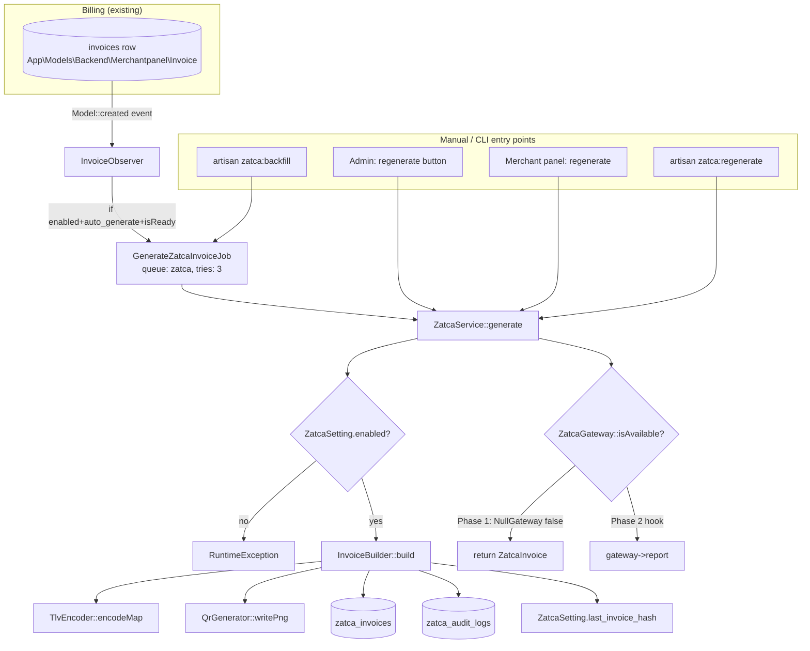
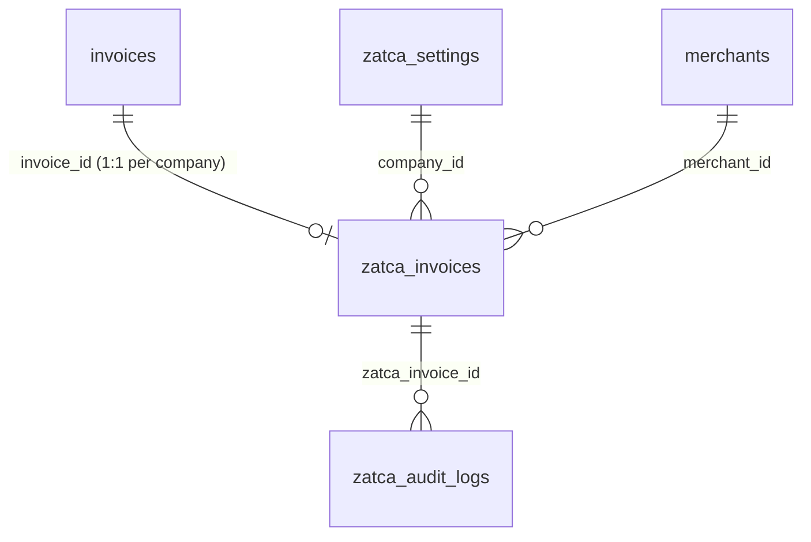

# ZATCA — Saudi E-Invoicing

> **Module scope:** Phase-1 (Generation) Saudi e-invoicing — TLV-encoded QR generation, per-tenant seller settings, an immutable invoice journal, and a forward-compatible gateway seam for Phase-2 (Integration/Clearance). Source of truth is `rushly-saas`; no Flutter client consumes this module yet.
>
> **Primary code:** `app/Services/Zatca/**`, `app/Enums/Zatca/*`, `app/Models/Backend/Zatca/*`, `app/Http/Controllers/Backend/Zatca/*` + `.../MerchantPanel/Zatca/*`.
>
> **Cross-links:** finance / billing integration → [../14-Integrations.md](../14-Integrations.md) §6; database → [../06-Database.md](../06-Database.md); module map → [../11-Modules.md](../11-Modules.md); API surface → [../09-API.md](../09-API.md); auth/permissions → [../10-Authentication.md](../10-Authentication.md); security → [../17-Security.md](../17-Security.md); accounting sibling → [../14-Integrations.md](../14-Integrations.md).

---

## 1. Purpose

ZATCA (Zakat, Tax and Customs Authority) mandates e-invoicing in Saudi Arabia. The regulation has two phases:

| Phase | Regulator name | What it requires | This module |
|---|---|---|---|
| **Phase 1** | *Generation* (Dec 2021) | Every tax invoice must carry a Base64 **TLV QR code** encoding seller name, VAT number, timestamp, total, and VAT total. Invoices stored electronically. | ✅ **Implemented** |
| **Phase 2** | *Integration / Clearance* | Cryptographically signed XML (UBL 2.1), CSID onboarding, live clearance (Standard/B2B) or 24 h reporting (Simplified/B2C) to ZATCA's Fatoora platform. | ⛔ **Not implemented** — only a seam (`ZatcaGateway` + `NullGateway`) exists |

This module derives a compliant Phase-1 artifact from Rushly's **existing merchant billing invoices** (`invoices` table, [../14-Integrations.md](../14-Integrations.md)) without disturbing the billing pipeline. It produces:

- A **TLV/Base64 QR payload** (`app/Services/Zatca/TlvEncoder.php`) rendered as PNG/SVG (`app/Services/Zatca/QrGenerator.php`).
- A persisted **`ZatcaInvoice`** journal row with VAT breakdown, sequence, and a **SHA-256 hash chain**.
- A printable **A4 PDF** (`resources/views/backend/admin/zatca/invoice_pdf.blade.php`).

> **⚠️ Doc vs Code — maturity.** The lang strings and comments describe this as *"Phase 1 — Generation"* and that is accurate: there is **no network call to ZATCA**, no XML signing, no CSID. `NullGateway::isAvailable()` always returns `false` (`app/Services/Zatca/Gateways/NullGateway.php:12`), so the Phase-2 `report()`/`clear()` hooks are never reached. The `xml_payload` and `pdf_path` columns exist but are never populated by the current builder.

---

## 2. Responsibilities & boundaries

**In scope (owned by this module):**
- Per-tenant ZATCA configuration (seller identity, VAT rate, numbering, mode).
- Deriving VAT subtotal/amount from a VAT-inclusive billing total.
- TLV encoding + QR image generation.
- Sequential ZATCA invoice numbering with a hash chain.
- An audit trail of every generate/regenerate/fail/settings-change.
- Admin (Inertia/React) and merchant-panel (Blade) UI surfaces.

**Out of scope (delegated / not built):**
- Source invoice creation → owned by the billing module (`App\Models\Backend\Merchantpanel\Invoice`).
- Live ZATCA submission, XML/UBL, digital signatures, CSID → Phase 2 (`ZatcaGateway` seam only).
- Accounting sync (Qoyod/Daftra/Odoo) → separate modules, see [../14-Integrations.md](../14-Integrations.md).
- Mobile display → **no Flutter app consumes ZATCA** (see §11).

---

## 3. Architecture at a glance



**Dependency-injection wiring** (`app/Providers/ZatcaServiceProvider.php`, registered in `config/app.php:184`):

```php
$this->app->singleton(ZatcaGateway::class, NullGateway::class);
$this->app->bind(ZatcaSettingRepositoryInterface::class, ZatcaSettingRepository::class);
$this->app->bind(ZatcaInvoiceRepositoryInterface::class, ZatcaInvoiceRepository::class);
// boot(): Invoice::observe(InvoiceObserver::class);
```

Swapping to Phase 2 requires only rebinding `ZatcaGateway` to a real implementation — no caller changes.

---

## 4. Services (`app/Services/Zatca/`)

### 4.1 `ZatcaService` — public facade
`app/Services/Zatca/ZatcaService.php`. The only entry point controllers, jobs and commands call. Constructor-injects `InvoiceBuilder` and `ZatcaGateway`.

| Method | Behaviour |
|---|---|
| `settingsFor(int $companyId): ZatcaSetting` | `firstOrCreate` a disabled, empty settings row for the company. |
| `generate(Invoice $source, array $opts = []): ZatcaInvoice` | Resolves `company_id` from the source (`$source->company_id ?? settings('company_id')`); **throws `RuntimeException` if `!$setting->enabled`**; delegates to `InvoiceBuilder::build`; if `gateway->isAvailable()` (Phase-2 only) calls `gateway->report()`. |
| `regenerate(ZatcaInvoice $zatca, array $opts = []): ZatcaInvoice` | Reloads the source `Invoice` and re-runs `generate()`. Throws if source is missing. |
| `markFailed(ZatcaInvoice $zatca, string $error): void` | Delegates to `InvoiceBuilder::markFailed`. |

### 4.2 `InvoiceBuilder` — orchestrator
`app/Services/Zatca/InvoiceBuilder.php`. Injects `TlvEncoder` + `QrGenerator`. All persistence runs inside a single `DB::transaction`. Key steps of `build()`:

1. **Guard:** `$setting->isReady()` or throw `RuntimeException`.
2. **Timestamp:** `CarbonImmutable::parse($opts['issued_at'] ?? $source->invoice_date ?? now())->utc()`.
3. **VAT split:** `splitVatInclusive($totalInclusive, $vatRate)` — treats `invoices.total_charge` as **VAT-inclusive** (see §6 business rules).
4. **Type:** `ZatcaInvoiceType::from($opts['type'])` else defaults to `Simplified` (B2C).
5. **Idempotency:** `ZatcaInvoice::firstOrNew(['company_id', 'invoice_id'])` — a source invoice maps to exactly one ZATCA row; re-running marks it `Regenerated`.
6. **Numbering:** reuses existing `invoice_number`/`sequence`, else `reserveInvoiceNumber()` (row-locked counter, see §6).
7. **TLV + QR:** `buildTlv()` → `TlvEncoder::encodeMap()` → `QrGenerator::writePng()` to `zatca/{company}/qr/{invoice_number}.png` on the `public` disk.
8. **Hash chain:** `hash = sha256((previous_hash ?? '') . qr_payload)`; then writes `hash` back to `ZatcaSetting.last_invoice_hash`.
9. **Persist** the `ZatcaInvoice`, then write a `ZatcaAuditLog` (`generated`/`regenerated`).

`splitVatInclusive(float $totalInclusive, float $vatRatePercent): array` (public, unit-testable):
```
$subtotal = round($totalInclusive / (1 + rate), 2);
$vat      = round($totalInclusive - $subtotal, 2);
```

### 4.3 `TlvEncoder` — Tag-Length-Value codec
`app/Services/Zatca/TlvEncoder.php`. Encodes `[tag => value]` to a Base64 blob per the ZATCA Phase-1 QR spec.

- **Phase-1 mandatory tags** (built in `InvoiceBuilder::buildTlv`):
  | Tag | Field | Value source |
  |---|---|---|
  | 1 | Seller name | `seller_name_ar` (fallback `seller_name_en`) or `$opts['seller_name_override']` |
  | 2 | VAT registration number | `ZatcaSetting.vat_number` (15 digits) |
  | 3 | Invoice timestamp | ISO-8601 UTC `Y-m-d\TH:i:s\Z` |
  | 4 | Invoice total (VAT-inclusive) | `number_format($totalInclusive, 2, '.', '')` |
  | 5 | VAT total | `number_format($vatAmount, 2, '.', '')` |
- `encodeLength()` supports 1-byte (≤0x7F), BER long-form `0x81` (≤0xFF) and `0x82` (≤0xFFFF) — **forward-compat for Phase-2 signature tags** which exceed 255 bytes.
- `decode(string $base64): array` reverses the process (used by tests).

### 4.4 `QrGenerator` — image rendering
`app/Services/Zatca/QrGenerator.php`. Wraps `Milon\Barcode\DNS2D` (dependency `milon/barcode`, per [_CONTEXT_BRIEF](../_CONTEXT_BRIEF.md)). Three renderers, all `QRCODE`, `storage_path('framework/barcodes/')` as scratch:

| Method | Output |
|---|---|
| `svg($payload, $size=4)` | inline SVG string (used by controllers `qr()` and PDF) |
| `writePng($payload, $relativePath, $size=4)` | writes PNG to `Storage::disk('public')`, returns relative path |
| `dataUri($payload, $size=4)` | `data:image/svg+xml;base64,…` for ``/PDF embed |

> Note: `ZatcaInvoice` also carries its own duplicate SVG renderer (`qrSvg()` / `qrDataUri()`), see §7.1.

### 4.5 Gateway seam (Phase-2 forward compat)
- `Contracts/ZatcaGateway` (`app/Services/Zatca/Contracts/ZatcaGateway.php`): `isAvailable()`, `clear()` (Standard→clearance), `report()` (Simplified→24 h reporting).
- `Contracts/GatewayResult` (`.../Contracts/GatewayResult.php`): immutable DTO `{success, referenceId, error, raw}`; `::noop()` returns success with *"Phase 1: no gateway integration"*.
- `Gateways/NullGateway` (`.../Gateways/NullGateway.php`): `isAvailable()` → `false`; `clear()`/`report()` → `GatewayResult::noop()`. Bound as the app-wide singleton today.

---

## 5. Data model & database

Three tables, migrated `2026_06_20_000001..3`. See [../06-Database.md](../06-Database.md) for the global schema.



### 5.1 `zatca_settings` (`2026_06_20_000001_create_zatca_settings_table.php`)
One row **per `company_id`** (`unique('company_id')`). Seller identity + tax config.

| Column | Type | Notes |
|---|---|---|
| `company_id` | bigint, unique | tenant company scope |
| `seller_name_en` / `seller_name_ar` | string(200) | Arabic preferred for TLV tag 1 |
| `vat_number` | string(15) | 15-digit Saudi VAT |
| `cr_number` | string(30) nullable | commercial registration |
| `address_*`, `building_number`, `district_*`, `city_*`, `postal_code` | nullable | registered address (bilingual) |
| `country_code` | string(2), default `SA` | |
| `vat_rate` | decimal(5,2), default `15.00` | |
| `currency` | string(3), default `SAR` | |
| `mode` | string(20), default `sandbox` | `ZatcaMode` (sandbox/production) — **cosmetic in Phase 1** |
| `enabled` | bool, default `false` | master switch |
| `auto_generate` | bool, default `true` | auto-fire on new billing invoice |
| `invoice_prefix` | string(20), default `ZAT-` | numbering prefix |
| `last_invoice_counter` | bigint, default `0` | monotonic sequence source |
| `last_invoice_hash` | string(64) nullable | tail of the SHA-256 hash chain |

### 5.2 `zatca_invoices` (`2026_06_20_000002_...`)
The immutable-ish journal. `unique(['company_id','invoice_number'])`; indexes on `(company_id,status)` and `(company_id,issued_at)`.

| Column | Type | Notes |
|---|---|---|
| `company_id`, `invoice_id`, `merchant_id` | bigint (nullable fk-less) | source linkage |
| `uuid` | uuid | ZATCA document UUID |
| `invoice_number` | string(50) | `{prefix}{8-digit zero-padded}` |
| `invoice_type` | string(20), default `simplified` | `ZatcaInvoiceType` |
| `issued_at` | timestamp | UTC |
| `buyer_name` / `buyer_vat_number` / `buyer_address` | nullable | B2B fields; defaults from `merchant.business_name` |
| `subtotal`, `vat_rate`, `vat_amount`, `total_inclusive` | decimal(14/5,2) | VAT breakdown |
| `currency` | string(3), default `SAR` | |
| `qr_payload` | longText | Base64 TLV |
| `qr_image_path` | string(255) | public-disk relative path |
| `pdf_path`, `xml_payload` | nullable | **declared but never written** (Phase-2 reserve) |
| `hash`, `previous_hash` | string(64) | SHA-256 chain |
| `sequence` | bigint | numbering sequence |
| `status` | string(20), default `pending` | `ZatcaInvoiceStatus` |
| `error_message` | text nullable | last failure |
| `generated_at` | timestamp nullable | |

### 5.3 `zatca_audit_logs` (`2026_06_20_000003_...`)
Append-only trail. `timestamps = false`; only `created_at` (`useCurrent`). Actions seen in code: `generated`, `regenerated`, `failed`, `settings_updated`. `payload` is JSON-cast; captures `ip` and `actor_id` (nullable — jobs run without an authenticated user).

---

## 6. Business rules

1. **VAT-inclusive source assumption.** The builder treats `invoices.total_charge` as **already VAT-inclusive** at the tenant rate (default 15%), then back-derives subtotal + VAT (`InvoiceBuilder.php:50-52`, doc-comment lines 20-24). This was an explicit choice to avoid touching the billing pipeline. **If billing totals are ever stored VAT-exclusive, this over-reports the taxable base** — a known correctness assumption, not validated against billing config.

2. **Enable gating (three layers).** Generation only proceeds when:
   - `ZatcaSetting.enabled === true` (checked in `ZatcaService::generate` *and* `InvoiceObserver`), and
   - `ZatcaSetting.isReady()` — `enabled && seller_name_en && seller_name_ar && vat_number && strlen(vat_number)===15` (`ZatcaSetting.php:46`), and
   - for auto-generation, `auto_generate === true` (`InvoiceObserver.php:22`).

3. **Saudi VAT number validation** (`app/Http/Requests/Zatca/UpdateSettingsRequest.php`): `digits:15`, and a custom `after` rule requiring the number to **start and end with digit "3"** — the ZATCA VAT format. Non-digits are stripped before save.

4. **Sequential numbering with pessimistic lock.** `reserveInvoiceNumber()` does `ZatcaSetting::whereKey(...)->lockForUpdate()`, increments `last_invoice_counter`, formats `{invoice_prefix}{next zero-padded to 8}` (e.g. `ZAT-00000001`). Prevents duplicate numbers under concurrency. `ZatcaSetting::nextInvoiceNumber()` is a non-locking preview helper.

5. **Hash chaining (tamper-evidence).** Each invoice's `hash = sha256(previous_hash . qr_payload)` and becomes the next `previous_hash` via `ZatcaSetting.last_invoice_hash`. Approximates ZATCA's PIH (Previous Invoice Hash) chaining, though Phase-1 QR does not itself require it.

6. **Idempotent 1:1 mapping.** `firstOrNew(['company_id','invoice_id'])` ensures one ZATCA record per billing invoice per company; a second run re-encodes and flips status `Generated → Regenerated` (preserving `invoice_number`, `sequence`, `uuid`).

7. **Default invoice type = Simplified (B2C).** Overridable via `$opts['type']`. Standard (B2B) sets buyer VAT/address fields.

8. **Timestamp normalized to UTC** for TLV tag 3.

---

## 7. Models & enums

### 7.1 Models (`app/Models/Backend/Zatca/`)
- **`ZatcaInvoice`** — `belongsTo(Invoice, 'invoice_id')`; scopes `companywise()` (`company_id = settings('company_id')`) and `forMerchant($id)`; helpers `statusEnum()`, `typeEnum()`, `qrDataUri()`, `qrSvg()`. Decimal casts on money fields.
  > **⚠️ Duplicate QR logic.** `ZatcaInvoice::qrSvg()` re-implements `QrGenerator::svg()` inline with its own `DNS2D` instance (`ZatcaInvoice.php:61-66`) — a small DRY violation; both paths render the same QR.
- **`ZatcaSetting`** — scope `companywise()` (uses `settings()->id`, **not** `settings('company_id')` — see the code comment about a fixed tenant-bleed bug); `modeEnum()`, `isProduction()`, `isReady()`, `nextInvoiceNumber()`.
  > **⚠️ Doc vs Code — scope inconsistency.** `ZatcaSetting::companywise()` scopes by `settings()->id`, but `ZatcaInvoice`/`ZatcaAuditLog::companywise()` scope by `settings('company_id')`. These are assumed equal per tenant; the settings model's inline comment documents a prior bug where `(int)settings('company_id')` fell through to `0` and created a shared row.
- **`ZatcaAuditLog`** — `timestamps=false`, `payload` array cast, `companywise()` scope.

### 7.2 Enums (`app/Enums/Zatca/`)
| Enum | Cases | Helpers |
|---|---|---|
| `ZatcaInvoiceStatus` | `pending`, `generated`, `failed`, `regenerated` | `label()`, `color()` (warning/success/danger/info) |
| `ZatcaInvoiceType` | `standard` (B2B), `simplified` (B2C) | `options()` |
| `ZatcaMode` | `sandbox`, `production` | `options()` — **UI only in Phase 1** |

**Invoice-status lifecycle:**
```mermaid
stateDiagram-v2
    [*] --> pending: row default (DB)
    pending --> generated: InvoiceBuilder::build (first run)
    generated --> regenerated: build again (firstOrNew exists)
    regenerated --> regenerated: build again
    generated --> failed: markFailed / job exhausts
    regenerated --> failed: markFailed
    failed --> generated: successful regenerate
```

> Note: `pending` is only the DB column default; the builder writes `generated`/`regenerated` directly, so a persisted row is rarely observed as `pending`.

---

## 8. Triggers, jobs & CLI

### 8.1 Automatic (event-driven)
`app/Observers/Zatca/InvoiceObserver.php` — bound in `ZatcaServiceProvider::boot()` via `Invoice::observe(...)`. On **`Invoice::created`**, if the company's `ZatcaSetting` is `enabled && auto_generate && isReady()`, dispatches `GenerateZatcaInvoiceJob` onto the **`zatca` queue**.

`app/Jobs/Zatca/GenerateZatcaInvoiceJob.php` — `ShouldQueue`, `$tries = 3`, `$backoff = 30`s. `handle(ZatcaService)` re-loads the `Invoice` and calls `generate()`. `failed()` logs permanently (does **not** mark the ZatcaInvoice failed — see §14).

> **⚠️ Queue caveat.** Default `QUEUE_CONNECTION=sync` ([_CONTEXT_BRIEF](../_CONTEXT_BRIEF.md)) — unless a real queue worker is configured, the "job" runs synchronously inside the billing request, and the `zatca` queue name has no effect.

### 8.2 Manual
- Admin & merchant "Regenerate" buttons → `InvoiceController::regenerate` → `ZatcaService::regenerate` (synchronous, wrapped in try/catch → `markFailed`).

### 8.3 CLI (`app/Console/Commands/Zatca/`)
| Command | Purpose |
|---|---|
| `zatca:backfill {--company=} {--since=} {--dry}` | Queues `GenerateZatcaInvoiceJob` for existing billing invoices with no ZATCA record (chunked 200). |
| `zatca:regenerate {id}` | Rebuilds a single `zatca_invoices` row synchronously. |

---

## 9. Controllers, routes & API

Two parallel surfaces — **admin** (Inertia/React) and **merchant panel** (Blade) — sharing the same service/repository layer. See route file `routes/web.php`. All are **session-authenticated web routes**; there is **no Sanctum/mobile API** for ZATCA ([../09-API.md](../09-API.md), [../10-Authentication.md](../10-Authentication.md)).

### 9.1 Admin (`/admin/.../zatca`, `routes/web.php:803`)
Gated by **`middleware('hasPermission:zatca_manage')`**. Controllers `app/Http/Controllers/Backend/Zatca/{Settings,Invoice}Controller.php`, rendering `resources/js/Pages/Admin/Zatca/*`.

| Method + URI | Name | Action |
|---|---|---|
| `GET settings` | `zatca.settings.index` | `Admin/Zatca/Settings/Index` |
| `PUT settings` | `zatca.settings.update` | validate + save + audit |
| `GET invoices` | `zatca.invoices.index` | paginated journal + stats + filters |
| `GET invoices/{id}` | `zatca.invoices.show` | detail (QR, TLV, hash) |
| `POST invoices/{id}/regenerate` | `zatca.invoices.regenerate` | rebuild |
| `GET invoices/{id}/pdf` | `zatca.invoices.pdf` | mPDF A4 download |
| `GET invoices/{id}/qr` | `zatca.invoices.qr` | inline SVG |

### 9.2 Merchant panel (`/.../zatca`, `routes/web.php:1434`)
Controllers `.../MerchantPanel/Zatca/*`, rendering Blade `resources/views/backend/merchant_panel/zatca/*`. Same actions (index/show/regenerate/pdf/qr/settings). `findOwned()` scopes every lookup by `companywise()` **and** the authenticated merchant id (`Auth::user()->merchant_id ?? id`).

> **⚠️ Doc vs Code — merchant-panel permission gap.** The merchant `zatca` route group has **no explicit `hasPermission` middleware** (`routes/web.php:1434`), unlike the admin group. It relies on the parent merchant-panel middleware group for access control. Verify the parent group actually restricts to authorized merchants. The `zatca_read`, `zatca_settings`, `zatca_regenerate` permissions defined in `PermissionSeeder.php:459` are **seeded but not referenced by any route** — only `zatca_manage` is enforced.

### 9.3 Request validation
`app/Http/Requests/Zatca/UpdateSettingsRequest.php` — `authorize()` returns `true` (route middleware is the gate); rules per §6.3; normalizes booleans, strips non-digits from VAT, uppercases country code.

### 9.4 Repositories
`app/Repositories/Zatca/` — `ZatcaInvoiceRepository` (`paginate` with status/type/q/date filters, `stats` = total/generated/failed/sum vat_amount, `findOrFail`), `ZatcaSettingRepository` (`forCurrentCompany`, `update`). Bound via interfaces in the provider.

---

## 10. Frontend / UI

| Surface | Tech | Files |
|---|---|---|
| Admin invoice list | Inertia + React | `resources/js/Pages/Admin/Zatca/Invoices/Index.jsx` |
| Admin invoice detail | Inertia + React | `.../Invoices/Show.jsx` |
| Admin settings | Inertia + React | `.../Settings/Index.jsx` |
| Merchant invoice list/detail | Blade | `resources/views/backend/merchant_panel/zatca/invoices/{index,show}.blade.php` |
| Merchant settings | Blade | `.../merchant_panel/zatca/settings.blade.php` |
| PDF template (shared) | Blade + mPDF | `resources/views/backend/admin/zatca/invoice_pdf.blade.php` |

> Mid-migration Blade→React: the admin surface is already Inertia/React; the merchant panel is still Blade (consistent with the platform-wide migration noted in [../11-Modules.md](../11-Modules.md)).

**i18n:** `lang/en/zatca.php`, `lang/ar/zatca.php` (UI strings), `lang/en/kb_zatca.php`, `lang/ar/kb_zatca.php` (knowledge-base). **Guided tour:** `database/seeders/tours/admin_zatca.json` (`admin.zatca.overview`, targets `sidebar-menu_zatca_invoices` / `sidebar-menu_zatca_settings`), see [../16-UI-UX.md](../16-UI-UX.md) / TOURS.

---

## 11. Flutter clients

**Not found in the current codebase.** A `grep -ri zatca` across all Flutter apps (admin, merchant, driver, etc.) returns **zero matches**. The `rushly-merchant-app` has an `invoices` feature (`lib/features/invoices/**`) but it consumes **billing invoices only** — its `domain/invoice.dart` contains no `zatca`/`qr`/`vat` fields. ZATCA is currently a **web-only** module (admin + merchant web panels). Any mobile ZATCA display would be new work.

---

## 12. Dependencies

| Dependency | Used for | Where |
|---|---|---|
| `milon/barcode` (`Milon\Barcode\DNS2D`) | QR PNG/SVG | `QrGenerator`, `ZatcaInvoice::qrSvg()` |
| `mccarlosen/laravel-mpdf` (mPDF) | A4 PDF with Arabic autoscript | both `InvoiceController::pdf` |
| `brian2694/toastr` | flash messages | controllers |
| `inertiajs/inertia-laravel` | admin React pages | admin controllers |
| Laravel storage `public` disk | QR PNG persistence | `QrGenerator::writePng` |
| Core: `App\Models\Backend\Merchantpanel\Invoice` (billing) | source data | builder/observer |

**Upstream module dependency:** the billing/finance module ([../14-Integrations.md](../14-Integrations.md)) — ZATCA is a *pure consumer* of `invoices` rows and adds no columns to the billing tables.

---

## 13. Notifications & permissions

- **Notifications:** **none.** No mail/SMS/push/`Notification` is dispatched by this module. User feedback is Toastr flash only; failures go to the Laravel log (`Log::warning`/`Log::error`) and `zatca_audit_logs`.
- **Permissions** (`database/seeders/PermissionSeeder.php:459`): `zatca_manage`, `zatca_read`, `zatca_settings`, `zatca_regenerate`. **Only `zatca_manage` is enforced** (admin route group). The other three are seeded but unreferenced — dead permissions or reserved for finer-grained gating. See [../10-Authentication.md](../10-Authentication.md) / [../17-Security.md](../17-Security.md).
- **Multi-tenancy:** every query is company-scoped via `companywise()` and, for merchants, merchant-scoped via `findOwned()`. Tenant isolation is enforced by `stancl/tenancy` at the connection level plus these app-level scopes.

---

## 14. Maturity, status & known issues

**Status: Phase-1 complete and functional; production-ready for QR generation, not for regulatory submission.**

Known issues / risks (verified in code):
1. **No Phase-2 submission** — `NullGateway` only. No XML/UBL, no signing, no CSID, no clearance/reporting. `xml_payload`/`pdf_path` columns unused.
2. **`GenerateZatcaInvoiceJob::failed()` does not mark the row failed** — on permanent job failure it only logs; the `ZatcaInvoice` may stay `pending`/absent. `markFailed()` is only called from the synchronous controller path.
3. **VAT-inclusive assumption unvalidated** against billing config (§6.1) — a silent correctness risk if billing totals are exclusive.
4. **Sync queue by default** — auto-generation runs inside the billing request unless a worker is configured.
5. **Scope-key inconsistency** between `ZatcaSetting` (`settings()->id`) and `ZatcaInvoice`/`ZatcaAuditLog` (`settings('company_id')`) (§7.1).
6. **Duplicate QR rendering** logic in `ZatcaInvoice` vs `QrGenerator` (§7.1).
7. **Merchant-panel routes lack an explicit ZATCA permission** (§9.2).
8. **Unused permissions** `zatca_read/settings/regenerate` (§13).
9. **No Flutter/API surface** (§11).

---

## 15. Future improvements

- **Phase 2 (Integration):** implement a real `ZatcaGateway` (CSID onboarding, UBL 2.1 XML build, XAdES signing, clearance for Standard / 24 h reporting for Simplified), populate `xml_payload`/`pdf_path`, and rebind the singleton — no caller changes needed by design.
- **Harden failure handling:** call `markFailed()` from `GenerateZatcaInvoiceJob::failed()`.
- **Validate the VAT-inclusive vs exclusive assumption** against the billing/finance config; make it a `ZatcaSetting` toggle.
- **Consolidate QR rendering** into `QrGenerator`; drop `ZatcaInvoice::qrSvg()`.
- **Unify `companywise()` scope keys** and add DB foreign keys (`invoice_id`, `merchant_id` are index-only today).
- **Expose a Sanctum API + Flutter surface** so merchants can view/download ZATCA invoices in the mobile app.
- **Wire the finer-grained permissions** (`zatca_read`/`settings`/`regenerate`) and add explicit merchant-panel gating.
- **Move `zatca:backfill`/tracking to a scheduled command** and configure a dedicated `zatca` queue worker.

---

## Sources

**Services & contracts**
- `app/Services/Zatca/ZatcaService.php`
- `app/Services/Zatca/InvoiceBuilder.php`
- `app/Services/Zatca/TlvEncoder.php`
- `app/Services/Zatca/QrGenerator.php`
- `app/Services/Zatca/Contracts/ZatcaGateway.php`
- `app/Services/Zatca/Contracts/GatewayResult.php`
- `app/Services/Zatca/Gateways/NullGateway.php`

**Enums / models / migrations**
- `app/Enums/Zatca/{ZatcaInvoiceStatus,ZatcaInvoiceType,ZatcaMode}.php`
- `app/Models/Backend/Zatca/{ZatcaInvoice,ZatcaSetting,ZatcaAuditLog}.php`
- `database/migrations/2026_06_20_000001..3_create_zatca_*_table.php`
- `app/Models/Backend/Merchantpanel/Invoice.php`

**Wiring, jobs, observer, commands, repos, requests**
- `app/Providers/ZatcaServiceProvider.php`, `config/app.php:184`
- `app/Observers/Zatca/InvoiceObserver.php`
- `app/Jobs/Zatca/GenerateZatcaInvoiceJob.php`
- `app/Console/Commands/Zatca/{ZatcaBackfill,ZatcaRegenerate}.php`
- `app/Repositories/Zatca/*`
- `app/Http/Requests/Zatca/UpdateSettingsRequest.php`

**Controllers, routes, UI, i18n, seeders**
- `app/Http/Controllers/Backend/Zatca/{Settings,Invoice}Controller.php`
- `app/Http/Controllers/Backend/MerchantPanel/Zatca/{Settings,Invoice}Controller.php`
- `routes/web.php:54-57, 802-811, 1433-1442`
- `resources/js/Pages/Admin/Zatca/**`, `resources/views/backend/**/zatca/**`
- `lang/{en,ar}/zatca.php`, `lang/{en,ar}/kb_zatca.php`
- `database/seeders/PermissionSeeder.php:459`, `database/seeders/tours/admin_zatca.json`

**Cross-referenced docs**
- `docs/_CONTEXT_BRIEF.md`, `docs/14-Integrations.md` (§6 ZATCA), `docs/06-Database.md`, `docs/11-Modules.md`, `docs/09-API.md`, `docs/10-Authentication.md`, `docs/17-Security.md`

**Verified absent:** `grep -ri zatca` across all `rushly-*-app/lib` Flutter projects → no matches.
