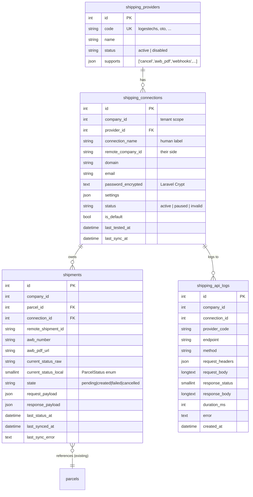
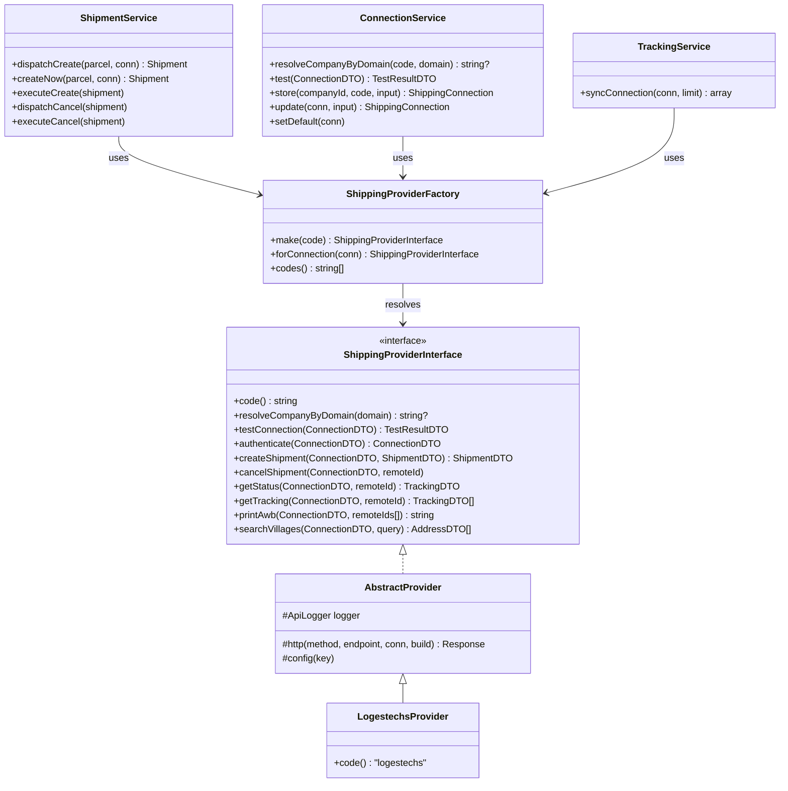
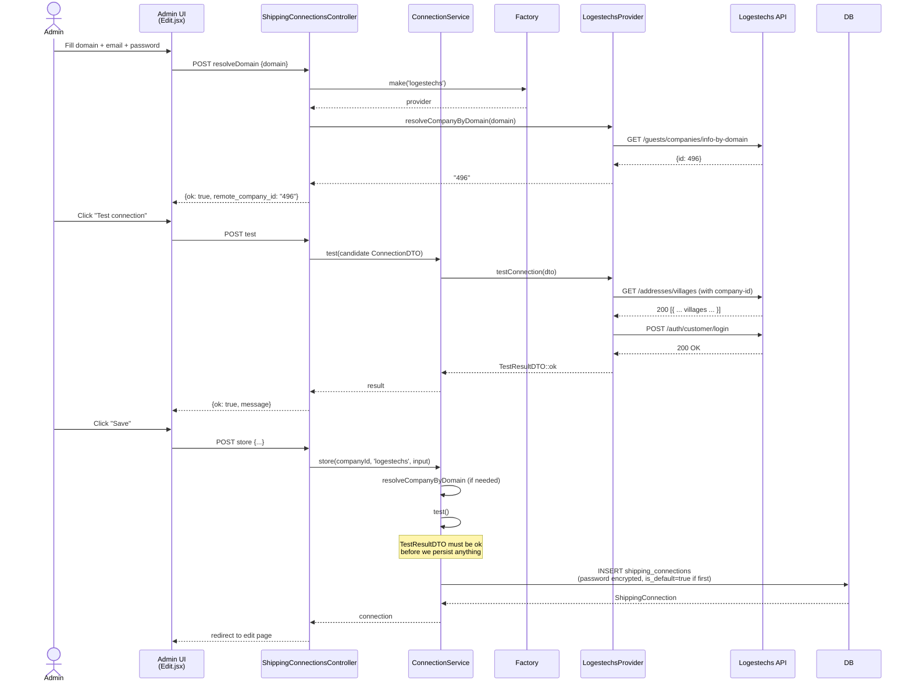
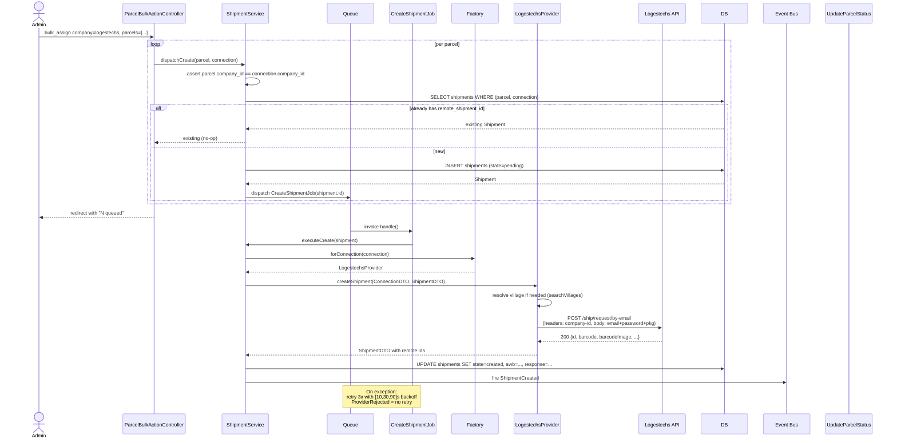
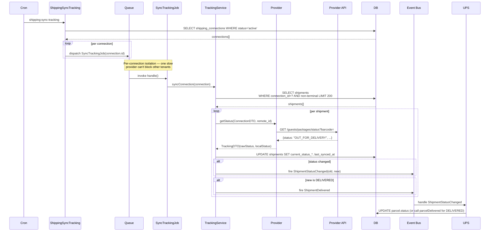

# Shipping Module — Architecture

Generic, multi-tenant shipping abstraction. Logestechs is the first provider; future providers (OTO, SMSA, Aramex v2, custom APIs) plug in without touching business logic.

This document is for engineers extending the module or integrating with it. For operator-facing detail (config UI, env keys, troubleshooting) see [3PL.md](../3PL.md).

---

## 1. High-level layers

```
┌─────────────────────────────────────────────────────────────┐
│ HTTP layer                                                  │
│   Admin UI (Inertia)        Public APIs        Webhooks     │
└───────────────┬─────────────────────────────────────────────┘
                │
┌───────────────▼─────────────────────────────────────────────┐
│ Service layer (orchestration, tenant safety, idempotency)   │
│   ConnectionService  ShipmentService  TrackingService       │
│   AwbService         WebhookService                         │
└───────────────┬─────────────────────────────────────────────┘
                │
┌───────────────▼─────────────────────────────────────────────┐
│ Queue / event layer (out-of-band work)                      │
│   CreateShipmentJob  CancelShipmentJob                      │
│   SyncTrackingJob    PrintAwbJob                            │
│   Events → Listeners (UpdateParcelStatus, ...)              │
└───────────────┬─────────────────────────────────────────────┘
                │
┌───────────────▼─────────────────────────────────────────────┐
│ Provider layer (per-provider implementations)               │
│   ShippingProviderInterface (contract)                      │
│   AbstractProvider (shared HTTP + logging + retries)        │
│   LogestechsProvider | OTOProvider | SMSAProvider | ...     │
└───────────────┬─────────────────────────────────────────────┘
                │
┌───────────────▼─────────────────────────────────────────────┐
│ Persistence + observability                                 │
│   shipping_providers  shipping_connections                  │
│   shipments  shipping_api_logs                              │
└─────────────────────────────────────────────────────────────┘
```

Business logic (controllers, observers, queue listeners outside this module) talks to the **Service layer only**. Service code talks to the **Contract**, never to a concrete provider class.

---

## 2. Folder tree

```
app/Shipping/
├── Contracts/
│   ├── ShippingProviderInterface.php
│   └── SupportsWebhooks.php
├── DTOs/
│   ├── AddressDTO.php
│   ├── ConnectionDTO.php
│   ├── ShipmentDTO.php
│   ├── TestResultDTO.php
│   └── TrackingDTO.php
├── Events/
│   ├── ShipmentCancelled.php
│   ├── ShipmentCreated.php
│   ├── ShipmentDelivered.php
│   └── ShipmentStatusChanged.php
├── Exceptions/
│   ├── ConnectionTestFailedException.php
│   ├── ProviderRejectedShipmentException.php
│   ├── ProviderUnavailableException.php
│   └── ShippingException.php
├── Factory/
│   └── ShippingProviderFactory.php
├── Jobs/
│   ├── CancelShipmentJob.php
│   ├── CreateShipmentJob.php
│   ├── PrintAwbJob.php
│   └── SyncTrackingJob.php
├── Listeners/
│   ├── SendShipmentNotifications.php
│   ├── StoreTrackingHistory.php
│   └── UpdateParcelStatus.php
├── Logging/
│   └── ApiLogger.php
├── Models/
│   ├── Shipment.php
│   ├── ShippingApiLog.php
│   ├── ShippingConnection.php
│   └── ShippingProvider.php
├── Providers/
│   ├── AbstractProvider.php
│   └── Logestechs/
│       ├── Exceptions/LogestechsApiException.php
│       ├── LogestechsProvider.php
│       └── Mappers/
│           ├── ShipmentRequestMapper.php
│           ├── ShipmentResponseMapper.php
│           └── StatusMapper.php
├── Repositories/
│   ├── ShipmentRepository.php
│   └── ShippingConnectionRepository.php
├── Services/
│   ├── AwbService.php
│   ├── ConnectionService.php
│   ├── ShipmentService.php
│   ├── TrackingService.php
│   └── WebhookService.php
└── ShippingServiceProvider.php

config/shipping.php
database/migrations/2026_06_30_13030[1-5]_*.php
app/Console/Commands/ShippingSyncTracking.php
app/Http/Controllers/Backend/Shipping/ShippingConnectionsController.php
resources/js/Pages/Admin/Shipping/Connections/{Index,Edit}.jsx
tests/Unit/Shipping/*.php
```

---

## 3. Data model



**Why a separate `shipments` table?** The existing `parcels_3pl` table tracks 3PL assignments for the legacy provider services (Aramex, Jet, Zajel, Panda). It has known multi-tenant issues (no `company_id`, no unique index). The new module starts clean: `shipments` is properly scoped (`company_id` + `(connection_id, remote_shipment_id)` unique) and is the canonical home for any provider integrated via the new abstraction.

**Why `shipping_api_logs` separate from Laravel's regular log?** Two reasons: (1) it's queryable from the admin UI for troubleshooting a specific tenant's failed shipment, (2) retention is bounded (30 days, pruned by a daily job) so it doesn't bloat indefinitely.

---

## 4. Key class relationships



---

## 5. Sequence — Add Integration (Logestechs)



---

## 6. Sequence — Create Shipment (queued)



---

## 7. Sequence — Tracking sync (every 5 minutes)



---

## 8. Adding a new provider

Six steps. No business-logic code is touched.

1. **Implement the provider class** at `app/Shipping/Providers/Foo/FooProvider.php` extending `AbstractProvider`. Override `code()` to return your short code (e.g. `'oto'`) and implement the contract methods. Use `$this->http(...)` for outbound calls — you get logging + retry semantics for free.

2. **Optional: write request/response mappers** at `app/Shipping/Providers/Foo/Mappers/`. Keeps the provider class lean.

3. **Register the provider in `config/shipping.php`**:
   ```php
   'providers' => [
       'logestechs' => [ ... ],
       'oto' => [
           'class'  => \App\Shipping\Providers\Oto\OtoProvider::class,
           'config' => [
               'base_url' => env('OTO_BASE_URL'),
               'timeout'  => 30,
           ],
       ],
   ],
   ```

4. **Seed the `shipping_providers` row** via a migration:
   ```php
   DB::table('shipping_providers')->updateOrInsert(
       ['code' => 'oto'],
       ['name' => 'OTO', 'status' => 'active', 'supports' => json_encode(['cancel','tracking']), ...],
   );
   ```

5. **Provider-specific webhook (optional)**: if the provider pushes status events, implement `SupportsWebhooks` on the provider class and add a route under `routes/api.php`:
   ```php
   Route::post('/shipping/webhooks/oto', fn (Request $r) => app(WebhookService::class)->handle('oto', $r));
   ```

6. **Done.** The admin UI auto-lists the new provider in the "Add integration" picker. Bulk + single assign flows pick it up via `ShippingConnection::provider->code`. Tracking sync polls it via the same `shipping:sync-tracking` command.

---

## 9. Tenant safety

Every shipping table carries `company_id`. The system enforces tenant scoping at three points:

1. **Routes**: tenant scope set by `InitializeTenancyByDomain` middleware (existing). Within tenant context, `settings()->id` returns the company id.
2. **Repositories**: `Connection->scopeCompanywise()` and `Shipment->scopeCompanywise()` filter by `settings()->id ?? null`. Use these scopes anywhere you query the new tables.
3. **ShipmentService**: `dispatchCreate()` explicitly asserts `parcel.company_id === connection.company_id` and throws if they differ. Prevents a malicious or buggy caller from cross-tenant linking.

There is **no** cross-tenant superuser path inside the module. Super-admins manage shipping connections by impersonating the tenant.

---

## 10. Observability

Three places to look when something breaks:

1. `shipping_api_logs` — every outbound HTTP call. Pull recent rows for a connection to see what was sent / received.
2. `shipments.last_sync_error` + `shipments.state` — last error per shipment.
3. Standard Laravel log — `shipping.tracking.synced`, `shipping.tracking.sync_failed`, `shipping.update_parcel_status_failed`.

Sensitive headers (`company-id`, `authorization`, `x-api-key`) are masked before write per `config('shipping.logging.sensitive_headers')`.

Retention: 30 days hot (configurable via `config('shipping.logging.retention_days')`). The `shipping:prune-logs` daily job runs at 03:15 (see `app/Console/Kernel.php`) and drops rows older than the retention window.

---

## 11. Migration from the old pattern

Logestechs was previously implemented via:
- `app/Services/LogestechsService.php` (still on disk — not loaded by anything in the new flow)
- `app/Logestechs/Models/Settings.php` + `logestechs_settings` table (still on disk + DB — superseded by `shipping_connections`)
- `app/Http/Controllers/Backend/LogestechsSettingsController.php` (still on disk — route is now a redirect)
- `app/Console/Commands/LogestechsSyncTracking.php` — **deleted**

The legacy `parcels_3pl` table stays untouched; it still serves Aramex / Jet / Zajel / Panda which haven't been migrated to the new module.

A future cleanup PR can drop the orphaned old files + the `logestechs_settings` table once there's confidence the new flow is stable.

---

## 12. Known gaps + follow-ups

1. **Tenant data backfill**: no automatic migration from `logestechs_settings` rows to `shipping_connections`. Operators set up their connection in the new UI from scratch.
2. **Aramex / Jet / Zajel / Panda still on the old pattern**. Migrating them is a separate effort — same module, more provider classes, then update the controllers.
3. **No webhook implementation for Logestechs**. Logestechs is poll-only today. If they add push events, implement `SupportsWebhooks` on `LogestechsProvider`.
4. **Cancel propagation**: the existing parcel-cancel flow doesn't dispatch `CancelShipmentJob` automatically. Wire it into `Parcel::cancelShipment()` via an observer if you want bidirectional cancellation.
5. **Village-lookup caching**: `LogestechsProvider::createShipment` calls `searchVillages` on every unmapped destination. Cache the resolved `{cityId, regionId}` per `(remote_company_id, area_name)` to avoid the extra round-trip.

**Recently closed (2026-06-30 to 2026-07-22):**
- ✅ **AWB log-prune job** — `shipping:prune-logs` runs daily at 03:15 via `Console\Kernel`; enforces `config('shipping.logging.retention_days')` (default 30).
- ✅ **HTTP-level retry** — `AbstractProvider::http()` now wraps calls in Laravel's `->retry($tries, $sleepMs)` with a `ConnectionException` filter. Tuned by `config('shipping.retry.http_tries')` (default 2) and `http_sleep_ms` (default 250). Sits *below* the queue-level retry so a single job attempt can absorb 1–2 transient failures before failing back to the job runner. 4xx responses never retry — provider-rejected payloads won't get better.
- ✅ **Bulk-assign UX** — `/admin/bulk_action` no longer asks operators to paste email/password per submission. When "Logestechs" is picked, a **connection picker** appears listing the tenant's saved connections (default one pre-selected). `assignLogestechsBulk` dispatches `CreateShipmentJob` per parcel against the chosen `connection_id`.
- ✅ **Bulk-action route swallowing** — `POST /admin/shipping/connections/test` was being matched by the wildcard `POST /connections/{provider}` (registered first). Literal routes now precede the wildcard in both `routes/web.php` and `routes/superadmin.php`.
- ✅ **Edit-page test flow** — the React edit form used to send `"__keep__"` as the password when blank, and the backend forwarded it to Logestechs as plaintext. Fix: the form now sends `connection_id` when editing; `ShippingConnectionsController::test()` hydrates the password from the row (strictly tenant-scoped) when it receives an empty/sentinel password with a `connection_id`.

---

## 13. Quick reference

| Endpoint | Auth | Purpose |
|---|---|---|
| `GET /admin/shipping/connections` | `integrations_read` | List connections (tenant-scoped) |
| `GET /admin/shipping/connections/create?provider=...` | `integrations_update` | Add wizard |
| `POST /admin/shipping/connections/{provider}` | `integrations_update` | Persist a new connection |
| `POST /admin/shipping/connections/test` | `integrations_update` | Validate without persisting |
| `POST /admin/shipping/connections/resolve-domain/{provider}` | `integrations_update` | Domain → remote company id |
| `PUT /admin/shipping/connections/{id}` | `integrations_update` | Update |
| `POST /admin/shipping/connections/{id}/default` | `integrations_update` | Set default for provider |
| `DELETE /admin/shipping/connections/{id}` | `integrations_update` | Remove |

| Console | Cron | Purpose |
|---|---|---|
| `shipping:sync-tracking` | `*/5 * * * *` | Dispatch per-connection SyncTrackingJob |
| `shipping:sync-tracking --provider=logestechs` | — | Limit to one provider (debug) |

| Event | Listener(s) |
|---|---|
| `ShipmentCreated` | (none registered yet — wire your own) |
| `ShipmentStatusChanged` | `UpdateParcelStatus`, `StoreTrackingHistory` |
| `ShipmentDelivered` | `SendShipmentNotifications` |
| `ShipmentCancelled` | (none registered yet) |
